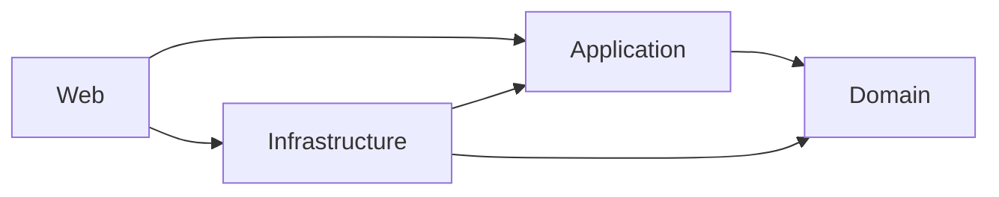

# Website Health Monitoring Detailed Implementation Plan

## 1. Purpose

This document turns the intern-owned specification and architecture into an executable delivery plan for a personal internship project. It defines work order, dependencies, deliverables, test gates, and acceptance evidence without implying enterprise governance or production certification.

Authoritative references:

- [`Website_Health_Monitoring_Project_Specification.md`](../Website_Health_Monitoring_Project_Specification.md)
- [`Technology_Stack.md`](Technology_Stack.md)
- [`System_Design_and_Architecture.md`](System_Design_and_Architecture.md)

The plan assumes a modular monolith using ASP.NET Core 10 MVC, Entity Framework Core with Npgsql and PostgreSQL, Hangfire with PostgreSQL storage, ASP.NET Core Identity, a safe `IHttpClientFactory`-based monitoring transport, personal Gmail SMTP for the initial low-volume MVP, Serilog, the Purity UI Dashboard Figma baseline, and Chart.js.

The intern is the sole project owner, implementer, reviewer, and operator. Optional mentor or peer feedback is advisory and not a delivery dependency. Plan approximately **14–20 working weeks** for the full scope and re-estimate after the immediate Phase 0 spikes and every phase gate. Production observation applies only if a real deployment is later pursued.

## 2. Delivery Principles

1. Build vertical, demonstrable increments rather than all data layers before all user flows.
2. Keep controllers and Hangfire entry points thin; place business decisions in testable application and domain services.
3. Protect correctness with PostgreSQL constraints, transactions, stable identifiers, leases, and idempotency records.
4. Treat outbound HTTP, DNS, redirects, HTML, SMTP responses, and browser input as untrusted.
5. Implement authorization server-side and test direct requests for every role.
6. Add regression tests with every nontrivial rule and confirmed defect.
7. Apply migrations explicitly and reproducibly; never mutate a deployed schema implicitly at application startup.
8. Demonstrate working software and test evidence at every phase gate.
9. Keep optional infrastructure and speculative abstractions out of the MVP.
10. Record changes to scope, permissions, thresholds, incident behavior, or retention before implementation.

## 3. Scope Strategy

### 3.1 Protected MVP

The following capabilities must remain protected if the schedule becomes constrained:

- Authentication, roles, policies, assignment-aware authorization, and anti-forgery protection.
- Client, website, environment, and endpoint management with audit history.
- Scheduled and manual HTTP checks with safe redirects and durable history.
- Stable logical checks, execution leases, retry safety, and restart reconciliation.
- Health evaluation, incident confirmation/recovery, lifecycle, and deduplication.
- Durable, deduplicated opening and recovery email notifications.
- SSL certificate monitoring.
- Operational dashboard, shared filters, and consistent CSV export.
- Maintenance behavior required by AC-09.
- Response-time and page-size behavior required by BR-P01 through BR-P05.
- Retention, aggregates, and holds required by AC-14.
- Unit and integration test pipeline required by AC-15.
- Security, diagnostics, migrations, backup/restore, and controlled deployment.

### 3.2 Deferrable by recorded intern decision

- SEO features beyond the minimum needed for AC-07.
- Crawler comparison and reporting beyond the minimum needed for AC-08.
- Performance analysis beyond the threshold, confirmation, page-size, and comparability behavior required by BR-P01 through BR-P05.
- Daily summary email and additional escalation levels.
- User-specific timezone preferences if a company timezone is sufficient initially.
- Separate web and worker processes before measurements justify them.
- History partitioning or advanced archival.

AC-07, AC-08, or BR-M05 cannot be silently omitted while claiming the full scope. The intern records each deferral and leaves the affected rule/criterion incomplete.

Opening, recovery, unacknowledged-reminder, and configured escalation notifications are part of the protected MVP. Daily summary email is deferred unless the intern adds it to scope. Additional escalation levels may be deferred, but BR-N04 and BR-N05 require a recorded specification change if omitted.

### 3.3 Release tracks

- **Full-scope release:** Completes and signs off AC-01 through AC-15.
- **Core-MVP release candidate:** May move from Phase 5 to Phase 7 only when AC-07, AC-08, and BR-M05 are each formally deferred with an owner, rationale, target release, and explicit record that the affected criteria/rule remain incomplete.

A core-MVP release is not the completed full project and must not report deferred acceptance criteria or BR-M05 as complete.


## 5. Planned Solution Structure

Use a small number of projects and module folders. Do not create one assembly per feature unless a measured maintenance problem justifies it.

```text
WebHealthProject.sln
src/
  WebHealth.Web/
    Controllers/
    Views/
    Modules/
      Identity/
      Registry/
      Monitoring/
      Incidents/
      Notifications/
      Reporting/
      Administration/
    wwwroot/
      css/
      js/
  WebHealth.Application/
    Identity/
    Registry/
    Scheduling/
    Monitoring/
    Incidents/
    Notifications/
    Reporting/
    Administration/
  WebHealth.Domain/
    Identity/
    Registry/
    Monitoring/
    Incidents/
    Notifications/
    Shared/
  WebHealth.Infrastructure/
    Persistence/
    Jobs/
    Monitoring/
    Email/
    Diagnostics/
tests/
  WebHealth.UnitTests/
  WebHealth.IntegrationTests/
```



The web project is the composition root. The domain project must not reference MVC, EF Core, Hangfire, SMTP, or HTTP infrastructure.

## 6. Work Item Definition

Every implementation work item should record:

- Business-rule and acceptance-criterion IDs.
- User-visible behavior and authorization policy.
- Inputs, outputs, validation, and error behavior.
- Data and migration impact.
- Security and privacy impact.
- Unit and integration tests.
- Logging and operational signals.
- Documentation impact.
- Rollout or compatibility concern.

A work item is complete only when its code, migration, tests, documentation, and review evidence are complete.

Phase evidence must be durable and linked from the applicable checklist item. As relevant, this includes a versioned demo result, CI run, automated test report, migration evidence, security/performance/query-plan result, documentation changes, known limitations, and intern decision date. A checked box without linked evidence is incomplete.

## 7. Phase 0 — Planning and Design

**Estimate:** 3–5 focused working days  
**Acceptance criteria:** Establishes prerequisites for AC-01 through AC-15.

### 7.1 Scope and decisions

- [x] Record sole intern ownership, personal-project boundary, protected MVP, and deferrable scope. Evidence: [`../phase-0/Scope_and_Decisions.md`](../phase-0/Scope_and_Decisions.md).
- [x] Record PostgreSQL as the selected persistence choice. Evidence: [`../phase-0/Scope_and_Decisions.md`](../phase-0/Scope_and_Decisions.md).
- [x] Defer enterprise production hosting, HA, backup/PITR, managed logging/alerting, and formal operational ownership to their deployment/release phases. Evidence: [`../phase-0/Scope_and_Decisions.md`](../phase-0/Scope_and_Decisions.md).
- [x] Require ownership or explicit testing permission for every monitored target. Evidence: [`../phase-0/Scope_and_Decisions.md`](../phase-0/Scope_and_Decisions.md).
- [x] Define application team/user assignment semantics independently from project ownership. Evidence: [`../phase-0/Scope_and_Decisions.md`](../phase-0/Scope_and_Decisions.md).
- [x] Define configuration inheritance between global, website, monitor policy, and endpoint scopes. Evidence: [`../phase-0/Scope_and_Decisions.md`](../phase-0/Scope_and_Decisions.md).
- [x] Identify controlled healthy, failing, redirecting, TLS, SEO, and crawler fixture capabilities. Evidence: [`../phase-0/Test_and_Delivery_Strategy.md`](../phase-0/Test_and_Delivery_Strategy.md); infrastructure remains open.

### 7.2 Domain and database design

- [x] Produce `Database_Design.md` with entities, fields, relationships, constraints, and indexes. Evidence: [`../phase-0/Database_Design.md`](../phase-0/Database_Design.md).
- [x] Define normalized representations for names, URLs, recipients, issue keys, and crawl pairs. Evidence: [`../phase-0/Database_Design.md`](../phase-0/Database_Design.md).
- [x] Define core statuses/transitions for health, incidents, logical checks, and notifications; defer detailed finding/crawl states to owning phases. Evidence: [`../phase-0/Database_Design.md`](../phase-0/Database_Design.md).
- [x] Define UTC timestamp behavior, stored timezone identifiers, and `[start, end)` reporting windows. Evidence: [`../phase-0/Database_Design.md`](../phase-0/Database_Design.md).
- [x] Define optimistic concurrency for editable configuration and incidents. Evidence: [`../phase-0/Database_Design.md`](../phase-0/Database_Design.md).
- [x] Define the endpoint/monitor execution lease, including owner and expiry. Evidence: [`../phase-0/Database_Design.md`](../phase-0/Database_Design.md).
- [x] Define durable work and reconciliation when transaction commit succeeds but job enqueueing fails. Evidence: [`../phase-0/Database_Design.md`](../phase-0/Database_Design.md).
- [x] Define soft deletion and record short operational-hold, aggregate, and retention notes for Phase 7. Evidence: [`../phase-0/Database_Design.md`](../phase-0/Database_Design.md).
- [x] Define the database strategy for one active incident and idempotent notifications. Evidence: [`../phase-0/Database_Design.md`](../phase-0/Database_Design.md).

### 7.3 Security design

- [x] Produce a threat model covering authentication, authorization, CSRF, XSS, SSRF, DNS rebinding, redirects, diagnostics, SMTP credentials, and Hangfire administration. Evidence: [`../phase-0/Security_and_Operations.md`](../phase-0/Security_and_Operations.md).
- [x] Define prohibited IPv4 and IPv6 ranges and exception governance. Evidence: [`../phase-0/Security_and_Operations.md`](../phase-0/Security_and_Operations.md).
- [x] Require validation of the address used for the actual connection and every redirect. Evidence: [`../phase-0/Security_and_Operations.md`](../phase-0/Security_and_Operations.md).
- [x] Define proxy behavior so it cannot bypass destination enforcement. Evidence: [`../phase-0/Security_and_Operations.md`](../phase-0/Security_and_Operations.md).
- [x] Define timeout, response-size, redirect, global concurrency, per-host, and crawler limits. Evidence: [`../phase-0/Security_and_Operations.md`](../phase-0/Security_and_Operations.md).
- [x] Define allow-listed fields for logs, emails, audits, and persisted diagnostics. Evidence: [`../phase-0/Security_and_Operations.md`](../phase-0/Security_and_Operations.md).
- [x] Prohibit production TLS-validation bypasses. Evidence: [`../phase-0/Security_and_Operations.md`](../phase-0/Security_and_Operations.md).

### 7.4 UI and testing design

- [x] Adopt the Purity UI Dashboard Figma file as the UI baseline and record the design-system reference and customization approach. Evidence: [`../phase-0/UI_Direction.md`](../phase-0/UI_Direction.md).
- [x] Produce responsive textual wireframes for dashboard, registry, endpoint details, incidents, reports, login, and error states. Evidence: [`../phase-0/UI_Direction.md`](../phase-0/UI_Direction.md).
- [x] Include keyboard flow, visible focus, labels, contrast, and non-color status cues. Evidence: [`../phase-0/UI_Direction.md`](../phase-0/UI_Direction.md).
- [x] Define unit and integration test boundaries. Evidence: [`../phase-0/Test_and_Delivery_Strategy.md`](../phase-0/Test_and_Delivery_Strategy.md).
- [x] Define PostgreSQL Testcontainer and controlled HTTP target setup. Evidence: [`../phase-0/Test_and_Delivery_Strategy.md`](../phase-0/Test_and_Delivery_Strategy.md).
- [ ] Define representative 500-endpoint and retention-sized datasets in Phase 7 before performance certification.
- [x] Create an AC-01 through AC-15 traceability board. Evidence: [`../phase-0/Traceability_Matrix.md`](../phase-0/Traceability_Matrix.md).
- [x] Extend traceability to every mandatory rule from BR-A01 through BR-R07. Evidence: [`../phase-0/Traceability_Matrix.md`](../phase-0/Traceability_Matrix.md).
- [x] Define a basic personal CI strategy; CI service selection remains open. Evidence: [`../phase-0/Test_and_Delivery_Strategy.md`](../phase-0/Test_and_Delivery_Strategy.md).

### 7.5 Feasibility spikes

- [x] Prove the selected Hangfire PostgreSQL storage provider works with the pinned .NET, EF Core, Npgsql, and PostgreSQL versions. Evidence: [`../phase-0/Test_and_Delivery_Strategy.md`](../phase-0/Test_and_Delivery_Strategy.md), SP-01.
- [x] Prove actual-connection-address enforcement can be implemented with the selected `IHttpClientFactory` transport design. Evidence: SP-02.
- [x] Prove required TLS certificate evidence can be inspected without disabling normal certificate validation. Evidence: SP-03.
- [x] Prove no-proxy handling prevents implicit proxy bypass in the local/demo transport. Evidence: SP-03.
- [x] Implement deterministic IPv4, IPv6, redirect, and DNS-rebinding test fixtures. Evidence: SP-02/SP-03.
- [x] Exercise the proposed PostgreSQL lease, active-incident uniqueness, and idempotency constraints under competing transactions. Evidence: SP-04.
- [x] Define the immediate spikes, pass criteria, current environment limitations, and evidence format. Evidence: [`../phase-0/Test_and_Delivery_Strategy.md`](../phase-0/Test_and_Delivery_Strategy.md); execution completed on 2026-08-13.

### 7.6 Phase gate

Required deliverables:

- Recorded scope classification and sole project ownership.
- Domain and database design.
- Threat model and safe-network policy.
- UI wireframes and design tokens.
- Prioritized backlog with requirements and test links.
- Migration and testing outline; production deployment operations are deferred.
- Immediate feasibility-spike results and revised estimates.
- Personal-project constraints, immediate blockers, contingency, and selected release track.

Do not begin Phase 1 until normalization, authorization, audit, and database constraints are sufficiently defined to avoid rewriting the foundation.

## 8. Phase 1 — Project Foundation

**Estimate:** 4–6 working days  
**Acceptance criteria:** Establishes the runtime and test foundation for AC-01 through AC-15.

### 8.1 Dependencies

- [ ] Phase 0 architecture, database, security, UI, and migration decisions recorded by the intern.
- [ ] Development and test PostgreSQL environments available.

### 8.2 Solution and runtime foundation

- [x] Create the solution and planned projects. Evidence: [`../../WebHealthProject.sln`](../../WebHealthProject.sln), [`../../src/`](../../src/), and the unit/integration projects under [`../../tests/`](../../tests/).
- [x] Add only selected, reviewed dependencies with pinned compatible versions. Evidence: central versions and per-project lock files; restore, build, tests, and vulnerability review passed on 2026-08-13.
- [x] Configure project references according to the recorded dependency direction. Evidence: Domain has no project references; Application references Domain; Infrastructure references Application and Domain; Web references Application and Infrastructure.
- [x] Configure dependency injection and module registration. Evidence: the Web composition root calls the focused Infrastructure registration in [`../../src/WebHealth.Infrastructure/DependencyInjection.cs`](../../src/WebHealth.Infrastructure/DependencyInjection.cs); empty modules have no speculative registrations.
- [x] Configure environment-specific settings and local secret handling. Evidence: [`../phase-1/Runtime_Foundation.md`](../phase-1/Runtime_Foundation.md) and the Web settings/project files.
- [x] Configure EF Core with Npgsql and PostgreSQL. Evidence: [`../../src/WebHealth.Infrastructure/Persistence/ApplicationDbContext.cs`](../../src/WebHealth.Infrastructure/Persistence/ApplicationDbContext.cs) and Infrastructure registration; startup never applies migrations.
- [x] Configure Serilog with correlation identifiers and secret-safe defaults. Evidence: [`../../src/WebHealth.Web/Program.cs`](../../src/WebHealth.Web/Program.cs), [`../../src/WebHealth.Web/Middleware/CorrelationIdMiddleware.cs`](../../src/WebHealth.Web/Middleware/CorrelationIdMiddleware.cs), and safe logging notes in [`../phase-1/Runtime_Foundation.md`](../phase-1/Runtime_Foundation.md).
- [x] Configure global exception handling with safe user-facing errors. Evidence: safe 403/404/409/500 handling and a passing response-content integration test.
- [x] Add liveness and basic readiness endpoints. Evidence: dependency-free liveness and bounded PostgreSQL readiness with passing healthy/unconfigured-state tests.
- [ ] Implement the Purity UI Dashboard baseline, application styles, shared layout, and accessible error pages.
- [x] Create unit and integration test projects. Evidence: [`../../tests/WebHealth.UnitTests/WebHealth.UnitTests.csproj`](../../tests/WebHealth.UnitTests/WebHealth.UnitTests.csproj) and [`../../tests/WebHealth.IntegrationTests/WebHealth.IntegrationTests.csproj`](../../tests/WebHealth.IntegrationTests/WebHealth.IntegrationTests.csproj).
- [x] Establish repeatable build and test commands. Evidence: [`../../scripts/run-tests.ps1`](../../scripts/run-tests.ps1), [`../../scripts/run-database-foundation-tests.ps1`](../../scripts/run-database-foundation-tests.ps1), and [`../phase-1/Testing_Foundation.md`](../phase-1/Testing_Foundation.md).

### 8.3 Database and test foundation

- [x] Add initial database context and migration conventions. Evidence: the context, default schema/history table, snake-case naming, UTC instant mapping, restrictive-delete convention, design-time factory, pinned EF tool, and `InitialFoundation` migration are documented in [`../phase-1/Database_Conventions.md`](../phase-1/Database_Conventions.md).
- [x] Verify clean PostgreSQL database creation. Evidence: [`../../scripts/run-database-foundation-tests.ps1`](../../scripts/run-database-foundation-tests.ps1) passed against isolated PostgreSQL 18 on 2026-08-13; exactly one migration and only the migration-history table existed.
- [x] Configure a reusable `WebApplicationFactory` integration-test host. Evidence: [`../../tests/WebHealth.IntegrationTests/Support/WebHealthWebApplicationFactory.cs`](../../tests/WebHealth.IntegrationTests/Support/WebHealthWebApplicationFactory.cs) and [`../../tests/WebHealth.IntegrationTests/RuntimeFoundationTests.cs`](../../tests/WebHealth.IntegrationTests/RuntimeFoundationTests.cs).
- [x] Configure opt-in PostgreSQL Testcontainers tests. The intern accepted `GHSA-q939-rpr3-3284` on 2026-08-13 and the audit suppression is limited to that advisory in the integration-test project. Evidence: [`../../tests/WebHealth.IntegrationTests/PostgreSqlTestcontainerTests.cs`](../../tests/WebHealth.IntegrationTests/PostgreSqlTestcontainerTests.cs) and [`../phase-1/Testing_Foundation.md`](../phase-1/Testing_Foundation.md).
- [x] Add startup, liveness, and readiness smoke tests. Evidence: five runtime integration tests passed on 2026-08-13.
- [x] Add repeatable local and GitHub Actions delivery checks. Evidence: [`../../scripts/run-delivery-checks.ps1`](../../scripts/run-delivery-checks.ps1), [`../../.github/workflows/delivery.yml`](../../.github/workflows/delivery.yml), and [`../phase-1/Delivery_Checks.md`](../phase-1/Delivery_Checks.md). A remote workflow run remains required before claiming hosted CI execution evidence.

### 8.4 Phase exit evidence

- The application builds, starts, and connects to PostgreSQL.
- Clean database creation and initial migration conventions are demonstrated.
- Liveness, readiness, unit tests, and integration-test infrastructure run successfully.
- No secrets are committed and project references follow the architecture.

## 9. Phase 2 — Identity, Authorization, Registry, and Audit

**Estimate:** 8–12 working days  
**Primary acceptance criteria:** AC-01, AC-10  
**Supporting criterion:** AC-13 for configuration changes.

### 9.1 Dependencies

- [x] Phase 1 application, database, logging, and test foundation is complete.
- [x] Phase 0 normalization, authorization, audit, and application-assignment decisions are recorded.
- [x] Role and assignment semantics are confirmed.

### 9.2 Identity and authorization

- [x] Configure ASP.NET Core Identity. Evidence: [`../phase-1/Authentication_and_Protected_Shell.md`](../phase-1/Authentication_and_Protected_Shell.md).
- [x] Create Administrator, Operations, Developer/Support, and Viewer role definitions with stable IDs and explicit bootstrap verification.
- [x] Implement admin-only user and supported-role assignment management. Evidence: [`../phase-2/Administration_and_Authorization_Baseline.md`](../phase-2/Administration_and_Authorization_Baseline.md).
- [x] Implement account disabling and security-stamp session invalidation. Evidence: [`../phase-2/Administration_and_Authorization_Baseline.md`](../phase-2/Administration_and_Authorization_Baseline.md).
- [x] Complete current registry role, effective-owner, grant, external-target-evidence, eligibility, and target-testing policies on the server. Evidence: [`../phase-2/Environment_and_Endpoint_Vertical_Slice.md`](../phase-2/Environment_and_Endpoint_Vertical_Slice.md).
- [x] Protect operational controllers and actions by default through a fallback authorization policy.
- [x] Require anti-forgery protection for state-changing browser requests.
- [ ] Restrict Hangfire administration when it is added. Detailed readiness already requires the Administrator/Operations diagnostics policy.

### 9.3 Registry and audit

- [x] Implement clients, websites, environments, endpoints, tags, and ownership. Evidence: [`../phase-2/Tags_Lifecycle_and_Audit_UI.md`](../phase-2/Tags_Lifecycle_and_Audit_UI.md).
- [x] Enforce trimmed, case-insensitive client uniqueness.
- [x] Enforce website-name uniqueness within a client.
- [x] Require an environment before monitoring can be enabled.
- [x] Accept only absolute HTTP/HTTPS endpoint URLs without embedded credentials.
- [x] Require HTTPS for production unless an administrator records an exception reason.
- [x] Enforce normalized URL uniqueness per environment and monitor type.
- [x] Implement website owner inheritance and endpoint override.
- [x] Trim and deduplicate tags through the shared normalizer and PostgreSQL unique index.
- [x] Implement soft deletion for current registry configuration with history.
- [x] Add optimistic concurrency to current editable registry configuration.
- [x] Record append-only audit events with safe before/after values for administration, assignment, and authorization denials. Registry configuration events follow registry CRUD. Evidence: [`../phase-2/Assignment_and_Audit_Foundation.md`](../phase-2/Assignment_and_Audit_Foundation.md).
- [x] Output-encode labels, notes, tags, and safe audit values through Razor rendering.

### 9.4 Database and migration

- [x] Add Phase 2 Identity, registry, ownership, tag, policy-default foundation, and audit schemas in two reviewable migrations.
- [x] Add required relationships and prevent cascading deletion of history through restrictive foreign keys.
- [x] Add normalized fields and documented normalization versions.
- [x] Add database uniqueness constraints matching Phase 2 business rules.
- [x] Add concurrency tokens to mutable registry configuration.
- [x] Index normalized names, active registry lists, ownership filters, and audit searches.
- [x] Seed role definitions through a controlled, idempotent bootstrap-admin mechanism; no password or role row is embedded in a migration.
- [x] Validate clean creation, Phase 1-baseline upgrade, and migration repeatability against PostgreSQL 18. Evidence: [`../phase-2/Database_and_Completion_Gate.md`](../phase-2/Database_and_Completion_Gate.md).

### 9.5 Verification gate

- [x] Unit-test URL and name normalization boundaries.
- [x] Integration-test every role using direct requests for the current global policies. Evidence: [`../../tests/WebHealth.IntegrationTests/AuthorizationBaselineTests.cs`](../../tests/WebHealth.IntegrationTests/AuthorizationBaselineTests.cs); assignment combinations remain with registry.
- [x] Verify current browser unauthenticated behavior and login redirects; API-specific 401/403 behavior remains due when API endpoints exist.
- [x] Verify anti-forgery rejection.
- [x] Verify disabled users and role-only stale principals lose access without deleting historical identity references. Evidence: native PostgreSQL assertions in [`../../tests/WebHealth.IntegrationTests/Support/DatabaseFoundationAssertions.cs`](../../tests/WebHealth.IntegrationTests/Support/DatabaseFoundationAssertions.cs).
- [x] Verify PostgreSQL constraints reject current registry duplicates independently of UI validation.
- [x] Verify stale current registry configuration updates are rejected.
- [x] Verify current registry soft deletion preserves reportable identity and relationships.
- [x] Verify all Phase 2 audit event kinds contain actor, timestamp, action, entity, and safe values; incident events remain owned by Phase 4.
- [x] Inspect logs and repository for secrets and sensitive values.

### 9.6 Phase exit evidence

- **AC-01:** An administrator creates a client, website, production environment, and endpoint; validation and PostgreSQL uniqueness are demonstrated.
- **AC-10:** Unauthorized direct requests fail with no data change.
- **AC-13 partial:** Configuration changes are queryable by actor, time, action, and entity.
- Secured application shell, registry CRUD, consolidated migrations, audit baseline, and the full PostgreSQL 18 Testcontainers delivery workflow are demonstrated.

## 10. Phase 3 — Scheduling and Monitoring Engine

**Estimate:** 12–18 working days  
**Primary acceptance criteria:** AC-02, AC-05.

### 10.1 Dependencies

- [x] Enabled registry entities and endpoint policies exist. Evidence: [`../phase-2/Environment_and_Endpoint_Vertical_Slice.md`](../phase-2/Environment_and_Endpoint_Vertical_Slice.md).
- [x] Safe-network and no-proxy decisions are recorded and immediate tests pass. Evidence: [`../phase-0/Test_and_Delivery_Strategy.md`](../phase-0/Test_and_Delivery_Strategy.md), SP-02/SP-03.
- [x] Hangfire PostgreSQL storage compatibility is confirmed. Evidence: [`../phase-0/Test_and_Delivery_Strategy.md`](../phase-0/Test_and_Delivery_Strategy.md), SP-01.
- [x] Controlled HTTP targets are available. Evidence: deterministic fixtures in the Phase 0 feasibility spikes.

### 10.2 Scheduling and logical checks

- [x] Select due, enabled endpoints using UTC. Evidence: [`../phase-3/Hangfire_Scheduling_and_Recovery.md`](../phase-3/Hangfire_Scheduling_and_Recovery.md).
- [x] Atomically claim due endpoint/monitor work.
- [x] Create a stable logical-check record before execution.
- [x] Advance cadence independently from infrastructure retries.
- [x] Create one catch-up check after scheduler downtime, not every missed interval.
- [ ] Queue authorized manual checks with source and initiating user.
- [ ] Keep manual checks outside scheduled cadence and contractual uptime by default.
- [x] Implement the PostgreSQL-backed endpoint/monitor execution lease. Evidence: [`../phase-3/Monitoring_Persistence_Foundation.md`](../phase-3/Monitoring_Persistence_Foundation.md).
- [x] Make every retry reference the same logical-check ID. Evidence: [`../phase-3/Logical_Check_Execution_and_Idempotency.md`](../phase-3/Logical_Check_Execution_and_Idempotency.md).
- [x] Close exhausted work with a terminal normalized result. Evidence: [`../phase-3/Logical_Check_Execution_and_Idempotency.md`](../phase-3/Logical_Check_Execution_and_Idempotency.md).
- [x] Reconcile committed but unqueued or incomplete work after restart.

### 10.3 Safe HTTP monitoring

- [x] Create the application-owned monitoring transport through `IHttpClientFactory`. Evidence: [`../phase-3/Safe_Outbound_HTTP_Transport.md`](../phase-3/Safe_Outbound_HTTP_Transport.md).
- [x] Reject invalid schemes, relative URLs, and credentials in URLs.
- [x] Disable uncontrolled automatic redirects.
- [x] Resolve and validate every destination and redirect.
- [x] Validate the actual connection address to mitigate DNS rebinding.
- [x] Enforce proxy policy and production TLS validation.
- [x] Apply timeout, cancellation, response-size, redirect, global concurrency, and per-host limits.
- [x] Capture status, total duration, available timing metrics, response length, and redirect path. Evidence: [`../phase-3/Http_Result_Normalization_and_History.md`](../phase-3/Http_Result_Normalization_and_History.md).
- [x] Normalize DNS, connection, TLS, timeout, client, server, redirect, and content failures.
- [x] Apply accepted-status and required-content-marker rules.
- [x] Detect redirect loops and excessive chains.
- [x] Persist bounded safe diagnostics, never full response bodies by default.
- [x] Add structured `CorrelationId`, `LogicalCheckId`, `EndpointId`, and `JobId` properties. HTTP correlation is established by middleware; logical-check execution adds the other identifiers through a logging scope.

### 10.4 Database and migration

- [x] Add logical checks, execution attempts if required, results, findings, leases, and durable work records. Evidence: `MonitoringExecutionFoundation` and `HttpMonitoringHistory`.
- [x] Enforce exactly one final result per logical check.
- [x] Store scheduling anchor, due time, source, initiator, attempts, and logical-check state. Evidence: `MonitoringExecutionFoundation`.
- [x] Bound metric and diagnostic columns.
- [x] Index endpoint eligibility, next-due time, check state, endpoint/result time, and issue key.
- [x] Validate clean and Phase 2 upgrade migrations. Evidence: isolated PostgreSQL 18 gate in [`../phase-3/Http_Result_Normalization_and_History.md`](../phase-3/Http_Result_Normalization_and_History.md).

### 10.5 Verification gate

- [x] Unit-test cadence and catch-up behavior. Evidence: `MonitorCadenceTests` and the PostgreSQL scheduling gate.
- [x] Integration-test controlled statuses, redirects, delays, malformed redirects, large responses, and cancellation. Evidence: `SafeHttpTransportTests`.
- [x] Test prohibited IPv4 and IPv6 destinations. Evidence: `DestinationAddressPolicyTests` and the controlled Phase 0 IPv4/IPv6 fixture.
- [x] Test redirects into prohibited destinations.
- [x] Test actual-connection address enforcement and DNS-rebinding defense.
- [x] Verify proxy configuration cannot bypass policy.
- [x] Verify one logical result across retries and duplicate job delivery. Evidence: isolated PostgreSQL gate in [`../phase-3/Logical_Check_Execution_and_Idempotency.md`](../phase-3/Logical_Check_Execution_and_Idempotency.md).
- [x] Verify competing workers cannot execute the same endpoint/monitor concurrently. Evidence: execution and lease integration tests.
- [x] Verify expired leases recover after worker failure. Evidence: PostgreSQL lease fencing tests in [`../phase-3/Monitoring_Persistence_Foundation.md`](../phase-3/Monitoring_Persistence_Foundation.md).
- [x] Verify restart reconciliation without duplicate samples.
- [x] Verify disabled targets produce no new scheduled work.
- [x] Verify logs and history exclude sensitive headers and complete bodies.

### 10.6 Phase exit evidence

- **AC-02:** An enabled production endpoint runs on schedule and history records status, duration, and timestamp.
- **AC-05:** A redirect loop produces a terminal result without hanging the worker.
- Retry, duplicate-delivery, restart, lease-expiry, and catch-up behavior are demonstrated.

## 11. Phase 4 — Minimum Maintenance, Health, Incidents, and Email Notifications

**Estimate:** 8–12 working days  
**Primary acceptance criteria:** AC-03, AC-04, AC-09, AC-12  
**Supporting criterion:** AC-13 for incident actions.

### 11.1 Dependencies

- [ ] Phase 3 produces stable terminal logical checks and findings.
- [ ] Application assignment data and issue-key normalization are recorded.
- [ ] A fake email transport is available; Gmail account setup is not required to begin.

### 11.2 Minimum maintenance behavior

- [ ] Implement non-recurring maintenance windows with target scope, start/end, timezone, reason, creator, and suppression policy.
- [ ] Reject invalid windows and evaluate active windows using stored UTC instants.
- [ ] Continue checks during maintenance and mark their results.
- [ ] Suppress notifications while preserving explicit suppression records.
- [ ] Pause escalation for incidents opened before maintenance according to policy.
- [ ] Reset post-maintenance failure confirmation by default.
- [ ] Leave recurring-window expansion, daylight-saving handling, and advanced administration to Phase 6.

### 11.3 Health and incident rules

- [ ] Implement failure and recovery counters.
- [ ] Reset the failure counter after a passing result.
- [ ] Open an incident at the configured confirmation threshold.
- [ ] Maintain one active incident per endpoint, monitor type, and issue key.
- [ ] Allow materially different issues to create separate incidents.
- [ ] Assign endpoint override first, then website owner.
- [ ] Implement Open, Acknowledged, In Progress, Monitoring Recovery, Resolved, and Closed states.
- [ ] Reject invalid transitions server-side.
- [ ] Require resolution category and note for manual resolution.
- [ ] Require an audit reason for forced closure and administrator reopening.
- [ ] Keep closed incidents immutable except controlled reopening.
- [ ] Link matching recurrence within 30 days.
- [ ] Append acknowledgement, assignment, note, and state events to the timeline.
- [ ] Calculate recovery time and outage duration from persisted evidence.

### 11.4 Durable notifications

- [ ] Create notification records in the same transaction as incident evaluation.
- [ ] Keep SMTP delivery outside the business transaction.
- [ ] Resolve recipients from endpoint, website, client support group, and escalation policy.
- [ ] Enforce event, channel, and normalized-recipient idempotency.
- [ ] Implement opening and recovery templates using allow-listed fields only.
- [ ] Implement configurable reminders for unacknowledged critical incidents.
- [ ] Implement the selected minimum escalation levels and append escalation evidence to the incident timeline.
- [ ] Stop unacknowledged reminders after acknowledgement and account for maintenance-paused time.
- [ ] Record pending, processing, sent, retry, permanent failure, and suppressed states.
- [ ] Apply bounded retry only to plausibly transient delivery failures.
- [ ] Configure a dedicated personal Gmail account only after two-step verification, app-password setup, secret configuration, and controlled routing tests.
- [ ] Require TLS and never use or store the Gmail account's normal password.
- [ ] If deployment use grows, define the threshold that requires migration from personal Gmail to a managed email service.
- [ ] Keep daily summary email deferred unless the intern records it as added scope.

### 11.5 Database and migration

- [ ] Add minimum maintenance, health/counter state, incidents, events, notifications, escalation, and delivery attempts.
- [ ] Add issue keys and recurrence links.
- [ ] Enforce one active incident per endpoint/monitor/issue key.
- [ ] Enforce notification uniqueness by event/channel/recipient.
- [ ] Add incident concurrency protection.
- [ ] Index status, severity, owner, age, issue key, notification state, and pending age.
- [ ] Validate clean and Phase 3 upgrade migrations.

### 11.6 Verification gate

- [ ] Unit-test fail-pass-fail reset behavior.
- [ ] Unit-test two-failure opening and two-pass recovery.
- [ ] Unit-test issue deduplication, distinct issues, transitions, recurrence, and duration.
- [ ] Unit-test notification idempotency and retry classification.
- [ ] Integration-test result, health, incident, timeline, and notification atomicity.
- [ ] Simulate duplicate job delivery and application restart.
- [ ] Verify exactly one active incident and one opening notification.
- [ ] Verify first pass enters Monitoring Recovery without a recovery notification.
- [ ] Verify second pass resolves and creates one recovery notification.
- [ ] Verify SMTP failure cannot roll back check or incident state.
- [ ] Verify maintenance suppression, marked-result retention, escalation pause, and post-maintenance confirmation reset.
- [ ] Verify reminder and escalation timing, acknowledgement cancellation, duplicate delivery, and restart.
- [ ] Verify incident actions enforce roles, assignments, anti-forgery, encoding, and audit.

### 11.7 Phase exit evidence

- **AC-03:** Two consecutive failures create exactly one critical incident and one opening email record/delivery.
- **AC-04:** Two consecutive passes resolve it and create exactly one recovery email record/delivery.
- **AC-09:** A maintenance-marked result is retained while its notification is explicitly suppressed.
- **AC-12:** Restart and duplicate-delivery tests create no duplicate incidents or notification events.
- **AC-13 partial:** Incident changes contain actor and timestamp in timeline and audit history.

## 12. Phase 5 — SSL, Dashboard, Trends, Reports, and CSV

**Estimate:** 8–12 working days  
**Primary acceptance criteria:** AC-06, AC-11.

### 12.1 SSL monitoring

- [ ] Schedule HTTPS certificate checks daily by default.
- [ ] Allow an urgent SSL check after qualifying TLS failures where policy permits.
- [ ] Record subject, issuer, fingerprint, validity dates, and days remaining.
- [ ] Classify expired, not-yet-valid, hostname mismatch, untrusted, handshake, and expiry findings.
- [ ] Implement exact 30/15/7-day severity boundaries.
- [ ] Deduplicate expiry incidents per endpoint and current fingerprint.
- [ ] Detect fingerprint changes and record renewal.
- [ ] Resolve the prior certificate incident after confirmed renewal.
- [ ] Show Not Applicable for HTTP-only endpoints.

### 12.2 Dashboard and reports

- [ ] Implement current-health summary cards and endpoint table.
- [ ] Show client, website, environment, owner, response time, SSL days, and open incident.
- [ ] Implement uptime and response-time trends from eligible logical samples.
- [ ] Keep failed checks separate from P50/P95 calculations.
- [ ] Implement shared authorized filter logic for screen, charts, reports, and CSV.
- [ ] Export UTF-8 CSV with stable columns and ISO-8601 timestamps.
- [ ] Show selected filters and as-of time.
- [ ] Use projections, bounded date ranges, pagination, and measured indexes.
- [ ] Apply the Purity UI Dashboard shell with reusable Razor partials and application-owned accessibility styles.
- [ ] Support mobile layouts, keyboard navigation, labels, focus, contrast, and non-color status cues.

### 12.3 Performance rules

- [ ] Implement configurable warning and critical total-response-time thresholds with endpoint overrides.
- [ ] Open slow-response incidents only after the configured consecutive-breach threshold.
- [ ] Implement page-size findings using clearly labelled transferred-length evidence when available.
- [ ] Persist and display monitor source and relevant configuration; warn when compared samples are not equivalent.
- [ ] Keep only analysis beyond BR-P01 through BR-P05 in the deferrable category.

### 12.4 Database and migration

- [ ] Add certificate observations, fingerprint history, renewal events, and expiry query fields.
- [ ] Add indexes for current health, certificate expiry, result windows, owner, status, and monitor type.
- [ ] Add daily aggregate schema if required for representative long-window tests.
- [ ] Inspect representative PostgreSQL query plans.
- [ ] Validate clean and Phase 4 upgrade migrations.

### 12.5 Verification gate

- [ ] Unit-test exact 30-, 15-, and 7-day boundaries.
- [ ] Test certificate replacement and incident deduplication by fingerprint.
- [ ] Verify dashboard current health uses confirmed state while trends retain previous failures.
- [ ] Verify uptime inclusion/exclusion and `[start, end)` boundaries.
- [ ] Verify P50/P95 uses successful eligible HTTP samples.
- [ ] Test exact response-time thresholds, endpoint overrides, consecutive-breach reset, page-size classification, and comparability warnings.
- [ ] Compare screen and CSV record identity for every filter.
- [ ] Verify Unicode CSV values and unambiguous timestamps.
- [ ] Review CSV formula-injection handling.
- [ ] Test role and assignment authorization for pages, chart JSON, and exports.
- [ ] Test keyboard, labels, focus, contrast, and non-color status behavior.
- [ ] Measure dashboard P95 with representative data and record the result.

### 12.6 Phase exit evidence

- **AC-06:** Certificate details display correctly and 30/15/7 boundaries pass.
- **AC-11:** Dashboard and CSV return the same authorized logical dataset.
- BR-P01 through BR-P05 have implementation and automated-test evidence.
- SSL monitoring, dashboard, charts, CSV, responsive UI, migration, and tests are demonstrated.

## 13. Phase 6 — Advanced Maintenance, SEO, and Bounded Crawler

**Estimate:** 10–15 working days  
**Primary acceptance criteria:** AC-07, AC-08. AC-09 is owned by Phase 4 and regression-tested here.  
**Scope note:** This phase is required for the full-scope release. A core-MVP release candidate may bypass it only through documented, separate deferrals for AC-07, AC-08, and BR-M05.

### 13.1 Dependencies

- [ ] Safe monitoring transport is proven.
- [ ] Crawl work has an isolated Hangfire queue.
- [ ] Allowed-host, path, query, rate, user-agent, and robots policies are recorded.
- [ ] A controlled mini-site exists for deterministic tests.

### 13.2 Advanced maintenance windows

- [ ] Regression-test the minimum Phase 4 maintenance behavior.
- [ ] Add advanced maintenance administration and policy controls where selected.
- [ ] Expand recurring windows into timezone-aware concrete occurrences.
- [ ] Test daylight-saving boundaries and invalid windows.

### 13.3 SEO checks

- [ ] Run SEO checks only for successful HTML responses.
- [ ] Extract required diagnostic values without retaining complete HTML.
- [ ] Implement title, meta description, canonical, noindex, robots, and sitemap findings.
- [ ] Evaluate `robots.txt` at the origin root.
- [ ] Respect group structure and comments when evaluating wildcard rules.
- [ ] Apply production and non-production indexing policies separately.
- [ ] Support recorded exceptions for expected indexing behavior.

### 13.4 Bounded crawler

- [ ] Start only from configured seed URLs.
- [ ] Enforce allowed hosts and path prefixes.
- [ ] Normalize URLs, remove fragments, and avoid revisits.
- [ ] Apply configured query handling and ignore tracking parameters by default.
- [ ] Enforce page, depth, concurrency, per-host rate, and duration limits.
- [ ] Respect robots by default and restrict override to recorded, personally owned non-production targets.
- [ ] Check external links at lower concurrency without recursive crawling.
- [ ] Record source, target, classification, timing, and limiting reason.
- [ ] Deduplicate source-target findings in one crawl.
- [ ] Preserve partial evidence after cancellation and mark the run Cancelled.
- [ ] Compare against the previous completed run for new, continuing, and resolved links.
- [ ] Use a configurable identifying user-agent and contact identifier.

### 13.5 Database and migration

- [ ] Add maintenance windows, concrete occurrences, and suppression data.
- [ ] Add bounded SEO extracted values.
- [ ] Add crawl runs, link results, limits, status, cancellation, and comparison data.
- [ ] Enforce source-target uniqueness within a crawl.
- [ ] Index crawl scope/status/time and broken-link state.
- [ ] Define crawler retention before production rollout.
- [ ] Prevent cascade deletion of crawler history.
- [ ] Validate clean and Phase 5 upgrade migrations.

### 13.6 Verification gate

- [ ] Unit-test title, canonical, noindex, robots groups/comments, environment policy, URL normalization, and scope decisions.
- [ ] Integration-test maintenance suppression, marked results, escalation behavior, and post-maintenance confirmation reset.
- [ ] Integration-test host/path boundaries, external links, redirects, queries, limits, cancellation, and rate controls.
- [ ] Apply actual-connection SSRF controls to every request and redirect.
- [ ] Verify one broken internal link is reported with its source page.
- [ ] Verify cancellation preserves partial evidence without claiming completion.
- [ ] Verify crawler traffic cannot starve availability checks.
- [ ] Verify binary content is not parsed as HTML.
- [ ] Verify complete HTML is not persisted.
- [ ] Load-test crawl limits against the controlled target.

### 13.7 Phase exit evidence

- **AC-07:** Production `noindex` and wildcard `Disallow: /` produce expected findings.
- **AC-08:** A crawl remains in scope, respects limits, and records a broken internal link with its source.
- **AC-09:** Maintenance suppresses notifications while retaining marked check results.
- Maintenance, SEO, crawler, reports, migration, and controlled-site tests are demonstrated.

## 14. Phase 7 — Retention, Hardening, Performance, and Release

**Estimate:** 8–12 working days  
**Primary acceptance criteria:** AC-14, AC-15  
**Final verification:** AC-01 through AC-15.

### 14.1 Retention and aggregation

- [ ] Produce daily availability and performance aggregates.
- [ ] Implement configurable raw and aggregate/incident retention.
- [ ] Implement legal and operational holds.
- [ ] Process retention in bounded, restartable batches.
- [ ] Preserve active incidents, held data, aggregates, and historical names.
- [ ] Define retention for findings, notifications, audit, certificate history, and crawler data.
- [ ] Log retention decisions without sensitive data.
- [ ] Verify reports after raw-result removal.

### 14.2 Diagnostics and operational readiness

- [ ] Expose liveness, readiness, worker heartbeat, queue depth, overdue checks, and notification failures.
- [ ] Protect detailed diagnostics and Hangfire administration.
- [ ] Add schedule coverage, queue latency, lease contention, incident, notification, and dashboard signals.
- [ ] Confirm graceful shutdown and bounded worker cancellation.
- [ ] Write deployment, migration, backup/restore, incident, and support runbooks.
- [ ] Assign operational ownership and escalation contacts.

### 14.3 Migration and data gate

- [ ] Add escalation, aggregate, retention, and hold schemas.
- [ ] Add retention eligibility and batch indexes.
- [ ] Validate current schema from a clean database.
- [ ] Validate supported upgrade paths.
- [ ] Back up before release migration and perform a restoration test.
- [ ] Document rollback limits and forward-fix procedure.

### 14.4 Security gate

- [ ] Complete the full role/action/assignment matrix.
- [ ] Review CSRF, output encoding, diagnostics, CSV, and audit safety.
- [ ] Complete SSRF tests for IPv4, IPv6, redirects, actual connection addresses, DNS rebinding, and proxy behavior.
- [ ] Confirm production TLS validation remains enabled.
- [ ] Confirm no secrets exist in repository, logs, audits, emails, diagnostics, or artifacts.
- [ ] Confirm least-privilege database, SMTP, deployment, and diagnostic identities.
- [ ] Review dependency compatibility, maintenance, licenses, and known security findings.
- [ ] Confirm authorization is recorded for every monitored target.

### 14.5 Performance and resilience gate

- [ ] Demonstrate 500 enabled endpoints and 100 bounded concurrent checks.
- [ ] Demonstrate at least 95% schedule coverage under target load.
- [ ] Demonstrate dashboard response below three seconds at P95 for representative data.
- [ ] Verify crawls, notifications, and maintenance work cannot starve availability checks.
- [ ] Verify restart recovery without duplicate logical checks, incidents, or notifications.
- [ ] Exercise PostgreSQL outage, SMTP outage, target timeout, queueing failure after commit, worker crash, lease expiry, and retention interruption.
- [ ] Verify bounded target traffic, response size, timeouts, cancellation, and retries.

### 14.6 Release and UAT gate

- [ ] Run all unit and integration tests in the delivery pipeline.
- [ ] Create a registry hierarchy and observe the first scheduled success.
- [ ] Simulate an outage, one incident, one opening alert, acknowledgement, recovery, and one recovery alert.
- [ ] Exercise a redirect loop.
- [ ] Exercise SSL boundary scenarios.
- [ ] Exercise maintenance suppression with retained results.
- [ ] Compare filtered dashboard and CSV data.
- [ ] Exercise recurring maintenance, SEO, and crawl acceptance scenarios for full scope; for core MVP, record BR-M05, AC-07, and AC-08 as deferred and incomplete.
- [ ] Exercise retention with active incidents and holds.
- [ ] Apply reviewed migrations to the agreed test environment.
- [ ] Verify readiness before enabling workers.
- [ ] Smoke-test login, authorization, database, queues, one controlled check, and test email routing.
- [ ] Enable endpoints in controlled batches while monitoring queue depth, alert volume, and target load.
- [ ] Complete intern architecture, security, and release self-review; link optional peer feedback if available.

### 14.7 Phase exit evidence

- **AC-14:** Retention removes eligible raw results while preserving active incidents, holds, and aggregates.
- **AC-15:** Unit and integration tests pass in the delivery pipeline.
- AC-01 through AC-15 and BR-M05 are re-run for the full-scope release; a core-MVP release identifies BR-M05, AC-07, and AC-08 as incomplete.
- Versioned artifact, migrations, runbooks, restore evidence, security/performance reports, deployed test environment, and final demo are available.

## 15. Phase 8 — Optional Deployment and Project Closeout

**Estimate:** 2–5 working days plus observation only if deployment is pursued.  
**Acceptance criteria:** Optional deployment confirmation of the selected release; no new functional acceptance criteria.

Production rollout, operational handover, backup/restore, and observation tasks below are conditional and do not apply to a local-only portfolio demonstration.

### 15.1 Dependencies

- [ ] The intern records the Phase 7 release decision.
- [ ] Production backup, restoration, migration, configuration, SMTP, logging, and operational ownership are ready.
- [ ] Remaining risks and formally deferred work are documented.

### 15.2 Production rollout

- [ ] Record the intern's release decision and change note.
- [ ] Back up PostgreSQL and confirm restoration readiness.
- [ ] Apply reviewed production migrations.
- [ ] Deploy the selected versioned artifact if deployment is pursued.
- [ ] Verify production liveness, readiness, worker heartbeat, and queues.
- [ ] Send a controlled notification through configured test routing.
- [ ] Enable an initial low-risk endpoint batch.
- [ ] Verify results, incidents, notifications, queue depth, target load, and false-positive rate.
- [ ] Expand endpoint batches only while operational signals remain healthy.
- [ ] Record and resolve rollout issues.

### 15.3 Documentation and handover

- [ ] Deliver architecture, database, deployment, migration, and configuration documentation.
- [ ] Deliver administrator and operations user guidance.
- [ ] Deliver backup, restoration, retention, and incident runbooks.
- [ ] Document monitoring ownership and escalation contacts.
- [ ] Document known limitations, formal deviations, and deferred scope.
- [ ] Document dependency versions and license decisions.
- [ ] Walk maintainers through module boundaries and critical invariants.
- [ ] Walk operators through dashboards, queues, alerts, and recovery procedures.

### 15.4 Closeout

- [ ] Archive acceptance, test, security, performance, migration, and restore evidence.
- [ ] Review incidents and defects found during rollout.
- [ ] Create owned follow-up work for non-blocking issues.
- [ ] Record intern closeout and optional peer feedback.
- [ ] Hold a retrospective and record actionable lessons.

### 15.5 Phase exit evidence

- Production is stable through the agreed observation period.
- Operational ownership and documentation are accepted.
- Remaining risks and deferred work have owners.
- Final intern closeout is recorded.

## 16. Acceptance Criteria Traceability

| AC | Owning phase | Required evidence |
|---|---:|---|
| AC-01 | 2 | Registry creation plus application validation and PostgreSQL constraint tests. |
| AC-02 | 3 | Scheduled controlled check and persisted status, duration, and timestamp. |
| AC-03 | 4 | Two failures produce one incident and one opening email event. |
| AC-04 | 4 | Two passes produce one resolution and one recovery email event. |
| AC-05 | 3 | Redirect loop is stored and worker terminates normally. |
| AC-06 | 5 | Displayed certificate details and exact 30/15/7 boundary tests. |
| AC-07 | 6 | Controlled `noindex` and robots findings. |
| AC-08 | 6 | Controlled crawl with scope, limits, and source-target evidence. |
| AC-09 | 4 | Maintenance-marked result retained and notification suppressed. |
| AC-10 | 2 | Direct-request authorization tests for every role. |
| AC-11 | 5 | Screen and export record identity for shared filters. |
| AC-12 | 4 | Restart and duplicate-delivery tests. |
| AC-13 | 2 and 4 | Configuration and incident changes with actor and timestamp. |
| AC-14 | 7 | Before/after retention assertions with holds and active incidents. |
| AC-15 | 7 | Successful delivery-pipeline test run. |

## 17. Requirement Coverage by Phase

| Phase | Functional focus | Principal rules |
|---|---|---|
| 0 | Design, data, security, test planning | All rules analyzed; no runtime behavior delivered. |
| 1 | Solution, runtime, database, logging, and test foundation | Enables all rules; no business workflow completed. |
| 2 | Identity, registry, authorization, audit | BR-A01–A06, BR-W01–W10, BR-Q03, BR-Q05–Q06, BR-R04, BR-R07. |
| 3 | Scheduling, HTTP monitoring, safe transport | BR-S01–S08, BR-H01–H10, BR-Q01–Q04, BR-Q07. |
| 4 | Minimum maintenance, health, incidents, notifications, reminders, escalation | BR-M01–M04 for non-recurring windows, BR-I01–I10, BR-N01–N08. |
| 5 | SSL, uptime, performance rules/views, dashboard/CSV | BR-C01–C07, BR-U01–U06, BR-P01–P05, BR-R01–R03. |
| 6 | Advanced recurring maintenance, SEO, crawling | BR-M05 plus Phase 4 maintenance regression, BR-E01–E10, BR-L01–L10. |
| 7 | Retention, hardening, release | BR-R05–R06 and operational NFRs. |
| 8 | Optional deployment and closeout | Confirms selected behavior in the chosen environment and records final evidence. |

This table establishes primary ownership, not exclusivity. Security, audit, authorization, and testing continue across every phase.

## 18. Review Cadence

At least once per week:

1. Demonstrate working software, not screenshots alone.
2. Review one architecture or security decision and its trade-offs.
3. Present automated test evidence for newly implemented rules.
4. Review migration changes and resulting database constraints.
5. Compare completed work against acceptance criteria.
6. Identify blockers, risks, changed estimates, and next-week goals.
7. Select one pull request for detailed code-quality feedback.

At every phase gate, update this plan rather than maintaining a disconnected private checklist.

Each phase review records links to the demo result, CI run, test reports, migration evidence, required technical evidence, known limitations, and intern decision date. Optional peer feedback may be linked. The cross-cutting delivery principles are re-evaluated at every gate.

## 19. Definition of Ready

A work item is ready when:

- Expected behavior and relevant rule IDs are identified.
- Authorization and ownership behavior are clear.
- Inputs, validation, errors, and boundary cases are defined.
- Data and migration impact are understood.
- Security risks and trust boundaries are identified.
- Test approach and acceptance evidence are specified.
- Dependencies and unresolved decisions are assigned.

## 20. Definition of Done

A work item is done when:

- Required behavior is implemented server-side.
- Authorization and anti-forgery behavior are enforced where relevant.
- Database constraints and migration are included where relevant.
- Unit and integration tests cover success, boundary, and failure paths.
- Structured logs and diagnostics are safe and useful.
- No secrets, debug output, full response bodies, or TLS bypasses are committed.
- Accessibility and responsive behavior are verified for UI work.
- Relevant documentation and traceability are updated.
- The resulting diff has been reviewed for unrelated changes.
- The feature is demonstrated against controlled inputs.
- Required automated checks pass.

## 21. Risk Register

| Risk | Early signal | Mitigation | Owner decision needed |
|---|---|---|---|
| Scope exceeds internship duration | Phase estimates slip or protected MVP remains incomplete after Phase 4 | Protect core HTTP/SSL/incidents/email; record extended SEO/crawler deferral if necessary | Intern |
| SSRF implementation is incomplete | Design validates DNS only before connection | Require actual-connection validation, redirect enforcement, IPv6, proxy, and rebinding tests | Intern |
| Duplicate business effects | Restart or retry creates extra samples/incidents/messages | Stable IDs, leases, transactions, constraints, and reconciliation | Development team |
| Monitoring burdens target sites | Queue latency or target complaints increase | Global/per-host bounds, crawler queues, rate limits, clear user-agent, phased enablement | Operations |
| False positives create noisy demos or tests | High rapidly resolving incident count | Confirmation/recovery thresholds, deduplication, controlled defaults | Intern |
| Dashboard slows as history grows | P95 approaches three seconds or scans appear in query plans | Projections, indexes, aggregates, retention, pagination, measured tuning | Development team |
| Gmail delivery is blocked or throttled | Test routing fails, anti-abuse controls trigger, or a sending limit is reached | Use a dedicated account, bounded retries and diagnostics; migrate to managed email when volume or criticality requires it | Email account owner |
| Migration causes outage or data loss | Blocking migration or incompatible rollback is identified | Reviewed migrations, backup/restore, compatibility analysis, forward-fix plan | Release owner |
| A future deployment lacks PostgreSQL recovery planning | No restore evidence exists before public/business-critical use | Design and test backup/restoration in Phase 7 or before any such deployment | Intern |
| Sensitive data leaks into diagnostics | Logs or emails contain headers/body content | Allow-listed fields, redaction, bounded diagnostics, security tests | Intern |

## 22. Deliberate Non-Goals

Do not add the following without a reviewed requirement:

- Microservices or a separate API application.
- A second scheduler beside Hangfire.
- RabbitMQ, Kafka, or another message broker.
- Redis or another cache.
- SignalR.
- GraphQL, OData, or gRPC.
- Automatic remediation or vulnerability scanning.
- Synthetic browser journeys or public status pages.

## 23. Immediate Next Actions

1. Record the personal-project scope, sole ownership, and release track.
2. Create `Database_Design.md` and resolve Phase 0 data constraints.
3. Create the threat model and safe-network policy.
4. Execute and record the Phase 0 feasibility spikes.
5. Create the AC and business-rule traceability matrix.
6. Convert Phase 1 into repository issues or backlog items with requirement and validation links.
7. Scaffold the solution only after the Phase 0 design gate is satisfied.

---

Material changes to scope, permissions, incident semantics, thresholds, retention, persistence, scheduling, or security controls must be documented and reviewed before this plan is changed.
