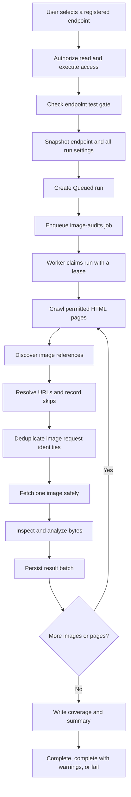
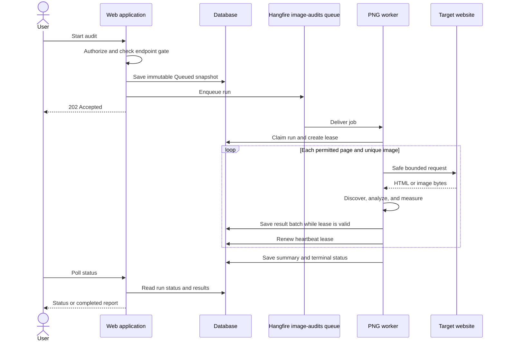
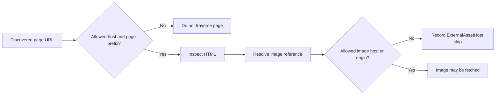
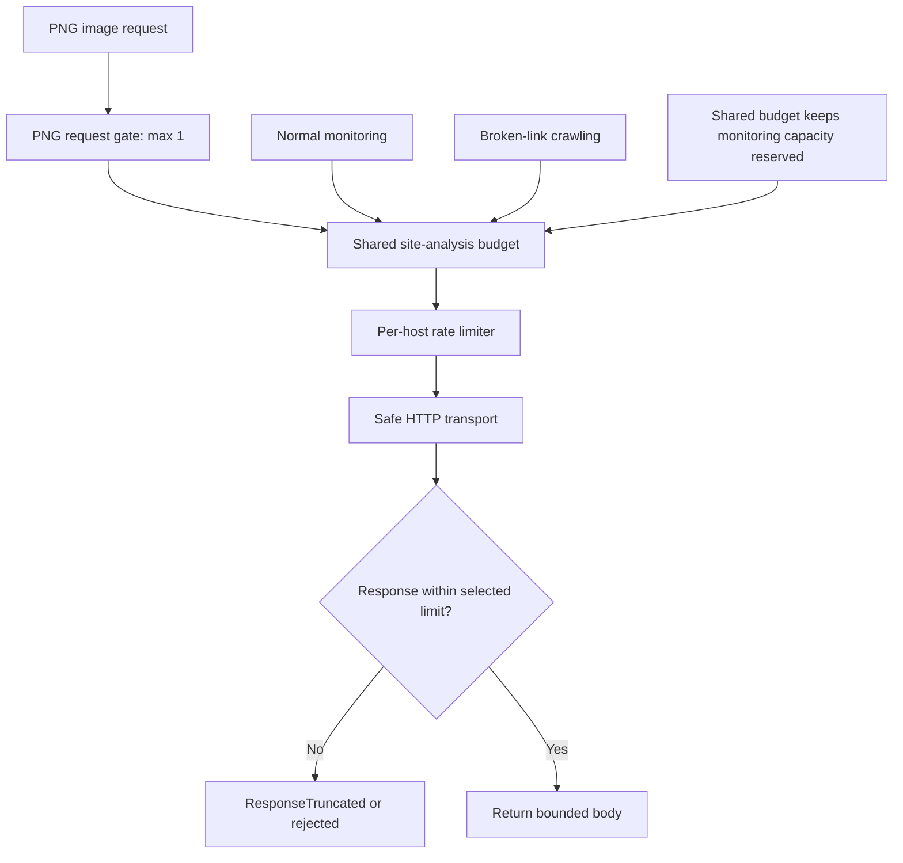
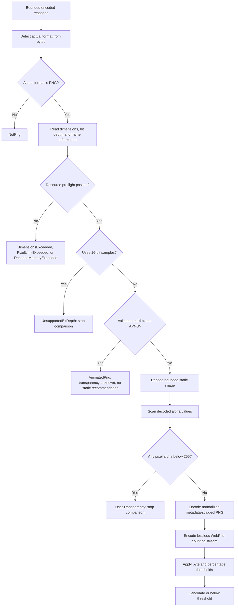
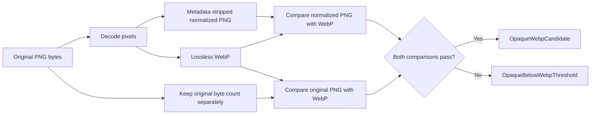
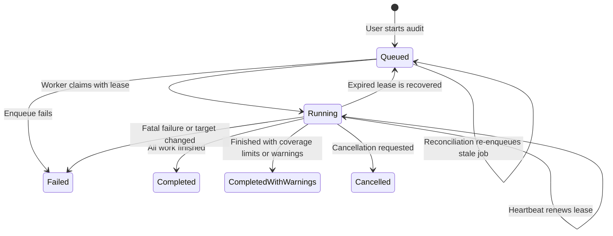
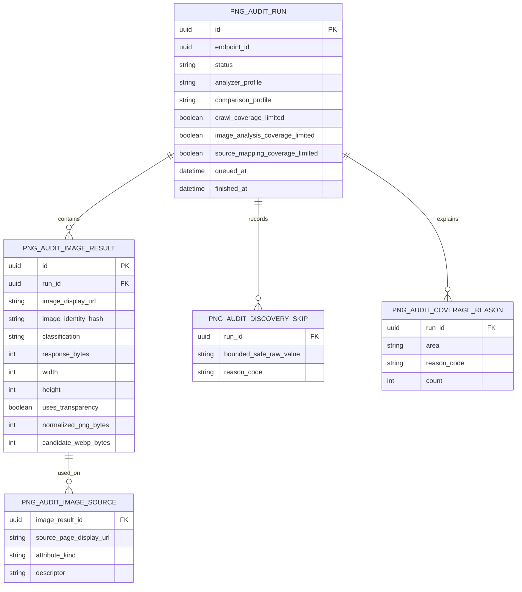
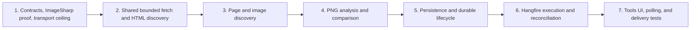

# PNG Image Audit — How It Works

This document explains the planned PNG image audit in plain language. It describes what the
feature does, how a run moves through the system, how an image is judged, and how safety and
history are handled.

The detailed source documents are:

- [Implementation plan](PNG_Image_Audit_Implementation_Plan.md)
- [Operations and decisions](PNG_Image_Audit_Operations_and_Decisions.md)

## 1. The purpose

The audit helps find PNG images that may be good candidates for **lossless WebP**. It does not
change the website. It only examines it and produces evidence-based results.

For each registered endpoint, the audit can:

1. Visit permitted internal HTML pages.
2. Find image references in those pages.
3. Remove duplicate image requests without losing information about where they were used.
4. Fetch each unique allowed image safely.
5. Check the actual bytes, dimensions, frames, and decoded pixels.
6. Detect whether any pixel really uses transparency.
7. For fully opaque PNGs, encode a normalized PNG and a lossless WebP.
8. Recommend WebP only when both configured saving tests pass.
9. Save the run, its results, skips, coverage limits, and source-page mappings.

The feature is analysis-only. It never rewrites HTML, uploads files, changes the target site, or
saves original or converted image binaries.

## 2. The complete journey of a run

At a high level, one audit follows this path:



The worker processes the image work in a deliberately narrow loop:

```text
fetch image
    -> analyze image
    -> encode comparison if eligible
    -> persist result
    -> dispose image data
    -> continue with the next image
```

This prevents a run from downloading many large images and holding them all in memory.

The important system interactions look like this:



## 3. What V1 examines

V1 extracts only image references that are directly present in the HTML:

```html


<picture>
    <source srcset="...">
    
</picture>
```

For `srcset`, the descriptor is preserved. Examples of descriptors are `1x`, `2x`, and `640w`.

V1 does **not** inspect:

| Not inspected in V1 | Why it is excluded |
| --- | --- |
| CSS `background-image` | It requires stylesheet analysis. |
| External stylesheets | They are outside the bounded HTML pass. |
| `data-src` and other custom lazy-loading attributes | They are not standard V1 image attributes. |
| JavaScript-created image URLs | V1 does not execute browser JavaScript. |
| `blob:` URLs | They are browser-local resources. |
| Inline `data:image/...` URLs | They do not represent a normal fetchable image request. |
| Browser-rendered DOM state | V1 reads downloaded HTML rather than rendering pages. |

This means the report describes the references visible to this version of the crawler, not every
image a browser might eventually display.

## 4. Page scope and image scope are different

The audit uses two separate scope rules.

### Page traversal scope

An HTML page must satisfy both conditions:

```text
allowed host
AND
allowed path prefix
```

For example, if the endpoint allows `https://example.com/application/`, the crawler can visit
`https://example.com/application/settings`, but not an unrelated host or path outside the
registered page prefixes.

### Image asset scope

An image only needs to be on an allowed asset host or origin. It does **not** inherit the page
path-prefix restriction.

Therefore this is valid:

```text
Page:  https://example.com/application/page
Image: https://example.com/assets/logo.png
```

An image on an unallowed host is recorded as `ExternalAssetHost` and is not fetched in V1. V1
does not fetch arbitrary CDN or other external origins.



## 5. How HTML discovery works

For every permitted HTML page, the shared document extractor performs one bounded pass. It
returns:

- navigation links;
- image references;
- the first valid `<base href>`;
- whether navigation extraction was complete;
- whether image-reference extraction was complete.

The existing broken-link feature continues to consume only the navigation-link part through its
adapter. It does not accidentally start consuming PNG-specific data.

References are resolved in this order:

1. Use the first valid `<base href>` when the document has one.
2. Otherwise use the document URL.
3. If the page was redirected, use the redirected document URL for resolving its relative links.
4. Remove URL fragments before fetching.
5. Validate the scheme, host, credentials, length, and scope.

The `srcset` value is parsed with a real `srcset` parser, not by naïvely splitting on commas.

Each accepted reference creates two kinds of information:

```text
unique image request
    + source page
    + attribute kind
    + srcset descriptor
```

The image request is deduplicated, but every valid source mapping is retained until its mapping
limit is reached. Thus one image can still show all the pages and attributes where it was found.

## 6. The three URL representations

An image URL has three separate representations because network safety and useful reporting need
different values.

| Representation | Purpose | Persisted? |
| --- | --- | --- |
| `FetchUrl` | Exact resolved URL used for the request, including meaningful query order and values. | No; memory only. |
| `IdentityHash` | SHA-256 of the discovered request identity. Used for deduplication. | Yes. |
| `DisplayUrl` | Bounded, safe, sensitive-query-redacted value for reports and storage. | Yes. |

For example, these are different requests and must not be merged:

```text
/image.png?w=400
/image.png?w=800
```

Signed query parameters are not rewritten before fetching. The request must remain valid, but
secret query values must never be persisted or written to logs. A display value may show a
redacted value such as `token=REDACTED`.

The display URL is never used to make a network request. The queued seed follows the same rule: storage retains its redacted display value and SHA-256 identity, while execution must rehydrate the current endpoint URL and prove that its identity still matches before fetching.

Redirect destinations receive the same treatment: the exact final request identity is kept only
in memory where needed, while safe display and identity values are stored.

## 7. Safe fetching and fairness

PNG auditing uses shared site-analysis fetching infrastructure. It does not call the existing
broken-link execution service directly and does not copy its implementation.

The shared fetcher owns:

- safe HTTP transport;
- timeouts;
- bounded transient retries;
- `Retry-After` handling;
- total request budgeting;
- per-host rate limiting;
- redirect-hop rules;
- normalized failure results.

The PNG feature supplies its own snapshotted rate and retry settings while using the same shared
budget. In V1, PNG image requests have an additional child gate allowing only one concurrent
outbound image request.

The normal transport ceiling remains 2 MB. Only the PNG-specific image path can explicitly request
up to 8 MB. A request above the absolute 8 MB ceiling is rejected before any outbound request.



The HTTP-attempt budget counts every outbound exchange, including redirects and retries. The run
deadline also applies while waiting for a rate-limit slot, waiting between retries, performing
robots lookups, and making requests.

## 8. Bounded discovery

The crawler is bounded so a large or hostile website cannot make one audit unlimited. The main
V1 defaults are:

| Area | Limit |
| --- | ---: |
| Worker count | 1 |
| Pages | 200 |
| Page depth | 5 |
| Individual page body | 1 MB |
| Total page bodies | 32 MB |
| Image references per page | 1,000 |
| Unique image requests | 500 |
| Total source mappings | 5,000 |
| Individual image body | 8 MB |
| Total image bodies | 128 MB |
| Total HTTP attempts | 1,500 |
| Run duration | 30 minutes |
| Image fetch concurrency | 1 |
| Image decode concurrency | 1 |
| Encoder parallelism | 1 |

There are separate coverage areas:

1. **Crawl coverage:** which pages could be visited.
2. **Image-analysis coverage:** which discovered images could be fetched and analyzed.
3. **Source-mapping coverage:** which page-to-image relationships could be stored.

For example, reaching the unique-image limit does not mean that page crawling was incomplete in
the same way. Each affected area records its own reason, such as `PageLimit`, `UniqueImageLimit`,
`TotalImageBytesLimit`, or `SourceMappingLimit`.

Skipped references are also recorded when they cannot become image results. Examples include:

- `data:`;
- `blob:`;
- unsupported schemes;
- malformed URLs;
- URLs that are too long;
- credentials in a URL;
- external asset hosts;
- reference limits.

## 9. How an image is analyzed

The audit trusts the downloaded bytes, not the filename or declared content type.



### 9.1 Format and resource checks

The analyzer first identifies the actual format from the bytes. This catches cases such as a WebP
file named `something.png`.

Before decoding, it checks the image against:

- maximum width: 10,000;
- maximum height: 10,000;
- maximum decoded pixels: 40,000,000;
- maximum decoded memory: 256 MB;
- 8-bit-or-lower sample precision for the V1 WebP comparison;
- frame limits and the encoded body limit.

These checks reduce the risk of decompression bombs and excessive memory use.

### 9.2 Transparency means actual alpha usage

The rule is:

```text
UsesTransparency = at least one decoded pixel has alpha < 255
```

The analyzer does not infer transparency from:

- the `.png` extension;
- the MIME type;
- the PNG color mode;
- the existence of an alpha channel;
- metadata.

An image with an alpha channel but every pixel at alpha 255 is fully opaque for this decision. A
single semi-transparent pixel is enough to classify the image as using transparency.

The wording is intentionally precise: the tool reports **uses transparency**, not “has a
transparent background.”

### 9.3 APNG and other result states

If a structurally valid PNG has multiple frames, it is classified as `AnimatedPng`. Its chunks,
CRCs, frame count, sequence numbers, frame bounds and terminal `IEND` are validated before that
classification. V1 does not decode its frames, so transparency remains unknown and it receives no
static WebP conversion recommendation.

Other possible result states include:

```text
FetchFailed
HttpNonSuccess
ResponseTruncated
NotPng
IdentificationFailed
UnsupportedBitDepth
DimensionsExceeded
PixelLimitExceeded
DecodedMemoryExceeded
AnimatedPng
DecodeFailed
UsesTransparency
WebpComparisonFailed
OpaqueWebpCandidate
OpaqueBelowWebpThreshold
```

The application stores a safe reason code rather than exposing raw exception text as user-facing
data.

## 10. How the WebP recommendation is proved

The audit performs a real encoding comparison for fully opaque PNGs. It does not estimate savings
from file extensions or a formula.

The original file is decoded once, then the same pixels are used for two comparison encodes:



The default recommendation policy is:

```text
minimum saving percentage = 10%
minimum saving bytes       = 4 KB
```

Both comparisons must pass:

```text
original_bytes - webp_bytes >= 4 KB
AND
(original_bytes - webp_bytes) / original_bytes >= 10%

normalized_png_bytes - webp_bytes >= 4 KB
AND
(normalized_png_bytes - webp_bytes) / normalized_png_bytes >= 10%
```

This prevents a recommendation that is explained only by removable PNG metadata or an unusually
poorly optimized original file.

Only the encoded byte counts are needed. The encoders write to a counting/discard stream instead
of retaining complete candidate files in memory.

Savings are signed. If WebP is larger, the saving is negative; that is a valid measured result,
not a special error.

The stable profiles make old results understandable after future package or encoder changes:

```text
analyzer_profile   = png-alpha-v1
comparison_profile = normalized-png-vs-lossless-webp-v1
```

The selected image library is SixLabors.ImageSharp 3.1.12. The operations document records the
current license decision and the need to recheck licensing before commercial use or a major
dependency upgrade.

## 11. Run lifecycle and recovery

A run starts as `Queued`, not `Running`. This makes the gap between creating a database record and
starting a worker visible and recoverable.



### Opening a run

When the user clicks **Run**:

1. The request is authorized.
2. The endpoint test gate checks that the target can be tested.
3. The system validates the endpoint.
4. It snapshots the endpoint and configuration.
5. It creates the immutable run in `Queued` state.
6. It commits the transaction.
7. It enqueues the background job.

There can be only one active run for an endpoint at a time. The database enforces uniqueness for
runs in `Queued` or `Running` state.

If the enqueue operation fails, the run becomes `Failed` with `WorkerUnavailable` rather than
remaining indefinitely queued.

### Worker claim and lease

The worker atomically changes the run from `Queued` to `Running` and records:

- a new lease token;
- a lease expiration time;
- the start time;
- an incremented attempt count.

Long audits renew the lease after page batches, after image-result batches, and at least once per
configured heartbeat interval. Results are committed only while the worker still owns the lease.

If a worker or job disappears, reconciliation can re-enqueue stale queued work or recover an
expired running lease. Duplicate job delivery cannot create duplicate image results because the
run and image identity constraints make execution idempotent.

### Immutable configuration

The worker uses the snapshot made when the run was queued. It does not silently pick up new
configuration halfway through an audit.

Before execution, it confirms that:

- the endpoint still exists;
- the endpoint remains testable;
- the endpoint URL is unchanged.

If the URL changed, the run fails with `TargetChanged` so results cannot be labeled as belonging to
one endpoint while actually auditing another URL.

## 12. What is stored

The audit uses five tables.



### `png_audit_run`

Stores lifecycle, the immutable configuration snapshot, and summary counts. The three coverage
flags remain separate so the report can explain exactly where completeness was lost.

### `png_audit_image_result`

Stores one row per unique image request identity. It contains safe URLs, hashes, HTTP facts,
dimensions, frame count, transparency facts, classification, reason code, and comparison metrics.
The transparency fields are nullable because APNG pixels are not decoded in V1. It does not
contain image binaries.

### `png_audit_image_source`

Stores where an image was found: source page, attribute type, and `srcset` descriptor. Multiple
source mappings can point to one image result.

### `png_audit_discovery_skip`

Stores references that could not become image results, along with a bounded and redacted value and
a reason code.

### `png_audit_coverage_reason`

Stores counts for limits and other causes of incomplete coverage, separated into `Crawl`,
`ImageAnalysis`, and `SourceMappings`.

## 13. Legal result rules

The database validates important relationships between a classification and its facts. Examples:

```text
UsesTransparency
    -> uses_transparency = true

AnimatedPng
    -> frame_count > 1
    -> uses_transparency is null

OpaqueWebpCandidate
    -> uses_transparency = false
    -> normalized_png_bytes is present
    -> candidate_webp_bytes is present
    -> recommendation = LosslessWebp

NotPng
    -> detected_format is present
    -> detected_format is not PNG
```

This prevents an invalid combination such as a “WebP candidate” with no WebP measurement from
being stored as if it were a valid result.

## 14. How users see the feature

The sidebar will contain:

```text
Tools
  PNG image audit
```

V1 adds only this tool. It does not create a generic Tools framework or generic `ToolRun` and
`ToolResult` tables.

The routes are explicitly defined under `/Tools/PngImages`:

```text
GET  /Tools/PngImages
POST /Tools/PngImages/Run
GET  /Tools/PngImages/Status
GET  /Tools/PngImages/Runs/{id}
```

The run request returns `202 Accepted`. The status endpoint returns `202` while the run is queued
or running and `200` when it reaches a terminal state. The existing AJAX poller and fragment
replacement pattern are reused; no new polling system is introduced.

### Authorization

| Role | Read results | Start a run |
| --- | ---: | ---: |
| Administrator | Yes | Yes |
| Operations | Yes | Yes |
| Developer/Support | Yes | Yes |
| Viewer | Yes | No |

Reading follows registry visibility. Starting a run requires both `TestRegistryTargets` and the
endpoint test gate.

### Results summary and table

The summary shows:

- pages inspected;
- images discovered;
- unique images;
- PNGs analyzed;
- images using transparency;
- opaque PNGs;
- WebP candidates;
- images below the threshold;
- skipped or unanalyzed references.

Coverage is shown separately for site crawling, image analysis, and source mappings.

The result table includes the image display URL, pages using it, dimensions, current size,
transparency, recommendation, WebP size, and potential saving. Filters include candidates,
transparency, below-threshold images, animated PNGs, not analyzed, and not-PNG resources.

The report shows URLs only. It does not embed target-hosted images in `` tags, because doing
so would make the user's browser bypass WebHealth's server-side SSRF controls, limits, rate
policy, and logging. Local bounded thumbnails are future work.

## 15. Recommendation wording

The report must describe evidence, not make a broader claim than the audit can support.

### Good wording

```text
Opaque PNG — lossless WebP candidate
Current: 184 KB · WebP: 112 KB · estimated reduction: 72 KB / 39%
```

```text
Uses transparency
This image is not eligible for the opaque-PNG recommendation used by this version of the tool.
```

```text
Opaque PNG — lossless WebP below threshold
Conversion saved 2.1%, below the configured 10% / 4 KB recommendation threshold.
```

### Wording to avoid

```text
PNG should be changed.
Keep PNG.
Transparent background detected.
```

The tool measures actual alpha usage and a bounded lossless comparison. It does not decide the
entire image strategy for the website.

## 16. Delivery order

The feature is intentionally built from its safety and correctness foundations upward. The UI and
database are not the first steps.



### Increment 1 — Feasibility

Establishes the result vocabulary, profiles, ImageSharp dependency decision, binary fixtures,
resource settings, comparison proof, and the 2 MB/8 MB transport split. PNG auditing remains
disabled and there is no UI, job, or persistence yet.

### Increment 2 — Shared site analysis

Introduces the shared bounded fetcher and shared HTML discovery extractor. Broken-link crawling is
adapted to the new infrastructure and must behave exactly as before, including redirects, robots,
`<base>`, retries, deduplication, truncation, and concurrency.

### Increment 3 — Bounded discovery

Adds the PNG site crawler, separate page and asset scopes, URL representations, `srcset` parsing,
discovery skips, source mappings, and coverage reasons. Image bodies are not downloaded yet.

### Increment 4 — Analyzer

Adds actual format detection, APNG handling, resource preflight, alpha scanning, normalized PNG
encoding, lossless WebP encoding, counting streams, and stable fixture expectations.

### Increment 5 — Persistence

Adds the five tables, constraints, indexes, immutable structured snapshots, persistence-boundary
redaction, authoritative partial summaries, leases, batching, pagination, endpoint purge behavior,
migrations, and compiled EF model updates.

### Increment 6 — Queue and execution

Adds the `image-audits` Hangfire queue, one worker, the runner, heartbeat, reconciliation, and
end-to-end execution. PNG work remains independent of the broken-link scheduling switch while
sharing the site-analysis infrastructure and fairness controls.

### Increment 7 — UI and delivery

Adds the sidebar item, explicit routes, authorization, AJAX status polling, result pages, filters,
and final integration tests. Only after this increment is the feature exposed to users.

## 17. Current implementation status described by the operations record

The operations document records these decisions as already established:

- PNG auditing is disabled by default.
- The stable analyzer and comparison profiles are defined.
- The comparison policy validates both byte and percentage thresholds.
- Fetch outcomes and image-analysis outcomes use separate typed classifications.
- ImageSharp 3.1.12 feasibility has been demonstrated with PNG, APNG, alpha, normalized PNG, and
  lossless WebP fixtures.
- Shared site-analysis fetching and bounded HTML discovery have been introduced for the planned
  architecture.
- Bounded PNG discovery produces in-memory pages, image identities, source mappings, skips, and
  coverage reasons.
- Bounded PNG analysis rejects 16-bit comparisons, validates APNG structure, scans decoded alpha,
  and measures normalized PNG and lossless WebP candidates without retaining encoded bodies.
- Durable PNG runs now snapshot their complete policy, use lease-owned idempotent result batches,
  retain separate coverage areas, expose paginated authorized reads, and participate in endpoint
  purge. Background execution and the UI belong to later increments in the implementation plan.

One implementation detail is especially important: the known APNG fixture is accepted by full
decoding, but `Image.Identify` alone rejects it. The analyzer therefore uses bounded PNG chunk
inspection and validation instead of relying on `Image.Identify` for APNG.

## 18. The simplest mental model

You can think of the audit as four separate questions:

```text
1. Where did the HTML say an image request exists?
2. Is that request allowed and safe to fetch?
3. What do the downloaded bytes and decoded pixels actually contain?
4. Does a real normalized lossless WebP encode save enough space by both tests?
```

Only when the answer to all required questions is supported by evidence does the tool show an
`OpaqueWebpCandidate`. Every other situation receives a narrower classification and an explanation
of what prevented a recommendation.
