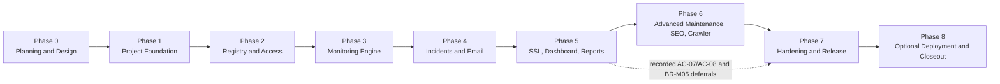

# Website Health Monitoring Phased Implementation Plan

## 1. Purpose

This file is the start-to-finish execution checklist for the Website Health Monitoring project. It summarizes delivery order and phase gates. Detailed design and task guidance remain in:

- [`Website_Health_Monitoring_Project_Specification.md`](../Website_Health_Monitoring_Project_Specification.md)
- [`Technology_Stack.md`](Technology_Stack.md)
- [`System_Design_and_Architecture.md`](System_Design_and_Architecture.md)
- [`Detailed_Implementation_Plan.md`](Detailed_Implementation_Plan.md)

## 2. How to Use This Plan

- Complete phases in order unless a dependency is explicitly independent.
- Keep only one major vertical increment in progress at a time.
- Link every implementation item to applicable business-rule and acceptance-criterion IDs.
- Do not mark a phase complete until its code, migration, tests, documentation, demonstration, and review evidence are complete.
- Record scope or behavior changes before implementation.
- Re-estimate remaining phases at every phase gate.

### Evidence standard

Every phase gate must link to durable evidence in the repository, delivery system, or intern decision record:

- Versioned demonstration script and result.
- CI run and automated test report.
- Reviewed migration and clean/upgrade migration results where data changed.
- Security, performance, query-plan, or resilience evidence required by the phase.
- Documentation changes, known limitations, intern decision, and date.

A checked box without linked evidence does not complete a phase. The Global Checklist is re-evaluated at every phase gate rather than completed once for the whole project.

## 3. Project Roadmap

## 4. Global Checklist

These requirements apply throughout the project:

- [ ] Keep controllers and Hangfire entry points thin.
- [ ] Keep domain rules independent of MVC, EF Core, Hangfire, SMTP, and HTTP infrastructure.
- [ ] Enforce authorization server-side for every protected operation.
- [ ] Require anti-forgery protection for state-changing browser requests.
- [ ] Validate untrusted input and output-encode untrusted display values.
- [ ] Keep secrets and sensitive response data out of source control, logs, email, audit data, and diagnostics.
- [ ] Use UTC for persisted instants and scheduling.
- [ ] Use PostgreSQL constraints and transactions for critical invariants.
- [ ] Add unit and integration tests for nontrivial rules and defects.
- [ ] Apply migrations explicitly through a repeatable release/deployment step.
- [ ] Update documentation and acceptance-criteria evidence with each increment.
- [ ] Demonstrate working software at each implementation phase gate; Phase 0 uses an evidence-backed architecture/design review because it delivers no runtime behavior.

---

## Phase 0 — Planning and Design

**Goal:** Resolve decisions that materially affect the foundation and establish an intern-owned backlog.  
**Estimated duration:** 3–5 focused working days, including immediate feasibility spikes.

### Requirements and scope

- [x] Record the business baseline, personal-project boundary, and sole intern ownership. Evidence: [`../phase-0/Scope_and_Decisions.md`](../phase-0/Scope_and_Decisions.md).
- [x] Review and record the selected technology stack and architecture. Evidence: [`../phase-0/Scope_and_Decisions.md`](../phase-0/Scope_and_Decisions.md).
- [x] Confirm PostgreSQL as the selected database deviation.
- [x] Confirm protected MVP and explicitly deferred scope.
- [x] Require intern ownership or explicit permission for monitored targets.
- [x] Defer production hosting, HA, backups, managed logging/alerts, and formal operations to later phases.
- [x] Record project risks, assumptions, and immediate blockers. Evidence: [`../phase-0/Scope_and_Decisions.md`](../phase-0/Scope_and_Decisions.md).

### Data and domain design

- [x] Create the detailed database design and ER diagram. Evidence: [`../phase-0/Database_Design.md`](../phase-0/Database_Design.md).
- [x] Define entities, relationships, required fields, and deletion behavior. Evidence: [`../phase-0/Database_Design.md`](../phase-0/Database_Design.md).
- [x] Define name, URL, recipient, issue-key, and crawl-pair normalization. Evidence: [`../phase-0/Database_Design.md`](../phase-0/Database_Design.md).
- [x] Define core health, incident, logical-check, and notification statuses; leave detailed finding/crawl state design to owning phases. Evidence: [`../phase-0/Database_Design.md`](../phase-0/Database_Design.md).
- [x] Define database uniqueness constraints and indexes. Evidence: [`../phase-0/Database_Design.md`](../phase-0/Database_Design.md).
- [x] Define optimistic concurrency behavior. Evidence: [`../phase-0/Database_Design.md`](../phase-0/Database_Design.md).
- [x] Define logical-check idempotency and endpoint/monitor leases. Evidence: [`../phase-0/Database_Design.md`](../phase-0/Database_Design.md).
- [x] Define core audit behavior and record short retention/aggregation/hold notes for Phase 7. Evidence: [`../phase-0/Database_Design.md`](../phase-0/Database_Design.md).

### Security and operations design

- [x] Create a threat model. Evidence: [`../phase-0/Security_and_Operations.md`](../phase-0/Security_and_Operations.md).
- [x] Define SSRF and destination-network policy for IPv4 and IPv6. Evidence: [`../phase-0/Security_and_Operations.md`](../phase-0/Security_and_Operations.md).
- [x] Define actual-connection and redirect validation requirements. Evidence: [`../phase-0/Security_and_Operations.md`](../phase-0/Security_and_Operations.md).
- [x] Define proxy behavior and private-network exceptions. Evidence: [`../phase-0/Security_and_Operations.md`](../phase-0/Security_and_Operations.md); environment decision remains open.
- [x] Define timeout, body-size, redirect, concurrency, and initial crawler limits. Evidence: [`../phase-0/Security_and_Operations.md`](../phase-0/Security_and_Operations.md).
- [x] Define local/demo secret storage and allow-listed logging fields. Evidence: [`../phase-0/Security_and_Operations.md`](../phase-0/Security_and_Operations.md).
- [x] Define explicit migration safety; defer production backup/restoration/forward-fix operations to deployment phases. Evidence: [`../phase-0/Security_and_Operations.md`](../phase-0/Security_and_Operations.md).

### UI and delivery planning

- [x] Adopt Metronic 8 Demo 34 as the UI baseline and define license, source-package, version, and asset-handling gates. Evidence: [`../phase-0/UI_Direction.md`](../phase-0/UI_Direction.md).
- [x] Prepare responsive textual wireframes for primary journeys. Evidence: [`../phase-0/UI_Direction.md`](../phase-0/UI_Direction.md).
- [x] Define accessibility requirements and interaction states. Evidence: [`../phase-0/UI_Direction.md`](../phase-0/UI_Direction.md).
- [x] Convert the specification into prioritized work packages and define the issue template. Evidence: [`../phase-0/Backlog.md`](../phase-0/Backlog.md).
- [x] Link AC-01 through AC-15 to delivery phases and tests. Evidence: [`../phase-0/Traceability_Matrix.md`](../phase-0/Traceability_Matrix.md).
- [x] Define controlled HTTP, TLS, DNS, proxy, PostgreSQL, and fake-email targets; leave detailed SEO/crawler fixtures to Phase 6. Evidence: [`../phase-0/Test_and_Delivery_Strategy.md`](../phase-0/Test_and_Delivery_Strategy.md).
- [x] Define build, test, migration, and security pipeline gates. Evidence: [`../phase-0/Test_and_Delivery_Strategy.md`](../phase-0/Test_and_Delivery_Strategy.md).
- [x] Create an AC-01 through AC-15 and BR-A01 through BR-R07 traceability matrix. Evidence: [`../phase-0/Traceability_Matrix.md`](../phase-0/Traceability_Matrix.md).

### Feasibility spikes

- [x] Prove the selected Hangfire PostgreSQL storage provider works with the pinned .NET, EF Core, Npgsql, and PostgreSQL versions. Evidence: [`../phase-0/Test_and_Delivery_Strategy.md`](../phase-0/Test_and_Delivery_Strategy.md), SP-01.
- [x] Prove actual-connection-address enforcement can be implemented with the selected `IHttpClientFactory` transport design. Evidence: SP-02.
- [x] Prove certificate inspection can capture required evidence while normal TLS validation remains enforced. Evidence: SP-03.
- [x] Prove no-proxy handling prevents implicit proxy bypass in the local/demo transport. Evidence: SP-03.
- [x] Implement deterministic IPv4, IPv6, redirect, and DNS-rebinding test fixtures. Evidence: SP-02/SP-03.
- [x] Prove the proposed PostgreSQL lease, active-incident uniqueness, and idempotency constraints under competing transactions. Evidence: SP-04.
- [x] Define immediate spike scope, pass criteria, current limitations, and evidence format. Evidence: [`../phase-0/Test_and_Delivery_Strategy.md`](../phase-0/Test_and_Delivery_Strategy.md). Execution completed on 2026-08-13.

### Phase 0 completion gate

- [x] Scope, sole ownership, and foundation decisions are recorded. Evidence: [`../phase-0/Scope_and_Decisions.md`](../phase-0/Scope_and_Decisions.md).
- [x] Database foundation is reviewable. Evidence: [`../phase-0/Database_Design.md`](../phase-0/Database_Design.md).
- [x] Threat model and network policy are reviewable; immediate proof passed. Evidence: [`../phase-0/Test_and_Delivery_Strategy.md`](../phase-0/Test_and_Delivery_Strategy.md), SP-02/SP-03.
- [x] UI direction and license/source/version confirmation are complete. Evidence: [`../phase-0/UI_Direction.md`](../phase-0/UI_Direction.md).
- [x] Backlog work packages contain requirement IDs and planned acceptance evidence. Evidence: [`../phase-0/Backlog.md`](../phase-0/Backlog.md) and [`../phase-0/Traceability_Matrix.md`](../phase-0/Traceability_Matrix.md).
- [x] Immediate dependency, safe-HTTP, and PostgreSQL concurrency spikes pass or produce a concrete foundation-safe action. Evidence: SP-01 through SP-04 in [`../phase-0/Test_and_Delivery_Strategy.md`](../phase-0/Test_and_Delivery_Strategy.md).
- [x] Personal-project constraints and deferred production operations are documented.
- [x] Intern completes [`../phase-0/Phase_0_Checklist.md`](../phase-0/Phase_0_Checklist.md).
- [x] No unresolved decision blocks Phase 1. Confirmed by the intern/project owner on 2026-08-13.

---

## Phase 1 — Project Foundation

**Goal:** Produce a runnable, testable application skeleton with PostgreSQL, observability, and controlled configuration.  
**Estimated duration:** 4–6 working days.

### Solution setup

- [x] Create the .NET solution. Evidence: [`../../WebHealthProject.sln`](../../WebHealthProject.sln).
- [x] Create Web, Application, Domain, and Infrastructure projects. Evidence: [`../../src/`](../../src/).
- [x] Create unit and integration test projects. Evidence: [`../../tests/WebHealth.UnitTests/`](../../tests/WebHealth.UnitTests/) and [`../../tests/WebHealth.IntegrationTests/`](../../tests/WebHealth.IntegrationTests/).
- [x] Configure project references according to architecture boundaries. Evidence: project references in [`../../src/`](../../src/) match the documented dependency direction.
- [x] Configure central package/version management if adopted by the repository. Evidence: [`../../Directory.Packages.props`](../../Directory.Packages.props) and per-project lock files.
- [x] Pin reviewed .NET 10-compatible dependency versions. Evidence: [`../../Directory.Packages.props`](../../Directory.Packages.props), locked restore, and the vulnerability review recorded in [`../phase-0/Test_and_Delivery_Strategy.md`](../phase-0/Test_and_Delivery_Strategy.md).
- [ ] Add repository formatting and build conventions.

### Runtime foundation

- [x] Configure ASP.NET Core MVC. Evidence: [`../../src/WebHealth.Web/Program.cs`](../../src/WebHealth.Web/Program.cs).
- [x] Configure environment-specific settings. Evidence: [`../../src/WebHealth.Web/appsettings.json`](../../src/WebHealth.Web/appsettings.json) and [`../../src/WebHealth.Web/appsettings.Development.json`](../../src/WebHealth.Web/appsettings.Development.json).
- [x] Configure safe local secret handling. Evidence: the user-secrets identifier in [`../../src/WebHealth.Web/WebHealth.Web.csproj`](../../src/WebHealth.Web/WebHealth.Web.csproj) and setup instructions in [`../phase-1/Runtime_Foundation.md`](../phase-1/Runtime_Foundation.md).
- [x] Configure EF Core, Npgsql, and PostgreSQL. Evidence: [`../../src/WebHealth.Infrastructure/DependencyInjection.cs`](../../src/WebHealth.Infrastructure/DependencyInjection.cs) and [`../../src/WebHealth.Infrastructure/Persistence/ApplicationDbContext.cs`](../../src/WebHealth.Infrastructure/Persistence/ApplicationDbContext.cs); schema migration remains explicit and belongs to the database-foundation work.
- [x] Configure Serilog and correlation identifiers. Evidence: [`../../src/WebHealth.Web/Program.cs`](../../src/WebHealth.Web/Program.cs) and [`../../src/WebHealth.Web/Middleware/CorrelationIdMiddleware.cs`](../../src/WebHealth.Web/Middleware/CorrelationIdMiddleware.cs).
- [x] Add global exception handling with safe user-facing errors. Evidence: [`../../src/WebHealth.Web/Controllers/HomeController.cs`](../../src/WebHealth.Web/Controllers/HomeController.cs) and [`../../src/WebHealth.Web/Views/Shared/Error.cshtml`](../../src/WebHealth.Web/Views/Shared/Error.cshtml).
- [x] Add liveness and initial readiness checks. Evidence: `/health/live` and `/health/ready` in [`../../src/WebHealth.Web/Program.cs`](../../src/WebHealth.Web/Program.cs), with PostgreSQL readiness in [`../../src/WebHealth.Infrastructure/Diagnostics/PostgreSqlReadinessCheck.cs`](../../src/WebHealth.Infrastructure/Diagnostics/PostgreSqlReadinessCheck.cs).
- [ ] Integrate the licensed, pinned Metronic Demo 34 assets and application-owned override structure.
- [ ] Add the shared layout, navigation shell, and accessible error pages.

### Database and tests

- [x] Add initial database context and migration conventions. Evidence: [`../../src/WebHealth.Infrastructure/Persistence/ApplicationDbContext.cs`](../../src/WebHealth.Infrastructure/Persistence/ApplicationDbContext.cs), [`../../src/WebHealth.Infrastructure/Persistence/DatabaseConventions.cs`](../../src/WebHealth.Infrastructure/Persistence/DatabaseConventions.cs), and [`../phase-1/Database_Conventions.md`](../phase-1/Database_Conventions.md).
- [x] Verify clean PostgreSQL database creation. Evidence: [`../../scripts/run-database-foundation-tests.ps1`](../../scripts/run-database-foundation-tests.ps1) applied the baseline migration to isolated PostgreSQL 18 on 2026-08-13.
- [x] Configure `WebApplicationFactory` integration tests. Evidence: [`../../tests/WebHealth.IntegrationTests/RuntimeFoundationTests.cs`](../../tests/WebHealth.IntegrationTests/RuntimeFoundationTests.cs).
- [ ] Configure PostgreSQL Testcontainers tests.
- [x] Add a smoke test for application startup and readiness. Evidence: five passing runtime tests in [`../../tests/WebHealth.IntegrationTests/RuntimeFoundationTests.cs`](../../tests/WebHealth.IntegrationTests/RuntimeFoundationTests.cs).
- [ ] Establish repeatable build and test commands.
- [ ] Add pipeline configuration using an available personal CI service.

### Phase 1 completion gate

- [ ] Application builds and starts locally.
- [x] PostgreSQL connectivity and migrations work from a clean database. Evidence: the clean-database integration test passed and a repeated explicit update applied no migrations.
- [ ] Liveness and readiness behave as documented.
- [ ] Unit and integration test projects run successfully.
- [ ] No secrets are committed.
- [ ] Architecture references follow the recorded dependency direction.

---

## Phase 2 — Identity, Authorization, Registry, and Audit

**Goal:** Deliver secured administration of clients and monitoring targets.  
**Estimated duration:** 8–12 working days.  
**Acceptance criteria:** AC-01, AC-10, partial AC-13.

### Identity and access

- [ ] Configure ASP.NET Core Identity.
- [ ] Add Administrator, Operations, Developer/Support, and Viewer roles.
- [ ] Implement sign-in and sign-out.
- [ ] Configure password, lockout, and security-stamp policies.
- [ ] Implement admin-only user and role management.
- [ ] Implement account disabling and session invalidation.
- [ ] Implement role and assignment-aware authorization policies.
- [ ] Protect every operational endpoint server-side.
- [ ] Add anti-forgery protection to state-changing MVC actions.

### Registry management

- [ ] Implement Client management.
- [ ] Implement Website management.
- [ ] Implement Environment management.
- [ ] Implement Endpoint management.
- [ ] Implement owners, teams, tags, and inherited ownership.
- [ ] Enforce normalized uniqueness rules.
- [ ] Enforce absolute HTTP/HTTPS URLs without embedded credentials.
- [ ] Enforce production HTTPS or administrator exception reason.
- [ ] Require an environment before enabling monitoring.
- [ ] Implement enabled/disabled behavior.
- [ ] Implement soft deletion for records with history.
- [ ] Implement optimistic concurrency for edits.

### Audit and UI

- [ ] Record create, update, delete, permission, and enable/disable events.
- [ ] Store actor, timestamp, action, entity, and safe before/after values.
- [ ] Implement an authorized audit search view.
- [ ] Build registry pages using the Metronic shell, reusable Razor components, and application-owned overrides.
- [ ] Support keyboard navigation, visible focus, labels, validation summaries, and responsive layouts.
- [ ] Ensure status and validation do not rely only on color.

### Database and verification

- [ ] Add Identity, registry, ownership, tags, policies, and audit migration.
- [ ] Add required foreign keys and uniqueness constraints.
- [ ] Add concurrency tokens and operational indexes.
- [ ] Verify direct requests for every role.
- [ ] Verify anti-forgery rejection.
- [ ] Verify disabled-account behavior.
- [ ] Verify database constraints independently of UI validation.
- [ ] Verify stale updates fail safely.
- [ ] Verify output encoding and secret-safe logs.

### Phase 2 completion gate

- [ ] AC-01 passes with database constraint evidence.
- [ ] AC-10 passes for direct unauthorized requests.
- [ ] Configuration changes satisfy the configuration portion of AC-13.
- [ ] Registry migration succeeds from clean and previous schemas.
- [ ] Secured registry workflow is demonstrated.

---

## Phase 3 — Scheduling and Monitoring Engine

**Goal:** Execute safe, persistent, deduplicated HTTP checks and record normalized history.  
**Estimated duration:** 12–18 working days.  
**Acceptance criteria:** AC-02, AC-05.

### Hangfire and scheduling

- [ ] Configure Hangfire with PostgreSQL storage.
- [ ] Create queues for short checks, notifications, crawls, and maintenance work.
- [ ] Select due enabled endpoints using UTC.
- [ ] Create stable logical-check records.
- [ ] Queue scheduled checks without blocking web requests.
- [ ] Implement authorized manual checks with initiator and source.
- [ ] Keep manual checks outside scheduled cadence and contractual uptime by default.
- [ ] Advance schedules independently from retry attempts.
- [ ] Implement one-check catch-up after scheduler downtime.
- [ ] Implement reconciliation for committed but unqueued work.

### Concurrency and idempotency

- [ ] Implement a PostgreSQL-backed lease per endpoint and monitor type.
- [ ] Store lease owner, acquisition, and expiry.
- [ ] Ensure duplicate jobs use the same logical-check ID.
- [ ] Enforce one terminal result per logical check.
- [ ] Recover safely after worker failure or expired lease.
- [ ] Close timed-out or exhausted checks with terminal outcomes.

### Safe HTTP transport

- [ ] Implement monitoring through `IHttpClientFactory`.
- [ ] Disable uncontrolled automatic redirects.
- [ ] Validate URL syntax, scheme, and credentials.
- [ ] Resolve and enforce destination policy for every request and redirect.
- [ ] Validate the actual connection address.
- [ ] Cover prohibited IPv4 and IPv6 destinations.
- [ ] Protect against DNS rebinding.
- [ ] Control outbound proxy behavior.
- [ ] Keep TLS validation enabled.
- [ ] Enforce timeout, cancellation, response-size, redirect, concurrency, and per-host bounds.
- [ ] Set the configured monitoring user-agent.

### Results and history

- [ ] Capture status, duration, available timing metrics, length, and redirect path.
- [ ] Normalize DNS, connection, TLS, timeout, HTTP, redirect, and content failures.
- [ ] Implement accepted-status and content-marker evaluation.
- [ ] Detect redirect loops and excessive chains.
- [ ] Persist bounded diagnostics without full bodies or sensitive headers.
- [ ] Add check history and details pages.
- [ ] Add structured check, endpoint, and job identifiers to logs.

### Database and verification

- [ ] Add logical checks, results, findings, leases, and durable work migration.
- [ ] Add scheduling and history indexes.
- [ ] Unit-test cadence, status rules, markers, redirects, loops, limits, and timeout classification.
- [ ] Integration-test controlled status, delay, redirect, cancellation, and large-body scenarios.
- [ ] Test IPv4, IPv6, redirects to prohibited ranges, actual connection addresses, DNS rebinding, and proxy policy.
- [ ] Test duplicate delivery, competing workers, lease expiry, restart, and catch-up.
- [ ] Verify disabled targets produce no new checks.

### Phase 3 completion gate

- [ ] AC-02 passes for scheduled checks and persisted history.
- [ ] AC-05 passes for redirect-loop termination and storage.
- [ ] Duplicate and restart tests produce one logical result.
- [ ] Safe-network tests pass.
- [ ] Monitoring workflow is demonstrated against controlled targets.

---

## Phase 4 — Health, Incidents, and Email Notifications

**Goal:** Turn monitoring evidence into stable health, controlled incidents, and deduplicated email notifications.  
**Estimated duration:** 8–12 working days.  
**Acceptance criteria:** AC-03, AC-04, AC-09, AC-12, remaining AC-13.

### Minimum maintenance behavior

- [ ] Implement non-recurring maintenance windows with target scope, start/end, timezone, reason, creator, and suppression policy.
- [ ] Validate that end is after start and evaluate active windows using stored UTC instants.
- [ ] Continue checks during maintenance and mark their results.
- [ ] Suppress notifications while retaining explicit suppression records.
- [ ] Pause escalation for incidents opened before maintenance according to policy.
- [ ] Reset post-maintenance failure confirmation by default.
- [ ] Keep recurring windows, DST expansion, and advanced maintenance administration in Phase 6.

### Health and incident engine

- [ ] Implement stable issue-key generation.
- [ ] Implement failure and recovery counters.
- [ ] Reset failure count after a passing result.
- [ ] Open incidents only after confirmation.
- [ ] Maintain one active incident per endpoint, monitor type, and issue key.
- [ ] Support separate incidents for materially different issues.
- [ ] Implement owner assignment and override precedence.
- [ ] Implement the complete incident state machine.
- [ ] Reject invalid state transitions server-side.
- [ ] Require resolution category and note for manual resolution.
- [ ] Require audit reasons for forced closure and reopening.
- [ ] Implement recurrence linking.
- [ ] Calculate outage and recovery durations.
- [ ] Append all operational changes to the incident timeline.

### Notification processing

- [ ] Define the application-owned email transport interface.
- [ ] Create durable notification records transactionally with incident changes.
- [ ] Keep SMTP delivery outside the incident transaction.
- [ ] Resolve recipients from endpoint, website, client, and escalation policy.
- [ ] Enforce event/channel/recipient idempotency.
- [ ] Implement opening and recovery templates.
- [ ] Implement configurable reminders for unacknowledged critical incidents.
- [ ] Implement configurable escalation levels and append escalation evidence to the incident timeline.
- [ ] Stop unacknowledged reminders after acknowledgement and account for maintenance-paused time.
- [ ] Record pending, processing, sent, retry, failed, and suppressed states.
- [ ] Apply bounded retries only to transient SMTP failures.
- [ ] Use a recording fake transport in automated tests.
- [ ] Configure a dedicated personal Gmail account only after enabling two-step verification and creating a revocable app password.
- [ ] Require TLS, store the app password only in secret configuration, and never use the account's normal password.
- [ ] Record Gmail throttling and delivery failures and define the threshold for migration to a managed email service.
- [ ] Ensure email excludes secrets, full response bodies, and unsafe exception details.
- [ ] Treat daily summary email as deferred unless the intern records it as added scope.

### Database, UI, and verification

- [ ] Add minimum maintenance, health counters, incidents, events, notifications, escalation, and delivery-attempt migration.
- [ ] Add active-incident and notification uniqueness constraints.
- [ ] Add incident optimistic concurrency and query indexes.
- [ ] Build incident list, details, timeline, acknowledgement, assignment, resolution, and closure pages.
- [ ] Authorize incident actions by role and assignment.
- [ ] Test failure confirmation and recovery boundaries.
- [ ] Test fail-pass-fail reset behavior.
- [ ] Test valid and invalid state transitions.
- [ ] Test distinct issues and recurrence.
- [ ] Test duplicate job delivery and restart.
- [ ] Test SMTP failure independently from incident commit.
- [ ] Test maintenance suppression, marked-result retention, escalation pause, and post-maintenance counter reset.
- [ ] Test reminder and escalation timing, acknowledgement cancellation, duplicate delivery, and restart.
- [ ] Verify incident audit and timeline records.

### Phase 4 completion gate

- [ ] AC-03 passes with one incident and one opening email.
- [ ] AC-04 passes with confirmed recovery and one recovery email.
- [ ] AC-09 passes for maintenance suppression with retained marked results.
- [ ] AC-12 passes after restart and duplicate delivery.
- [ ] Incident actions complete AC-13.
- [ ] Personal Gmail SMTP is verified through controlled delivery tests or has an assigned pre-release blocker.
- [ ] Outage and recovery workflow is demonstrated end to end.

---

## Phase 5 — SSL, Dashboard, Trends, Reports, and CSV

**Goal:** Deliver operational visibility, SSL monitoring, and consistent reporting.  
**Estimated duration:** 8–12 working days.  
**Acceptance criteria:** AC-06, AC-11.

### SSL monitoring

- [ ] Schedule daily SSL checks for HTTPS endpoints.
- [ ] Trigger urgent SSL checks after qualifying TLS failures where permitted.
- [ ] Record certificate subject, issuer, fingerprint, validity, and days remaining.
- [ ] Detect expiry, not-yet-valid, hostname mismatch, untrusted, and handshake failures.
- [ ] Implement exact 30/15/7-day severity boundaries.
- [ ] Deduplicate expiry incidents by endpoint and fingerprint.
- [ ] Detect renewal and resolve previous certificate incidents after confirmation.
- [ ] Show Not Applicable for HTTP-only endpoints.

### Dashboard and reporting

- [ ] Add endpoint health summary cards.
- [ ] Add current-health table with owner, environment, response time, SSL, and incident data.
- [ ] Add open-incident, SSL-expiry, and diagnostics sections.
- [ ] Implement uptime calculations using eligible logical checks.
- [ ] Implement response-time P50/P95 using successful eligible samples.
- [ ] Keep failed checks separate from percentile values.
- [ ] Implement Chart.js uptime and response-time datasets.
- [ ] Use shared authorized filters for screens, charts, reports, and CSV.
- [ ] Export UTF-8 CSV with stable columns and ISO-8601 timestamps.
- [ ] Display selected filters and as-of time.
- [ ] Add pagination and bounded reporting periods.

### Performance rules

- [ ] Implement configurable warning and critical total-response-time thresholds, including endpoint overrides.
- [ ] Open slow-response incidents only after the configured consecutive-breach threshold.
- [ ] Implement page-size findings using clearly labelled transferred-length evidence when available.
- [ ] Persist and display monitor source and relevant configuration; warn when comparisons are not equivalent.
- [ ] Treat analysis beyond BR-P01 through BR-P05 as deferrable only through a recorded scope change.

### UI, database, and verification

- [ ] Implement Metronic-based responsive dashboard and reports.
- [ ] Verify keyboard navigation, focus, labels, contrast, and non-color status indicators.
- [ ] Add certificate history and reporting indexes.
- [ ] Add daily aggregates if required for long report windows.
- [ ] Inspect representative PostgreSQL query plans.
- [ ] Unit-test SSL boundaries and certificate replacement.
- [ ] Test uptime eligibility and `[start, end)` windows.
- [ ] Test P50/P95 inclusion behavior.
- [ ] Test exact response-time thresholds, endpoint overrides, consecutive-breach reset, page-size classification, and comparability warnings.
- [ ] Compare screen and CSV record identity for all filters.
- [ ] Test Unicode, quoting, newlines, and spreadsheet formula handling in CSV.
- [ ] Test authorization for pages, chart endpoints, reports, and exports.
- [ ] Measure dashboard P95 using representative data.

### Phase 5 completion gate

- [ ] AC-06 passes at exact SSL boundaries.
- [ ] AC-11 passes for shared screen and CSV data.
- [ ] Dashboard accessibility checks pass.
- [ ] Performance baseline is recorded.
- [ ] BR-P01 through BR-P05 have implementation and test evidence.
- [ ] SSL and dashboard workflows are demonstrated.

---

## Phase 6 — Advanced Maintenance, SEO, and Bounded Crawler

**Goal:** Complete advanced recurring-maintenance behavior, technical SEO checks, and safe crawling.  
**Estimated duration:** 10–15 working days.  
**Acceptance criteria:** AC-07, AC-08. AC-09 is owned by Phase 4 and regression-tested here.

**Release-track rule:** This phase is part of the full scope. A core-MVP release candidate may proceed from Phase 5 to Phase 7 only when the intern records AC-07, AC-08, and BR-M05 as deferred with rationale and explicit incomplete status.

### Maintenance windows

- [ ] Regression-test the minimum Phase 4 maintenance behavior.
- [ ] Add advanced maintenance administration and policy controls where selected.
- [ ] Expand recurring windows into timezone-aware occurrences.
- [ ] Test daylight-saving boundaries.

### SEO checks

- [ ] Run only for successful HTML responses.
- [ ] Extract required values without storing complete HTML.
- [ ] Check title and meta description.
- [ ] Check canonical validity, uniqueness, and expected host.
- [ ] Check production and non-production `noindex` policy.
- [ ] Evaluate `robots.txt` at the origin root.
- [ ] Parse robots groups and comments correctly.
- [ ] Check wildcard `Disallow: /` policy.
- [ ] Check configured sitemap availability.
- [ ] Support recorded policy exceptions.

### Bounded crawler

- [ ] Start only from configured seeds.
- [ ] Enforce allowed hosts and path prefixes.
- [ ] Normalize URLs and remove fragments.
- [ ] Prevent revisits and query-string explosion.
- [ ] Ignore configured tracking parameters by default.
- [ ] Enforce page, depth, duration, concurrency, and per-host rate limits.
- [ ] Respect robots and restrict overrides to authorized owned non-production targets.
- [ ] Check external links without recursive crawling.
- [ ] Record source, target, classification, and timing.
- [ ] Deduplicate source-target results within a crawl.
- [ ] Preserve partial results on cancellation.
- [ ] Compare new, continuing, and resolved broken links.
- [ ] Use an identifying user-agent and contact value.
- [ ] Isolate crawler work from availability checks.

### Database, UI, and verification

- [ ] Add maintenance, SEO values, crawl runs, and link results migration.
- [ ] Add source-target uniqueness and reporting indexes.
- [ ] Define crawler data retention.
- [ ] Add maintenance, SEO, and broken-link views.
- [ ] Unit-test indexing, robots, normalization, and scope rules.
- [ ] Integration-test maintenance suppression and result retention.
- [ ] Integration-test crawl host/path scope, redirects, limits, rate, and cancellation.
- [ ] Apply actual-connection SSRF controls to every crawl request.
- [ ] Verify crawler work cannot starve availability checks.
- [ ] Verify HTML and sensitive body data are not retained.

### Phase 6 completion gate

- [ ] AC-07 passes for production `noindex` and wildcard `Disallow: /`.
- [ ] AC-08 passes for scoped, bounded crawling with source-target evidence.
- [ ] AC-09 remains passing after recurring-maintenance behavior is added.
- [ ] Controlled SEO, crawler, and maintenance scenarios are demonstrated.

---

## Phase 7 — Retention, Hardening, Performance, and Release

**Goal:** Prove security, resilience, performance, data lifecycle, and deployment readiness.  
**Estimated duration:** 8–12 working days.  
**Acceptance criteria:** AC-14, AC-15, final verification of every criterion included in the recorded release scope.

### Retention and aggregation

- [ ] Produce daily availability and performance aggregates.
- [ ] Implement configurable raw and aggregate/incident retention.
- [ ] Implement legal and operational holds.
- [ ] Process retention in bounded, restartable batches.
- [ ] Preserve active incidents, holds, aggregates, and historical names.
- [ ] Define retention for findings, notifications, audits, certificates, and crawl data.
- [ ] Verify reports remain correct after raw data removal.
- [ ] Log retention activity without sensitive data.

### Operational readiness

- [ ] Complete liveness and readiness behavior.
- [ ] Add worker heartbeat, queue depth, overdue checks, and notification diagnostics.
- [ ] Protect detailed diagnostics and Hangfire administration.
- [ ] Add schedule coverage, queue latency, lease, incident, notification, and dashboard signals.
- [ ] Verify graceful shutdown and job cancellation.
- [ ] Confirm operational alert ownership.
- [ ] Write support and incident runbooks.

### Security review

- [ ] Re-test every role/action/assignment combination.
- [ ] Review CSRF and output encoding.
- [ ] Review CSV and audit-data safety.
- [ ] Complete IPv4, IPv6, redirect, connection-address, DNS-rebinding, and proxy SSRF tests.
- [ ] Confirm TLS validation cannot be bypassed in production.
- [ ] Scan repository and artifacts for secrets.
- [ ] Verify least-privilege database, SMTP, deployment, and diagnostic access.
- [ ] Review dependency compatibility, maintenance, licenses, and security advisories.
- [ ] Verify intern ownership or explicit testing permission exists for enabled targets.

### Performance and resilience

- [ ] Test at least 500 enabled endpoints.
- [ ] Test 100 bounded concurrent checks.
- [ ] Demonstrate at least 95% schedule coverage.
- [ ] Demonstrate dashboard response under three seconds at P95.
- [ ] Verify crawler and notification queues do not starve availability work.
- [ ] Test application restart and duplicate delivery.
- [ ] Test PostgreSQL outage and recovery.
- [ ] Test SMTP outage and recovery.
- [ ] Test worker crash and lease expiry.
- [ ] Test queue failure after business commit and reconciliation.
- [ ] Test retention interruption and restart.

### Deployment and release

- [ ] Finalize production configuration and secret references.
- [ ] Review all EF Core migrations.
- [ ] Validate clean installation and supported upgrades.
- [ ] Back up PostgreSQL and test restoration.
- [ ] Document rollback limitations and forward-fix procedure.
- [ ] Build one versioned application artifact.
- [ ] Deploy to the agreed test environment.
- [ ] Apply migrations as a controlled release step.
- [ ] Verify readiness before starting workers.
- [ ] Smoke-test login, authorization, database, queues, controlled monitoring, and test email.
- [ ] Run all required UAT scenarios.
- [ ] Enable endpoints in controlled batches.
- [ ] Observe queue depth, target load, alert volume, and false positives.

### Phase 7 completion gate

- [ ] AC-14 passes for retention, holds, aggregates, and active incidents.
- [ ] AC-15 passes in the delivery pipeline.
- [ ] AC-01 through AC-15 and BR-M05 are re-run for the full-scope release; a recorded core-MVP release identifies BR-M05, AC-07, and AC-08 as incomplete.
- [ ] Security review has no unresolved release-blocking findings.
- [ ] Performance and resilience targets are demonstrated.
- [ ] Backup and restoration evidence exists.
- [ ] Test-environment deployment and smoke tests pass.
- [ ] Release decision and remaining risks are documented.

---

## Phase 8 — Optional Deployment and Project Closeout

**Goal:** Package and document the personal project; execute deployment-specific work only if the intern chooses a real hosted environment.  
**Estimated duration:** 2–5 working days plus the agreed observation period.

Production rollout, operational handover, backup/restore, and observation items in this phase are conditional. They are not required for a local portfolio demonstration and must not be reported complete unless exercised.

### Production rollout

- [ ] Record the intern's release decision and change note.
- [ ] Confirm production backup and restoration readiness.
- [ ] Apply reviewed production migrations.
- [ ] Deploy the selected versioned application artifact if deployment is pursued.
- [ ] Verify production liveness and readiness.
- [ ] Verify worker heartbeat and queues.
- [ ] Send a controlled notification through configured test routing.
- [ ] Enable an initial low-risk endpoint batch.
- [ ] Verify results, incidents, and notifications.
- [ ] Expand endpoint batches only when operational signals remain healthy.
- [ ] Record and resolve rollout issues.

### Documentation and handover

- [ ] Deliver architecture, database, deployment, migration, and configuration documentation.
- [ ] Deliver administrator and operations user guidance.
- [ ] Deliver backup, restoration, retention, and incident runbooks.
- [ ] Document monitoring ownership and escalation contacts.
- [ ] Document known limitations and formally deferred scope.
- [ ] Document dependency versions and license decisions.
- [ ] Document how to add controlled test targets and fake email delivery.
- [ ] Walk maintainers through module boundaries and critical invariants.
- [ ] Walk operators through dashboards, queues, alerts, and recovery procedures.

### Project closeout

- [ ] Archive acceptance-criteria evidence.
- [ ] Archive test, performance, security, migration, and restore evidence.
- [ ] Review incidents or defects found during rollout.
- [ ] Create follow-up work for non-blocking issues.
- [ ] Record final scope and deviations.
- [ ] Record intern closeout and optional peer feedback.
- [ ] Hold a retrospective and record actionable lessons.

### Phase 8 completion gate

- [ ] Production rollout is stable through the agreed observation period.
- [ ] Operational ownership is accepted.
- [ ] Documentation and runbooks are accessible.
- [ ] Remaining risks and deferred work have owners.
- [ ] Final intern closeout is recorded.

---

## 5. Acceptance Criteria Summary

| Acceptance criterion | Primary phase | Final confirmation |
|---|---:|---:|
| AC-01 Registry validation and uniqueness | 2 | 7 |
| AC-02 Scheduled check history | 3 | 7 |
| AC-03 Confirmed incident and opening email | 4 | 7 |
| AC-04 Confirmed recovery and recovery email | 4 | 7 |
| AC-05 Redirect-loop safety | 3 | 7 |
| AC-06 SSL expiry boundaries | 5 | 7 |
| AC-07 SEO indexing rules | 6 | 7 |
| AC-08 Bounded crawler | 6 | 7 |
| AC-09 Maintenance suppression | 4 | 7 |
| AC-10 Direct-request authorization | 2 | 7 |
| AC-11 Dashboard and CSV consistency | 5 | 7 |
| AC-12 Restart idempotency | 4 | 7 |
| AC-13 Audit history | 2 and 4 | 7 |
| AC-14 Retention and holds | 7 | 7 |
| AC-15 Automated delivery tests | All | 7 |

## 6. Final Definition of Done

The project is complete only when:

- [ ] Approved scope is implemented or formal deferrals are recorded.
- [ ] AC-01 through AC-15 have signed evidence.
- [ ] Business rules and authorization are implemented server-side.
- [ ] Migrations and database constraints are reviewed and tested.
- [ ] Unit and integration tests pass in the delivery pipeline.
- [ ] Security, SSRF, performance, restart, and dependency-failure tests pass.
- [ ] No production secrets or unsafe TLS bypasses exist in the repository.
- [ ] Deployment, backup, restoration, rollback/forward-fix, and operational procedures are verified.
- [ ] The production rollout is observable, staged, and stable.
- [ ] Documentation, ownership, known limitations, and deferred work are handed over.
- [ ] Intern records closeout; optional mentor/peer feedback is linked separately.

For a recorded core-MVP release that defers BR-M05, AC-07, and AC-08, the release record lists the rule/criteria as incomplete and must not claim the full project Definition of Done until they pass.

---

Material changes to scope, permissions, thresholds, incident behavior, retention, persistence, scheduling, security controls, or deployment topology require documented review before implementation.
