# Phases 1-6 Explained — How WebHealth Actually Works

> **You can read this without reading any other doc.**  
> It tells the story left-to-right: *foundation → registry → monitoring → health → reporting → SEO & crawl*, in plain English with just enough technical detail to be accurate.  
> The full normative specs live in `docs/phase-*/*.md` and `System_Design_and_Architecture.md` — this file is the map.

**If you have 30 seconds, read this:**

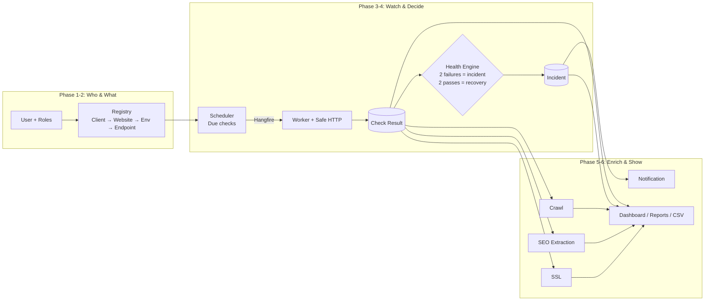

**Reading guide:** Each phase adds one layer. Nothing after a layer bypasses the layer before it.

---

## 1. Timeline — What landed when

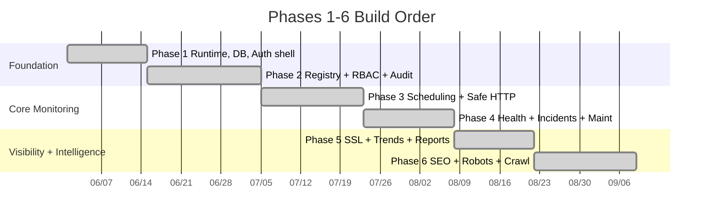

---

## 2. Core Concepts — 60 second vocabulary

| Concept | Plain English | One detail that matters |
|---|---|---|
| **Client** | The company you manage sites for | Name is globally unique (case-insensitive) |
| **Website** | One logical property like `example.com` | Belongs to exactly one Client, name unique *within* that Client |
| **Environment** | `Production` / `Staging` / `Test` … | A Website needs ≥1 Environment before you can enable monitoring |
| **Endpoint** | The exact URL + policy you monitor (e.g. `https://example.com/` every 5m) | Normalized URL is unique within the Environment |
| **Logical Check** | One *business* sample for one Endpoint + monitor type | One ID across all retries — retries don't create new samples |
| **Check Result** | The stored outcome of that check | HTTP status, timings, redirect chain OR certificate fields |
| **Finding** | A rule violation inside a result (e.g. `MissingTitle`) | Each has a stable `ruleKey` + normalized `issueKey` |
| **Incident** | Tracked operational issue after confirmation | Only one *active* incident per Endpoint + monitor type + issueKey |
| **Crawl Run** | Bounded exploration of a site | Reports `source → target` link pairs, not just URLs |

---

## 3. Overall Architecture — One codebase, clear boundaries

We run a **modular monolith** — one app, one DB, but strict internal modules.

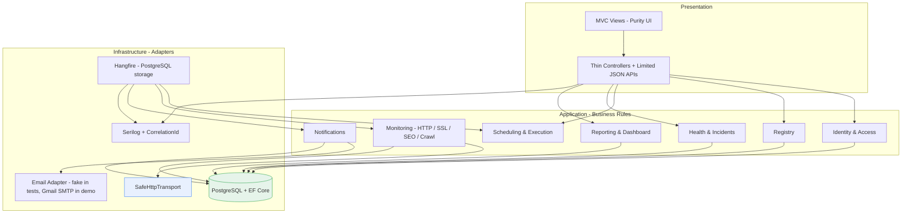

**Three rules that never break:**

1.  Controllers and Hangfire jobs are **thin** — they call application services.
2.  Domain rules know nothing about MVC, Hangfire, SMTP or EF Core.
3.  Browser input, endpoint URLs, DNS answers, redirect targets and target HTML are **all untrusted**.

### Runtime in one process (today)

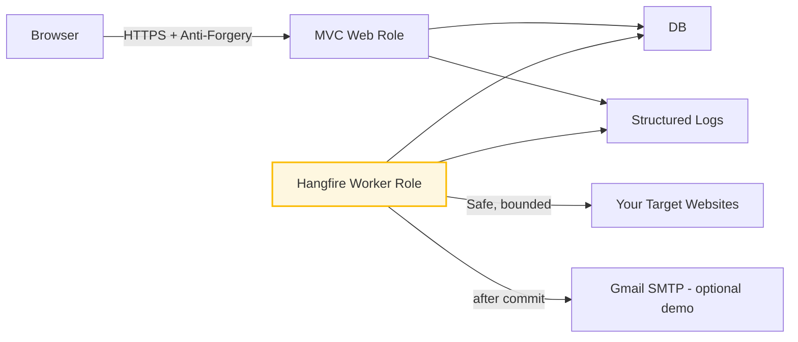

We can later split Web and Worker into two processes without rewriting anything — same artifact, separate queue wiring.

---

## 4. Phase 1 — The Foundation

> **Goal:** Make it possible to build everything else safely.

### 4.1 What Phase 1 gave us

*   **.NET 10 + ASP.NET Core 10 MVC** — one composition root.
*   **PostgreSQL + EF Core + Npgsql** — explicit migrations (`dotnet ef migrations add`), **never** auto-migrated at startup. Reproducible, reviewable.
*   **Serilog** — structured logs with `CorrelationId` on every request/job. Sensitive data never logged. Request logs exclude query strings/headers/bodies.
*   **Health endpoints:**
    *   `/health/live` → "is the process running?" (no DB)
    *   `/health/ready` → "can we reach PostgreSQL?" (bounded check)
*   **Correlation ID:** every response carries `X-Correlation-ID` — you can trace a user action from browser → log → DB row.
*   **Config loading:** `appsettings.json` → env-specific → env vars → User Secrets (local). Secrets **never** in git.
*   **UI tokens + Purity Dashboard shell** — responsive, focus-visible, reduced-motion, color is never the only signal.
*   **Testing baseline:** `xUnit` + `FluentAssertions` + `Testcontainers` PostgreSQL + controlled HTTP fixtures. One real DB test suite (22 ordered stages) replaces mocks.

### 4.2 Why it matters

Without Phase 1, every later feature would reinvent logging, migration, time handling (UTC everywhere, timezone only at display) or a different DB strategy. Phase 1 makes those one decision.

---

## 5. Phase 2 — Registry & Security

> **Goal:** Securely describe *what* we monitor and *who* may touch it.

### 5.1 The hierarchy + ownership

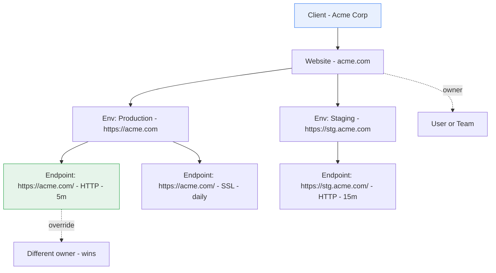

**Rules that surprise people (but prevent bugs):**

*   Names are normalized once (`NameNormalizer`: trim + Unicode + collapse whitespace + case-fold). PostgreSQL **partial unique indexes** enforce it for *non-deleted* rows only — soft-deleted history keeps its name without blocking reuse.
*   `Website` **cannot be enabled** until it has ≥1 active Environment *(deferred DB trigger)*.
*   Endpoint URL must be absolute `http/https`, no credentials, no `ftp/file`. Production `http` needs an explicit exception or it warns.
*   `Normalized URL + Environment + Monitor Type` is unique — `https://EXAMPLE.com:443/` and `https://example.com/` cannot duplicate.
*   Deleting Client/Website/Endpoint is **soft** — `deleted_at` set, row stays for history/reports.
*   Tags are trimmed + deduped.
*   Effective incident owner = `Endpoint override` → else `Website owner`. Snapshotted when incident opens — later reassignments don't rewrite history.

### 5.2 Authorization — 4 roles, server-side, tested with direct requests

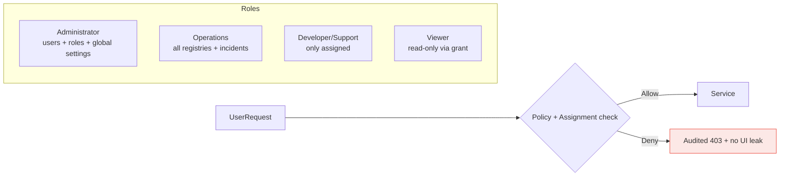

| Capability | Admin | Ops | Dev | Viewer |
|---|---|---|---|---|
| Manage users/roles | ✅ | ❌ | ❌ | ❌ |
| Manage Clients/Websites | ✅ | ✅ | only assigned* | ❌ |
| Run check now | ✅ | ✅ | assigned | ❌ |
| Ack / Assign / Resolve incident | ✅ | ✅ | assigned | ❌ |
| View reports | all | all | assigned | permitted |

*Dev configuration of websites is disabled by default, enableable via permission.

**Assignment trick:** A `Developer` who owns `acme.com` can see **all** its environments/endpoints, but a `Viewer` with a grant to `stg.acme.com` environment sees **only** that slice. Client scope flows down — never up.

### 5.3 Optimistic concurrency + Audit

Every edit form sends the original `version` (row version). If someone else saved first, EF Core rejects with a **safe conflict** — no data silently overwritten, user must reload and reapply. Optimistic concurrency is PostgreSQL-backed, not Hangfire.

Every create/update/delete/permission/incident-state action writes a typed, allow-listed `AuditEvent` inside the **same transaction** as the data change — actor, timestamp, before/after snapshot. Notes themselves are not stored in audit, only `NotesChanged: true/false`.

### 5.4 What that looks like for a user

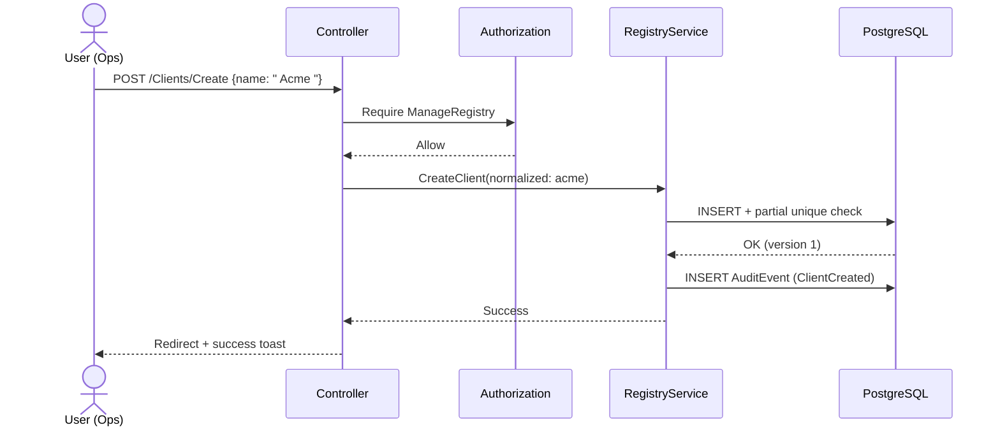

---

## 6. Phase 3 — The Monitoring Engine

> **Goal:** Reliably turn "check this URL every 5m" into one stored result per logical check — no duplicates, no leaks, no SSRF.

### 6.1 The daily flow — scheduled check

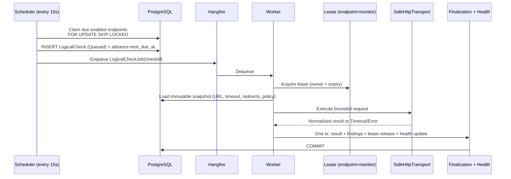

**Four ideas that make this correct:**

#### a) Scheduler is a single catch-up, not a backlog cannon

If the worker was down for an hour (12 missed 5m slots), the scheduler creates **one** catch-up check, then resumes normal cadence. It never floods targets or the queue.

#### b) Logical Check = the truth, attempts are just tries

A `LogicalCheck` has one stable ID. Hangfire retries, worker restarts, lease expiries — they all operate on that same ID. History counts logical checks, not attempts.

#### c) Lease prevents concurrent execution of the same endpoint+type

`BR-S03`: no two active checks of same Endpoint + Monitor Type at once. Lease is PostgreSQL-backed with `owner + acquired_at + expires_at`. If a worker dies, expiry frees it. Constraints are the final duplicate defense, not Hangfire.

#### d) Safe HTTP is the security boundary

This is where most monitoring projects get hacked. We treat every URL as attacker-controlled.

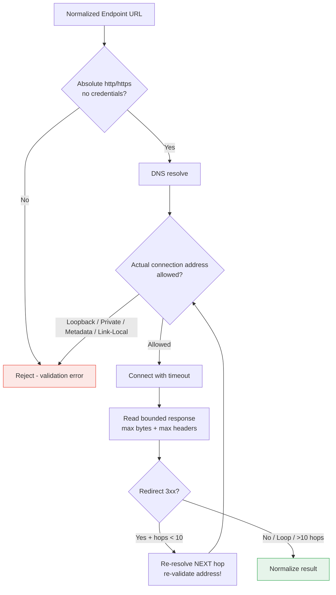

Key points: validate the **actual socket address**, not just the hostname (prevents DNS rebinding), re-validate **every redirect hop**, no auto-redirects, no proxy bypass, TLS validation stays on in production, every byte is bounded, `x-` headers + body not persisted unless explicitly approved snippet with secrets stripped.

### 6.2 Manual (Run Now) checks

*   Authorized users only, button says `Manual`.
*   Queued exactly like scheduled, labeled `Source: Manual`, records `initiated_by`.
*   **Does not** shift the scheduled cadence.
*   By default excluded from contractual uptime and from confirmation counters (so you can't accidentally open/close incidents by clicking).

### 6.3 Time & idempotency guarantees

*   Scheduling/storage in **UTC**. Display converts using stored IANA timezone.
*   Reporting windows are `[start, end)` in UTC — a check exactly at the boundary appears once.
*   Every transaction checks `FOR UPDATE` + constraint. Duplicate deliveries are no-ops. Notification send runs **after** the check/incident transaction commits.

---

## 7. Phase 4 — Health, Incidents & Maintenance

> **Goal:** Turn noisy individual results into one clear signal per issue.

### 7.1 The confirmation engine

One failing check is not an outage. A flaky network blip should not wake anyone at 2am.

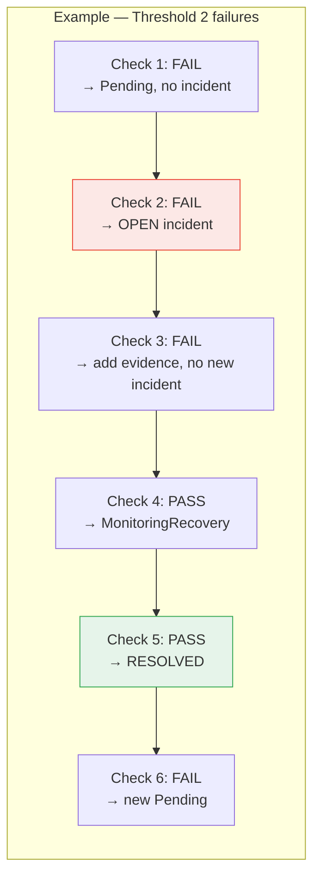

**Defaults (all endpoint-overridable):**

*   Availability: **2 consecutive fails** → incident (BR-I01)
*   Any **pass before threshold** resets counter (BR-I02)
*   Recovery: **2 consecutive passes** → resolved (BR-I05)
*   Slow response: **3 consecutive breaches** → incident (BR-P03)

### 7.2 Deduplication via stable issueKey

`issueKey = hash(endpoint + monitorType + normalized failure category + stable attributes)`.

Only **one active incident** per `(endpoint_monitor_id, issueKey)` — PostgreSQL partial unique index is the enforcer. A different `issueKey` (e.g. HTTP 500 vs SSL expiry) **can** open a second simultaneous incident for the same endpoint. Repeats just add evidence to the active incident.

### 7.3 Incident lifecycle

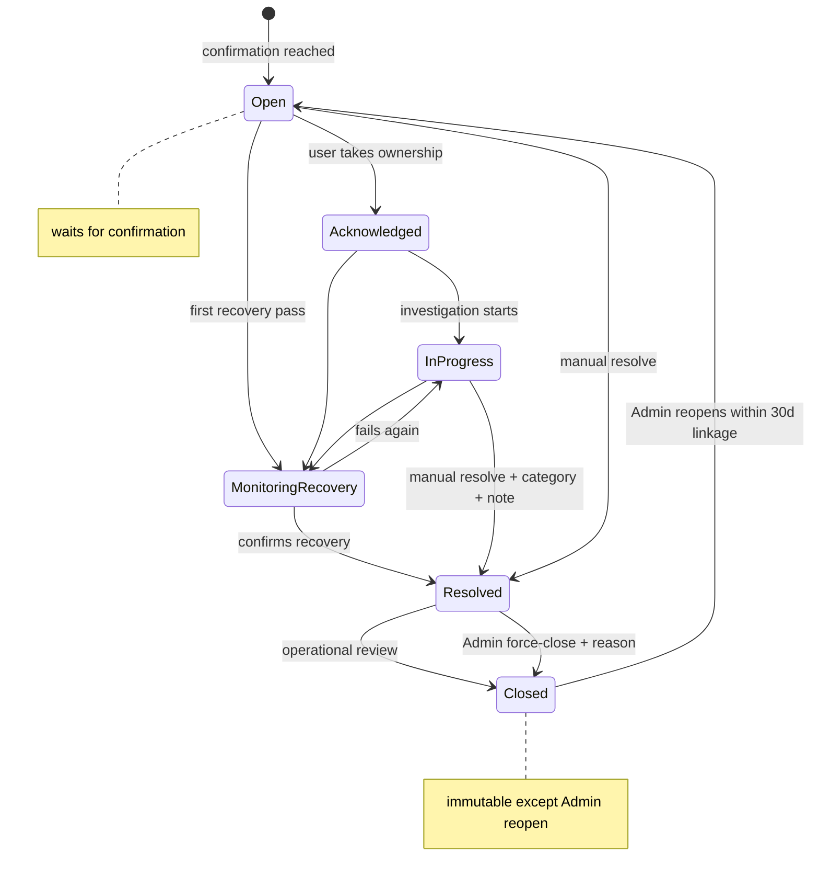

*   `Resolved` needs a category + note. `Closed` needs `Resolved` first (unless Admin force-close with audited reason).
*   Every transition appends to `IncidentEvent` timeline — never silently overwritten.
*   Reoccurrence within **30 days** with same `issueKey` links to previous incident (new row, not reopening an immutable closed one).

### 7.4 Maintenance windows — suppression without erasure

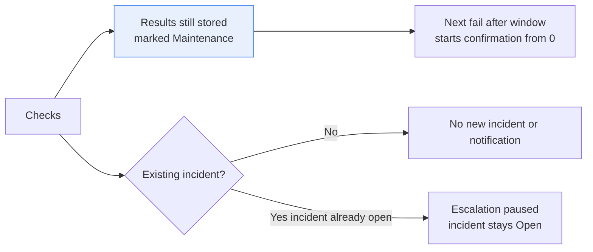

*   Checks **continue** by default during maintenance — we keep evidence, just suppress noisy new opens/notifications.
*   Recurring windows are expanded into concrete UTC occurrences — DST cannot create ambiguous starts.
*   Not a delete — reports can still prove what happened.

### 7.5 Notifications — durable, deduplicated, idempotent

Notification is **not** sent inside the health transaction. Health commits `Pending Notification` rows; a separate worker delivers them.

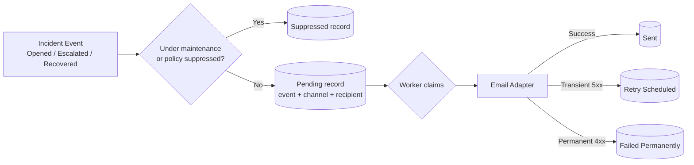

*   One pending row per `event + channel + recipient` — retry cannot double-send.
*   Failure of email **never** rolls back the check or incident.
*   Escalation default: **30m unacknowledged** → next level. Reminders: **60m** for critical unacknowledged. Both configurable.

---

## 8. Phase 5 — SSL, Performance & Reporting

> **Goal:** Turn collected evidence into answers a human can act on.

### 8.1 How SSL actually works (the part most people get wrong)

We **never** weaken normal HTTP TLS validation to capture certificates.

There are two observations for HTTPS:

1.  **Happy path:** The normal `SafeHttpTransport` succeeds — platform TLS validated → we can extract `subject / issuer / fingerprint / validFrom / validTo / daysRemaining` from the validated chain.
2.  **Failure path:** If TLS **fails** (expired, hostname mismatch, untrusted), we *immediately* run a **dedicated probe** that intentionally accepts any cert, just to capture *why* it failed. That probe is isolated and never used for health.

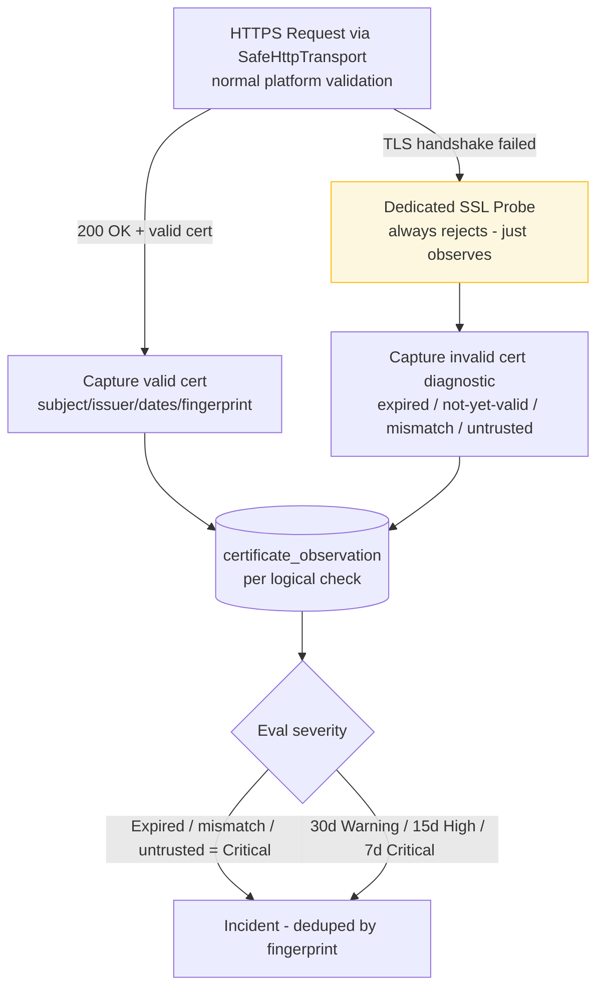

**Expiry severity (BR-C04):** `>30d Healthy` → `≤30d Warning` → `≤15d High` → `≤7d Critical` → `Expired Critical`. Boundaries are exact.  
**Dedup:** one active expiry incident per `endpoint + current fingerprint` — daily checks don't spam.  
**Renewal:** fingerprint changes → new cert becomes truth → old incident resolves after confirmation.  
**Scheduling:** SSL runs **daily** by default + urgently after a TLS-related HTTP failure.

For `http://` endpoints, SSL status = `Not Applicable`.

### 8.2 Performance (BR-P01 → P05) — trustworthy numbers, not vanity metrics

| Rule | What it does |
|---|---|
| **P01** | Store `totalDuration + TTFB + DNS + connect + TLS` in ms, consistently, with measurement timestamp |
| **P02** | `1500ms Warning`, `3000ms Critical` (endpoint overridable) — boundaries tested |
| **P03** | Slow incident only after **3 consecutive** breaches — one spike not an incident |
| **P04** | Page-size warnings from `Content-Length` where available, default **2 MB** for HTML |
| **P05** | UI warns when you compare performance from different monitor locations/configs — apples vs oranges flag |

Raw bodies **not** stored; if a payload is stored it is truncated, secrets stripped.

### 8.3 Shared reporting core — the "don't lie to yourself" layer

This is Phase 5's quiet superpower: **one query object powers both the screen and the CSV.**

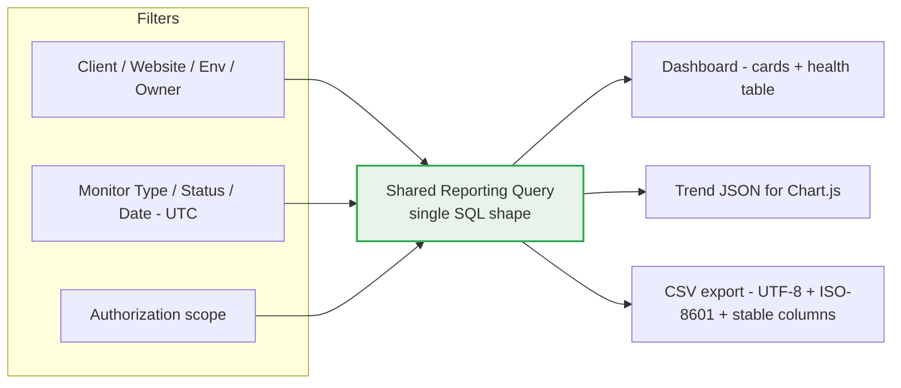

**Rules that keep CSV honest (BR-R02, R03):**

*   Exports use **same filtered dataset** as the screen — changing filters recomputes every card consistently (BR-R01).
*   UTF-8, stable column names, ISO-8601 `Z`, correct quoting, **formula-injection protection** (`=`, `+` escaped).
*   **Uptime:** `healthy samples / eligible samples × 100`. Logical checks only — not retry attempts. Manual / disabled / maintenance-suppressed / unknown are excluded by default but remain visible operationally.
*   **Response percentiles:** P50/P95 from **successful eligible HTTP samples** — failures reported separately, never mixed in.
*   **Time windows:** `[start, end)` so a check at exactly `end` isn't double-counted.

### 8.4 Dashboard — what you see

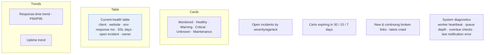

`Health` = latest confirmed state. `Trends` = all eligible samples over time — a recovered endpoint shows Healthy today but the outage stays in the chart.

---

## 9. Phase 6 — SEO & Crawl Intelligence

> **Goal:** Catch preventable config mistakes (noindex on prod, wrong canonical, permissive robots) and broken-link rot before clients do.

### 9.1 SEO extraction vs SEO policy — the split everyone confuses

**Extraction (Phase 6.2) = what the page *said*. Policy (Phase 6.3) = whether that was *right* for env/production.**

Extraction runs **without a second fetch** — on the body `SafeHttpTransport` already read, within the existing byte cap, then discarded. Privacy rule: **values are extracted, document is never retained** (BR-E10) — no column can hold markup, verified by absence tests across `seo_observation / check_result / finding / audit_event`.

Why **AngleSharp**, not regex?

*   Regex fails on exactly the attacker-controlled input that matters (`<title>` in `<script>`, comments, unquoted attributes) and backtracks can DoS the worker.
*   AngleSharp follows HTML5 tree construction, recovers like a browser, has **zero transitive deps** on `net10.0`, MIT 1.7.1 pinned in `Directory.Packages.props`.

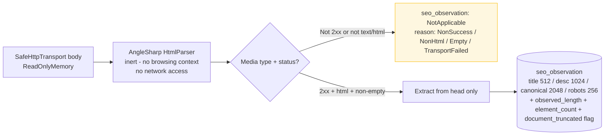

**Applicability is explicit:** every HTTP check gets a decision (`NotApplicable` + reason), not a missing row. Certificate checks get no SEO row.

**Head-only, counts matter:** SVG `<title>` doesn't count. `<meta>` outside `<head>` ignored. Counting elements lets policy distinguish `missing` (0) vs `duplicate` (2). Canonical href is **trimmed not collapsed** — internal whitespace is diagnostic.

**Encoding is real:** `Content-Type` charset wins → then BOM → then `<meta charset>` → UTF-8. `windows-1252` works because `CodePagesEncodingProvider` is registered.

**Truncated docs:** If the byte cap cut the document, we still extract from what we have and set `document_truncated`. Absence findings from a truncated doc are suppressed — you can't claim "no canonical" when you never saw `</head>`.

### 9.2 Policy — same signals, different meaning per environment

| Check | Production | Non-production (staging/test) |
|---|---|---|
| `title` missing / duplicate `<title>` | warning (BR-E02) | warning |
| `meta description` missing/empty | warning (can be disabled per endpoint) | warning |
| `canonical` missing / invalid / cross-domain | high on prod (BR-E04) | warning |
| `noindex` present | **high** unless explicitly expected (BR-E05) | **reverse:** a *missing* `noindex` raises warning — staging should not be indexed |
| `robots.txt` `Disallow: /` at origin `https://host/robots.txt` for every endpoint | **critical** unless approved exception (BR-E07) | reverse expected |
| `sitemap` missing/invalid | warning (from config + `robots.txt` directives) | — |

Policy lives in `SeoRuleEvaluator` + `SeoFindingGroups`, not in the extractor. Same extracted values, different judgment by `isProduction + endpoint policy`.

### 9.3 Robots.txt & Sitemaps — origin facts, single snapshot

*   One `robots_snapshot` per origin `scheme + host + port`, refreshed by a dedicated Hangfire job (own `robots` queue learner).
*   `GET /robots.txt` via **same** `SafeHttpTransport` + same destination policy — a malicious `Disallow` line cannot fetch internal hosts.
*   Extraction is pure: parser respects group structure, wildcard `User-agent: *` semantics, ignores comments, captures `Sitemap:` directives.
*   Every check goes to the **host**, never to `/subpath/robots.txt`.

### 9.4 Crawl — bounded, polite, actionable

The headline is broken links, but the engine classifies *every* link:

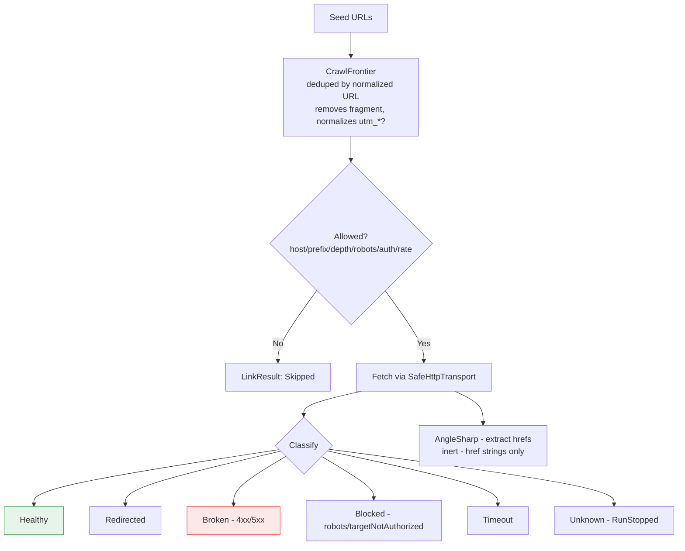

#### a) Identity & scope keep it bounded (no `https://example.com/?utm_source=1` explosion)

*   URL identity: normalized, fragments removed, host lowercased, default ports stripped, **tracking params ignored** by default → `/?utm_foo=1` and `/?utm_bar=2` are the **same** target.
*   Scope: stays within `seed host + AllowedHosts + path prefixes`, seeded only, `MAX pages / ` `MAX depth` / `MAX duration / concurrency / req/s` all enforced — exceeding stops gracefully with **stop reason**, never labeled `Completed`.

**Only `FrontierExhausted` means coverage.** Anything else (pageLimit / durationLimit / cancelled) must show as partial — otherwise "0 broken links" would be a lie.

#### b) Isolation — crawl cannot starve monitoring

This was the hardest Phase 6 design choice. A crawl is a burst of hundreds of requests. Availability is a steady trickle that must meet its cadence.

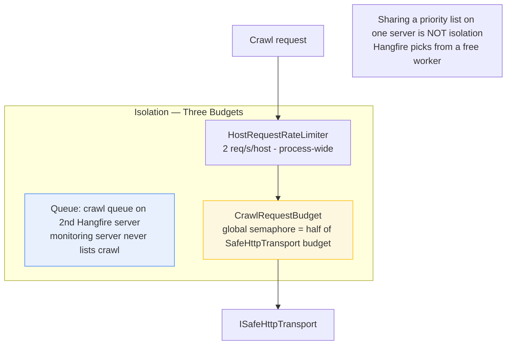

Every crawl request goes through the **same** `ISafeHttpTransport` as all other checks → same global concurrency limiter. `CrawlRequestBudget` being **process-wide** (not per-run) is what stops 8 concurrent crawls from each holding 10 slots and blocking all 20 shared slots.

#### c) Reports point to the *source page* (the actionable part)

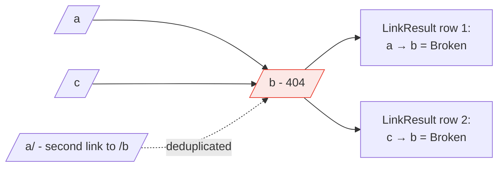

*   **Fetched once** (BR-L03 revisit rule), reported per distinct `source → target` pair (BR-L07).
*   Same page linking to same target 5 times → 1 row, not 5.
*   External links: **checked** (low concurrency) but **never recursively crawled** (BR-L08). And only when target authorization evidence covers that external host/port — otherwise `Skipped(TargetNotAuthorized)` — no open proxy.
*   Cancellation preserves findings: results are written **as each target resolves**, not batched. Cancelled run is `Cancelled`, never `Completed`, and discovered-but-not-yet-fetched targets flush as `Unknown(RunStopped)`.
*   `CrawlRunJob` is `[AutomaticRetry(0)]` on purpose — re-running from the start would re-hit a site we don't own; a new run is an explicit decision.

---

## 10. Cross-Cutting Data Model — One picture

```mermaid
erDiagram
    CLIENT ||--o{ WEBSITE : "owns"
    WEBSITE ||--o{ ENVIRONMENT : "has"
    ENVIRONMENT ||--o{ ENDPOINT : "contains"
    ENDPOINT ||--o{ ENDPOINT_MONITOR : "per type Http or Ssl"
    ENDPOINT_MONITOR ||--o{ LOGICAL_CHECK : "schedules"
    LOGICAL_CHECK ||--o| CHECK_RESULT : "one terminal result"
    LOGICAL_CHECK ||--o{ DURABLE_WORK : "attempts"
    LOGICAL_CHECK ||--o| SEO_OBSERVATION : "per Http 2xx html"
    LOGICAL_CHECK ||--o| CERTIFICATE_OBSERVATION : "per TLS probe"
    CHECK_RESULT ||--o{ FINDING : "rule violations"
    CHECK_RESULT ||--o{ REDIRECT_HOP : "when relevant"
    ENDPOINT_MONITOR ||--o{ ENDPOINT_HEALTH_STATE : "confirmed counters"
    ENDPOINT_MONITOR ||--o{ INCIDENT : "issueKey deduped"
    INCIDENT ||--o{ INCIDENT_EVENT : "timeline"
    INCIDENT_EVENT ||--o{ NOTIFICATION : "per recipient"
    ENDPOINT ||--o{ CRAWL_RUN : "bounded runs"
    CRAWL_RUN ||--o{ LINK_RESULT : "source to target pairs"
    ORIGIN ||--o| ROBOTS_SNAPSHOT : "per scheme host port"
    ENDPOINT ||--o{ MAINTENANCE_WINDOW : "scopes"
    APP_USER ||--o{ AUDIT_EVENT : "actor"
    APP_USER ||--o{ ACCESS_GRANT : "assignment"
```

**The retention story in one line:** Raw `check_result`/findings kept **90 days** default; daily aggregates + incidents kept **24 months**; nothing under an active hold is ever deleted.

### Transactions & recovery in one diagram

```mermaid
flowchart TD
    JOB[Hangfire delivery<br/>stable LogicalCheckId] --> DONE{Already completed?}
    DONE -->|Yes| NOP[No-op - idempotent]
    DONE -->|No| LEASE{Lease acquired<br/>endpoint+monitorType?}
    LEASE -->|No - live owner exists| DEFER[Defer - no attempt created]
    LEASE -->|Yes| ATT[Create execution_attempt<br/>Running]

    ATT --> EXEC[Execute via SafeHttpTransport]
    EXEC --> TX[One tx: result + findings + hops<br/>+ health counters<br/>+ incident open/update<br/>+ notification records<br/>+ lease release]

    TX -->|Uniqueness conflict| RELOAD[Reload authoritative state<br/>no duplicate incident]
    TX -->|OK| COMMIT[Commit]
    COMMIT --> EMAIL[Notification worker sends after commit]

    style TX fill:#E8F0FE,stroke:#4285F4
    style COMMIT fill:#E6F4EA,stroke:#34A853
```

---

## 11. Put It All Together — A Real Story

> Acme Corp's `https://acme.com/` page got a new deploy.

```mermaid
sequenceDiagram
    actor Dev as Developer
    participant Reg as Registry
    participant Sched as Scheduler
    participant Check as Check Worker
    participant Health as Health Engine
    participant Inc as Incident
    participant Email as Notification
    participant Dash as Dashboard

    Dev->>Reg: Create Client Acme, Website acme.com,<br/>Env Production, Endpoint https://acme.com/ (5m)
    Reg->>Sched: Endpoint is enabled → eligible

    loop Every 5m
        Sched->>Check: LogicalCheck (Http)
        Check->>Health: Persist 200 OK + TLS dates +<br/>extract title/canonical/robots + classify
        Health->>Dash: Health = Healthy
    end

    Note over Check,Health: Deploy accidentally adds <meta name=robots content=noindex>
    Sched->>Check: Next check → 200 OK but SEO extraction sees noindex
    Check->>Health: Availability OK, SEO finding: NoIndexOnProduction (High)
    Health->>Inc: Does not open availability incident<br/>(wrong failure category) - SEO visible in reports
    Health->>Dash: Endpoint = Warning

    Note over Check,Health: Next deploy returns 500 twice
    Sched->>Check: Check → 500
    Check->>Health: 1st fail → Pending (no incident yet)
    Sched->>Check: Next check → 500 again
    Check->>Health: 2nd consecutive fail → OPEN incident (issueKey: ServerError-500)
    Health->>Email: Queue Opening notification → owner of endpoint
    Email-->>Dev: Email: Critical - acme.com is down

    Dev->>Inc: Acknowledge → InProgress
    Sched->>Check: 200 OK → MonitoringRecovery
    Sched->>Check: 200 OK → Resolved + recovery email

    Dev->>Dash: Filters: Production + Last 7 days → sees outage in chart<br/>Current health back to Healthy<br/>CSV export matches exactly what dashboard shows
```

**Authorization stays on in every frame:** The `Viewer` who only has access to `Staging` would see none of the above rows — dashboard, trends and CSV all use the same `RegistryVisibility` scope.

---

## 12. Security & Privacy in Plain English

| Threat | How we prevent it |
|---|---|
| **SSRF** — an approved endpoint redirects to `http://169.254.169.254` or private host | Destination policy checks **actual connected IP** on every hop, every redirect re-validated |
| **Spend our target's quota** — queue floods on missed intervals | One catch-up check, not N. Bounded response + timeout + concurrency + duration |
| **Steal secrets** — response body or header leaks into logs/DB/email | Only `safe_diagnostic` + bounded observation values stored; audit allow-listed; bodies not persisted |
| **Forge requests** | Every state-changing browser POST requires anti-forgery token |
| **See data you shouldn't** | Server-side policy check on every route — hidden buttons don't count. Direct-request 403 tests cover all 4 roles |
| **Over-crawl someone's site** | Page limit, depth, concurrency, per-host rate (2/s), duration — all enforced, cancellation preserves findings but never lies as Completed |
| **XSS from target HTML** | Parser is inert (no browsing context, no fetcher), extracted values bounded + encoded on output |

---

## 13. Tech Stack — One table

| Layer | Choice |
|---|---|
| Runtime | .NET 10, ASP.NET Core 10 MVC, Razor + Purity UI Dashboard |
| Language | C# |
| DB | PostgreSQL + EF Core + Npgsql, explicit migrations, UTC `timestamptz` |
| Background | Hangfire (PostgreSQL storage), queues: `monitoring` · `crawl` · `notifications` · `maintenance` · `robots` |
| HTTP | `IHttpClientFactory` → `SafeHttpTransport` (manual redirects, actual-address validation) |
| Parser | AngleSharp 1.7.1 (zero transitive deps) — HTML5 spec, inert |
| Auth | ASP.NET Core Identity, role + policy + assignment-aware |
| Charts | Chart.js from narrow authorized JSON datasets |
| Logs | Serilog + `X-Correlation-ID` |
| Tests | xUnit + FluentAssertions + Testcontainers (real PostgreSQL) |

---

## 14. How to Navigate Phases as You Extend

*   **New check type?** Follow the SSL pattern (Phase 5.1/5.2) — own monitor type, reuse `LogicalCheck` + leases, add `*Observations` one-to-one with check, keep TLS probing separate if needed.
*   **New report?** Reuse the shared reporting query core (Phase 5.5) — never duplicate the filter SQL for CSV vs screen.
*   **New crawl rule?** Add it to `CrawlScope / CrawlFrontier` (Phase 6.5), not inside `CrawlRun` loop.
*   **New policy per environment?** Keep extraction (6.2) pure facts and put judgment in `SeoRuleEvaluator` (6.3).
*   **Long-running job?** Give it its own Hangfire queue + worker budget + request budget — don't add a priority list to the monitoring server.

---

## 15. Where to Go Next

*   **Phase 7 (in draft):** PageSpeed Insights SEO audit — provider abstraction (`IPageAuditProvider`), `page-audits` isolated queue, normalized `page_audit_run`/`page_audit_item`, score delta + Lighthouse version comparability. See `docs/phase-7/PageSpeed_Insights_SEO_Audit_Implementation_Plan.md` and its companion `SEO_Integration_Explained.md`.
*   **Roadmap detail:** `docs/General/Phased_Implementation_Plan.md` and `Detailed_Implementation_Plan.md`.
*   **Architecture acceptance bar:** Every gate links durable demonstration + CI/migration/Testcontainers evidence + known limitations — never screenshots alone.

> **One-line takeaway:** Phases 1-2 decide *who sees what*, Phase 3 guarantees *one honest sample* despite retries/failures, Phase 4 turns noise into *one incident per real issue*, Phases 5-6 make that truth *useful* — correctly classified, comparable, auditable, and safe to operate.
