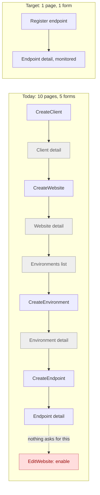
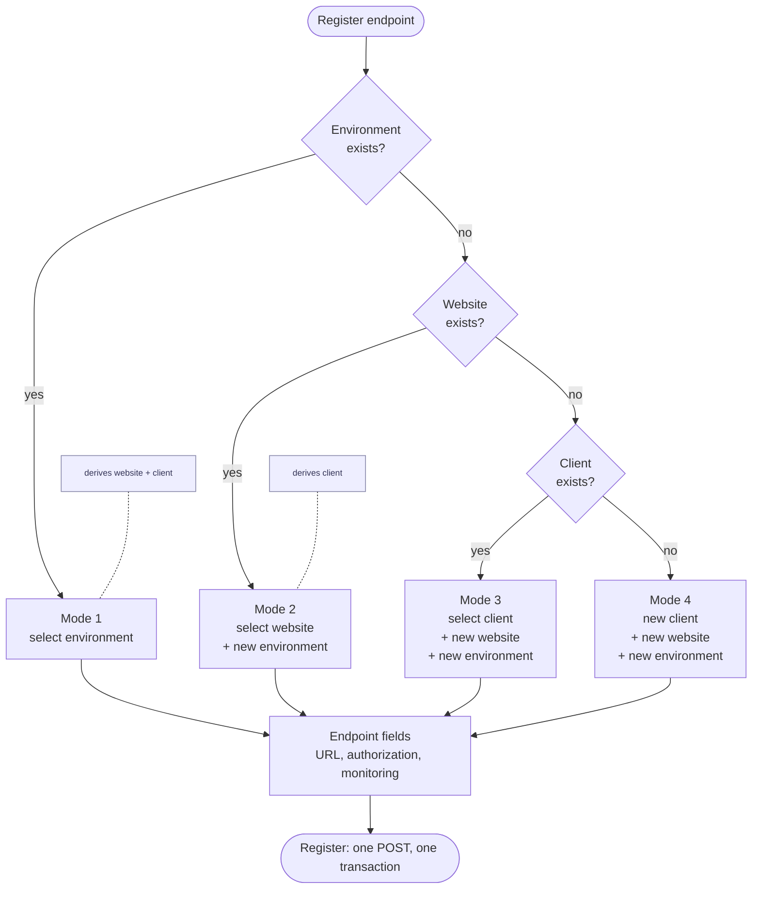
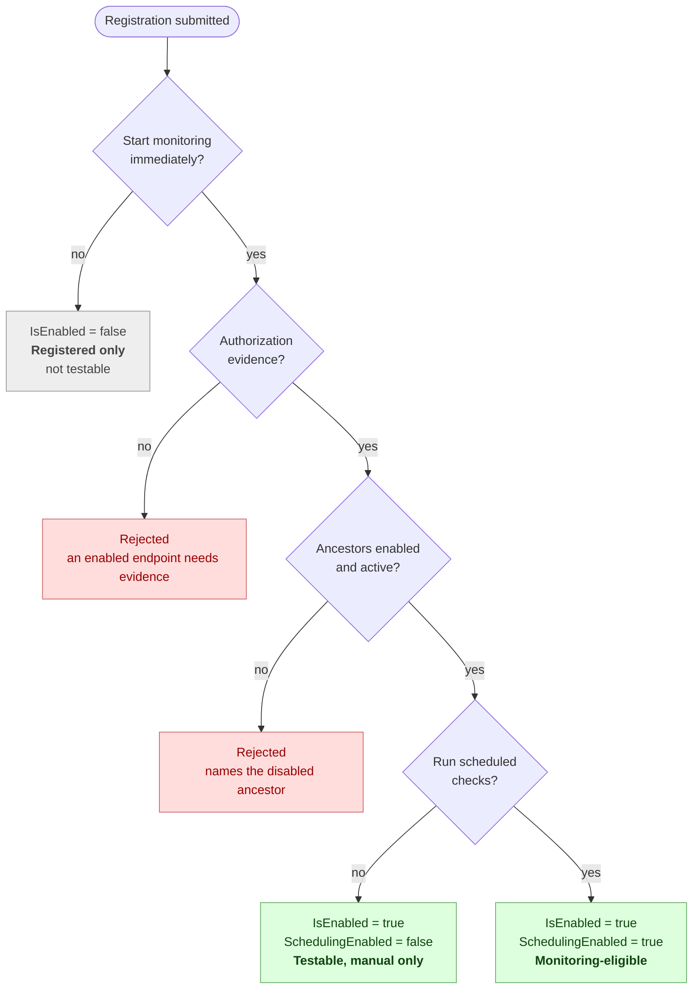
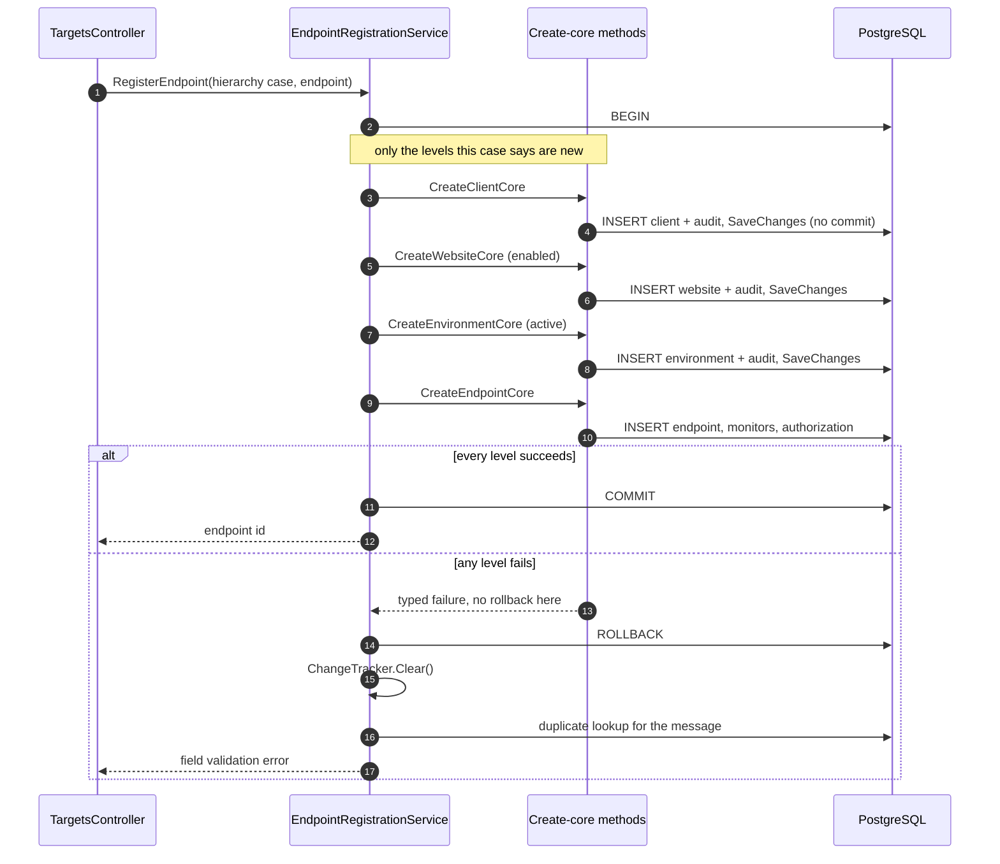
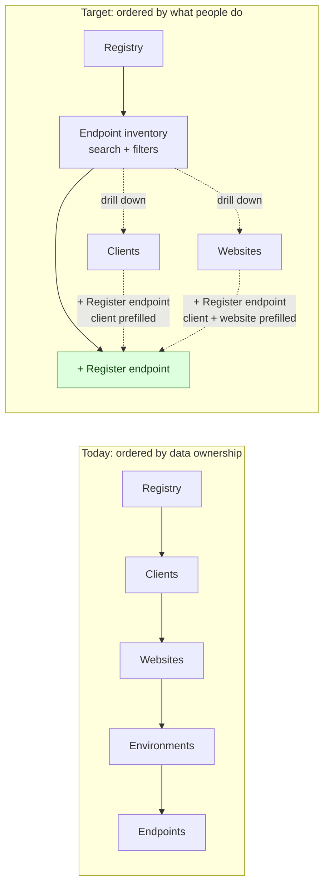

# Registry Endpoint-First Registration Refactor Plan

**Status:** Planned

**Project profile:** Personal internship/portfolio project owned, implemented, reviewed, and operated by one intern.

## 1. Purpose

Registering one endpoint currently costs five forms, nine page loads, and a tenth step nothing asks for. This plan replaces that journey with a single consolidated registration operation, and makes the endpoint inventory the front door of the Registry.

This is an interaction-layer refactor. The `Client -> Website -> Environment -> Endpoint` hierarchy is correct and stays exactly as it is. What changes is that users stop having to walk it by hand.

No schema migration is required by any phase in this plan.

## 2. Relationship to the roadmap

This document is a UI/UX subplan. It does not replace:

- `docs/Website_Health_Monitoring_Project_Specification.md`;
- `docs/General/Phased_Implementation_Plan.md`;
- `docs/General/Detail_Page_UI_Pattern.md`, which still governs the shape of every detail page;
- `docs/General/Ajax-contract.md`, which governs every enhanced form and link added here.

## 3. Problem statement

### 3.1 The measured journey

Registering one endpoint under a new client:

| # | Page | Purpose |
|---|---|---|
| 1 | `Registry/CreateClient` | real input |
| 2 | `Registry/Client/{id}` | pass-through redirect target |
| 3 | `Registry/CreateWebsite` | real input |
| 4 | `Registry/Website/{id}` | pass-through |
| 5 | `Targets/Environments?websiteId=` | dead click; `Views/Registry/Website.cshtml:29` links to the list, never to `CreateEnvironment` |
| 6 | `Targets/CreateEnvironment` | real input |
| 7 | `Targets/Environment/{id}` | pass-through |
| 8 | `Targets/CreateEndpoint` | real input |
| 9 | `Targets/Endpoint/{id}` | apparent success |
| 10 | `Registry/EditWebsite/{id}` | enable the website - **nothing in the UI asks for this** |

Four of the ten pages carry no input. Step 5 exists only because a link points at a list instead of a form.



Grey steps carry no input. The red step is invisible: nothing in the UI asks for it, and without it the endpoint is never checked.

### 3.2 Three silent dead ends

`MonitoringEligibility.ApplyTestable` (`src/WebHealth.Infrastructure/Registry/MonitoringEligibility.cs:11-25`) requires all of:

```text
endpoint.IsEnabled
Environment.IsActive
Website.IsEnabled
Client.IsActive
at least one live monitor
a current TargetAuthorization matching host and port
```

Three of those are reachable only outside the registration journey.

**Website disabled by construction.** `WebsiteRegistryService.CreateAsync` rejects `IsEnabled = true` outright (`WebsiteRegistryService.cs:33-38`) and hard-forces `false` (`WebsiteRegistryService.cs:71`), because at create time no environment can exist yet. Step 10 is the only way to undo it, and no page mentions it.

**Website already disabled.** `LockEnvironmentAsync` (`EndpointRegistryService.cs:483-496`) accepts any environment that is active under a website that is not archived. It never checks `Website.IsEnabled` or `Client.IsActive`. So registering an endpoint into an *existing* hierarchy whose website happens to be disabled also succeeds, and also produces an endpoint that is never checked. The consolidated flow must not inherit this hole.

**No target authorization.** `Views/Targets/CreateEndpoint.cshtml:18-20` tells the user:

> Only the URL is required - everything else has a working default you can change later.

That is untrue. `EndpointFormViewModel.IsEnabled` defaults to `true`, and an enabled endpoint with no evidence is rejected with `"An enabled endpoint needs testing evidence..."` (`EndpointRegistryService.cs:1013-1017`). The page's own promise contradicts the service's rule. The field is not hard to find - **Permission to test this target** is the second fieldset in `_EndpointForm.cshtml` - so the defect is the false promise, not the placement.

`Views/Targets/Endpoint.cshtml:257` then renders `Eligible` / `Not eligible` without a reason, even though `EndpointTestBlockDisplay` already holds the exact sentence for every block and both `Views/Crawl/Index.cshtml:72` and `Views/PageAudits/Index.cshtml:103` render it.

### 3.3 Structural causes

1. **Parent ids arrive by route, not by picker.** `CreateEnvironment(Guid websiteId)` and `CreateEndpoint(Guid environmentId)` have no form-level parent selection, so the only way to supply a parent is to be standing on its page. `CreateWebsite(Guid? clientId)` already proves the alternative works.
2. **The endpoint list cannot create endpoints.** `Views/Targets/Endpoints.cshtml` - the page dedicated to the primary object - offers only "View clients" and "View websites".
3. **Navigation is ordered by data ownership.** `ShellNavigation` points Registry at `Registry/Clients`. Clients are the rarest record; endpoints are the daily one.

## 4. Scope

### 4.1 Included

- A single `RegisterEndpoint` application operation that resolves or creates the whole chain in one transaction.
- A consolidated registration form with a four-mode hierarchy cascade (5.7).
- Endpoint-first Registry landing surface, search, filters, and CTA.
- Context-aware prefill from client, website, and environment pages.
- Repair of the dead click and the unexplained ineligibility badge.
- Regression coverage for every new path.

### 4.2 Excluded

- Any schema migration.
- Website hostname auto-resolution (see 5.2).
- Asynchronous monitor provisioning states (see 5.3).
- A redesign of `Website.IsEnabled` lifecycle semantics (see 5.4).
- Removal of the existing per-level create pages.
- Any change to the update or concurrency paths of the registry services.
- Broader Client/Website management redesign.

## 5. Fixed decisions

### 5.1 One form, not a wizard

A single page with a hierarchy cascade, not a multi-step wizard. A wizard preserves the multi-page feel this plan exists to remove, and needs cross-step draft state the codebase has no home for. The common case - existing environment, new endpoint - must stay one field plus a URL.

### 5.2 No website hostname auto-resolution - rejected

`Website` has no URL column of any kind (`src/WebHealth.Infrastructure/Registry/RegistryEntities.cs:26-46`). URLs live on `WebsiteEnvironment.BaseUrl` and `Endpoint.NormalizedUrl`.

Deriving or keying a website on hostname would require a new column, a migration, a backfill, and a new uniqueness constraint - a domain-model change this plan explicitly avoids. It is also the wrong model: one website deliberately spans hostnames (`acme.com` in Production, `staging.acme.com` in Staging), so keying it on hostname collapses the Environment concept above it.

The cascade in 5.7 delivers the same keystroke savings with no schema change.

### 5.3 No asynchronous monitor initialization - rejected

There is no external provisioning step to model. `EndpointRegistryService.CreateAsync` inserts the availability monitor, the SSL monitor when the URL is HTTPS, and the page-audit monitor when enabled, as ordinary rows in the same transaction as the endpoint (`EndpointRegistryService.cs:106-114`). An `Initializing` / `Setup failed` state machine would model a failure mode that cannot occur.

### 5.4 `Website.IsEnabled` keeps its meaning

It is one of four independent kill switches checked on every scheduling pass, not a setup artifact. Disabling a website to silence a client during a migration is a real operation.

The defect is narrower than the field: the create-time rule rejects `IsEnabled = true` because no environment can exist *yet*. Inside a transaction that also creates the environment, the precondition is satisfiable. The fix is an internal create path that accepts the flag and validates the rule before commit - not a second state field.

**The public path does not change.** `WebsiteRegistryService.CreateAsync` keeps its current rule and keeps storing standalone new websites disabled. Only the internal path used by registration may defer the invariant, and only because it creates the active environment before the same transaction commits.

### 5.5 Target authorization is a first-class field

Authorization kind and evidence move into the default section of the registration form, beside the URL. They are the difference between a registered endpoint and a monitored one, and 3.2 shows what happens when the form implies otherwise.

### 5.6 Endpoints have no name

`EndpointFormViewModel` has no `Name`. Endpoints are identified by URL and stay that way.

### 5.7 Four registration modes, not three independent switches

The form offers one cascade with exactly four legal modes:

```text
1. Existing environment   select environment
2. New environment        select website,  enter environment
3. New website            select client,   enter website, enter environment
4. New client             enter client,    enter website, enter environment
```



Three independent existing/new toggles would admit combinations that cannot exist - a new client with an existing website, an existing environment under a new website, a website belonging to client A selected while client B is chosen. The cascade makes them unrepresentable rather than merely rejected.

Mode 1 alone is not enough, and this is the failure that motivates the whole cascade. `ListAllEnvironmentsAsync` returns environments, so a website that has none cannot appear anywhere in an environment-shaped picker - and a website with no environments is one of the exact broken states this plan exists to rescue. Modes 2 through 4 are served by `IRegistryReader.ListWebsitesAsync` and `ListClientsAsync`, which are independent of the environment table.

Mode 1 must also exclude inactive environments: `ListAllEnvironmentsAsync` filters only on `DeletedAt == null`, while endpoint creation rejects an inactive environment.

**The cascade must survive the trip to the application layer.** A command carrying all three levels as "existing id OR new" can still express nonsense however carefully the UI is built. The flexible shape therefore stops at the view model; the application command is a closed set of four cases:

```text
RegisterEndpointRequest
    hierarchy   one of the four cases below
    endpoint    url, owner override, authorization, monitoring settings

ExistingEnvironment   environmentId
NewEnvironment        websiteId,  environment
NewWebsite            clientId,   website, environment
NewClient             client,     website, environment
```

Each case carries exactly one existing id - the lowest one - and **every ancestor above it is derived from that id, never submitted**. Mode 1 reads website and client from the environment; mode 2 reads the client from the website; mode 3 needs only the client; mode 4 needs no existing parent at all. A submitted-and-trusted parent id is precisely how a website under client A ends up attached through client B; deriving removes the possibility instead of validating against it.

### 5.8 "Inline" means reveal fields, never POST

Choosing `+ New client`, `+ New website`, or `+ New environment` reveals that level's fields inside the form. It does **not** POST to `CreateClient`, `CreateWebsite`, or `CreateEnvironment`.

Nothing is persisted until **Register endpoint** is submitted, and then everything is persisted by one operation in one transaction. Creating parents eagerly over AJAX would strand an orphan client behind every abandoned form and would defeat Phase 3 entirely. This is stated explicitly because "inline creation" commonly means the opposite.

### 5.9 What "Start monitoring immediately" controls

Two different gates exist and the form must not conflate them. `MonitoringEligibility.ApplyTestable` decides whether a manual run is possible. `MonitoringEligibility.Apply` is `ApplyTestable` **plus** a live monitor with `SchedulingEnabled && IsEnabled` (`MonitoringEligibility.cs:43-46`), and that is what "eligible" means. `MonitoringEligibilityTests.cs:16-17` already pins the distinction: an endpoint whose monitor has scheduling off is testable but not eligible.

So the two controls map one-to-one onto the two fields that already exist, and neither overrides the other:

```text
Start monitoring immediately   controls Endpoint.IsEnabled
                               requires authorization evidence when checked
                               defaults Run scheduled checks to on

Run scheduled checks           controls EndpointMonitor.SchedulingEnabled
                               defaults on, editable in Advanced settings
```

All three useful states stay reachable, and each has a precise meaning:

```text
start monitoring off                    registered only, not testable
start monitoring on, scheduling off      testable, manual runs only
start monitoring on, scheduling on       monitoring-eligible
```



Note where the ancestor check sits: it is reached only on the monitoring branch, which is what 5.10 means by conditional.

### 5.10 Disabled ancestors are refused, not reactivated

When **Start monitoring immediately** is checked and the chosen environment sits under a disabled website or an inactive client, registration fails with a message naming the ancestor and what to do about it.

It does not silently enable them - those kill switches have deliberate operational meaning (5.4) - and it does not silently register an endpoint that will never be checked (3.2). This is the rule that stops the consolidated flow from reproducing the old dead end in a new place.

**The refusal is conditional on the request.** With **Start monitoring immediately** cleared, registration under a disabled ancestor succeeds and stores the endpoint disabled, exactly as endpoint creation does today. Creation validity and monitoring eligibility are different questions and stay that way; this section must not be implemented as "disabled ancestors are always rejected".

## 6. Phases

Each phase is independently shippable and independently demonstrable.

### Phase 1 - Repair the existing journey

Cheap and user-visible. No persistence or mutation-layer change, though the eligibility fix below does touch the controller and read model. Ships before any refactor so the pain drops immediately.

**Changes**

- `Views/Registry/Website.cshtml`: add a direct "Add environment" action alongside the existing "Environments" link, removing the step-5 dead click.
- `Views/Targets/Endpoint.cshtml`: render `EndpointTestBlockDisplay.Describe(...)` next to the eligibility line so "Not eligible" always states its cause. `ITargetAuthorizationService.DescribeTestBlockAsync` already returns the value; it needs carrying on `EndpointDetailsViewModel` the way `CrawlViewModels.cs:14` already carries `RunBlock`.
- `Views/Targets/CreateEndpoint.cshtml`: correct the "Only the URL is required" promise so it stops contradicting the authorization rule (3.2). A copy fix, pending the real fix in Phase 4.

**Not in this phase**

The global "Add endpoint" CTA on `Views/Targets/Endpoints.cshtml`. `CreateEndpoint(Guid environmentId)` needs an environment and the global inventory has none to give it, so the button would have no valid destination. It ships in Phase 4, once one exists.

**Acceptance**

- From a website detail page, an environment can be added in one click.
- An endpoint that is ineligible names the reason on its own page.

**Tests** - view-level assertions in the existing shell/authorization suites; no new fixtures.

**Risk** - none material.

### Phase 2 - Lift transaction ownership

Enabler. No user-visible change. Must land before Phase 3.

Every registry service opens its own transaction - fifteen `BeginTransactionAsync` call sites across `ClientRegistryService`, `WebsiteRegistryService`, `EnvironmentRegistryService`, and `EndpointRegistryService`. None checks `Database.CurrentTransaction` first; that pattern exists only in the monitoring services. Calling two of them in sequence on one scoped `DbContext` throws.

**Changes**

- For each of the four services, split `CreateAsync` into a public method that opens a transaction and delegates, and an internal `Create*CoreAsync` that assumes an open transaction and does not commit.
- Public behaviour, validation order, audit writes, and error mapping stay byte-for-byte identical.
- **Create paths only.** Every `CreateAsync` catches a duplicate constraint violation and nothing else. `RollBackConcurrencyAsync` is reached from `UpdateAsync`, which this phase does not touch. Leave it, and the whole update path, alone.
- **Core methods must not roll back.** `RollBackDuplicateAsync` (`EndpointRegistryService.cs:1110-1136`, and its siblings in the other three services) currently does rollback, then `ChangeTracker.Clear()`, then a query for the conflicting row to build the message. A core method cannot do that under an outer transaction: after a constraint violation PostgreSQL refuses further statements until the transaction unwinds. The sequence becomes:

```text
core method detects the constraint violation and maps it to a typed duplicate result
        -> returns to the transaction owner
        -> owner rolls back
        -> owner clears the ChangeTracker
        -> owner performs the duplicate lookup and builds the field error
```

- **Preserve the audit flush.** `AuditTrailWriter.RecordAsync` calls `SaveChangesAsync` (`AuditTrailWriter.cs:202,225`). That flush is what makes a parent created earlier in the transaction queryable by the next level, so Phase 3 depends on it. Keep it deliberately; do not treat it as a redundant save.
- **Preserve per-call timestamps.** Each create acquires its own `DateTimeOffset.UtcNow` (`ClientRegistryService.cs:48`, `EnvironmentRegistryService.cs:43`, and so on). Sharing a transaction does not imply sharing a timestamp, and leaving this alone keeps every existing audit assertion valid.

**Acceptance**

- The full database foundation suite is green with no test changes.
- A new composability test passes.

**Tests**

`scripts\run-database-foundation-tests.ps1` green proves nothing old broke. It does **not** prove the new capability, because nothing in the existing suite composes two mutations under one transaction. Add a test that does:

```text
BEGIN outer transaction
  CreateClientCore -> CreateWebsiteCore -> CreateEnvironmentCore -> CreateEndpointCore
COMMIT
  assert client, website, environment, endpoint, monitors, audit rows all present

BEGIN outer transaction
  same four calls
ROLLBACK
  assert no client, website, environment, endpoint, monitor, or audit row
```

`InternalsVisibleTo("WebHealth.IntegrationTests")` is already declared (`src/WebHealth.Infrastructure/Properties/AssemblyInfo.cs:3`) and existing tests already call internal registry types directly, so the core methods can be exercised without widening any accessibility.

**Risk** - the rollback rework is the sharpest edge in the plan. Confirm each core method still reports the same field name it reports today, and keep the change scoped to the helpers the extracted create paths actually reach.

### Phase 3 - The `RegisterEndpoint` operation

Backend only. Fully testable before any UI exists.

**Changes**

- New `IEndpointRegistrationService` in `WebHealth.Application/Registry`, registered in `DependencyInjection.cs:131-136` alongside the existing registry services.
- **DI ownership.** The orchestrator calls internal `Create*CoreAsync` methods, so it needs the concrete `ClientRegistryService`, `WebsiteRegistryService`, `EnvironmentRegistryService`, and `EndpointRegistryService` - all four `internal sealed` and today registered by interface only, which does not make the concrete type resolvable. Register each concrete type and map its interface back to the same scoped instance, so one request never gets two instances of the same service on one `DbContext`:

```csharp
services.AddScoped<ClientRegistryService>();
services.AddScoped<IClientRegistryService>(sp => sp.GetRequiredService<ClientRegistryService>());
```

  Never cast the public interface to the concrete implementation.
- One operation, taking the closed four-case command defined in 5.7. Ancestors are derived from the single submitted id, never accepted from the request.
- The implementation opens one transaction, calls the Phase 2 core methods for whichever levels the case says are new, then creates the endpoint and its monitors.
- Websites created through this path are created enabled, because the same transaction creates an active environment. The public create path keeps its current rule (5.4).
- Existing ancestors are checked against 5.10, and only when monitoring is requested.
- `RegistryVisibility.CanManage` is enforced once at entry and again by each core method; the consolidated path must not become a permission bypass.
- Identity stays as the schema already defines it: website is `Client + normalized name`, endpoint is `Environment + normalized URL`. A duplicate is reported the way it is reported today - a field validation error naming the existing record. No new `409`; the AJAX contract keeps that for concurrency conflicts.
- Any failure rolls the whole thing back - no orphan client or website left behind by a rejected endpoint.



The `SaveChanges` after each level is the audit writer's, and it is load-bearing: it stages the parent row so the next level can query it without committing.

**Acceptance**

- All four cases created atomically; with monitoring and scheduling both requested, the resulting endpoint is eligible with no follow-up edit.
- A failing endpoint create leaves no new client, website, or environment.

**Tests** - integration coverage for:

- each of the four cases;
- ancestors derived, not submitted: a mode-2 request cannot attach a website to a client it does not belong to, because the client is never part of the request;
- duplicate endpoint URL; duplicate website name; invalid URL; unreachable host; inactive environment selected; disabled owner;
- monitoring requested with no authorization evidence - rejected;
- monitoring requested under a disabled website, and under an inactive client - rejected, naming the ancestor;
- **monitoring not requested with no authorization evidence - succeeds, endpoint stored disabled**;
- **monitoring not requested under a disabled website or inactive client - succeeds, endpoint stored disabled and not monitored**;
- monitoring requested with scheduling explicitly off - succeeds, endpoint testable but not eligible;
- rollback leaves no partial rows;
- authorization denied for each non-managing role.

The two bolded cases exist to stop a future implementation from collapsing 5.10 into "disabled ancestors are always rejected".

**Risk** - cross-level error mapping. A duplicate website name raised while creating level two must surface against the registration form's website-name field, not as an opaque endpoint error. Every core method's field names need re-mapping onto the consolidated form.

### Phase 4 - The consolidated registration form

The payoff.

**Changes**

- `TargetsController.RegisterEndpoint` GET/POST, accepting optional `clientId`, `websiteId`, and `environmentId` for prefill.
- A dedicated `EndpointRegistrationFormViewModel`. Do not stretch `EndpointFormViewModel` to also represent client, website, and environment creation - the conditional validation across four modes would be unreadable, and the existing create/edit pages still need the current model unchanged.
- The view model is the flexible shape; the controller maps it into the closed four-case command of 5.7 and discards any submitted ancestor above the lowest chosen id.
- One view: URL, the mode cascade, authorization kind and evidence, **Start monitoring immediately**, and everything else behind an **Advanced settings** disclosure - **Run scheduled checks**, intervals, thresholds, SEO expectations, PageSpeed, production HTTP exception.
- Mode selection follows 5.7 and 5.8: choosing "new" at any level reveals that level's fields in place and persists nothing.
- Inline validation follows `docs/General/Ajax-contract.md`: a `422` returns the form fragment with validation messages and every entered value preserved, including the chosen mode.
- `EnvironmentListItem` gains `ClientName` so mode 1 can group without a second query. Read-model change only - the record in `TargetContracts.cs:27-38` and its projection in `TargetRegistryReader`. Necessary but not sufficient: modes 2 through 4 read from the client and website readers instead.
- The global "Add endpoint" CTA deferred from Phase 1 lands here, now that it has a destination.

**Acceptance**

- From `/Targets/RegisterEndpoint`, a user who knows the URL registers a monitored endpoint without leaving the page, in every one of the four modes.

**Tests** - form state and selected mode preserved across each validation failure; advanced settings round-trip; prefill honoured; a non-managing role receives `403`; a website with zero environments is reachable through mode 2; nothing is persisted by revealing a "new" section and abandoning the form.

**Risk** - form size. The default view must stay short enough to read in one screen; if Advanced settings is not genuinely collapsed by default, this phase has failed its own purpose.

### Phase 5 - Endpoint-first information architecture

**Changes**

- `ShellNavigation`: Registry points at the endpoint inventory. Clients and Websites remain reachable, as their own entries or from the inventory.
- Filters for client, website, environment, enabled state, and monitoring mode. This is not a Razor-only change: `ITargetRegistryReader.ListAllEndpointsAsync` currently accepts only `search`, and `RegistryEndpointListViewModel` carries only endpoints and search. Both need extending, along with the projection behind them.
- Context-aware CTAs, each prefilling what the page already knows:

```text
Registry              + Register endpoint   nothing preselected
Client / Acme         + Register endpoint   client
Website / Corp Site   + Register endpoint   client + website
Environment / Prod    + Register endpoint   client + website + environment
```



**Acceptance**

- Registering from a Production environment page opens the form in mode 1 with all three parents already chosen and the cursor in the URL field.

**Tests** - each prefill route resolves and is authorization-checked; each filter narrows correctly and survives the AJAX round trip; existing breadcrumb assertions updated.

**Risk** - breadcrumbs and `is-current` highlighting both key off controller/action; changing the Registry landing target touches both.

### Phase 6 - De-emphasis and polish

Only after Phase 4 has proven stable in real use.

- Demote the standalone "Add client" and "Add website" CTAs from primary to secondary; they remain available for deliberate structural administration.
- Grouping and saved filters on the inventory.
- Revisit the remaining `registry-facts` pages listed in `docs/General/Detail_Page_UI_Pattern.md`.

## 7. Test plan

Per Delivery Principle 6, every rule below gets a regression test as it is implemented.

| Area | Coverage |
|---|---|
| Transaction composability | outer-transaction commit and rollback across all four core creates |
| Transaction ownership | full foundation suite unchanged and green |
| Atomicity | rollback leaves no partial hierarchy and no audit rows |
| Modes | all four cases; ancestors derived and not submitted; website with zero environments reachable |
| Identity | duplicate website name, duplicate endpoint URL, each mapped to the right form field |
| Authorization | every non-managing role rejected at the consolidated entry point; cross-client attachment impossible by construction |
| Eligibility, requested | monitoring plus scheduling yields an eligible endpoint; scheduling off yields a testable one; disabled ancestor or missing evidence refused by name |
| Eligibility, not requested | registration succeeds with no evidence, and under a disabled ancestor, leaving the endpoint disabled |
| Validation | invalid URL, unreachable host, inactive environment, disabled owner |
| AJAX | `422` fragment preserves form state and selected mode for every level; abandoning the form persists nothing |
| Views | eligibility reason rendered; CTAs present per role |

`scripts\run-database-foundation-tests.ps1` must be green at the end of every phase. It is one test with 22 ordered stages sharing one database, so only a green run is evidence.

## 8. Risks

| Risk | Mitigation |
|---|---|
| Rollback rework breaks duplicate reporting | Phase 2 ships alone, scoped to create paths, with the composability test plus the unchanged suite |
| Consolidated form becomes a wall of fields | Advanced settings collapsed by default; default view reviewed against the one-screen rule |
| Consolidated service becomes a permission bypass | `CanManage` enforced at entry and in every core method; ancestors derived rather than trusted |
| Cross-level errors surface against the wrong field | explicit field re-mapping, covered per level in Phase 3 tests |
| Inline creation implemented as eager AJAX creates | 5.8 states the contract; Phase 4 tests assert nothing persists before submit |
| 5.10 over-applied into a blanket rejection | the two success-path tests in Phase 3 |
| Scope creep into a Registry redesign | Phase 6 is explicitly optional and last |

## 9. Definition of done

> From the Registry, a user who knows the endpoint URL can register it without navigating away from the registration interface. When **Start monitoring immediately** and **Run scheduled checks** are both selected, a successful registration returns an endpoint that is immediately monitoring-eligible.

The other two outcomes are equally defined:

- **Start monitoring immediately** selected, scheduling explicitly off: a testable, manual-only endpoint.
- **Start monitoring immediately** cleared: a disabled endpoint, registered and nothing more - including under a disabled ancestor, which 5.10 refuses only when monitoring is requested.

Existing hierarchy (mode 1):

```text
Registry -> Register endpoint -> URL -> environment -> authorization -> Register
```

New hierarchy (mode 4):

```text
Registry -> Register endpoint -> URL -> new client
         -> new website -> new environment
         -> authorization -> Register
```

Where an existing ancestor is disabled or inactive and monitoring was requested, registration says so by name and offers the fix, rather than succeeding into a dead end or silently reactivating it.

## 10. Setup impact

None. No migration, no new package, no configuration key, no change to `setup.ps1` or the connection-string arrangement. `ExpectedMigrations`, `ExpectedTables`, and `TablesAddedAfterPhaseThree` are untouched by every phase.

The DI changes are confined to `DependencyInjection.cs:131-136`: the new registration service, plus the concrete-type registrations described in Phase 3.
