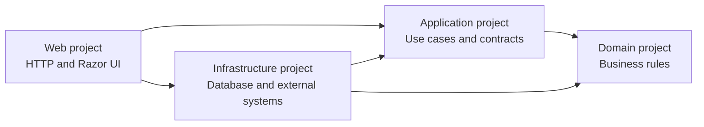
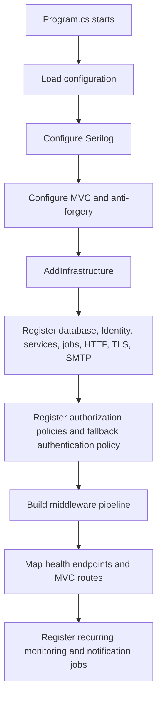
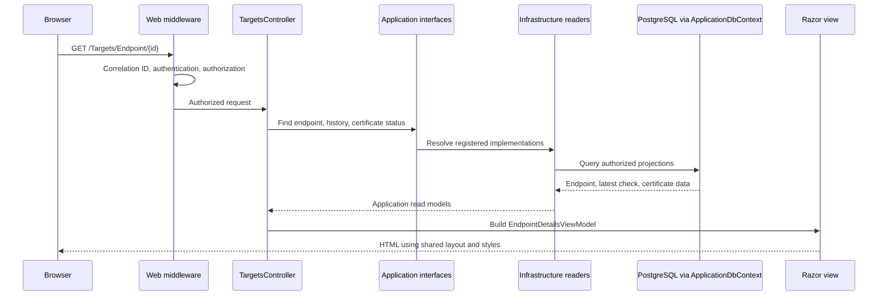
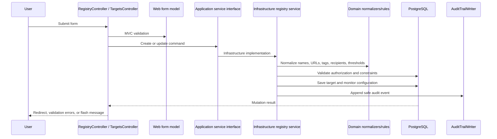
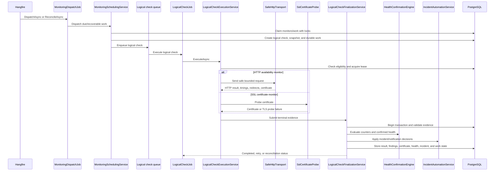
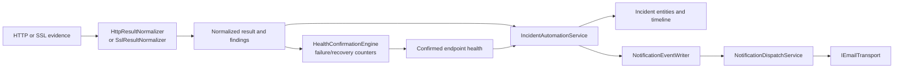
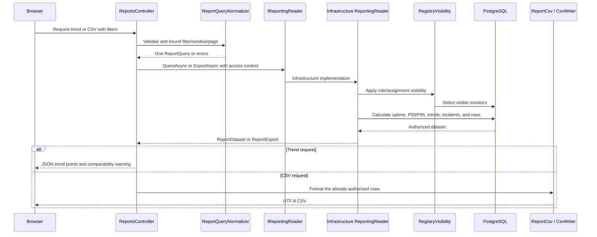

# `src` Tree Guide

This document explains the meaningful source files under [`../../src/`](../../src/), what each file is responsible for, and how the files work together.

It is written as a guide for understanding the project, not as a list of every generated or third-party file.

---

## 1. The simple mental model

The source code is split into four projects:

| Project | Simple responsibility |
|---|---|
| `WebHealth.Domain` | Business vocabulary and rules that should not depend on the web, database, Hangfire, or SMTP. |
| `WebHealth.Application` | Use-case contracts, commands, result models, and rules that coordinate business behavior. |
| `WebHealth.Infrastructure` | PostgreSQL, Entity Framework Core, Identity, Hangfire, HTTP, TLS, SMTP, and implementations of application interfaces. |
| `WebHealth.Web` | ASP.NET Core startup, controllers, Razor views, view models, middleware, navigation, and static assets. |

The dependency direction is:



The important rule is that the **Domain project is the innermost layer**. It must remain independent from ASP.NET Core, Entity Framework Core, Hangfire, SMTP, and HTTP implementation details.

---

## 2. High-level source tree

This is the meaningful structure. Generated files and vendor files are explained separately in [Section 8](#8-files-intentionally-omitted).

```text
src/
├── WebHealth.Domain/
│   ├── Health/
│   ├── Incidents/
│   ├── Maintenance/
│   ├── Monitoring/
│   ├── Normalization/
│   └── Notifications/
│
├── WebHealth.Application/
│   ├── Administration/
│   ├── Assignments/
│   ├── Auditing/
│   ├── Authorization/
│   ├── Health/
│   ├── Incidents/
│   ├── Maintenance/
│   ├── Monitoring/
│   ├── Notifications/
│   ├── Registry/
│   └── Reporting/
│
├── WebHealth.Infrastructure/
│   ├── Assignments/
│   ├── Auditing/
│   ├── Diagnostics/
│   ├── Health/
│   ├── Identity/
│   ├── Incidents/
│   ├── Maintenance/
│   ├── Monitoring/
│   ├── Notifications/
│   ├── Persistence/
│   │   └── Migrations/
│   ├── Registry/
│   └── Reporting/
│
└── WebHealth.Web/
    ├── Authorization/
    ├── Controllers/
    ├── Middleware/
    ├── Models/
    ├── Shell/
    ├── Views/
    └── wwwroot/
        ├── css/
        ├── fonts/
        ├── images/
        ├── js/
        └── lib/
```

The same structure can be viewed as a Mermaid map:

```mermaid
flowchart TD
    Src[src]

    Src --> Domain[WebHealth.Domain]
    Src --> App[WebHealth.Application]
    Src --> Infra[WebHealth.Infrastructure]
    Src --> Web[WebHealth.Web]

    Domain --> DHealth[Health]
    Domain --> DIncidents[Incidents]
    Domain --> DMaintenance[Maintenance]
    Domain --> DMonitoring[Monitoring]
    Domain --> DNormalization[Normalization]
    Domain --> DNotifications[Notifications]

    App --> AAdministration[Administration]
    App --> AAssignments[Assignments]
    App --> AAuditing[Auditing]
    App --> AAuthorization[Authorization]
    App --> AHealth[Health]
    App --> AIncidents[Incidents]
    App --> AMaintenance[Maintenance]
    App --> AMonitoring[Monitoring]
    App --> ANotifications[Notifications]
    App --> ARegistry[Registry]
    App --> AReporting[Reporting]

    Infra --> IIdentity[Identity]
    Infra --> IRegistry[Registry]
    Infra --> IMonitoring[Monitoring]
    Infra --> IIncidents[Incidents]
    Infra --> INotifications[Notifications]
    Infra --> IPersistence[Persistence]
    Infra --> IReporting[Reporting]

    Web --> WControllers[Controllers]
    Web --> WModels[Models]
    Web --> WViews[Views]
    Web --> WShell[Shell]
    Web --> WMiddleware[Middleware]
    Web --> WStatic[wwwroot]
```



---

## 3. Domain project

The Domain project contains small, reusable business rules and shared business vocabulary. It does not read from PostgreSQL or handle HTTP requests.

### `Health/`

| File | Role |
|---|---|
| `HealthLifecycle.cs` | Defines the allowed endpoint health statuses, such as `Healthy`, `Warning`, `Critical`, and `Unknown`. |

### `Incidents/`

| File | Role |
|---|---|
| `IncidentLifecycle.cs` | Defines incident severities, statuses, event types, evidence types, and resolution categories used by the incident state machine. |

### `Maintenance/`

| File | Role |
|---|---|
| `MaintenanceInterval.cs` | Contains validation and interval-related rules for maintenance windows. |
| `MaintenancePolicies.cs` | Defines the supported maintenance suppression policies. |

### `Monitoring/`

| File | Role |
|---|---|
| `CertificateExpiry.cs` | Calculates certificate days remaining and selects the warning, high, or critical expiry band. |
| `DestinationAddressPolicy.cs` | Defines prohibited destination-network rules used to prevent unsafe outbound requests. |
| `MonitorCadence.cs` | Defines monitoring sources, states, durable-work states, configuration sources, schedule anchors, and next-due calculations. |
| `PerformanceThresholds.cs` | Defines response-time thresholds and evaluates slow responses and page-size warnings. |
| `TlsCertificateEvaluator.cs` | Classifies a certificate as valid, expired, not-yet-valid, hostname-mismatched, or untrusted using a fixed precedence. |

### `Normalization/`

| File | Role |
|---|---|
| `EndpointUrlNormalizer.cs` | Converts endpoint URLs into a safe, canonical representation and rejects unsupported URL forms. |
| `NameNormalizer.cs` | Normalizes names for comparison and uniqueness rules. |
| `RecipientNormalizer.cs` | Normalizes email recipients for comparison and notification deduplication. |
| `TagNormalizer.cs` | Splits, trims, deduplicates, and normalizes website tags. |

### `Notifications/`

| File | Role |
|---|---|
| `NotificationLifecycle.cs` | Defines notification source kinds, event types, channels, delivery states, transport outcomes, and occurrence keys. |

---

## 4. Application project

The Application project describes what the system can do without deciding how the work is stored or transported.

Most `I...` files are **ports**: interfaces that Infrastructure implements and Web consumes. The record types in these files are the safe input and output shapes exchanged between layers.

### `Administration/`

| File | Role |
|---|---|
| `IUserAdministrationService.cs` | Defines user-list, user-create, user-update, role, password, and disable-account operations. |

### `Assignments/`

| File | Role |
|---|---|
| `IAssignmentAccessEvaluator.cs` | Defines assignment-aware access checks for users, teams, owners, and resources. |
| `ITeamAdministrationService.cs` | Defines team listing, creation, editing, member selection, and team result contracts. |

### `Auditing/`

| File | Role |
|---|---|
| `IAuditTrailReader.cs` | Defines authorized audit search and audit filter-list operations. |
| `IAuditTrailWriter.cs` | Defines the port used to append safe audit events. |
| `IAuthorizationDenialAuditWriter.cs` | Defines the port used to persist authenticated authorization denials. |

### `Authorization/`

| File | Role |
|---|---|
| `AuthorizationPolicies.cs` | Centralizes policy names such as administration, registry reading, monitoring operations, diagnostics, and audit access. |

### `Health/`

| File | Role |
|---|---|
| `CheckResultIssues.cs` | Converts normalized check findings into health issues with issue keys and confirmation counts. |
| `HealthConfirmationEngine.cs` | Applies consecutive-failure and consecutive-recovery rules to produce confirmed health transitions. |

### `Incidents/`

| File | Role |
|---|---|
| `IIncidentReader.cs` | Defines incident list, detail, timeline, evidence, and notification-delivery read models. |
| `IIncidentLifecycleService.cs` | Defines incident actions such as acknowledge, assign, resolve, close, force-close, and reopen. |
| `IncidentLifecycleEngine.cs` | Pure decision logic for validating incident state transitions and required notes or reasons. |

### `Maintenance/`

| File | Role |
|---|---|
| `IMaintenanceEvaluator.cs` | Defines the read-only check used to find active maintenance for a target and time. |
| `IMaintenanceReader.cs` | Defines maintenance list, detail, scope-option, and active-occurrence queries. |
| `IMaintenanceWindowService.cs` | Defines create, update, and cancel operations for maintenance windows. |
| `MaintenanceContracts.cs` | Contains maintenance scope, command, status, list, detail, and active-occurrence records. |

### `Monitoring/`

| File | Role |
|---|---|
| `ICheckHistoryReader.cs` | Defines paged check-history and check-detail results for endpoint pages. |
| `IExecutionLeaseService.cs` | Defines acquisition and release of the PostgreSQL-backed execution lease. |
| `ILogicalCheckExecutionService.cs` | Defines execution of a queued logical check and its retry/reconciliation statuses. |
| `ILogicalCheckFinalizationService.cs` | Defines the transaction that normalizes evidence, stores results, updates health, and completes durable work. |
| `IMonitoringSchedulingService.cs` | Defines due-work dispatch and restart reconciliation. |
| `IManualCheckService.cs` | Defines an authorized immediate check request. |
| `ISafeHttpTransport.cs` | Defines safe HTTP requests, results, redirects, timings, body bounds, and failure categories. |
| `ISslCertificateProbe.cs` | Defines certificate-only inspection that records certificate evidence but never accepts an invalid certificate. |
| `ISslUrgentCheckScheduler.cs` | Defines the urgent SSL check requested after a TLS-related HTTP failure. |
| `HttpMonitoringIdentity.cs` | Creates stable HTTP monitor and issue identities. |
| `HttpResultNormalization.cs` | Converts raw safe-transport output into normalized outcomes, findings, timings, and performance/page-size issues. |
| `MonitorWorkKinds.cs` | Maps monitor types to durable work kinds, preventing HTTP and SSL work from being confused. |
| `PerformanceComparability.cs` | Determines whether samples use comparable monitor sources and configuration. |
| `SslResultNormalization.cs` | Converts SSL probe output into certificate findings, expiry issue keys, and normalized results. |

### `Notifications/`

| File | Role |
|---|---|
| `IEmailTransport.cs` | Defines the application-owned email boundary so business logic does not depend directly on SMTP. |
| `INotificationFeedReader.cs` | Defines the in-application notification feed and mark-read operations. |
| `NotificationTemplates.cs` | Builds allow-listed opening, recovery, reminder, escalation, and SSL notification content. |

### `Registry/`

| File | Role |
|---|---|
| `IClientRegistryService.cs` | Defines client create, update, disable, delete, restore, and concurrency-aware mutation operations. |
| `IEndpointRegistryService.cs` | Defines endpoint create, update, enable/disable, schedule pause/resume, archive, and restore operations. |
| `IEnvironmentRegistryService.cs` | Defines environment management operations. |
| `IWebsiteRegistryService.cs` | Defines website management operations. |
| `IRegistryReader.cs` | Defines client, website, owner, tag, and registry-detail read operations. |
| `ITargetRegistryReader.cs` | Defines environment, endpoint, archive, and certificate-status read operations. |
| `ITargetAuthorizationService.cs` | Defines whether a user may view, manage, or test a monitored target. |
| `IMonitoringEligibilityService.cs` | Defines whether a client, website, environment, endpoint, or monitor may produce scheduled work. |
| `RegistryContracts.cs` | Contains client, website, owner, tag, access-context, command, and mutation-result records. |
| `TargetContracts.cs` | Contains environment, endpoint, certificate-status, target-authorization, and endpoint command records. |
| `ResponseThresholdOverride.cs` | Validates endpoint-specific response-time threshold overrides. |

### `Reporting/`

| File | Role |
|---|---|
| `IReportingReader.cs` | Defines the single query port used by dashboard data, trend data, and CSV export. |
| `ReportQuery.cs` | Normalizes filters, bounds report windows and pages, and defines the shared `ReportQuery` object. |
| `ReportCsv.cs` | Converts report rows to stable CSV columns without applying a second filter or authorization rule. |
| `CsvWriter.cs` | Writes UTF-8 CSV with quoting and spreadsheet formula-injection protection for user-controlled text. |

---

## 5. Infrastructure project

Infrastructure contains the implementations of the Application interfaces and the adapters to external systems.

The usual pattern is:

```text
Application interface
        ↓ implemented by
Infrastructure service
        ↓ uses
ApplicationDbContext / PostgreSQL / Hangfire / HTTP / SMTP
```

### Root and diagnostics

| File | Role |
|---|---|
| `DependencyInjection.cs` | Registers PostgreSQL, Identity, services, jobs, HTTP transport, SSL probing, Hangfire, health checks, and fallback email transport in the dependency-injection container. |
| `Diagnostics/PostgreSqlReadinessCheck.cs` | Reports database readiness for the protected readiness endpoint. |
| `Properties/AssemblyInfo.cs` | Allows the integration-test project to access selected internal Infrastructure types. |

### `Assignments/`

| File | Role |
|---|---|
| `Team.cs` | Persistence entities for teams and team membership. |
| `AssignmentAccessEvaluator.cs` | Evaluates whether a user's team or assignment grants access to a resource. |
| `AssignmentModelConfiguration.cs` | Configures team and membership tables, keys, indexes, and constraints. |
| `TeamAdministrationService.cs` | Implements team listing, creation, editing, membership changes, and audit recording. |

### `Auditing/`

| File | Role |
|---|---|
| `AuditEvent.cs` | Persistence entity for an append-only audit event. |
| `AuditEventConfiguration.cs` | Configures audit columns, lengths, indexes, and restrictive relationships. |
| `AuditTrailReader.cs` | Implements authorized audit searches and filter options. |
| `AuditTrailWriter.cs` | Appends safe before/after and actor/action audit records. |
| `AuthorizationDenialAuditWriter.cs` | Persists audit records for authenticated forbidden requests. |

### `Health/`

| File | Role |
|---|---|
| `HealthEntities.cs` | Persistence entities for endpoint confirmed health and per-issue counters. |
| `HealthEntityConfigurations.cs` | Configures health and issue-state tables and their constraints. |

### `Identity/`

| File | Role |
|---|---|
| `ApplicationUser.cs` | Extends ASP.NET Identity's user with application-specific user data. |
| `ApplicationRole.cs` | Application role entity using GUID keys. |
| `ApplicationRoles.cs` | Defines the supported Administrator, Operations, Developer/Support, and Viewer roles. |
| `ApplicationClaimTypes.cs` | Defines application claim names. |
| `ApplicationUserClaimsPrincipalFactory.cs` | Adds application claims, including the display-name claim, to the signed-in principal. |
| `ApplicationUserSignInManager.cs` | Applies application-specific sign-in behavior and disabled-account checks. |
| `ApplicationUserConfiguration.cs` | Configures the application user table. |
| `ApplicationRoleConfiguration.cs` | Configures the application role table. |
| `IdentityModelConfiguration.cs` | Applies Identity model configuration to the EF model. |
| `ClaimsPrincipalExtensions.cs` | Provides safe convenience accessors for display name and identity information in views. |
| `BootstrapAdminOptions.cs` | Binds configuration for the local bootstrap-admin operation. |
| `AdminBootstrapper.cs` | Creates or updates the initial administrator from secret configuration when explicitly invoked. |
| `UserAdministrationService.cs` | Implements administrator-only user management, role assignment, disabling, and password changes. |

### `Incidents/`

| File | Role |
|---|---|
| `IncidentEntities.cs` | Persistence entities for incidents, incident timeline events, and incident evidence. |
| `IncidentEntityConfigurations.cs` | Configures incident relationships, status constraints, uniqueness, indexes, and concurrency. |
| `IncidentReader.cs` | Loads authorized incident lists, details, timelines, evidence, and delivery information. |
| `IncidentLifecycleService.cs` | Implements user-driven incident state changes and writes audit/timeline records. |
| `IncidentAutomationService.cs` | Applies normalized check results to health issues, incidents, recurrence, recovery, and notification events. |

### `Maintenance/`

| File | Role |
|---|---|
| `MaintenanceEntities.cs` | Persistence entities for maintenance windows, occurrences, and scope. |
| `MaintenanceEntityConfigurations.cs` | Configures maintenance tables, constraints, relationships, and indexes. |
| `MaintenanceReader.cs` | Reads maintenance lists, details, scope options, and active occurrences. |
| `MaintenanceEvaluator.cs` | Determines whether a check falls inside an active maintenance occurrence. |
| `MaintenanceWindowService.cs` | Implements maintenance create, update, cancel, validation, concurrency, and audit behavior. |

### `Monitoring/`

This folder contains the most important runtime pipeline in the project.

#### Scheduling and durable work

| File | Role |
|---|---|
| `MonitoringSchedulingOptions.cs` | Binds and validates scheduling batch sizes, recovery delays, and urgent SSL cooldown settings. |
| `MonitoringSchedulingApplicationBuilderExtensions.cs` | Registers recurring Hangfire dispatch and reconciliation jobs when scheduling is enabled. |
| `MonitoringSchedulingService.cs` | Claims due monitors with PostgreSQL locking, creates logical checks and durable work, advances schedules, and reconciles abandoned work. |
| `MonitoringDispatchJob.cs` | Thin Hangfire entry point that calls dispatch or reconciliation. |
| `HangfireLogicalCheckQueue.cs` | Enqueues logical checks into the Hangfire short-check queue. |
| `DisabledLogicalCheckQueue.cs` | Safe no-op queue used when scheduling is disabled. |
| `DurableWorkEnqueueAcknowledgement.cs` | Records the enqueue hand-off and leaves committed work recoverable if enqueueing fails. |
| `LogicalCheckJob.cs` | Thin Hangfire entry point that executes a logical check and requests retry when needed. |

#### Check execution and persistence

| File | Role |
|---|---|
| `MonitoringExecutionEntities.cs` | EF entities for logical checks, configuration snapshots, attempts, leases, durable work, results, findings, redirects, and certificate observations. |
| `MonitoringExecutionConfigurations.cs` | Configures the monitoring execution tables, database constraints, keys, and indexes. |
| `CheckConfigurationSnapshotFactory.cs` | Copies the monitor configuration into an immutable snapshot for a logical check. |
| `ExecutionLeaseService.cs` | Acquires, fences, and releases one execution lease per endpoint monitor. |
| `LogicalCheckExecutionService.cs` | Loads a queued check, checks eligibility, acquires a lease, chooses HTTP or SSL observation, and sends evidence to finalization. |
| `LogicalCheckFinalizationService.cs` | Runs the final transaction: validates evidence, normalizes the result, evaluates maintenance, updates health, applies incidents, stores history, and completes work. |
| `ManualCheckService.cs` | Creates an authorized manual HTTP logical check outside the normal scheduled cadence. |
| `CheckHistoryReader.cs` | Reads authorized paged check history and detailed findings, timings, redirects, and uptime inclusion. |

#### Safe HTTP and TLS

| File | Role |
|---|---|
| `SafeHttpTransportOptions.cs` | Stores the named HTTP client, user-agent, timeout, proxy, and transport defaults. |
| `SafeHttpTransport.cs` | Executes bounded HTTP GET requests, validates every redirect, captures timings, reads bounded bodies, and classifies failures. |
| `SafeHttpConnectionFactory.cs` | Builds the custom HTTP handler/connection path that validates the actual remote address and preserves safe TLS behavior. |
| `SafeDestinationConnector.cs` | Shared resolve → policy-check → connect → actual-address-validation logic for HTTP and SSL probe connections. |
| `SafeHttpConcurrencyLimiter.cs` | Applies global and per-host concurrency limits. |
| `SafeHttpDependencies.cs` | Contains the resolver, connection, and transport helper abstractions used by the safe HTTP implementation. |
| `SafeHttpTiming.cs` | Collects DNS, connect, TLS, and TTFB phase timing data. |
| `SafeHttpTlsCapture.cs` | Captures the negotiated leaf certificate on a normally validated HTTPS response. |
| `SslCertificateProbe.cs` | Opens an HTTPS TLS connection only to inspect a certificate, records validation signals, and always rejects the handshake. |
| `TlsChainTrust.cs` | Evaluates certificate-chain trust from individual chain-element statuses. |
| `SslUrgentCheckScheduler.cs` | Creates and queues one cooldown-limited urgent SSL check after a TLS-related HTTP failure. |

### `Notifications/`

| File | Role |
|---|---|
| `NotificationEntities.cs` | Persistence entities for notification events, deliveries, attempts, and read markers. |
| `NotificationEntityConfigurations.cs` | Configures notification relationships, states, uniqueness, and indexes. |
| `NotificationEventWriter.cs` | Creates durable notification events in the same business transaction as incident changes. |
| `NotificationDispatchService.cs` | Claims pending deliveries, sends them through `IEmailTransport`, and records outcomes. |
| `NotificationDispatchJob.cs` | Thin Hangfire entry point for notification delivery. |
| `NotificationReminderService.cs` | Creates reminder and escalation events for eligible unacknowledged incidents. |
| `NotificationSchedulingOptions.cs` | Binds notification queue, lease, retry, reminder, and escalation settings. |
| `NotificationSchedulingApplicationBuilderExtensions.cs` | Registers recurring notification dispatch and reminder jobs. |
| `NotificationFeedReader.cs` | Reads the signed-in user's in-app notification feed and read state. |
| `SmtpEmailTransport.cs` | Sends email through configured TLS SMTP, such as the personal Gmail transport. |
| `SmtpEmailOptions.cs` | Binds SMTP host, port, sender, timeout, username, and secret-backed password settings. |
| `RecordingEmailTransport.cs` | In-memory/recording transport used as the safe default and by automated tests. |

### `Persistence/`

#### Database setup files

| File | Role |
|---|---|
| `ApplicationDbContext.cs` | The EF Core database context exposing Identity and application entities and applying all model configurations. |
| `ApplicationDbContextFactory.cs` | Creates the design-time context used by EF migration commands. |
| `DatabaseConventions.cs` | Applies shared database conventions such as schema naming, UTC timestamps, snake_case names, and restrictive deletes. |
| `PostgreSqlDbContextOptions.cs` | Configures Npgsql/PostgreSQL-specific EF options. |

#### Versioned migrations

Migration files change the database schema explicitly. The timestamp is part of the migration identity, and the name describes the feature introduced.

| Migration file | Main schema responsibility |
|---|---|
| `20260813095149_InitialFoundation.cs` | Creates the initial application schema foundation. |
| `20260814190445_IdentityAccessAndAudit.cs` | Adds Identity, roles, access-related data, and audit storage. |
| `20260814190510_RegistryFoundation.cs` | Adds clients, websites, environments, endpoints, tags, ownership, and monitor configuration. |
| `20260816120256_MonitoringExecutionFoundation.cs` | Adds logical checks, snapshots, execution attempts, leases, durable work, and monitoring execution storage. |
| `20260816175236_HttpMonitoringHistory.cs` | Adds HTTP result history, findings, redirects, and timing-related fields. |
| `20260817070044_LogicalCheckExecutionLifecycle.cs` | Adds lifecycle constraints and indexes for logical-check execution. |
| `20260817072634_HangfireSchedulingAndRecovery.cs` | Adds durable scheduling/recovery support and Hangfire-related database objects. |
| `20260817103231_HealthMaintenanceAndIncidents.cs` | Adds health state, maintenance, and initial incident persistence. |
| `20260817120619_IncidentLifecycle.cs` | Adds incident lifecycle, timeline, recurrence, and concurrency support. |
| `20260817130137_DurableNotifications.cs` | Adds notification events, deliveries, attempts, and notification uniqueness. |
| `20260818065727_EndpointSchedulingMode.cs` | Adds endpoint scheduling enable/disable state. |
| `20260818081749_NotificationReadMarker.cs` | Adds per-recipient notification read markers. |
| `20260818084805_NotificationRecipientIndex.cs` | Adds notification recipient lookup/index support. |
| `20260818101710_SslCertificateMonitoring.cs` | Adds SSL monitor support, certificate observations, SSL result categories, and HTTPS backfill. |
| `20260818110028_SslSeverityAndPerformanceRules.cs` | Adds SSL severity/performance-rule persistence updates and related constraints/indexes. |

Generated migration designer files and `ApplicationDbContextModelSnapshot.cs` are intentionally not explained individually because EF generates them from the migration model. They should not be edited manually.

### `Registry/`

| File | Role |
|---|---|
| `RegistryEntities.cs` | Persistence entities for clients, websites, tags, environments, endpoints, monitors, policy profiles, grants, and authorization evidence. |
| `RegistryEntityConfigurations.cs` | Configures registry relationships, normalized uniqueness, foreign keys, constraints, indexes, and concurrency fields. |
| `RegistryDefaults.cs` | Defines default monitor types, policy profiles, intervals, thresholds, and configuration fingerprints. |
| `RegistryMutationSupport.cs` | Shared validation, concurrency, authorization, normalization, and audit helpers for registry mutations. |
| `RegistryVisibility.cs` | Applies role- and assignment-aware visibility scopes to registry queries. |
| `RegistryReader.cs` | Reads clients, websites, tags, owners, and registry details through authorized projections. |
| `ClientRegistryService.cs` | Implements client mutations and records their audit events. |
| `WebsiteRegistryService.cs` | Implements website mutations, tags, ownership, and related audit behavior. |
| `EnvironmentRegistryService.cs` | Implements environment mutations and validates their website relationship. |
| `EndpointRegistryService.cs` | Implements endpoint mutations, URL rules, target authorization, monitor creation, scheduling, and threshold overrides. |
| `TargetRegistryReader.cs` | Reads environments, endpoints, archives, and current certificate status for target pages. |
| `TargetAuthorizationService.cs` | Checks target ownership/permission evidence and user rights before target operations or outbound checks. |
| `MonitoringEligibility.cs` | Builds the database query that determines whether a target is enabled, active, authorized, and schedulable. |
| `MonitorIntervalOverride.cs` | Resolves endpoint interval overrides against policy/default values. |
| `OwnerSubjectNames.cs` | Resolves owner subject IDs into safe display names for pages and reports. |

### `Reporting/`

| File | Role |
|---|---|
| `ReportingReader.cs` | Applies authorization and filters once, loads current monitor rows, calculates uptime/P50/P95/trends in PostgreSQL, and supplies both screen and CSV data. |

---

## 6. Web project

The Web project is the application's entry point. It receives browser requests, applies authorization and anti-forgery protection, calls Application interfaces, and chooses Razor views or file/JSON responses.

### `Program.cs`

| File | Role |
|---|---|
| `Program.cs` | Configures Serilog, MVC, anti-forgery, authorization policies, cookies, middleware, health endpoints, routes, Infrastructure services, and monitoring/notification scheduling. |

The startup sequence is approximately:



### `Authorization/`

| File | Role |
|---|---|
| `AuditingAuthorizationMiddlewareResultHandler.cs` | Logs authenticated forbidden requests through the Application audit port before returning the normal 403 response. |

### `Middleware/`

| File | Role |
|---|---|
| `CorrelationIdMiddleware.cs` | Creates the request correlation ID, returns it in `X-Correlation-ID`, and places it into the Serilog log context. |
| `SafeExceptionLoggingMiddleware.cs` | Logs only the exception type for unhandled request failures, avoiding unsafe exception details in normal logs. |

### `Controllers/`

Controllers are intentionally thin. They receive input, call an Application interface, select a view or response, and convert the result into user-facing messages.

| File | Role |
|---|---|
| `AccountController.cs` | Handles login, logout, access-denied redirects, safe local return URLs, Identity sign-in, and anti-forgery. |
| `AdministrationController.cs` | Provides administrator-only user and team management pages and posts. |
| `AuditController.cs` | Provides the authorized audit-search page. |
| `ChecksController.cs` | Queues authorized manual checks and displays check history and check details. |
| `HomeController.cs` | Displays the current home/shell dashboard placeholder and safe error/status pages. |
| `IncidentsController.cs` | Lists incidents and sends user actions such as acknowledge, progress, resolve, close, force-close, and reopen to the incident service. |
| `MaintenanceController.cs` | Lists, creates, edits, and cancels maintenance windows. |
| `NotificationsController.cs` | Marks the current user's in-app notifications as read. |
| `RegistryController.cs` | Manages client and website pages, forms, archive actions, and state changes. |
| `ReportsController.cs` | Normalizes shared reporting filters and exposes trend JSON and UTF-8 CSV export through the same reporting reader. |
| `TargetsController.cs` | Manages environments and endpoints, displays endpoint history/certificate status, and controls endpoint schedule state. |

### `Models/`

Web models are presentation models. They are not database entities. They combine Application read models with form validation and UI-only values.

| File | Role |
|---|---|
| `AssignmentViewModels.cs` | User-interface models for team lists and team forms. |
| `AuditViewModels.cs` | Page model for audit filters, available filter values, and search results. |
| `CheckHistoryViewModels.cs` | Wraps Application check-history and check-detail records for Razor views. |
| `EmptyStateViewModel.cs` | Supplies a reusable title, message, and optional action for empty states. |
| `ErrorViewModel.cs` | Supplies status code, trace ID, and safe retry information for error pages. |
| `IncidentViewModels.cs` | Page models for incident lists and incident detail/actions. |
| `LoginViewModel.cs` | Login form fields and validation attributes. |
| `MaintenanceViewModels.cs` | List, detail, and form models for maintenance windows. |
| `RegistryViewModels.cs` | List, detail, archive, and client/website form models. |
| `TargetRegistryViewModels.cs` | Environment, endpoint, archive, and endpoint-detail models, including latest check and certificate status. |
| `UserAdministrationViewModels.cs` | User list, create-user, and edit-user form models. |

### `Shell/`

The Shell folder contains reusable UI behavior shared across pages.

| File | Role |
|---|---|
| `BreadcrumbItem.cs` | Represents one breadcrumb label and optional URL. |
| `Breadcrumbs.cs` | Stores and reads breadcrumb data from `ViewData`. |
| `FlashMessage.cs` | Defines flash-message levels and message records. |
| `FlashMessageExtensions.cs` | Adds success/error flash messages to MVC `TempData`. |
| `NavigationItem.cs` | Represents one navigation entry and its allowed roles. |
| `NavigationSection.cs` | Groups navigation items under an optional heading. |
| `ShellNavigation.cs` | Defines the sidebar navigation and planned entries; visibility improves usability but does not replace server authorization. |
| `ShellViewData.cs` | Adds title and page metadata helpers to `ViewData`. |
| `StatusBadges.cs` | Converts stored statuses and expiry bands into accessible labels and UI badge information. |
| `NotificationsMenuViewComponent.cs` | Loads the signed-in user's notification feed for the shared header without making every controller supply it. |

### `Views/`

Razor views render the models returned by controllers. Shared views are composed into most pages through `_Layout.cshtml`.

#### `Views/Account/`

| File | Role |
|---|---|
| `Login.cshtml` | Login form and validation/error display. |

#### `Views/Administration/`

| File | Role |
|---|---|
| `Users.cshtml` | Lists managed users and links to user creation/editing. |
| `CreateUser.cshtml` | Creates a user and assigns supported roles. |
| `EditUser.cshtml` | Edits user identity, roles, disabled state, and optional password. |
| `Teams.cshtml` | Lists managed teams. |
| `CreateTeam.cshtml` | Creates a team and selects members. |
| `EditTeam.cshtml` | Edits team name, disabled state, version, and members. |
| `_TeamForm.cshtml` | Shared create/edit team form fields. |

#### `Views/Audit/`

| File | Role |
|---|---|
| `Index.cshtml` | Displays authorized audit filters, filter options, paged results, and safe before/after values. |

#### `Views/Checks/`

| File | Role |
|---|---|
| `History.cshtml` | Displays paged check history for an endpoint, including outcome, timing, monitor source, and uptime inclusion. |
| `Check.cshtml` | Displays one check's result, timings, diagnostics, findings, and redirect hops. |

#### `Views/Home/`

| File | Role |
|---|---|
| `Index.cshtml` | Current home page and Phase 1 shell demonstration; it still contains an empty monitored-endpoints state. |

#### `Views/Incidents/`

| File | Role |
|---|---|
| `Index.cshtml` | Displays filtered and paged incidents. |
| `Details.cshtml` | Displays incident state, owner, timeline, evidence, notifications, and allowed actions. |

#### `Views/Maintenance/`

| File | Role |
|---|---|
| `Index.cshtml` | Lists maintenance windows. |
| `Create.cshtml` | Creates a maintenance window. |
| `Edit.cshtml` | Edits a maintenance window. |
| `Details.cshtml` | Shows maintenance scope, dates, reason, policy, and cancellation state. |
| `_Form.cshtml` | Shared maintenance form fields. |

#### `Views/Registry/`

| File | Role |
|---|---|
| `Clients.cshtml` | Lists visible clients. |
| `Client.cshtml` | Displays one client and its websites. |
| `CreateClient.cshtml` | Creates a client. |
| `EditClient.cshtml` | Edits a client. |
| `Websites.cshtml` | Lists visible websites and supports tag filtering. |
| `Website.cshtml` | Displays one website and its environments. |
| `CreateWebsite.cshtml` | Creates a website. |
| `EditWebsite.cshtml` | Edits a website. |
| `Archived.cshtml` | Displays archived clients and websites. |
| `_ClientForm.cshtml` | Shared client create/edit form fields. |
| `_WebsiteForm.cshtml` | Shared website create/edit form fields. |

#### `Views/Targets/`

| File | Role |
|---|---|
| `Endpoints.cshtml` | Lists visible endpoints and supports search. |
| `Endpoint.cshtml` | Displays endpoint configuration, latest check, certificate status, and actions. |
| `CreateEndpoint.cshtml` | Creates an endpoint and its HTTP monitor. |
| `EditEndpoint.cshtml` | Edits endpoint URL, authorization evidence, schedule, owner, and performance overrides. |
| `Environments.cshtml` | Lists environments belonging to a website. |
| `Environment.cshtml` | Displays one environment and its endpoints. |
| `CreateEnvironment.cshtml` | Creates an environment. |
| `EditEnvironment.cshtml` | Edits environment settings. |
| `Archived.cshtml` | Displays archived environments and endpoints. |
| `_EndpointForm.cshtml` | Shared endpoint create/edit form fields. |
| `_EnvironmentForm.cshtml` | Shared environment create/edit form fields. |

#### `Views/Shared/`

| File | Role |
|---|---|
| `_Layout.cshtml` | Main authenticated page layout: sidebar, header, breadcrumbs, account menu, notification component, messages, content, and footer. |
| `_AuthLayout.cshtml` | Layout used by authentication pages. |
| `_Sidebar.cshtml` | Renders role-aware navigation from `ShellNavigation`. |
| `_Breadcrumbs.cshtml` | Renders the current breadcrumb trail. |
| `_FlashMessages.cshtml` | Renders success and error messages from `TempData`. |
| `_ValidationSummary.cshtml` | Renders model-validation errors near the top of the page. |
| `_EmptyState.cshtml` | Renders a reusable empty-state card. |
| `_Icon.cshtml` | Renders the application's inline icon markup for a named icon. |
| `Error.cshtml` | Renders safe 4xx/5xx error information and a local retry action when available. |
| `Components/NotificationsMenu/Default.cshtml` | Renders the notification feed supplied by `NotificationsMenuViewComponent`. |

There is currently no `Views/Reports/` folder. Reporting endpoints exist in `ReportsController`, but the dedicated dashboard/report Razor screen and chart integration are still separate UI work. `Views/Home/Index.cshtml` currently demonstrates the shell and an empty dashboard state.

### Configuration and static assets

| File/folder | Role |
|---|---|
| `appsettings.json` | Base runtime settings for allowed hosts, monitoring scheduling, HTTP user-agent, and Serilog. |
| `appsettings.Development.json` | Development-only logging overrides. |
| `appsettings.Testing.json` | Test-host settings that disable scheduling and use quiet logging. Connection-string secrets are supplied by the test environment. |
| `wwwroot/css/tokens.css` | Design tokens for colors, typography, spacing, borders, and focus styles. |
| `wwwroot/css/shell.css` | Layout, sidebar, header, responsive shell, and accessibility styles. |
| `wwwroot/css/components.css` | Reusable cards, forms, tables, badges, buttons, alerts, and empty-state styles. |
| `wwwroot/css/auth.css` | Login/authentication page styling. |
| `wwwroot/js/shell.js` | Progressive enhancement for sidebar, account-menu, and shell interactions. |
| `wwwroot/images/login-panel.png` | Login-page visual asset. |
| `wwwroot/images/sidebar-support.png` | Sidebar support/promotion visual asset. |
| `wwwroot/fonts/*.woff2` | Figtree font files used by the application-owned UI styles. |
| `wwwroot/favicon.ico` | Browser/application icon. |

The files under `wwwroot/lib/` are third-party library assets, mainly Bootstrap, jQuery, and jQuery validation. They are not application architecture files.

---

## 7. How the files interact

### 7.1 A normal browser request

For a page such as the endpoint details page:



The controller does not query EF Core directly. It calls interfaces such as `ITargetRegistryReader` and `ICheckHistoryReader`; Infrastructure provides the implementations.

### 7.2 Creating or editing a registry target



The database remains the final enforcement point for uniqueness, relationships, and concurrency. UI validation is helpful, but it is not the security boundary.

### 7.3 Scheduled HTTP or SSL monitoring

The scheduler handles both monitor types. Only the observation step differs.



Important interaction details:

1. `MonitoringSchedulingService` creates a stable logical check before enqueueing work.
2. `LogicalCheckExecutionService` uses `ExecutionLeaseService` to prevent competing workers from executing the same monitor at the same time.
3. `SafeHttpTransport` uses `SafeDestinationConnector`, DNS resolution, destination policy, actual-connection checks, proxy/TLS settings, and concurrency limits.
4. `SslCertificateProbe` reuses the same safe destination machinery but deliberately rejects the TLS handshake after capturing certificate evidence.
5. `LogicalCheckFinalizationService` is the business transaction boundary. It stores the result, updates health, evaluates maintenance, applies incident automation, and prepares an urgent SSL check when needed.

### 7.4 Failure and incident flow



A single check can contain multiple findings. Issue keys keep different problems separate; for example, an endpoint can have an availability outage and a slow-response incident without treating them as the same issue.

### 7.5 Reporting and CSV flow



The most important design choice is that the screen and CSV use the same `ReportQuery`, the same visibility scope, and the same `ReportingReader`. `ReportCsv` only formats rows; it does not perform a second query or apply a second authorization rule.

---

## 8. Files intentionally omitted from the detailed role tables

The following files or folders exist under `src`, but they are not application architecture files:

| Omitted item | Reason |
|---|---|
| `bin/` and `obj/` | Build output and intermediate files. They are regenerated. |
| `packages.lock.json` | Restore/dependency lock files. Important for repeatable builds, but not runtime application behavior. |
| `*.csproj` | Project/build configuration. The project references are summarized in Section 1. |
| `Properties/launchSettings.json` | Local development launch profiles. |
| EF `*.Designer.cs` migration files | Generated migration metadata. |
| `ApplicationDbContextModelSnapshot.cs` | Generated EF model snapshot. |
| `Views/_ViewStart.cshtml` and `Views/_ViewImports.cshtml` | Razor conventions/imports rather than feature behavior. |
| `Views/Shared/_ValidationScriptsPartial.cshtml` | Standard client-side validation script partial. |
| `wwwroot/lib/` | Third-party Bootstrap, jQuery, and validation assets. |
| `*.map`, vendor licenses, and generated minified files | Vendor/debugging support files. |

Omitting these files from the role tables does not mean they are unimportant to builds or local execution. It means they do not explain the application's business architecture.

---

## 9. The most important files to read first

If you are learning the project, do not start by reading every file. Read these in order:

1. [`WebHealth.Web/Program.cs`](../../src/WebHealth.Web/Program.cs) — see startup, middleware, policies, and scheduling registration.
2. [`WebHealth.Infrastructure/DependencyInjection.cs`](../../src/WebHealth.Infrastructure/DependencyInjection.cs) — see which interfaces are connected to implementations.
3. [`WebHealth.Web/Controllers/TargetsController.cs`](../../src/WebHealth.Web/Controllers/TargetsController.cs) — see the browser-to-application flow for endpoints.
4. [`WebHealth.Infrastructure/Monitoring/MonitoringSchedulingService.cs`](../../src/WebHealth.Infrastructure/Monitoring/MonitoringSchedulingService.cs) — see how due work becomes logical checks.
5. [`WebHealth.Infrastructure/Monitoring/LogicalCheckExecutionService.cs`](../../src/WebHealth.Infrastructure/Monitoring/LogicalCheckExecutionService.cs) — see how HTTP and SSL checks share execution behavior.
6. [`WebHealth.Infrastructure/Monitoring/LogicalCheckFinalizationService.cs`](../../src/WebHealth.Infrastructure/Monitoring/LogicalCheckFinalizationService.cs) — see the main result transaction.
7. [`WebHealth.Infrastructure/Reporting/ReportingReader.cs`](../../src/WebHealth.Infrastructure/Reporting/ReportingReader.cs) — see how authorized report data is calculated.
8. [`WebHealth.Web/Views/Shared/_Layout.cshtml`](../../src/WebHealth.Web/Views/Shared/_Layout.cshtml) — see how pages are composed into the shared UI shell.

These files show the main control paths without requiring you to understand every helper first.
