# Website Health Monitoring System Design and Architecture

## 1. Purpose

This document defines the implementation architecture for the personal Website Health Monitoring project. It translates the baseline business rules in [`Website_Health_Monitoring_Project_Specification.md`](../Website_Health_Monitoring_Project_Specification.md) into a system design using [`Technology_Stack.md`](Technology_Stack.md).

The system is a **modular monolith**. It has one codebase and one application composition root, while keeping identity, registry, monitoring, incidents, notifications, reporting, and administration as explicit internal modules.

PostgreSQL is the intern-selected technical deviation from the specification's SQL Server recommendation. All functional, security, integrity, retention, and acceptance requirements remain unchanged.

## 2. Architectural Drivers

The architecture must support:

- At least 500 enabled endpoints and 100 bounded concurrent checks.
- At least 95% of enabled endpoints checked within their configured schedule.
- Confirmed outage creation within two check intervals by default.
- No duplicate logical checks, active incidents, or notification events after retries or restarts.
- Common dashboard views loading within three seconds at P95 for the target dataset.
- Monitoring and notification processing independent of interactive web sessions.
- Safe outbound HTTP when URLs and remote responses are untrusted.
- Complete auditability for configuration and incident-state changes.
- Configurable retention, with raw results retained for 90 days and aggregates and incidents for 24 months by default.
- Controlled migrations, environment-specific configuration, and secret management.

## 3. Architecture Decisions

| Area | Decision |
|---|---|
| Architecture style | Modular monolith with explicit internal boundaries. |
| Runtime | .NET 10 and ASP.NET Core 10 MVC. |
| UI | Server-rendered MVC views using licensed Metronic 8 Bootstrap assets with Demo 34 as the shell, semantic HTML, and Chart.js. |
| Identity | ASP.NET Core Identity with role- and policy-based authorization. |
| Persistence | Entity Framework Core with Npgsql and PostgreSQL. |
| Background work | Hangfire with PostgreSQL storage; no second scheduler or message broker. |
| Monitoring transport | `IHttpClientFactory` with an application-owned safe transport and manual redirect handling. |
| Email | Application-owned email interface backed initially by personal Gmail SMTP (`smtp.gmail.com`). |
| Logging and diagnostics | Serilog, correlation identifiers, and ASP.NET Core health checks. |
| Mapping | Explicit entity, DTO, and view-model projections. |
| Time | Store timestamps as UTC instants; store timezone identifiers separately and convert only for display. |
| Consistency | PostgreSQL constraints and transactions enforce invariants; optimistic concurrency protects user edits. |
| Asynchronous side effects | Durable database records separate business transactions from SMTP delivery. |

## 4. System Context

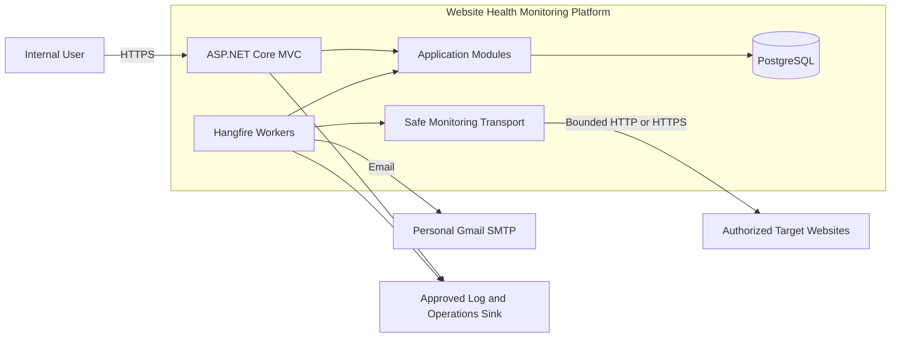

### Trust boundaries

- Browser input, configured endpoint URLs, target responses, DNS results, redirect locations, and SMTP errors are untrusted.
- PostgreSQL is the authoritative system of record.
- Target websites must be owned by the intern or explicitly permitted for testing before onboarding.
- Detailed diagnostics and Hangfire administration are restricted to authorized operational roles.
- Secrets enter through environment-specific secret configuration and never through source control.

## 5. Logical Architecture

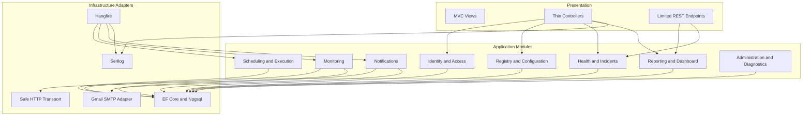

### Dependency rules

- Controllers and Hangfire job entry points remain thin and call application services.
- Domain rules do not depend on MVC, Hangfire, SMTP, EF Core, or HTTP infrastructure.
- Infrastructure adapters implement interfaces owned by the application modules.
- Cross-module changes go through explicit application services, not direct modification of another module's persistence objects.
- Monitoring gathers evidence; health and incident rules interpret it; notification workers deliver resulting messages.

## 6. Module Responsibilities

### 6.1 Identity and Access

- User accounts, roles, lockout, disabled accounts, and security stamps.
- Policies for administrators, operations users, assigned developers/support users, and viewers.
- Assignment-aware access checks.
- Server-side authorization for every protected action.

### 6.2 Registry and Configuration

- Clients, websites, environments, endpoints, tags, ownership, and monitor policies.
- URL validation and normalization.
- Maintenance windows and configurable defaults.
- Soft deletion and configuration audit events.
- Monitoring eligibility based on enabled website and endpoint state.

### 6.3 Scheduling and Execution

- Select due endpoints and create durable logical checks.
- Queue scheduled and authorized manual work.
- Prevent concurrent execution for the same endpoint and monitor type.
- Apply retry classification, timeout closure, catch-up behavior, and worker diagnostics.

A Hangfire attempt is infrastructure execution. A logical check is the single business sample across all attempts.

### 6.4 Monitoring

- HTTP availability, response timing, content marker, and redirects.
- SSL certificate validity and expiry.
- SEO and technical configuration checks.
- Bounded broken-link crawling.
- Normalized results, findings, metrics, and safe diagnostics.

This module does not send email or directly manage incident lifecycle state.

### 6.5 Health and Incidents

- Consecutive failure and recovery counters.
- Confirmed endpoint health state.
- Stable normalized issue keys.
- Incident creation, deduplication, assignment, lifecycle, recurrence, and timeline.
- Maintenance-aware notification suppression and post-maintenance behavior.

### 6.6 Notifications

- Resolve recipients from endpoint, website, client, and escalation policies.
- Create opening, reminder, escalation, recovery, SSL, and summary events.
- Enforce event, channel, and recipient idempotency.
- Deliver email independently and record attempts and normalized failures.

### 6.7 Reporting and Dashboard

- Current health, uptime, response time, incidents, SSL, SEO, crawler, and audit views.
- Shared filters for screen and CSV output.
- Chart.js datasets and daily aggregates.
- Retention-aware historical reporting.

### 6.8 Administration and Diagnostics

- Users, roles, global settings, retention, and operational holds.
- Worker heartbeat, queue depth, overdue checks, and notification failures.
- Protected audit and health diagnostics.

## 7. Runtime and Deployment Model

The web role and worker role use the same application code and module boundaries. For the initial environment they may run in one process. Worker execution remains independently configurable so it can later run as a separate always-on process without splitting the system into services.

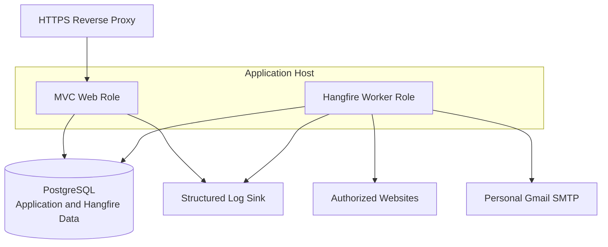

Use separate Hangfire queues for short monitoring checks, crawls, notifications, and maintenance work. This prevents long crawler jobs from starving availability checks. Exact process topology and worker counts are deployment decisions that must be load-tested.

## 8. Interactive Request Flow

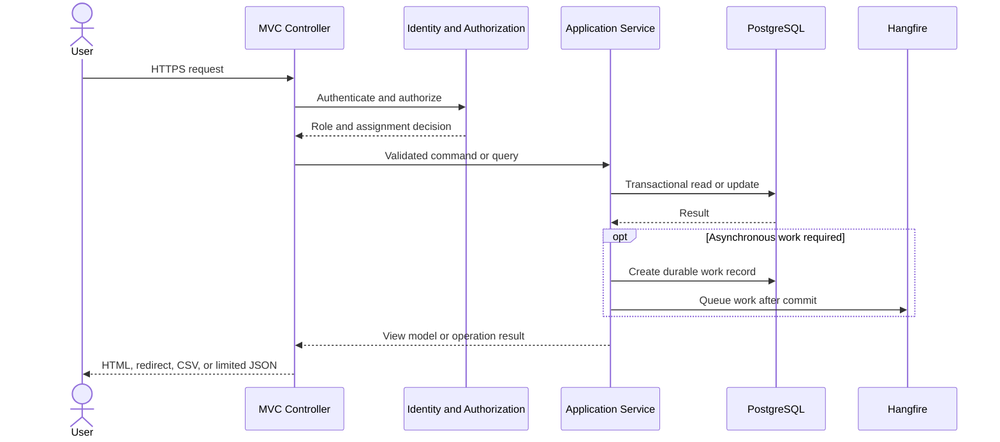

- State-changing browser requests require anti-forgery protection.
- Commands validate authorization, business invariants, and concurrency state.
- On-demand checks are queued and never perform outbound monitoring inside the web request.
- Dashboard queries use projections, bounded date ranges, and pagination where appropriate.

## 9. Scheduled Monitoring Flow

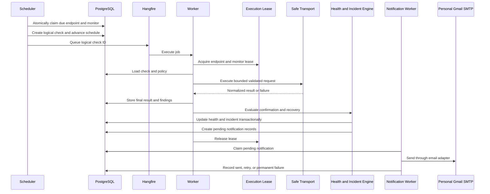

### Retry and restart behavior

- Every job carries a stable `LogicalCheckId`.
- A retry never creates another availability sample for the same logical check.
- A completed logical check makes duplicate deliveries a no-op.
- Exhausted execution is closed with a terminal normalized outcome; it is not left running.
- A reconciliation job finds committed work that was not queued or completed.
- Scheduler recovery creates one catch-up check rather than every missed interval.

## 10. Health and Incident State

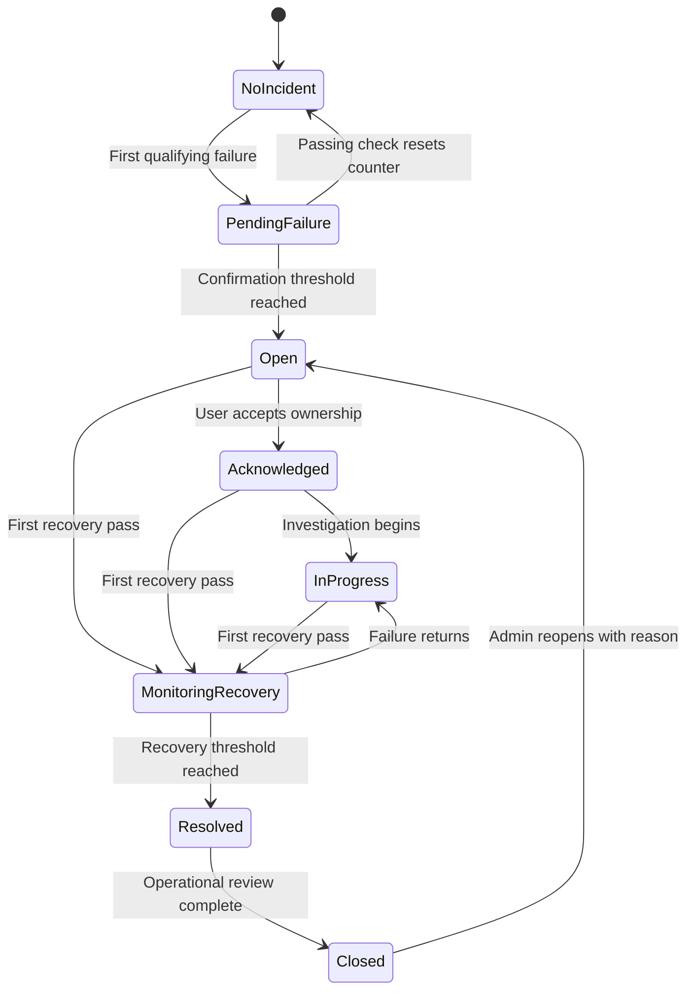

- Only one active incident may exist for an endpoint, monitor type, and normalized issue key.
- A materially different issue may create a separate incident.
- Closing normally requires `Resolved`; administrative exceptions require an audit reason.
- Closed incidents are immutable except for controlled administrator reopening.

## 11. Data Architecture

### 11.1 Core relationships

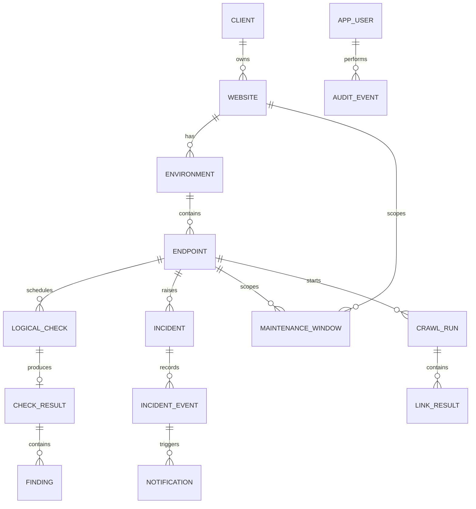

The diagram shows principal business relationships, not every field or join table. Maintenance scope may also apply at broader levels and should be represented with explicit scope data rather than nullable foreign keys for every possible target.

### 11.2 Integrity rules

PostgreSQL constraints and indexes must enforce, where practical:

- Normalized client name uniqueness using a defined case-insensitive normalization strategy.
- Website name uniqueness within a client.
- Normalized endpoint URL uniqueness within an environment, with monitor type uniqueness enforced by one child endpoint-monitor row per endpoint/type. Together these enforce BR-W06 without duplicating endpoint identity.
- Exactly one final result per logical check.
- At most one active incident per endpoint, monitor type, and issue key.
- Notification uniqueness by incident event, channel, and normalized recipient.
- Link-result uniqueness by crawl and normalized source-target pair.

Index due scheduling fields, current health, result timestamps, incident status and severity, certificate expiry, notification state, and audit timestamp/entity. Verify index choices with representative query plans.

### 11.3 Data lifecycle

- Configuration entities with history are soft-deleted.
- Raw results are retained for 90 days by default.
- Daily aggregates and incidents are retained for 24 months by default.
- Active legal or operational holds prevent deletion.
- Retention runs in bounded, restartable batches.
- Reports use `[start, end)` UTC boundaries.
- Full response bodies and sensitive headers are not persisted by default.

## 12. Transactions, Idempotency, and Concurrency

### 12.1 Check evaluation transaction

Use one PostgreSQL transaction to:

1. Persist the terminal logical check result and findings.
2. Update failure or recovery state.
3. Update confirmed endpoint health.
4. Open or update the matching incident.
5. Append incident timeline events.
6. Create pending or suppressed notification records.

SMTP delivery occurs only after commit and never participates in this transaction.

### 12.2 Idempotency controls

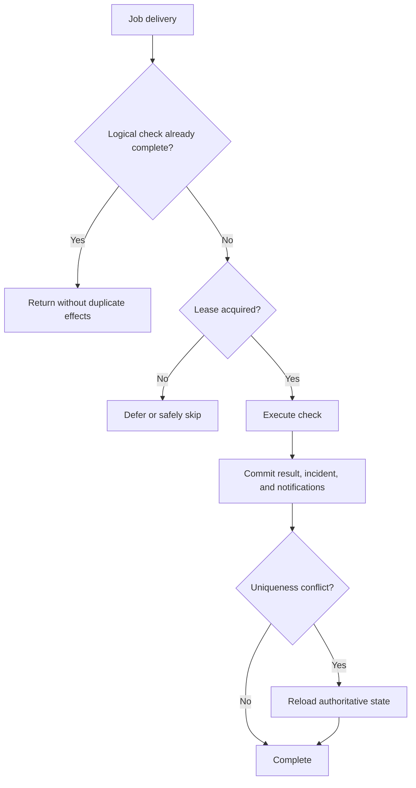

- Logical-check identity protects availability samples across retries.
- Database uniqueness protects active incidents and notification events.
- Notification workers re-read state before sending.
- Manual checks record their initiator and do not alter scheduled cadence or contractual uptime by default.

### 12.3 Execution locking

- Use an application-owned PostgreSQL-backed lease keyed by endpoint and monitor type.
- Store owner, acquisition time, and expiry to allow recovery after worker failure.
- Acquire the lease atomically and verify ownership before final mutation.
- Treat database constraints as the final duplicate defense.
- Do not depend only on Hangfire retry or concurrency behavior for business correctness.

### 12.4 User concurrency

Use optimistic concurrency for endpoint configuration, policies, maintenance windows, and incidents. Reject stale updates and require users to review current state. Incident history is append-only rather than overwritten.

## 13. Safe Outbound Monitoring

SSRF protection is a core architectural boundary because users configure destinations that the server requests.

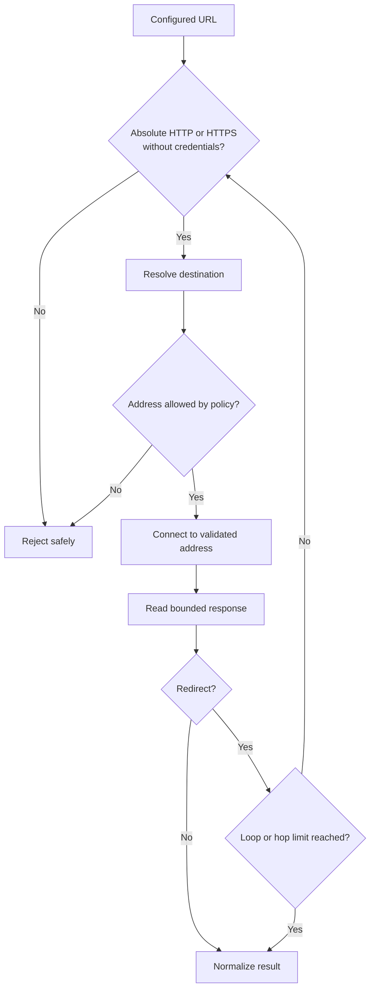

### Required controls

- Reject malformed or relative URLs, unsupported schemes, and embedded credentials.
- Block unauthorized IPv4 and IPv6 loopback, link-local, private, reserved, unspecified, multicast, and metadata destinations.
- Validate the actual connection address, not only a prior DNS lookup, to mitigate DNS rebinding.
- Resolve and validate every redirect hop independently.
- Disable uncontrolled automatic redirect handling.
- Explicitly control proxy behavior so it cannot bypass destination policy.
- Keep production TLS certificate validation enabled.
- Apply explicit timeouts, cancellation, response-size bounds, redirect limits, and loop detection.
- Bound global and per-host concurrency.
- Enforce crawler page, depth, duration, rate, and query-expansion limits.
- Store normalized safe diagnostics rather than response bodies or sensitive headers.

## 14. Notification Architecture

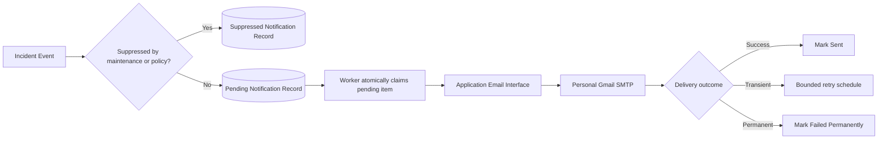

- Notification failure never rolls back a check or incident.
- Delivery is idempotent by event, recipient, and channel.
- Retries are bounded and apply only to plausibly transient failures.
- Messages contain allow-listed fields only and exclude secrets, full bodies, and unsafe exception details.
- Automated tests use a recording fake transport rather than Gmail SMTP.
- The dedicated Gmail account uses two-step verification and a revocable app password; the application never uses the account's normal password.
- TLS is required. Provider throttling or anti-abuse rejection is recorded and exposed through diagnostics.
- Personal Gmail has provider-controlled limits and no application-specific delivery SLA, so it is suitable only for an optional low-volume personal demo. The application-owned interface preserves a migration path to a managed email service.

## 15. Reporting and UI Design

- MVC renders primary pages on the server.
- Chart.js receives narrow, authorized JSON datasets where needed.
- Shared query objects or application queries drive both dashboard views and CSV exports.
- Current-health views read stored confirmed endpoint state.
- Trends use eligible logical-check samples.
- P50 and P95 use successful eligible HTTP samples; failures are reported separately.
- Long-window reports use daily aggregates after raw data expires.
- Metronic vendor assets remain pinned and unmodified; application-owned overrides provide shared tokens, responsive behavior, visible focus states, and reduced-motion support.
- Health and severity indicators use text or icons in addition to color.

## 16. Observability and Operations

### 16.1 Structured logs

Serilog events should carry relevant identifiers:

- `CorrelationId`
- `LogicalCheckId`
- `EndpointId`
- `IncidentId`
- `NotificationId`
- `JobId`

Log state transitions, retry classification, lease conflicts, schedule delays, SMTP outcomes, retention actions, and authorization failures. Do not log credentials, sensitive headers, complete response bodies, or unsafe user-facing exception details.

### 16.2 Operational signals

Track at minimum:

- Due, queued, running, overdue, completed, timed-out, and failed checks.
- Schedule coverage and queue latency.
- Check duration and target response metrics.
- Lease contention and expired leases.
- Incident opening and recovery counts.
- Notification pending age, retries, and permanent failures.
- Worker heartbeat and queue depth.
- Dashboard query latency.
- PostgreSQL connectivity and migration status.

### 16.3 Health endpoints

- **Liveness:** the process is running.
- **Readiness:** required configuration, PostgreSQL, and required runtime dependencies are usable.
- **Protected diagnostics:** worker heartbeat, queue state, overdue checks, and recent notification failures.

Detailed diagnostics must not be publicly exposed.

## 17. Failure Handling

| Failure | Response |
|---|---|
| Application restart | Persistent jobs, stable IDs, leases, and reconciliation resume safely. |
| Worker crash during a check | The lease expires; retry uses the same logical-check ID. |
| PostgreSQL unavailable | Fail readiness and retry only safe operations with bounded backoff. |
| Queueing fails after business commit | Reconciliation finds durable pending work and queues it. |
| Target timeout or connection failure | Persist a terminal normalized result and apply confirmation rules. |
| SMTP unavailable | Retain the notification, retry independently, and expose diagnostics. |
| Duplicate job delivery | Idempotency checks and constraints prevent duplicate effects. |
| Long crawler run | Dedicated queue and hard limits protect short availability checks. |
| Invalid incident transition | Reject server-side without changing state and audit when appropriate. |
| Retention interruption | Resume bounded batches without deleting held or ineligible records. |

## 18. Scaling Strategy

Scale only in response to measurements:

1. Add appropriate indexes, projections, pagination, retention, and daily aggregates.
2. Isolate short checks, crawls, notifications, and maintenance work in separate queues.
3. Tune worker count while retaining endpoint leases and bounded per-host concurrency.
4. Add worker processes from the same application artifact if required.
5. Separate web and worker runtime roles if resource contention is measured.
6. Partition or archive large history only when query plans and data growth justify it.
7. Extract services only if independent deployment or scaling becomes a demonstrated need.

No cache, message broker, or distributed service is part of the initial design.

## 19. Security Design

- Authenticate every interactive user before exposing operational data.
- Enforce role, policy, and assignment authorization server-side.
- Require anti-forgery protection on state-changing browser requests.
- Validate input at controllers and domain boundaries and output-encode untrusted content.
- Enforce safe outbound network policy at the actual connection and every redirect.
- Keep TLS validation enabled and prohibit production bypasses.
- Use least-privilege database, SMTP, diagnostics, and deployment identities.
- Store secrets in environment-specific local/CI secret configuration and never in source control.
- Keep sensitive values out of logs, audit payloads, emails, and persisted diagnostics.
- Restrict Hangfire administration and detailed health information.
- Record authorization failures and material changes without logging sensitive data.

## 20. Testing Architecture

### Unit tests

Use xUnit and FluentAssertions for deterministic rules:

- URL normalization and issue-key stability.
- Status and failure classification.
- Redirect loops and hop limits.
- Failure and recovery confirmation.
- Incident transitions and recurrence.
- SSL expiry boundaries.
- SEO, robots, and crawl-scope rules.
- Uptime eligibility and report boundaries.
- Notification idempotency and escalation timing.

### Integration tests

Use `WebApplicationFactory`, PostgreSQL Testcontainers, controlled HTTP targets, and a fake email transport to verify:

- Identity, authorization, assignments, and anti-forgery behavior.
- PostgreSQL constraints, transactions, optimistic concurrency, migrations, and leases.
- Hangfire persistence, retries, reconciliation, and restart idempotency.
- Redirects, delays, bounded responses, crawler limits, and cancellation.
- SSRF controls for IPv4, IPv6, redirects, actual connection addresses, and proxy policy.
- Dashboard/filter/CSV consistency.
- Retention and operational holds.

### Performance and resilience tests

- 500 endpoints and 100 bounded concurrent checks.
- Dashboard P95 against retention-sized representative data.
- Queue recovery after restart.
- SMTP and PostgreSQL dependency failures.
- Crawler isolation from high-priority availability work.
- Restartable retention batches.

## 21. Deployment, Migration, and Rollback

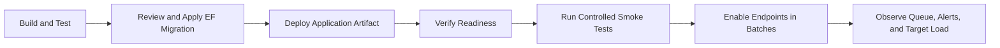

- Produce one versioned application artifact for web and worker roles.
- Apply reviewed EF Core migrations as a controlled release step.
- Prefer backward-compatible schema changes for staged deployments.
- Supply PostgreSQL and SMTP credentials through local/CI secret configuration.
- Back up PostgreSQL and test restoration before production reliance.
- Smoke-test login, authorization, database readiness, queue processing, a controlled check, and test email routing.
- Enable monitored endpoints in batches to control alert volume and target load.
- Roll back the application only when schema compatibility is preserved; otherwise use a reviewed forward-fix migration.

## 22. Delivery Sequence

1. Resolve domain, security, data, deployment, and ownership decisions; run feasibility spikes for Hangfire/PostgreSQL compatibility, safe actual-address connections, TLS inspection, proxy enforcement, deterministic network tests, leases, and uniqueness constraints.
2. Establish the application, PostgreSQL, migration, logging, health-check, UI-token, and automated-test foundation.
3. Implement Identity, roles, assignment authorization, audit baseline, and registry CRUD.
4. Implement logical checks, scheduling, safe HTTP monitoring, and result history.
5. Implement minimum non-recurring maintenance behavior before finalizing health evaluation, incidents, reminders, escalation, durable notifications, and fake email delivery.
6. Configure personal Gmail SMTP only after dedicated-account setup, app-password configuration, and controlled delivery testing.
7. Implement SSL monitoring, BR-P01 through BR-P05 performance behavior, dashboard projections, Chart.js trends, and CSV export.
8. Complete advanced recurring maintenance, SEO, and crawler functionality for the full-scope release.
9. Complete retention, aggregates, diagnostics, load testing, SSRF testing, security review, and test-environment deployment.

If time is constrained, HTTP, SSL, incidents, opening/recovery/reminder/escalation email, authorization, audit, minimum maintenance, BR-P01 through BR-P05, and the operational dashboard remain protected. The intern may defer AC-07, AC-08, BR-M05, and advanced retention through a recorded decision; they remain incomplete.

The intern is the sole owner, implementer, reviewer, and operator. Plan approximately 14–20 working weeks for full scope, then re-estimate after immediate spikes and each gate. Every gate links durable demonstration, CI/test/migration evidence, and known limitations rather than relying on unchecked narrative or screenshots. Production observation applies only if deployment is later pursued.

## 23. Open Deployment Decisions

The following do not block application design but must be resolved before production deployment:

- Hosting platform and whether web and worker roles initially share one process.
- PostgreSQL hosting, backups, restore testing, high availability, and connection limits.
- Approved Serilog sink, retention, search, and alerting integration.
- Dedicated Gmail sender ownership, account recovery, app-password rotation, effective sending limits, and the threshold for migration to a managed email service.
- Whether any private-network test targets are permitted and how exceptions are recorded and audited.
- Outbound proxy behavior in each environment.
- Queue priorities and worker concurrency per environment.
- Company timezone versus user timezone precedence.
- Operational ownership of alerts, backups, migrations, and incident runbooks.

## 24. Architecture Acceptance Criteria

The architecture is considered implemented when:

- Module boundaries are reflected in the solution structure and dependencies.
- Protected actions enforce server-side authorization and anti-forgery requirements.
- Scheduled and manual checks execute asynchronously with stable logical IDs.
- Database constraints, transactions, leases, and idempotency survive duplicate delivery and restart tests.
- SSRF controls validate the actual connection and every redirect hop.
- Notification failure cannot invalidate checks or incidents.
- PostgreSQL migrations and restoration procedures are documented and tested.
- Target load and dashboard performance requirements are demonstrated with representative tests.
- Health diagnostics, structured logs, and actionable operational signals are available without leaking sensitive data.

---

Material changes to architecture boundaries, persistence, scheduling, security controls, incident behavior, notification semantics, or deployment topology require review against the project specification.
