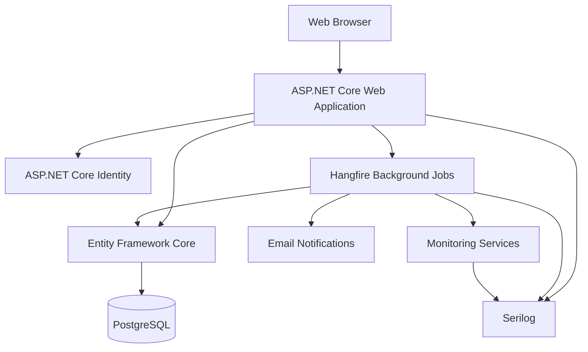
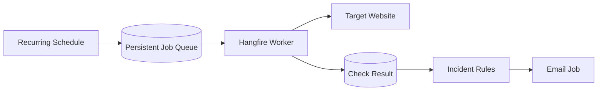
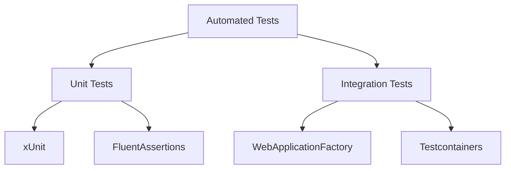

# Website Health Monitoring Technology Stack

## 1. Purpose

This document defines the technologies selected for the Website Health Monitoring project.

The project should begin as a **modular monolith**, not as a microservices system. This keeps development, testing, deployment, and debugging manageable while still allowing clear internal boundaries between monitoring, incidents, notifications, reporting, and administration.



## 2. Selected Technologies

| Area | Technology | Purpose |
|---|---|---|
| Platform | .NET 10 | Application runtime and development platform. |
| Language | C# | Main application language. |
| Web framework | ASP.NET Core 10 MVC | Secured dashboard, forms, reports, and HTTP endpoints. |
| Authentication | ASP.NET Core Identity | User accounts, passwords, lockout, roles, and security stamps. |
| Authorization | ASP.NET Core role and policy authorization | Server-side protection of every restricted action. |
| Data access | Entity Framework Core | Database queries, persistence, constraints, and migrations. |
| Database | PostgreSQL with the Npgsql EF Core provider | Configuration, monitoring history, incidents, notifications, and audit data. |
| Background jobs | Hangfire with PostgreSQL storage | Scheduling, persistent jobs, retries, locking, and job diagnostics. |
| HTTP communication | `IHttpClientFactory` | Managed HTTP clients, timeouts, handlers, and connection reuse. |
| Email transport | Personal Gmail SMTP (`smtp.gmail.com`) behind an application-owned interface | Sends MVP incident, escalation, recovery, SSL, and summary emails without coupling business logic to Gmail. |
| Logging | Serilog | Structured application and worker logs. |
| UI | Purity UI Dashboard Figma baseline with application-owned implementation assets | Responsive ASP.NET Core MVC dashboard with accessible application-specific views. |
| Charts | Chart.js | Uptime, response-time, incident, and health visualizations. |
| API style | REST where needed | Manual checks, chart data, incident actions, diagnostics, and integrations. |
| Object mapping | Manual mapping | Explicit entity, DTO, and view-model projections. |
| Unit tests | xUnit | Automated business-rule tests. |
| Assertions | FluentAssertions | Clear and readable test assertions. |
| Integration tests | `WebApplicationFactory` | Tests the ASP.NET Core application through a realistic test host. |
| Database tests | Testcontainers for PostgreSQL | Tests actual PostgreSQL constraints, transactions, and concurrency. |

## 3. Core Application Stack

### .NET 10 and C#

.NET 10 and C# provide the foundation for the web application, background jobs, monitoring services, and tests.

### ASP.NET Core MVC

The project will use ASP.NET Core MVC consistently for the main user interface.

It will provide:

- Login and account management.
- Client, website, environment, and endpoint management.
- Dashboard and reporting screens.
- Incident management.
- CSV exports.
- Health and diagnostic endpoints.
- REST endpoints where they have a concrete purpose.

### ASP.NET Core Identity

Identity will manage:

- User accounts.
- Password hashing and password policy.
- Sign-in and sign-out.
- Account lockout.
- Account disabling and security-stamp validation.
- Role membership.

ASP.NET Core policies and roles will enforce administrator, operations, developer/support, and viewer permissions on the server.

## 4. Data Storage

### Entity Framework Core

Entity Framework Core will be used for:

- Entity mapping.
- Database queries and updates.
- Versioned migrations.
- Unique indexes and relationship constraints.
- Optimistic concurrency.
- Transactions.

Queries for dashboards and reports should project only the required fields instead of loading complete entity graphs.

### PostgreSQL

PostgreSQL will store:

- Users and roles.
- Clients, websites, environments, and endpoints.
- Check results and findings.
- Incidents and incident timelines.
- Maintenance windows.
- Notification events and delivery attempts.
- Crawl runs and link results.
- Audit events.
- Hangfire job state.

This is the intern-selected technical deviation from the SQL Server recommendation in the project specification. It changes the database implementation only; the specification's functional, integrity, retention, concurrency, and reporting requirements remain authoritative.

All persisted timestamps should use UTC-compatible `DateTimeOffset` values. Display conversion happens in the configured company or user timezone.

## 5. Background Processing

### Hangfire

Hangfire is selected for scheduled and asynchronous work. PostgreSQL will provide persistent Hangfire storage through a compatible provider.



Hangfire will support:

- Scheduled HTTP checks.
- Daily SSL checks.
- Authorized on-demand checks.
- Notification delivery and retries.
- Escalation and reminder processing.
- Retention and aggregation jobs.
- Persistent work across application restarts.
- Job visibility and operational diagnostics.

The application must still implement logical-check identifiers, incident uniqueness, notification idempotency, and endpoint/monitor locking. Hangfire retries alone do not guarantee business-level deduplication.

Do not combine Hangfire with Quartz or Coravel. The project should have one scheduling system.

## 6. HTTP and Monitoring

### IHttpClientFactory

Monitoring clients will be created through `IHttpClientFactory`.

Each outbound operation must have:

- An explicit timeout.
- Cancellation support.
- A bounded response size.
- Safe redirect handling.
- A clear user-agent.
- Structured correlation identifiers.

Automatic redirect handling may need to be disabled for monitoring requests so the application can validate and record every redirect hop itself.

### Network safety

The monitoring engine must validate configured destinations before requesting them and repeat validation after every redirect.

It must block unauthorized destinations such as:

- Loopback addresses.
- Link-local addresses.
- Cloud metadata endpoints.
- Unauthorized private networks.
- Unsupported URL schemes.
- URLs containing embedded credentials.

TLS certificate validation must remain enabled in production.

Pre-request URL and DNS validation alone is not sufficient because DNS may change between validation and connection. The monitoring transport must validate the IP address used for the actual connection and must protect against DNS rebinding. This policy applies independently to the initial destination and every redirect hop.

The network policy must cover both IPv4 and IPv6 loopback, link-local, private, reserved, and cloud-metadata destinations. Proxy behavior must be explicitly controlled so that it cannot bypass destination enforcement. These controls should be implemented in a dedicated safe monitoring transport or handler and covered by integration tests.

## 7. Email Delivery

Email will initially be sent from a dedicated free personal Gmail account through `smtp.gmail.com`, behind an application-owned email transport interface. Incident and notification business logic must not depend directly on Gmail-specific transport details.

The Gmail account must enable two-step verification and use a revocable app password for SMTP; the normal account password must not be used by the application. SMTP host settings, sender address, and app password must be supplied through environment-specific secret configuration and must never be committed to source control or written to logs. TLS must be required.

Personal Gmail has provider-controlled limits, anti-abuse controls, and no application-specific delivery SLA. The system must expose delivery failures, use bounded retries, and avoid relying on email as the only incident record. If the personal project is later used for higher-volume or business-critical monitoring, replace this adapter with an appropriate managed email service. Automated tests use a fake transport and never Gmail.

## 8. Logging and Diagnostics

### Serilog

Serilog will provide structured logging for the web application and background workers.

Important log properties include:

- `CorrelationId`
- `LogicalCheckId`
- `EndpointId`
- `IncidentId`
- `NotificationId`
- `JobId`

Use console logging locally and in CI. A rolling file or managed structured sink is optional if a deployment later needs it.

Logs must not include:

- Passwords or API credentials.
- SMTP credentials.
- Sensitive request or response headers.
- Complete response bodies.
- Unsafe exception details sent to users.

Do not add NLog alongside Serilog.

### ASP.NET Core health checks

ASP.NET Core health checks will expose liveness and readiness information for:

- The web application.
- PostgreSQL.
- Hangfire and worker heartbeat.
- Queue state.
- Email delivery dependencies where practical.

## 9. User Interface

### Purity UI Dashboard Figma and semantic HTML

Use the provided [Purity UI Dashboard Figma file](https://www.figma.com/design/cjTsi6qaX3bH0l3a4vF7Jm/Purity-UI-Dashboard---Chakra-UI-Dashboard--Community-?node-id=0-1&p=f&m=dev) as the visual and application-shell baseline. Treat Figma as a design reference and implement the required views with application-owned semantic HTML, CSS, and accessible components.

ASP.NET Core MVC and Razor remain the rendering model. Preserve semantic HTML, Tag Helpers, server validation, anti-forgery tokens, and server-side authorization. Keep application overrides separate from unmodified vendor assets and include only the plugins used by implemented pages.

The interface must support:

- Desktop and mobile layouts.
- Keyboard navigation.
- Clear form labels.
- Accessible contrast.
- Status indicators that do not rely only on color.
- Consistent typography, spacing, colors, breakpoints, and interaction states derived from the Purity UI Dashboard Figma design and application accessibility requirements.
- Visible focus states and reduced-motion support.

### Chart.js

Chart.js will visualize:

- Uptime trends.
- Response-time trends.
- Healthy, warning, and critical totals.
- Incident counts and age.
- SSL expiry bands.

## 10. APIs and Communication

Use regular MVC actions for the main application. Add REST endpoints only when useful, such as for:

- Queueing a manual check.
- Loading chart data.
- Performing incident actions.
- Reading current endpoint status.
- Exposing health diagnostics.
- Supporting explicitly selected future integrations.

The MVP does not need:

- GraphQL or HotChocolate.
- OData.
- gRPC.
- Gridify.
- A separate API application.

## 11. Object Mapping

Use manual mapping between entities, DTOs, and view models.

Manual mapping keeps database projections explicit and avoids unnecessary framework behavior.

```csharp
var model = new EndpointDetailsViewModel
{
    Id = endpoint.Id,
    Url = endpoint.Url,
    IsEnabled = endpoint.IsEnabled,
    CurrentStatus = endpoint.CurrentStatus
};
```

## 12. Testing Stack



### Unit tests

Use xUnit and FluentAssertions for deterministic business rules, including:

- URL validation and normalization.
- HTTP status classification.
- Redirect loop and hop-limit detection.
- Failure and recovery confirmation.
- Incident deduplication and state transitions.
- SSL expiry boundaries.
- SEO and robots rules.
- Uptime inclusion and reporting boundaries.
- Notification idempotency and escalation timing.

### Integration tests

Use `WebApplicationFactory` to test:

- Authentication and authorization.
- MVC or REST endpoints.
- Middleware and anti-forgery behavior.
- Dependency injection and application configuration.

Use Testcontainers with PostgreSQL to test real database behavior, including:

- Unique constraints.
- Transactions.
- Optimistic concurrency.
- Migrations.
- Restart and deduplication behavior.

Use a controlled test HTTP server for statuses, redirects, delays, HTML, and failures. Use a fake email transport that records deliveries without sending real email.

## 13. Technologies Not Selected for the MVP

| Technology | Reason not selected |
|---|---|
| NLog | Serilog already provides the required logging. |
| Native Background Service | Hangfire provides persistent scheduling, retries, and diagnostics with less custom infrastructure. |
| Quartz or Coravel | They would duplicate Hangfire scheduling responsibilities. |
| AutoMapper | Manual mapping is sufficient and more explicit for the initial scope. |
| GraphQL or HotChocolate | The dashboard does not require a flexible graph-query API. |
| OData | Broad query exposure adds complexity and security concerns without a requirement. |
| gRPC | The modular monolith has no separate services requiring RPC. |
| RabbitMQ, Kafka, ActiveMQ, or Azure Service Bus | PostgreSQL-backed Hangfire queues are sufficient for the MVP. |
| MassTransit or NServiceBus | No external message broker or distributed workflow is currently required. |
| SpecFlow or LightBDD | Business rules can be tested clearly with standard xUnit tests. |
| NUnit or MSTest | xUnit is the selected unit-testing framework. |
| Shouldly | FluentAssertions is already selected by the project specification. |
| .NET Aspire | The initial application is not a distributed system. |

These technologies may be reconsidered only when a concrete requirement justifies them.

## 14. Dependency Principles

When adding a package or platform component:

1. It must solve a real project requirement.
2. Existing .NET or selected-stack functionality should be considered first.
3. Competing libraries for the same responsibility should not be installed together.
4. The package must be maintained and compatible with .NET 10.
5. Security and license implications must be reviewed.
6. The project must not depend on a package merely to avoid a small amount of clear code.

## 15. Final Stack Summary

The selected stack is:

- .NET 10 and C#.
- ASP.NET Core MVC.
- ASP.NET Core Identity and policy-based authorization.
- Entity Framework Core with the Npgsql provider and PostgreSQL.
- Hangfire with PostgreSQL storage.
- `IHttpClientFactory` and custom safe redirect/network validation.
- Personal Gmail SMTP (`smtp.gmail.com`) behind an application-owned email transport interface for the initial MVP.
- Serilog and ASP.NET Core health checks.
- Purity UI Dashboard Figma baseline implemented as the MVC shell, with semantic HTML, application-owned accessibility styles, and Chart.js.
- REST endpoints only where needed.
- Manual object mapping.
- xUnit and FluentAssertions.
- `WebApplicationFactory` and Testcontainers for integration tests.

This stack is intended to meet the project requirements while keeping the MVP understandable, testable, secure, and practical to deliver. The intern records the Phase 0 decision; compatibility spikes remain required.

---

This technology decision supports the intern-owned baseline in [`Website_Health_Monitoring_Project_Specification.md`](../Website_Health_Monitoring_Project_Specification.md). Material changes require a recorded self-review before implementation.
