# PostgreSQL Foundation Design

**Owner:** Intern  
**Status:** Revised Phase 0 design; owner re-approval and later migration tests pending
**Previous approval:** The 2026-08-13 approval is superseded by this revision

This document defines the correctness-critical data foundation. Later feature schemas receive only short notes until their owning phase.

## 1. Conventions

- Application-generated UUID primary7 keys.
- PostgreSQL `timestamptz` for UTC instants; IANA timezone identifiers stored separately.
- Reporting windows use `[start, end)` boundaries.
- Statuses use bounded text with `CHECK` constraints unless measurements justify another representation.
- Mutable configuration uses audit timestamps/actors and `version bigint` optimistic concurrency.
- Configuration with history is soft-deleted; historical rows are not cascade-deleted.
- Bounded, allow-listed diagnostics only; no secrets, sensitive headers, or complete bodies.
- Tables and columns are `NOT NULL` unless this document explicitly describes them as optional.
- Foreign keys use `ON DELETE RESTRICT` by default. Hard deletion is limited to unreferenced setup data; historical identity, configuration, check, incident, notification, and audit rows never cascade-delete.
- Correctness-critical configuration uses typed columns. Bounded `jsonb` stores only versioned, allow-listed supplemental settings or immutable snapshots.

## 2. Core model

The ERD below covers the complete Phase 0 core schema, including the minimum
one-off maintenance foundation. Detailed recurring maintenance, SSL,
SEO/crawler, retention, and aggregate schemas remain deferred to their owning
phases as described in [Section 7](#7-later-phase-design-notes).

```mermaid
erDiagram
    APP_USER {
        uuid id PK
        text identity_subject UK
        text display_name
        boolean is_disabled
        text security_stamp
        timestamptz created_at
        timestamptz updated_at
    }

    APP_ROLE {
        uuid id PK
        text name
        text normalized_name UK
        bigint version
    }

    APP_USER_ROLE {
        uuid app_user_id PK, FK
        uuid app_role_id PK, FK
    }

    ACCESS_GRANT {
        uuid id PK
        uuid app_user_id FK
        uuid client_id FK
        uuid website_id FK
        uuid environment_id FK
        uuid endpoint_id FK
        text access_level
        uuid granted_by_user_id FK
        timestamptz effective_from
        timestamptz effective_until
        timestamptz revoked_at
        bigint version
    }

    TEAM {
        uuid id PK
        text name
        text normalized_name UK
        timestamptz deleted_at
        bigint version
    }

    TEAM_MEMBER {
        uuid id PK
        uuid team_id FK
        uuid app_user_id FK
        timestamptz effective_from
        timestamptz effective_until
    }

    OWNER_SUBJECT {
        uuid id PK
        uuid app_user_id FK
        uuid team_id FK
        timestamptz created_at
    }

    CONTACT_POINT {
        uuid id PK
        uuid owner_subject_id FK
        text channel
        text display_recipient
        text normalized_recipient
        integer normalization_version
        boolean is_enabled
        bigint version
    }

    CLIENT {
        uuid id PK
        uuid owner_subject_id FK
        text name
        text normalized_name
        text bounded_notes
        boolean is_active
        timestamptz deleted_at
        bigint version
    }

    WEBSITE {
        uuid id PK
        uuid client_id FK
        uuid owner_subject_id FK
        text name
        text normalized_name
        text technology_cms
        boolean is_enabled
        timestamptz deleted_at
        bigint version
    }

    ENVIRONMENT {
        uuid id PK
        uuid website_id FK
        text name
        text environment_type
        boolean is_production
        text base_url
        uuid policy_profile_id FK
        timestamptz deleted_at
        bigint version
    }

    ENDPOINT {
        uuid id PK
        uuid environment_id FK
        uuid owner_subject_id FK
        text display_url
        text normalized_url
        bytea normalized_url_hash
        integer normalization_version
        boolean is_enabled
        text http_exception_evidence
        timestamptz deleted_at
        bigint version
    }

    POLICY_PROFILE {
        uuid id PK
        text name
        text monitor_type
        jsonb bounded_settings
        timestamptz deleted_at
        bigint version
    }

    ENDPOINT_MONITOR {
        uuid id PK
        uuid endpoint_id FK
        uuid policy_profile_id FK
        text monitor_type
        jsonb bounded_overrides
        timestamptz schedule_anchor
        timestamptz next_due_at
        text configuration_fingerprint
        integer interval_seconds
        integer timeout_seconds
        integer failure_confirmation_count
        integer recovery_confirmation_count
        integer warning_threshold_ms
        integer critical_threshold_ms
        boolean is_enabled
        timestamptz deleted_at
        bigint version
    }

    TAG {
        uuid id PK
        text name
        text normalized_name UK
    }

    WEBSITE_TAG {
        uuid website_id PK, FK
        uuid tag_id PK, FK
    }

    TARGET_AUTHORIZATION {
        uuid id PK
        uuid endpoint_id FK
        uuid granted_by_user_id FK
        text evidence_reference
        text allowed_host
        integer allowed_port
        timestamptz effective_from
        timestamptz expires_at
        timestamptz revoked_at
        uuid revoked_by_user_id FK
        text revocation_reason
    }

    LOGICAL_CHECK {
        uuid id PK
        uuid endpoint_monitor_id FK
        uuid initiated_by_user_id FK
        text source
        timestamptz scheduled_for
        timestamptz requested_at
        text state
        text cadence_key
        text policy_fingerprint
    }

    CHECK_CONFIGURATION_SNAPSHOT {
        uuid logical_check_id PK, FK
        integer schema_version
        jsonb bounded_effective_values
        jsonb bounded_value_sources
        text configuration_fingerprint
        timestamptz captured_at
    }

    EXECUTION_ATTEMPT {
        uuid id PK
        uuid logical_check_id FK
        integer attempt_number
        text job_reference
        text worker_reference
        timestamptz started_at
        timestamptz finished_at
        text infrastructure_outcome
    }

    CHECK_RESULT {
        uuid logical_check_id PK, FK
        text outcome
        text failure_category
        integer http_status
        integer dns_duration_ms
        integer connect_duration_ms
        integer tls_duration_ms
        integer ttfb_duration_ms
        integer total_duration_ms
        bigint transferred_length
        bigint decoded_length
        text length_source
        text monitor_source
        timestamptz measured_at
        uuid maintenance_occurrence_id FK
        boolean is_maintenance
        boolean counts_for_uptime
        text safe_diagnostic
        timestamptz completed_at
    }

    REDIRECT_HOP {
        uuid id PK
        uuid logical_check_id FK
        integer hop_number
        text normalized_from_url
        text normalized_to_url
        integer http_status
        boolean is_loop
    }

    FINDING {
        uuid id PK
        uuid logical_check_id FK
        text rule_key
        text severity
        text observed_value
        text expected_value
        text issue_key
    }

    ISSUE_STATE {
        uuid id PK
        uuid endpoint_monitor_id FK
        text issue_key
        integer consecutive_failures
        integer consecutive_recoveries
        timestamptz updated_at
        bigint version
    }

    ENDPOINT_HEALTH {
        uuid endpoint_monitor_id PK, FK
        uuid evidence_logical_check_id FK
        text confirmed_status
        timestamptz confirmed_at
        bigint version
    }

    EXECUTION_LEASE {
        uuid endpoint_monitor_id PK, FK
        uuid logical_check_id FK
        text owner_token
        bigint fencing_generation
        timestamptz acquired_at
        timestamptz expires_at
    }

    DURABLE_WORK {
        uuid id PK
        uuid logical_check_id FK
        text work_kind
        text dedupe_key
        text queue_name
        text state
        timestamptz available_at
        text lease_owner
        timestamptz lease_expires_at
        integer attempt_count
        text safe_failure
    }

    INCIDENT {
        uuid id PK
        uuid endpoint_monitor_id FK
        uuid owner_subject_id FK
        uuid previous_incident_id FK
        text issue_key
        text severity
        text status
        integer recurrence_count
        timestamptz opened_at
        timestamptz acknowledged_at
        timestamptz resolved_at
        timestamptz closed_at
        text resolution_category
        text resolution_note
        bigint version
    }

    INCIDENT_EVENT {
        uuid id PK
        uuid incident_id FK
        uuid actor_user_id FK
        bigint sequence_number
        text event_type
        text from_status
        text to_status
        uuid from_owner_subject_id FK
        uuid to_owner_subject_id FK
        text bounded_note
        timestamptz occurred_at
    }

    INCIDENT_EVIDENCE {
        uuid id PK
        uuid incident_id FK
        uuid logical_check_id
        text evidence_type
        text evidence_role
        jsonb bounded_snapshot
        timestamptz captured_at
    }

    NOTIFICATION_EVENT {
        uuid id PK
        uuid incident_event_id FK
        uuid incident_id FK
        text source_kind
        text event_type
        text occurrence_key
        text template_version
        boolean is_suppressed
        text suppression_reason
        timestamptz occurred_at
    }

    NOTIFICATION_DELIVERY {
        uuid id PK
        uuid notification_event_id FK
        text channel
        text normalized_recipient
        integer recipient_normalization_version
        text state
        integer attempt_count
        timestamptz next_attempt_at
        text lease_owner
        timestamptz lease_expires_at
        timestamptz sent_at
    }

    NOTIFICATION_ATTEMPT {
        uuid id PK
        uuid notification_delivery_id FK
        integer attempt_number
        text transport_outcome
        text safe_response
        timestamptz attempted_at
    }

    AUDIT_EVENT {
        uuid id PK
        uuid actor_user_id FK
        text action
        text entity_type
        uuid entity_id
        text correlation_id
        jsonb allowed_before_values
        jsonb allowed_after_values
        timestamptz occurred_at
    }

    MAINTENANCE_WINDOW {
        uuid id PK
        uuid created_by_user_id FK
        text reason
        text timezone_id
        text suppression_policy
        boolean pause_escalation
        boolean continue_failure_counter
        timestamptz deleted_at
        bigint version
    }

    MAINTENANCE_TARGET {
        uuid id PK
        uuid maintenance_window_id FK
        uuid client_id FK
        uuid website_id FK
        uuid environment_id FK
        uuid endpoint_id FK
        uuid endpoint_monitor_id FK
    }

    MAINTENANCE_OCCURRENCE {
        uuid id PK
        uuid maintenance_window_id FK
        timestamptz starts_at
        timestamptz ends_at
        timestamptz created_at
    }

    APP_USER ||--o{ APP_USER_ROLE : has
    APP_ROLE ||--o{ APP_USER_ROLE : assigns
    APP_USER ||--o{ ACCESS_GRANT : receives
    APP_USER ||--o{ ACCESS_GRANT : grants
    APP_USER ||--o{ TEAM_MEMBER : joins
    TEAM ||--o{ TEAM_MEMBER : contains
    APP_USER o|--o{ OWNER_SUBJECT : identifies
    TEAM o|--o{ OWNER_SUBJECT : identifies
    OWNER_SUBJECT ||--o{ CONTACT_POINT : has
    OWNER_SUBJECT o|--o{ CLIENT : supports
    OWNER_SUBJECT o|--o{ WEBSITE : supports
    OWNER_SUBJECT o|--o{ ENDPOINT : overrides_assignment
    OWNER_SUBJECT o|--o{ INCIDENT : assigned_to

    CLIENT ||--o{ WEBSITE : owns
    WEBSITE ||--o{ ENVIRONMENT : has
    WEBSITE ||--o{ WEBSITE_TAG : classified_by
    TAG ||--o{ WEBSITE_TAG : labels
    POLICY_PROFILE ||--o{ ENVIRONMENT : defaults
    ENVIRONMENT ||--o{ ENDPOINT : contains
    ENDPOINT ||--o{ ENDPOINT_MONITOR : enables
    POLICY_PROFILE ||--o{ ENDPOINT_MONITOR : configures
    ENDPOINT ||--o{ TARGET_AUTHORIZATION : authorizes
    APP_USER ||--o{ TARGET_AUTHORIZATION : grants
    APP_USER o|--o{ TARGET_AUTHORIZATION : revokes
    CLIENT o|--o{ ACCESS_GRANT : scopes
    WEBSITE o|--o{ ACCESS_GRANT : scopes
    ENVIRONMENT o|--o{ ACCESS_GRANT : scopes
    ENDPOINT o|--o{ ACCESS_GRANT : scopes

    ENDPOINT_MONITOR ||--o{ LOGICAL_CHECK : schedules
    APP_USER o|--o{ LOGICAL_CHECK : initiates
    LOGICAL_CHECK ||--o{ EXECUTION_ATTEMPT : attempts
    LOGICAL_CHECK ||--o| CHECK_RESULT : produces
    LOGICAL_CHECK ||--|| CHECK_CONFIGURATION_SNAPSHOT : snapshots
    LOGICAL_CHECK ||--o{ REDIRECT_HOP : follows
    LOGICAL_CHECK ||--o{ FINDING : detects
    ENDPOINT_MONITOR ||--o{ ISSUE_STATE : tracks
    ENDPOINT_MONITOR ||--o| ENDPOINT_HEALTH : summarizes
    LOGICAL_CHECK ||--o{ ENDPOINT_HEALTH : evidences
    ENDPOINT_MONITOR ||--o| EXECUTION_LEASE : serializes
    LOGICAL_CHECK o|--o| EXECUTION_LEASE : owns
    LOGICAL_CHECK o|--o{ DURABLE_WORK : dispatches

    ENDPOINT_MONITOR ||--o{ INCIDENT : raises
    INCIDENT ||--o{ INCIDENT_EVENT : records
    INCIDENT o|--o{ INCIDENT : follows
    APP_USER o|--o{ INCIDENT_EVENT : acts
    INCIDENT ||--o{ INCIDENT_EVIDENCE : preserves
    INCIDENT_EVENT o|--o{ NOTIFICATION_EVENT : triggers
    INCIDENT ||--o{ NOTIFICATION_EVENT : concerns
    NOTIFICATION_EVENT ||--o{ NOTIFICATION_DELIVERY : delivers
    NOTIFICATION_DELIVERY ||--o{ NOTIFICATION_ATTEMPT : attempts
    APP_USER o|--o{ AUDIT_EVENT : performs
    APP_USER ||--o{ MAINTENANCE_WINDOW : creates
    MAINTENANCE_WINDOW ||--|{ MAINTENANCE_TARGET : scopes
    MAINTENANCE_WINDOW ||--|{ MAINTENANCE_OCCURRENCE : expands
    CLIENT o|--o{ MAINTENANCE_TARGET : targets
    WEBSITE o|--o{ MAINTENANCE_TARGET : targets
    ENVIRONMENT o|--o{ MAINTENANCE_TARGET : targets
    ENDPOINT o|--o{ MAINTENANCE_TARGET : targets
    ENDPOINT_MONITOR o|--o{ MAINTENANCE_TARGET : targets
    MAINTENANCE_OCCURRENCE o|--o{ CHECK_RESULT : marks
```



### Identity and assignment

| Entity | Important data |
|---|---|
| `app_user` | Identity fields, display name, disabled state, security stamp |
| `app_role`, `app_user_role` | Application persona and role assignment |
| `access_grant` | Explicit read or permitted-action scope for a user at exactly one registry level |
| `team`, `team_member` | Named group and effective-dated membership |
| `owner_subject` | Exactly one user or team reference |
| `contact_point` | Channel, display recipient, normalized recipient, enabled state |

These support the product's role/assignment behavior. They do not imply a multi-person project team. ASP.NET Core Identity owns password hashes, lockout, authentication tokens, and session-security behavior; migrations may map `app_user`, `app_role`, and `app_user_role` directly to supported Identity tables rather than duplicating them. `app_user.id` is the single application/Identity user key. `access_grant` supplies explicit scoped access such as Viewer permission; global Administrator and Operations behavior comes from roles. Disabled users and expired/revoked grants or team memberships confer no current access while their historical foreign keys remain valid.

### Registry

| Entity | Important data |
|---|---|
| `client` | Name/normalized name, active/deletion state, support assignment, bounded notes, version |
| `website` | Client, name/normalized name, technology/CMS, assignment, enabled/deletion state, version |
| `environment` | Website, name/type, production flag, base URL, policy profile, version |
| `endpoint` | Environment, display/normalized URL and hash, assignment override, enabled state, HTTPS exception evidence, version |
| `endpoint_monitor` | Endpoint, monitor type, typed interval/timeout/confirmation/threshold values, policy/overrides, schedule anchor, next due, configuration fingerprint |
| `tag`, `website_tag` | Normalized tag and unique website/tag relation |
| `target_authorization` | Personal ownership/permission evidence, effective/expiry/revocation state, endpoint and normalized redirect host/port scope |

An endpoint represents one URL in one environment. Child monitors represent HTTP, SSL, SEO, and other monitor types.

### Scheduling and evidence

| Entity | Important data |
|---|---|
| `logical_check` | Stable ID, endpoint monitor, Scheduled/Manual/Urgent source, schedule/request time, initiator, state, cadence key, policy fingerprint |
| `check_configuration_snapshot` | Immutable effective values, inheritance source per value, schema version, and canonical fingerprint |
| `execution_attempt` | Logical check, attempt number, job/worker reference, times, infrastructure outcome |
| `check_result` | One per logical check; outcome, failure category, status, phase/total timings, labeled transferred/decoded lengths, measurement provenance, maintenance/uptime flags, safe diagnostic |
| `redirect_hop` | Ordered normalized from/to URLs, status, loop flag |
| `finding` | Rule, severity, bounded observed/expected values, stable issue key |
| `issue_state` | Endpoint monitor/issue key and failure/recovery counters |
| `endpoint_health` | Confirmed current status and evidence reference |
| `execution_lease` | Endpoint monitor key, owner token, fencing generation, acquisition/expiry, logical check |
| `durable_work` | Kind, dedupe key, queue/state, availability, lease, attempts, safe failure |

`check_result.logical_check_id` is both primary and foreign key, enforcing at most one terminal sample per logical check.

Timing and length fields are nullable only when the transport could not observe them. Present measurements are nonnegative. `length_source` identifies values such as measured transferred bytes, decoded bytes, or trusted bounded header evidence. `monitor_source` identifies the configured local/demo execution source; the immutable configuration snapshot preserves the transport and policy values needed to judge comparability. The snapshot must exist before a check is queued and is never reconstructed from mutable current profiles.

### Maintenance

| Entity | Important data |
|---|---|
| `maintenance_window` | Creator, bounded reason, IANA timezone, suppression/escalation/counter policy, deletion state and version |
| `maintenance_target` | Exactly one client, website, environment, endpoint, or endpoint-monitor scope |
| `maintenance_occurrence` | Concrete immutable `[starts_at, ends_at)` UTC interval |

Checks continue during an occurrence. A result references the occurrence that governed its maintenance classification, allowing suppression and post-maintenance counter behavior to be reconstructed. Phase 4 implements one-off occurrences and BR-M01–M04. Phase 6 adds recurrence expansion and daylight-saving behavior for BR-M05 without changing the occurrence contract.

### Incidents, audit, and notifications

| Entity | Important data |
|---|---|
| `incident` | Endpoint monitor, issue key, severity/status, snapshotted assignment, previous recurrence, lifecycle times, structured resolution, version |
| `incident_event` | Ordered append-only actor/system timeline with state/assignment changes and bounded note |
| `incident_evidence` | Typed opening/failure/recovery evidence, immutable snapshot, and copied logical-check identifier; survives raw-result deletion |
| `notification_event` | Incident/source kind, type, occurrence key, template version and suppression |
| `notification_delivery` | Event, channel, immutable normalized recipient, state, retry/lease/sent fields |
| `notification_attempt` | Delivery attempt and normalized transport outcome |
| `audit_event` | Actor/system, time, action, entity, correlation, allow-listed before/after values |

Finalization verifies the lease token and fencing generation, then commits the logical-check terminal state, result, findings, issue counters, health, incident, timeline/evidence, and pending/suppressed notification records in one PostgreSQL transaction. SMTP delivery happens afterward. A duplicate delivery that finds the logical check already finalized performs no mutations.

## 3. Normalization

Normalization is versioned. Existing identities are never silently recomputed.

### Names and tags

Preserve a trimmed display value. Normalize to Unicode NFC, collapse whitespace, apply invariant case folding, and store a normalized value. Active client names are globally unique; website names are unique inside a client; tags are deduplicated.

### URLs

- Require absolute HTTP/HTTPS and reject user information.
- Lowercase scheme and IDNA ASCII host; remove final host dot and default port.
- Empty path becomes `/`; resolve dot segments and remove fragments.
- Preserve path case and trailing-slash distinction.
- Decode percent-encoded unreserved characters; normalize remaining escape casing.
- Preserve significant query values/order for endpoint identity.
- Store bounded normalized text, SHA-256 hash, and normalization version.
- Apply the same process to every redirect.

Crawl normalization additionally removes approved tracking parameters and applies the crawl profile's query policy.

### Recipients

Trim and parse the address, normalize the domain to IDNA ASCII, preserve the display address, and use a configured case-insensitive local-part policy only for the project's known company/demo mailboxes. Otherwise preserve local-part case. Store the recipient-normalization version so a policy change does not silently rewrite delivery identity.

### Issue keys

Use `v1|monitor-type|rule-key|normalized-discriminator`. Exclude timestamps, severity, diagnostics, and mutable labels. Endpoint/monitor remain separate uniqueness columns.

## 4. Core statuses

- Confirmed health: `Unknown`, `Healthy`, `Warning`, `Critical`, `Disabled`. `Maintenance` is a computed/display overlay from an active occurrence and does not replace `endpoint_health.confirmed_status`.
- Logical check: `Pending → Queued → Running → Completed`; retry returns the same logical check to queued work. Terminal timeout/cancel/disabled outcomes still produce one result.
- Incident: `Open → Acknowledged → InProgress → MonitoringRecovery → Resolved → Closed`, with valid alternate transitions defined by BR-I rules. Closed reopening and forced closure require an administrator reason.
- Notification: `Pending → Processing → Sent`, with bounded `RetryScheduled`, `FailedPermanently`, and `Suppressed` paths.

## 5. Required PostgreSQL constraints

```text
app_role(normalized_name)
app_user_role(app_user_id, app_role_id)
owner_subject(app_user_id) WHERE app_user_id IS NOT NULL
owner_subject(team_id) WHERE team_id IS NOT NULL
team_member: no overlapping [effective_from, effective_until) range per (team_id, app_user_id)
access_grant: exactly one client_id/website_id/environment_id/endpoint_id
client(normalized_name) WHERE deleted_at IS NULL
website(client_id, normalized_name) WHERE deleted_at IS NULL
environment(website_id, normalized_name) WHERE deleted_at IS NULL
endpoint(environment_id, normalized_url_hash, normalization_version) WHERE deleted_at IS NULL
endpoint_monitor(endpoint_id, monitor_type) WHERE deleted_at IS NULL
logical_check(endpoint_monitor_id, cadence_key)
  WHERE source = 'Scheduled'
check_result(logical_check_id)
check_configuration_snapshot(logical_check_id)
execution_attempt(logical_check_id, attempt_number)
redirect_hop(logical_check_id, hop_number)
finding(logical_check_id, issue_key, rule_key)
issue_state(endpoint_monitor_id, issue_key)
incident(endpoint_monitor_id, issue_key)
  WHERE status IN ('Open','Acknowledged','InProgress','MonitoringRecovery')
incident_event(incident_id, sequence_number)
notification_event(incident_id, source_kind, event_type, occurrence_key)
notification_delivery(notification_event_id, channel, normalized_recipient)
notification_attempt(notification_delivery_id, attempt_number)
durable_work(work_kind, dedupe_key)
maintenance_target: exactly one target FK
maintenance_occurrence(maintenance_window_id, starts_at, ends_at)
```

Also enforce:

- Exactly one user-or-team reference per owner subject and exactly one target per access grant or maintenance target.
- Positive interval, timeout and confirmation counts; nonnegative timings, byte lengths, attempt numbers and counters; warning below critical thresholds.
- `effective_until > effective_from`, `expires_at > effective_from`, `finished_at >= started_at`, `ends_at > starts_at`, and lease expiry after acquisition.
- `source = 'Scheduled'` requires `scheduled_for` and `cadence_key` and forbids an initiator; `source = 'Manual'` requires `requested_at` and `initiated_by_user_id` and forbids `cadence_key`.
- Owner, lease, delivery and resolution field groups are either complete or absent. Resolved incidents require a resolution category, bounded note and `resolved_at`; closed incidents also require `closed_at`. Acknowledged and later states require `acknowledged_at`.
- A production HTTP endpoint requires bounded administrator exception evidence. `environment_type = 'Production'` agrees with `is_production`.
- `policy_profile.monitor_type` matches every referencing endpoint monitor. Correctness-critical schedule, timeout, confirmation and threshold values are typed; supplemental JSON has a versioned allow-list, size bound, and explicit missing-versus-null rules.
- The SHA-256 URL hash is fixed-length `bytea` and compared with canonical normalized text before treating a matching hash as the same URL. A normalization upgrade uses an explicit migration/alias process; it does not silently admit equivalent mixed-version identities.
- Allowed authorization hosts use the same IDNA host normalization as URLs, ports are 1–65535, active grants are not expired/revoked, and prohibited-network policy remains an overriding deny. Revocation records actor, time and bounded reason in the same audit transaction.

Indexes prioritize due monitors, endpoint history, active incidents, pending notifications/work, current health, audit search, and report time windows. Partitioning is not part of the initial design.

### Requiredness and lifecycle

- Registry names, normalized names, status/type keys, issue keys, fingerprints and event identity keys are non-null and bounded. Display-only descriptions, optional overrides, unavailable measurements and lifecycle timestamps not yet reached are nullable.
- Every website has an owner subject. `endpoint.owner_subject_id` is nullable only to mean inherit from the website. An enabled endpoint must therefore resolve to exactly one effective assignee.
- A website cannot be enabled without a non-deleted environment; enforce this cross-row invariant in the enable transaction and with a deferred PostgreSQL constraint trigger. Scheduler eligibility requires an active client and enabled, non-deleted website, non-deleted environment, enabled non-deleted endpoint and enabled non-deleted endpoint monitor.
- Soft deletion makes the row operationally inactive. Restore fails if an active row has reused its unique normalized identity; restoration never merges history automatically.
- Configuration and policy rows referenced by history are not hard-deleted. Deleting users, teams, owner subjects, registry rows or tags is restricted while referenced; application deletion uses disablement or soft deletion.
- Mutable configuration carries `created_at`, `created_by_user_id`, `updated_at`, `updated_by_user_id`, optional `deleted_at`/`deleted_by_user_id`, and `version`, even where the compact ERD omits repeated audit columns. Its allow-listed `audit_event` is inserted in the same transaction. Normal application roles have no update/delete permission on audit and incident-event rows.

## 6. Concurrency and idempotency

- EF updates include the original `version`; stale updates fail and require reload.
- Lease acquisition is atomic and includes token plus fencing generation; final writes verify ownership.
- Scheduler claims due rows with `FOR UPDATE SKIP LOCKED`, creates a stable logical check and durable work, advances cadence, commits, then enqueues.
- Reconciliation can enqueue ambiguous work again because consumers and database constraints are idempotent.
- Duplicate deliveries of a completed logical check are no-ops.
- Active-incident and notification uniqueness are final database defenses under competing workers.
- `issue_state` uses an atomic insert-or-lock/update by `(endpoint_monitor_id, issue_key)` inside finalization. Event and attempt sequence numbers are allocated while locking their parent row.
- A scheduled cadence key is a versioned canonical monitor/anchor/slot identity and remains reserved after completion. A durable-work dedupe key is a versioned logical-check/work-kind identity and also remains reserved; completion updates state rather than deleting the row.
- Opening, escalation/reminder and recovery occurrence keys are deterministic versioned identities. For example, an opening uses the incident ID, a reminder uses the incident ID and reminder slot, and recovery uses the resolving incident-event ID.

## 7. Later-phase design notes

- Maintenance: the foundation includes one-off windows, concrete UTC occurrences and explicit scope joins; only recurrence expansion/DST design remains in Phase 6.
- SSL: bounded certificate observations keyed by endpoint/fingerprint; detailed renewal behavior in Phase 5.
- SEO/crawler: extracted values only, bounded crawl runs, unique source-target pairs; detailed schemas in Phase 6.
- Retention: default raw and aggregate periods remain requirements, but hold/aggregate/batch schemas are detailed in Phase 7.
- Production backup, PITR, HA, and restoration are deployment concerns, not Phase 0 blockers for this personal project.

## 8. Immediate proof required

Before the foundation is considered stable, automated PostgreSQL tests must demonstrate:

- One lease winner and safe expiry/fencing.
- One final result per logical check.
- One active incident per endpoint/monitor/issue key.
- One notification per event/channel/recipient.
- One issue-state row per endpoint monitor/issue key under competing finalizers.
- Stable ordering and deduplication for redirect hops, incident events and notification attempts.
- Scheduled/manual conditional requiredness and exact idempotency index predicates.
- Optimistic-concurrency conflicts.
- Normalized and soft-delete uniqueness, including mixed normalization-version handling.
- Maintenance occurrence boundaries, target scope and result association.
