# PostgreSQL Foundation Design

**Owner:** Intern  
**Status:** Phase 0 design; migrations are implemented and tested in later phases
**Approval:** Approved by the intern/project owner on 2026-08-13

This document defines the correctness-critical data foundation. Later feature schemas receive only short notes until their owning phase.

## 1. Conventions

- Application-generated UUID primary keys.
- PostgreSQL `timestamptz` for UTC instants; IANA timezone identifiers stored separately.
- Reporting windows use `[start, end)` boundaries.
- Statuses use bounded text with `CHECK` constraints unless measurements justify another representation.
- Mutable configuration uses audit timestamps/actors and `version bigint` optimistic concurrency.
- Configuration with history is soft-deleted; historical rows are not cascade-deleted.
- Bounded, allow-listed diagnostics only; no secrets, sensitive headers, or complete bodies.

## 2. Core model

The ERD below covers the complete Phase 0 core schema. Detailed maintenance, SSL,
SEO/crawler, retention, and aggregate schemas remain deferred to their owning
phases as described in [Section 7](#7-later-phase-design-notes).

```mermaid
erDiagram
    APP_USER {
        uuid id PK
        text identity_subject UK
        text display_name
        boolean is_disabled
        text security_stamp
        timestamptz created_at
        timestamptz updated_at
    }

    TEAM {
        uuid id PK
        text name
        text normalized_name UK
        timestamptz deleted_at
        bigint version
    }

    TEAM_MEMBER {
        uuid id PK
        uuid team_id FK
        uuid app_user_id FK
        timestamptz effective_from
        timestamptz effective_until
    }

    OWNER_SUBJECT {
        uuid id PK
        uuid app_user_id FK
        uuid team_id FK
        timestamptz created_at
    }

    CONTACT_POINT {
        uuid id PK
        uuid owner_subject_id FK
        text channel
        text display_recipient
        text normalized_recipient
        boolean is_enabled
        bigint version
    }

    CLIENT {
        uuid id PK
        uuid owner_subject_id FK
        text name
        text normalized_name
        boolean is_active
        timestamptz deleted_at
        bigint version
    }

    WEBSITE {
        uuid id PK
        uuid client_id FK
        uuid owner_subject_id FK
        text name
        text normalized_name
        boolean is_enabled
        timestamptz deleted_at
        bigint version
    }

    ENVIRONMENT {
        uuid id PK
        uuid website_id FK
        text name
        text environment_type
        boolean is_production
        text base_url
        uuid policy_profile_id FK
        timestamptz deleted_at
        bigint version
    }

    ENDPOINT {
        uuid id PK
        uuid environment_id FK
        uuid owner_subject_id FK
        text display_url
        text normalized_url
        text normalized_url_hash
        integer normalization_version
        boolean is_enabled
        text http_exception_evidence
        timestamptz deleted_at
        bigint version
    }

    POLICY_PROFILE {
        uuid id PK
        text name
        text monitor_type
        jsonb bounded_settings
        timestamptz deleted_at
        bigint version
    }

    ENDPOINT_MONITOR {
        uuid id PK
        uuid endpoint_id FK
        uuid policy_profile_id FK
        text monitor_type
        jsonb bounded_overrides
        timestamptz schedule_anchor
        timestamptz next_due_at
        text configuration_fingerprint
        timestamptz deleted_at
        bigint version
    }

    TAG {
        uuid id PK
        text name
        text normalized_name UK
    }

    WEBSITE_TAG {
        uuid website_id PK, FK
        uuid tag_id PK, FK
    }

    TARGET_AUTHORIZATION {
        uuid id PK
        uuid endpoint_id FK
        uuid granted_by_user_id FK
        text evidence_reference
        text allowed_host
        integer allowed_port
        timestamptz effective_from
        timestamptz expires_at
        timestamptz revoked_at
    }

    LOGICAL_CHECK {
        uuid id PK
        uuid endpoint_monitor_id FK
        uuid initiated_by_user_id FK
        text source
        timestamptz scheduled_for
        timestamptz requested_at
        text state
        text cadence_key
        text policy_fingerprint
    }

    EXECUTION_ATTEMPT {
        uuid id PK
        uuid logical_check_id FK
        integer attempt_number
        text job_reference
        text worker_reference
        timestamptz started_at
        timestamptz finished_at
        text infrastructure_outcome
    }

    CHECK_RESULT {
        uuid logical_check_id PK, FK
        text outcome
        text failure_category
        integer http_status
        integer duration_ms
        bigint response_length
        boolean is_maintenance
        boolean counts_for_uptime
        text safe_diagnostic
        timestamptz completed_at
    }

    REDIRECT_HOP {
        uuid id PK
        uuid logical_check_id FK
        integer hop_number
        text normalized_from_url
        text normalized_to_url
        integer http_status
        boolean is_loop
    }

    FINDING {
        uuid id PK
        uuid logical_check_id FK
        text rule_key
        text severity
        text observed_value
        text expected_value
        text issue_key
    }

    ISSUE_STATE {
        uuid id PK
        uuid endpoint_monitor_id FK
        text issue_key
        integer consecutive_failures
        integer consecutive_recoveries
        timestamptz updated_at
        bigint version
    }

    ENDPOINT_HEALTH {
        uuid endpoint_monitor_id PK, FK
        uuid evidence_logical_check_id FK
        text confirmed_status
        timestamptz confirmed_at
        bigint version
    }

    EXECUTION_LEASE {
        uuid endpoint_monitor_id PK, FK
        uuid logical_check_id FK
        text owner_token
        bigint fencing_generation
        timestamptz acquired_at
        timestamptz expires_at
    }

    DURABLE_WORK {
        uuid id PK
        uuid logical_check_id FK
        text work_kind
        text dedupe_key
        text queue_name
        text state
        timestamptz available_at
        text lease_owner
        timestamptz lease_expires_at
        integer attempt_count
        text safe_failure
    }

    INCIDENT {
        uuid id PK
        uuid endpoint_monitor_id FK
        uuid owner_subject_id FK
        text issue_key
        text severity
        text status
        integer recurrence_count
        timestamptz opened_at
        timestamptz resolved_at
        timestamptz closed_at
        text resolution
        bigint version
    }

    INCIDENT_EVENT {
        uuid id PK
        uuid incident_id FK
        uuid actor_user_id FK
        bigint sequence_number
        text event_type
        text from_status
        text to_status
        text bounded_note
        timestamptz occurred_at
    }

    INCIDENT_EVIDENCE {
        uuid id PK
        uuid incident_id FK
        uuid logical_check_id
        text evidence_type
        jsonb bounded_snapshot
        timestamptz captured_at
    }

    NOTIFICATION_EVENT {
        uuid id PK
        uuid incident_event_id FK
        text event_type
        text occurrence_key
        text template_version
        boolean is_suppressed
        text suppression_reason
        timestamptz occurred_at
    }

    NOTIFICATION_DELIVERY {
        uuid id PK
        uuid notification_event_id FK
        text channel
        text normalized_recipient
        text state
        integer attempt_count
        timestamptz next_attempt_at
        text lease_owner
        timestamptz lease_expires_at
        timestamptz sent_at
    }

    NOTIFICATION_ATTEMPT {
        uuid id PK
        uuid notification_delivery_id FK
        integer attempt_number
        text transport_outcome
        text safe_response
        timestamptz attempted_at
    }

    AUDIT_EVENT {
        uuid id PK
        uuid actor_user_id FK
        text action
        text entity_type
        uuid entity_id
        text correlation_id
        jsonb allowed_before_values
        jsonb allowed_after_values
        timestamptz occurred_at
    }

    APP_USER ||--o{ TEAM_MEMBER : joins
    TEAM ||--o{ TEAM_MEMBER : contains
    APP_USER o|--o{ OWNER_SUBJECT : identifies
    TEAM o|--o{ OWNER_SUBJECT : identifies
    OWNER_SUBJECT ||--o{ CONTACT_POINT : has
    OWNER_SUBJECT o|--o{ CLIENT : supports
    OWNER_SUBJECT o|--o{ WEBSITE : supports
    OWNER_SUBJECT o|--o{ ENDPOINT : overrides_assignment
    OWNER_SUBJECT o|--o{ INCIDENT : assigned_to

    CLIENT ||--o{ WEBSITE : owns
    WEBSITE ||--o{ ENVIRONMENT : has
    WEBSITE ||--o{ WEBSITE_TAG : classified_by
    TAG ||--o{ WEBSITE_TAG : labels
    POLICY_PROFILE ||--o{ ENVIRONMENT : defaults
    ENVIRONMENT ||--o{ ENDPOINT : contains
    ENDPOINT ||--o{ ENDPOINT_MONITOR : enables
    POLICY_PROFILE ||--o{ ENDPOINT_MONITOR : configures
    ENDPOINT ||--o{ TARGET_AUTHORIZATION : authorizes
    APP_USER ||--o{ TARGET_AUTHORIZATION : grants

    ENDPOINT_MONITOR ||--o{ LOGICAL_CHECK : schedules
    APP_USER o|--o{ LOGICAL_CHECK : initiates
    LOGICAL_CHECK ||--o{ EXECUTION_ATTEMPT : attempts
    LOGICAL_CHECK ||--o| CHECK_RESULT : produces
    LOGICAL_CHECK ||--o{ REDIRECT_HOP : follows
    LOGICAL_CHECK ||--o{ FINDING : detects
    ENDPOINT_MONITOR ||--o{ ISSUE_STATE : tracks
    ENDPOINT_MONITOR ||--o| ENDPOINT_HEALTH : summarizes
    LOGICAL_CHECK ||--o{ ENDPOINT_HEALTH : evidences
    ENDPOINT_MONITOR ||--o| EXECUTION_LEASE : serializes
    LOGICAL_CHECK o|--o| EXECUTION_LEASE : owns
    LOGICAL_CHECK o|--o{ DURABLE_WORK : dispatches

    ENDPOINT_MONITOR ||--o{ INCIDENT : raises
    INCIDENT ||--o{ INCIDENT_EVENT : records
    APP_USER o|--o{ INCIDENT_EVENT : acts
    INCIDENT ||--o{ INCIDENT_EVIDENCE : preserves
    INCIDENT_EVENT o|--o{ NOTIFICATION_EVENT : triggers
    NOTIFICATION_EVENT ||--o{ NOTIFICATION_DELIVERY : delivers
    NOTIFICATION_DELIVERY ||--o{ NOTIFICATION_ATTEMPT : attempts
    APP_USER o|--o{ AUDIT_EVENT : performs
```



### Identity and assignment

| Entity | Important data |
|---|---|
| `app_user` | Identity fields, display name, disabled state, security stamp |
| `team`, `team_member` | Named group and effective-dated membership |
| `owner_subject` | Exactly one user or team reference |
| `contact_point` | Channel, display recipient, normalized recipient, enabled state |

These support the product's role/assignment behavior. They do not imply a multi-person project team.

### Registry

| Entity | Important data |
|---|---|
| `client` | Name/normalized name, active/deletion state, support assignment, version |
| `website` | Client, name/normalized name, assignment, enabled/deletion state, version |
| `environment` | Website, name/type, production flag, base URL, policy profile, version |
| `endpoint` | Environment, display/normalized URL and hash, assignment override, enabled state, HTTPS exception evidence, version |
| `endpoint_monitor` | Endpoint, monitor type, policy/overrides, schedule anchor, next due, configuration fingerprint |
| `tag`, `website_tag` | Normalized tag and unique website/tag relation |
| `target_authorization` | Personal ownership/permission evidence, effective/expiry/revocation state, endpoint and redirect host/port scope |

An endpoint represents one URL in one environment. Child monitors represent HTTP, SSL, SEO, and other monitor types.

### Scheduling and evidence

| Entity | Important data |
|---|---|
| `logical_check` | Stable ID, endpoint monitor, Scheduled/Manual/Urgent source, schedule/request time, initiator, state, cadence key, policy fingerprint |
| `execution_attempt` | Logical check, attempt number, job/worker reference, times, infrastructure outcome |
| `check_result` | One per logical check; outcome, failure category, status, timings, lengths, maintenance/uptime flags, safe diagnostic |
| `redirect_hop` | Ordered normalized from/to URLs, status, loop flag |
| `finding` | Rule, severity, bounded observed/expected values, stable issue key |
| `issue_state` | Endpoint monitor/issue key and failure/recovery counters |
| `endpoint_health` | Confirmed current status and evidence reference |
| `execution_lease` | Endpoint monitor key, owner token, fencing generation, acquisition/expiry, logical check |
| `durable_work` | Kind, dedupe key, queue/state, availability, lease, attempts, safe failure |

`check_result.logical_check_id` is both primary and foreign key, enforcing at most one terminal sample per logical check.

### Incidents, audit, and notifications

| Entity | Important data |
|---|---|
| `incident` | Endpoint monitor, issue key, severity/status, assignment, recurrence, lifecycle times, resolution, version |
| `incident_event` | Ordered append-only actor/system timeline with state change and bounded note |
| `incident_evidence` | Independent immutable snapshot plus copied logical-check identifier; survives raw-result deletion |
| `notification_event` | Type, occurrence key, template version, suppression, typed source |
| `notification_delivery` | Event, channel, immutable normalized recipient, state, retry/lease/sent fields |
| `notification_attempt` | Delivery attempt and normalized transport outcome |
| `audit_event` | Actor/system, time, action, entity, correlation, allow-listed before/after values |

The result, health, incident, timeline, and pending/suppressed notification records commit in one PostgreSQL transaction. SMTP delivery happens afterward.

## 3. Normalization

Normalization is versioned. Existing identities are never silently recomputed.

### Names and tags

Preserve a trimmed display value. Normalize to Unicode NFC, collapse whitespace, apply invariant case folding, and store a normalized value. Active client names are globally unique; website names are unique inside a client; tags are deduplicated.

### URLs

- Require absolute HTTP/HTTPS and reject user information.
- Lowercase scheme and IDNA ASCII host; remove final host dot and default port.
- Empty path becomes `/`; resolve dot segments and remove fragments.
- Preserve path case and trailing-slash distinction.
- Decode percent-encoded unreserved characters; normalize remaining escape casing.
- Preserve significant query values/order for endpoint identity.
- Store bounded normalized text, SHA-256 hash, and normalization version.
- Apply the same process to every redirect.

Crawl normalization additionally removes approved tracking parameters and applies the crawl profile's query policy.

### Recipients

Trim, normalize the IDNA domain, preserve the display address, and use a case-insensitive normalized company address for deduplication.

### Issue keys

Use `v1|monitor-type|rule-key|normalized-discriminator`. Exclude timestamps, severity, diagnostics, and mutable labels. Endpoint/monitor remain separate uniqueness columns.

## 4. Core statuses

- Health: `Unknown`, `Healthy`, `Warning`, `Critical`, `Maintenance`, `Disabled`. Maintenance overlays rather than destroys confirmed health.
- Logical check: `Pending → Queued → Running → Completed`; retry returns the same logical check to queued work. Terminal timeout/cancel/disabled outcomes still produce one result.
- Incident: `Open → Acknowledged → InProgress → MonitoringRecovery → Resolved → Closed`, with valid alternate transitions defined by BR-I rules. Closed reopening and forced closure require an administrator reason.
- Notification: `Pending → Processing → Sent`, with bounded `RetryScheduled`, `FailedPermanently`, and `Suppressed` paths.

## 5. Required PostgreSQL constraints

```text
client(normalized_name) WHERE deleted_at IS NULL
website(client_id, normalized_name) WHERE deleted_at IS NULL
endpoint(environment_id, normalized_url_hash) WHERE deleted_at IS NULL
endpoint_monitor(endpoint_id, monitor_type) WHERE deleted_at IS NULL
logical_check(endpoint_monitor_id, cadence_key) for scheduled work
check_result(logical_check_id)
execution_attempt(logical_check_id, attempt_number)
incident(endpoint_monitor_id, issue_key)
  WHERE status IN ('Open','Acknowledged','InProgress','MonitoringRecovery')
notification_event(source/type/occurrence_key)
notification_delivery(notification_event_id, channel, normalized_recipient)
durable_work(work_kind, dedupe_key)
```

Also enforce positive intervals/timeouts/limits, warning below critical thresholds, end after start, one user-or-team owner subject, required production HTTP exception evidence, and valid resolution data.

Indexes prioritize due monitors, endpoint history, active incidents, pending notifications/work, current health, audit search, and report time windows. Partitioning is not part of the initial design.

## 6. Concurrency and idempotency

- EF updates include the original `version`; stale updates fail and require reload.
- Lease acquisition is atomic and includes token plus fencing generation; final writes verify ownership.
- Scheduler claims due rows with `FOR UPDATE SKIP LOCKED`, creates a stable logical check and durable work, advances cadence, commits, then enqueues.
- Reconciliation can enqueue ambiguous work again because consumers and database constraints are idempotent.
- Duplicate deliveries of a completed logical check are no-ops.
- Active-incident and notification uniqueness are final database defenses under competing workers.

## 7. Later-phase design notes

- Maintenance: concrete UTC occurrences and explicit scope joins; detailed recurrence/DST design in Phase 6.
- SSL: bounded certificate observations keyed by endpoint/fingerprint; detailed renewal behavior in Phase 5.
- SEO/crawler: extracted values only, bounded crawl runs, unique source-target pairs; detailed schemas in Phase 6.
- Retention: default raw and aggregate periods remain requirements, but hold/aggregate/batch schemas are detailed in Phase 7.
- Production backup, PITR, HA, and restoration are deployment concerns, not Phase 0 blockers for this personal project.

## 8. Immediate proof required

Before the foundation is considered stable, automated PostgreSQL tests must demonstrate:

- One lease winner and safe expiry/fencing.
- One final result per logical check.
- One active incident per endpoint/monitor/issue key.
- One notification per event/channel/recipient.
- Optimistic-concurrency conflicts.
- Normalized and soft-delete uniqueness.
