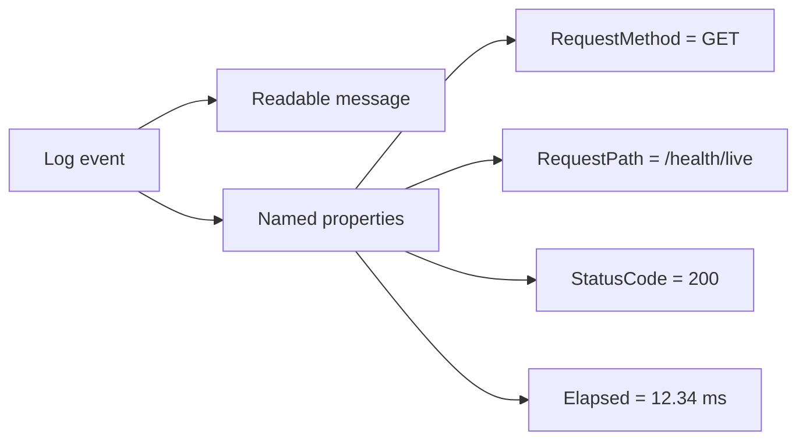
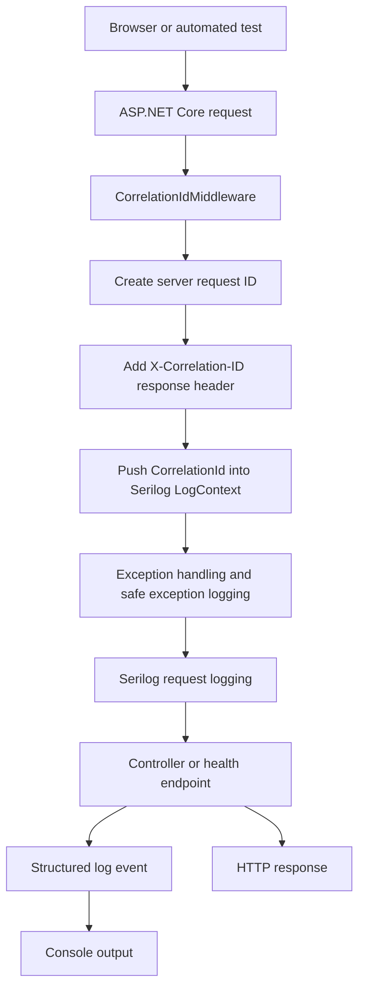
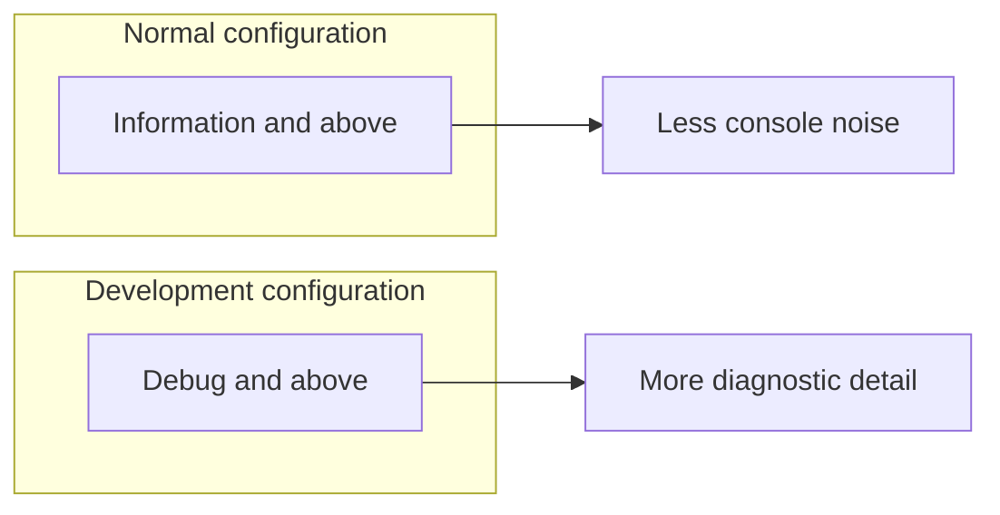
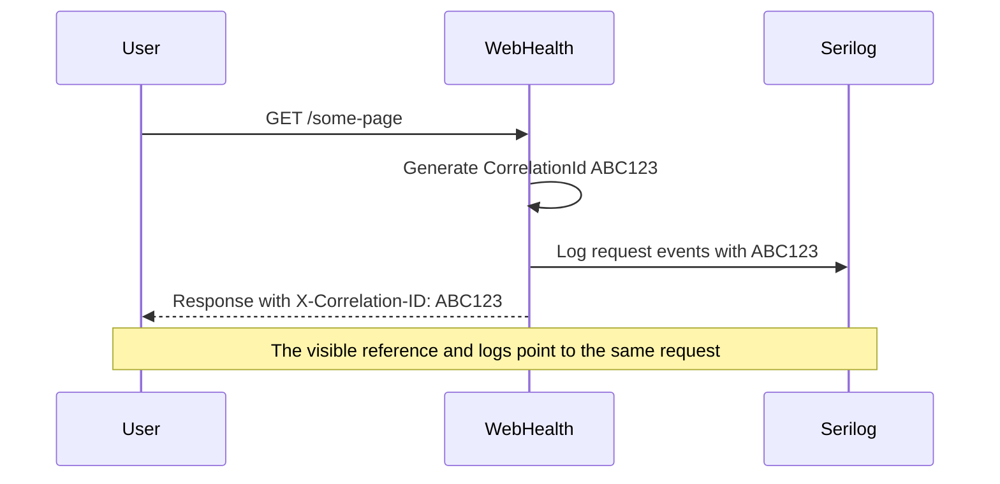
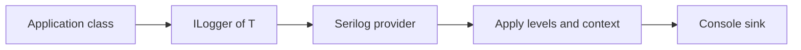
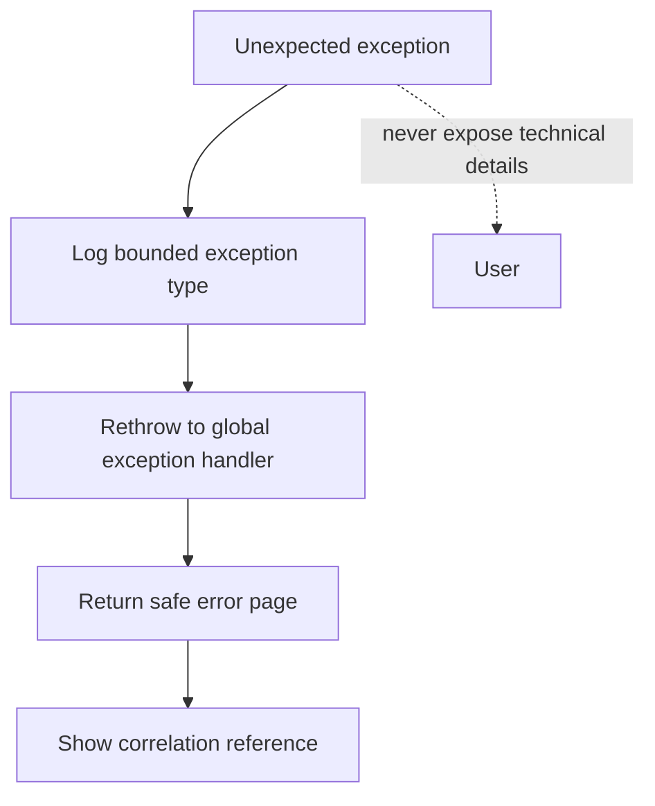
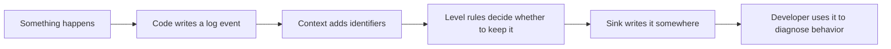

# Serilog in WebHealth — A Beginner-Friendly Guide

## 1. What is Serilog?

Serilog is the application's **logging library**. A log is a timestamped record of something that happened while the application was running, such as:

- an HTTP request completing;
- a PostgreSQL readiness check timing out;
- an unexpected exception occurring;
- later, a monitoring job or email delivery succeeding or failing.

Logs help the developer answer questions such as:

> What happened, when did it happen, and which request or job did it belong to?

Serilog does not prevent errors or fix them. It records useful evidence so that errors and application behavior can be understood.

## 2. Why use Serilog instead of plain text messages?

Serilog supports **structured logging**. This means a log event contains named properties, not only one finished sentence.

For example, the application uses this message template:

```csharp
"HTTP {RequestMethod} {RequestPath} responded {StatusCode} in {Elapsed:0.0000} ms"
```

A completed request might appear in the console approximately like this:

```text
HTTP GET /health/live responded 200 in 12.3400 ms
```

Behind that message, Serilog understands that `RequestMethod`, `RequestPath`, `StatusCode`, and `Elapsed` are separate properties. A structured log destination could therefore search or filter by them later—for example, “show requests where `StatusCode` is 500.”



## 3. Serilog's role in WebHealth

Serilog is part of the project's **observability foundation**. Observability means having enough evidence to understand the application's internal behavior from the outside.

Its current Phase 1 responsibilities are:

1. Collect logs written through ASP.NET Core's `ILogger<T>` abstraction.
2. Write structured logs to the console for local development and CI.
3. Record one completion event for HTTP requests.
4. Attach the application name `WebHealth` to log events.
5. Attach a correlation identifier to logs created during a request.
6. Record safe, limited information about unexpected errors and PostgreSQL readiness failures.

Serilog and health checks have different jobs:

| Tool | Question it answers |
|---|---|
| Health check | “Is the application alive or ready right now?” |
| Serilog | “What happened before and during this behavior?” |

## 4. The current logging flow

When a browser or test sends a request, the request passes through ASP.NET Core middleware. The important logging path is:



The important idea is that all log events produced while the request is inside the correlation-ID scope can carry the same `CorrelationId`.

## 5. How Serilog is configured

The main setup is in `src/WebHealth.Web/Program.cs`:

```csharp
builder.Services.AddSerilog((services, loggerConfiguration) => loggerConfiguration
    .ReadFrom.Configuration(builder.Configuration)
    .ReadFrom.Services(services)
    .Enrich.FromLogContext()
    .Enrich.WithProperty("Application", "WebHealth")
    .WriteTo.Console());
```

Here is what each line means:

| Configuration | Meaning |
|---|---|
| `AddSerilog(...)` | Makes Serilog the logging provider used by the ASP.NET Core application. |
| `ReadFrom.Configuration(...)` | Reads logging levels from `appsettings.json` and environment-specific settings. |
| `ReadFrom.Services(...)` | Allows Serilog configuration to use services registered with dependency injection. |
| `Enrich.FromLogContext()` | Includes temporary contextual properties, such as the current `CorrelationId`. |
| `Enrich.WithProperty(...)` | Adds `Application = WebHealth` to events. |
| `WriteTo.Console()` | Sends log output to the terminal or CI output. |

“Enrich” means **add useful context to a log event**.

## 6. Logging levels

A logging level describes how important or severe an event is.

| Level | Typical meaning |
|---|---|
| `Debug` | Detailed development information. |
| `Information` | Normal, meaningful application activity. |
| `Warning` | Something unexpected happened, but the application can continue. |
| `Error` | An operation failed. |
| `Fatal` | The application cannot continue safely. |

The committed default in `appsettings.json` records WebHealth events from `Information` upward. Most Microsoft framework logs are raised to `Warning` to avoid excessive noise.

During development, `appsettings.Development.json` changes the application default to `Debug` and allows EF Core database commands at `Information`. This gives the developer more detail locally without making normal logs unnecessarily noisy.



These are minimum thresholds. An event below the configured threshold is discarded rather than written.

## 7. Correlation IDs

Several requests can run at the same time, causing their log messages to be mixed together. A **correlation ID** labels events that belong to the same request.

`CorrelationIdMiddleware` currently does the following:

```csharp
var correlationId = context.TraceIdentifier;
context.Response.Headers["X-Correlation-ID"] = correlationId;

using (LogContext.PushProperty("CorrelationId", correlationId))
{
    await next(context);
}
```

For each request, it:

1. uses ASP.NET Core's server-generated request identifier;
2. returns that value in the `X-Correlation-ID` response header;
3. adds it to Serilog's context while the request is processed.

For example:

```text
Request A -> CorrelationId 0HNABC123
Request B -> CorrelationId 0HNXYZ789
```

If Request A fails, its ID can be shown on the safe error page. The developer can then look for log events carrying `CorrelationId = 0HNABC123` instead of searching every event.



The integration tests verify that responses contain a non-empty server-generated correlation ID and that safe error pages show the same reference.

## 8. Automatic HTTP request logs

`Program.cs` enables Serilog's request-logging middleware:

```csharp
app.UseSerilogRequestLogging(options =>
{
    options.MessageTemplate =
        "HTTP {RequestMethod} {RequestPath} responded {StatusCode} in {Elapsed:0.0000} ms";
});
```

This creates a concise completion log containing:

- the HTTP method, such as `GET`;
- the path, such as `/health/ready`;
- the response status code, such as `200` or `503`;
- the elapsed processing time in milliseconds.

The current template deliberately uses the request **path**, not query-string values, headers, or request bodies. This reduces the risk of recording secrets or other sensitive input.

## 9. Application code can use `ILogger<T>`

Application classes do not need to call Serilog directly. They normally receive ASP.NET Core's standard `ILogger<T>` interface through dependency injection:

```csharp
internal sealed class PostgreSqlReadinessCheck(
    IConfiguration configuration,
    ILogger<PostgreSqlReadinessCheck> logger)
```

They can then write structured events:

```csharp
logger.LogWarning(
    "PostgreSQL readiness check failed with {ExceptionType}.",
    exception.GetType().Name);
```

`ILogger<T>` creates the event, and the configured Serilog provider processes and writes it.



This separation keeps application code tied to the standard .NET logging abstraction rather than to Serilog-specific APIs. Direct Serilog usage is currently limited to setup and the request correlation context.

## 10. Safe exception logging

`SafeExceptionLoggingMiddleware` catches an unhandled exception long enough to record a bounded event:

```csharp
logger.LogError(
    "Unhandled request failed with {ExceptionType}.",
    exception.GetType().Name);
```

It logs the exception **type**, then rethrows the exception so ASP.NET Core's global exception handler can return the safe error page.

The current implementation intentionally does not place the exception message or sensitive application values into that event. For the same reason, PostgreSQL readiness logging records a timeout or exception type without logging the connection string.



This supports two goals at once:

- the developer receives evidence that a failure occurred;
- the user does not receive internal exception details.

## 11. What must never be logged

Logs can outlive a request and may later be collected by CI or a hosted logging service. Therefore, WebHealth must not log:

- passwords, API keys, or SMTP credentials;
- database connection strings;
- authorization cookies or sensitive headers;
- complete monitored-site response bodies;
- secrets placed in query strings or form bodies;
- unsafe technical details displayed to users.

A correlation ID is a reference, not a secret-storage mechanism. Sensitive data must still be excluded even when an event has a correlation ID.

## 12. What is implemented now and what comes later?

### Implemented in Phase 1

- Serilog is registered as the ASP.NET Core logging provider.
- Logging levels are controlled through application settings.
- Structured logs are written to the console.
- HTTP requests receive completion logs.
- Events are enriched with `Application = WebHealth`.
- Request-scoped logs can contain a server-generated `CorrelationId`.
- Safe exception and PostgreSQL-readiness events are recorded.

### Planned for later phases

As monitoring, incidents, notifications, and Hangfire jobs are implemented, relevant log events should also carry identifiers such as:

- `LogicalCheckId`;
- `EndpointId`;
- `IncidentId`;
- `NotificationId`;
- `JobId`.

Those identifiers will let the developer trace one operation across web requests, background jobs, database work, incidents, and notifications. They are part of the planned design, not all part of the current Phase 1 implementation.

A rolling file or managed logging destination may be added only if a future real deployment needs it. The current project writes to the console.

## 13. Mental model to remember

Think of Serilog as a structured event pipeline:



In the current project:

> Application and framework code create events → Serilog adds context and applies level rules → the console sink writes the retained events.

Serilog is therefore not the monitoring engine that checks websites. It is the logging system that helps explain what the WebHealth application itself did while processing requests and, later, background monitoring work.

## 14. Relevant project files

| File | Purpose |
|---|---|
| `src/WebHealth.Web/Program.cs` | Registers Serilog and HTTP request logging. |
| `src/WebHealth.Web/appsettings.json` | Defines normal minimum logging levels. |
| `src/WebHealth.Web/appsettings.Development.json` | Enables additional development detail. |
| `src/WebHealth.Web/Middleware/CorrelationIdMiddleware.cs` | Adds the request correlation ID to responses and log context. |
| `src/WebHealth.Web/Middleware/SafeExceptionLoggingMiddleware.cs` | Records bounded information for unhandled request exceptions. |
| `src/WebHealth.Infrastructure/Diagnostics/PostgreSqlReadinessCheck.cs` | Uses `ILogger<T>` for safe readiness-failure events. |
| `tests/WebHealth.IntegrationTests/RuntimeFoundationTests.cs` | Verifies correlation references and safe error behavior. |
