# Phase 2: Administration and Authorization Explained

This guide explains task 2.2 in beginner-friendly terms and connects it to the
authentication work from task 2.1.

## The main idea

Task 2.1 answered:

> Who is this user?

Task 2.2 adds the next question:

> What is this signed-in user allowed to do?

The application now has a protected administration area where an Administrator
can manage users and roles. It also has named authorization policies that can be
attached to controllers or actions.

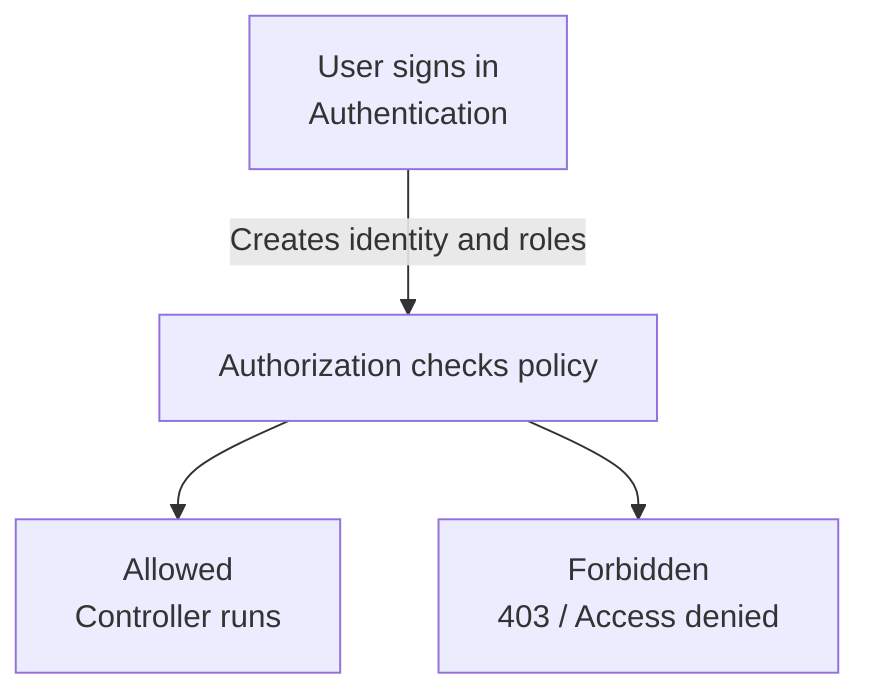

Authentication and authorization are related, but they are not the same:

| Concept | Question | Example |
|---|---|---|
| Authentication | Who are you? | Alice signed in successfully |
| Authorization | What may you do? | Alice is an Administrator, so she may manage users |

## What was added

The implementation adds:

1. Administrator-only user administration pages.
2. User creation with an initial password.
3. Role assignment and replacement.
4. Account disabling and re-enabling.
5. Password reset by an Administrator.
6. Protection against removing the last enabled Administrator.
7. Global antiforgery validation for MVC requests.
8. Named policies for administration, operations, and viewing data.
9. Protected detailed readiness; liveness remains public.
10. Role-aware navigation visibility.
11. Integration coverage for direct authorization requests and the role matrix.

The implementation uses the Identity tables created in task 2.1. No new database
migration is required for this increment.

## Where the code lives

### Application layer

```text
src/WebHealth.Application/
├── Administration/
│   └── IUserAdministrationService.cs
└── Authorization/
    └── AuthorizationPolicies.cs
```

The application layer defines the use cases and policy names without knowing
how ASP.NET Identity stores data.

`IUserAdministrationService` defines operations such as:

- list users;
- find a user;
- create a user;
- update access for a user.

The command records make the inputs explicit:

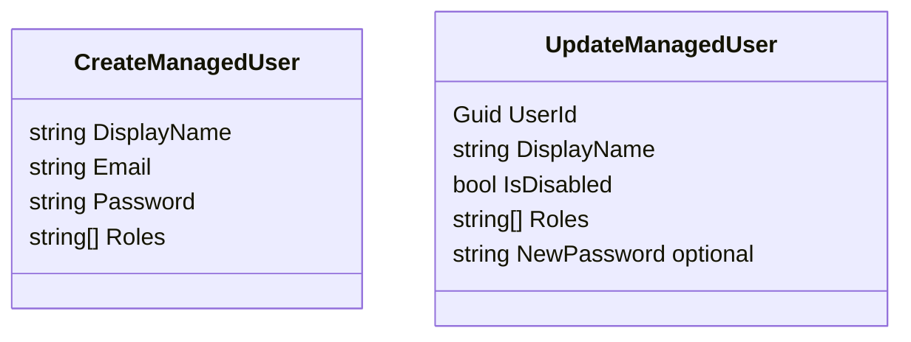

### Infrastructure layer

```text
src/WebHealth.Infrastructure/Identity/UserAdministrationService.cs
```

`UserAdministrationService` implements the application interface using:

- `UserManager<ApplicationUser>` for users and password hashing;
- Identity role operations for role assignment;
- `ApplicationDbContext` for transactions and last-admin checks;
- `ILogger` for operational signals that do not include passwords.

This keeps the controller thin. The controller receives a web form, while the
service makes the important access decisions.

### Web layer

```text
src/WebHealth.Web/Controllers/AdministrationController.cs
src/WebHealth.Web/Models/UserAdministrationViewModels.cs
src/WebHealth.Web/Views/Administration/
├── Users.cshtml
├── CreateUser.cshtml
└── EditUser.cshtml
```

The controller is protected at the class level:

```csharp
[Authorize(Policy = AuthorizationPolicies.Administration)]
```

Therefore every action in `AdministrationController` requires the Administrator
role unless a later action explicitly changes that behavior.

## User administration flow

### Creating a user

An Administrator opens:

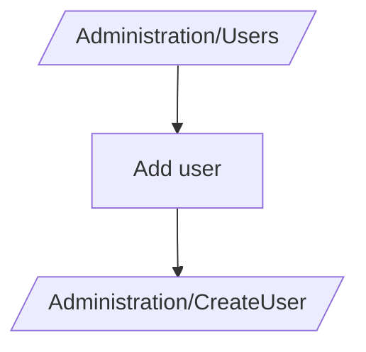

The form collects a display name, email, initial password, and at least one
supported role.

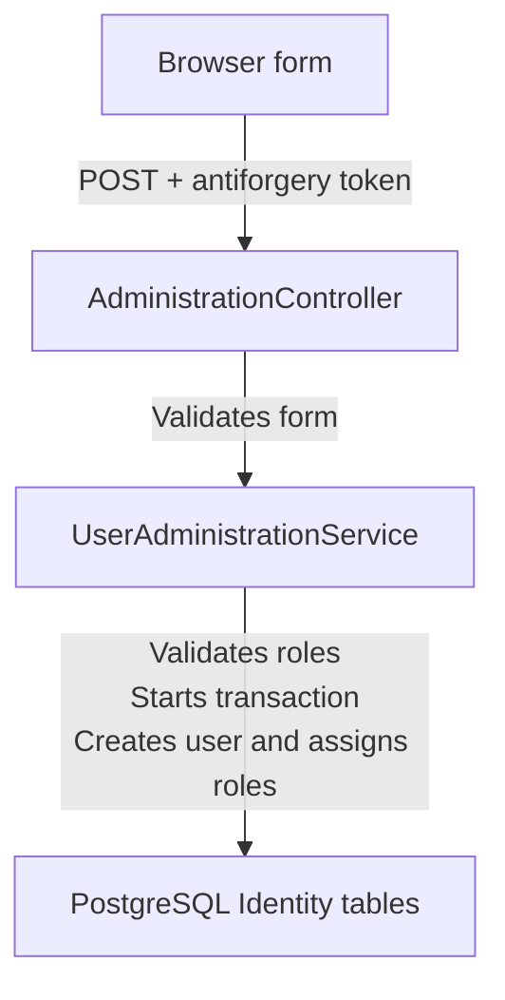

The password is given to Identity. Identity stores a password hash, not the
original password. The controller clears the password from the view model after
processing and the service logs only IDs, role names, and whether a password was
reset.

### Editing access

The edit page allows an Administrator to change:

- display name;
- roles;
- enabled/disabled state;
- optional replacement password.

The service replaces the user’s role set by removing roles that are no longer
selected and adding newly selected roles.

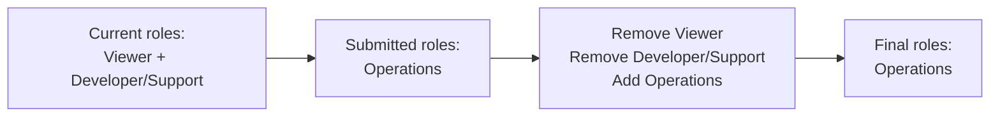

### Safety rules

The service prevents an Administrator from:

- disabling their own account;
- removing their own Administrator role;
- disabling or demoting the last enabled Administrator.

The last-administrator check runs inside a serializable transaction. This is
important because two simultaneous admin updates should not both conclude that
it is safe to remove the last administrator.

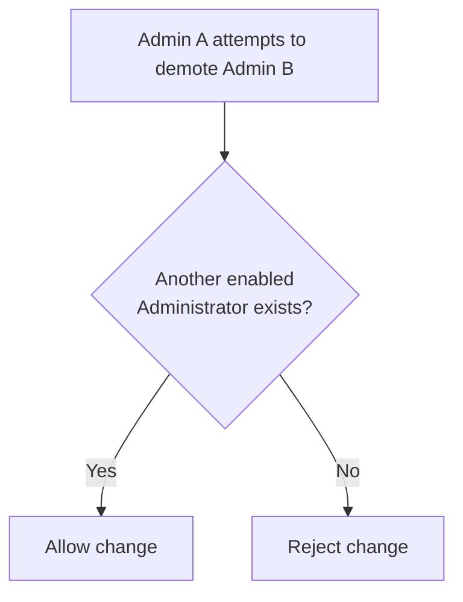

## Security stamps and access reset

An Identity security stamp is a value associated with a user’s security state.
The authentication cookie is periodically checked against it.

The application validates security stamps every five minutes.

The custom `ApplicationUserSignInManager` adds the disabled-state rule in two
places:

1. A disabled user cannot sign in.
2. A disabled user is rejected when an existing principal is revalidated.

The intended session flow is:

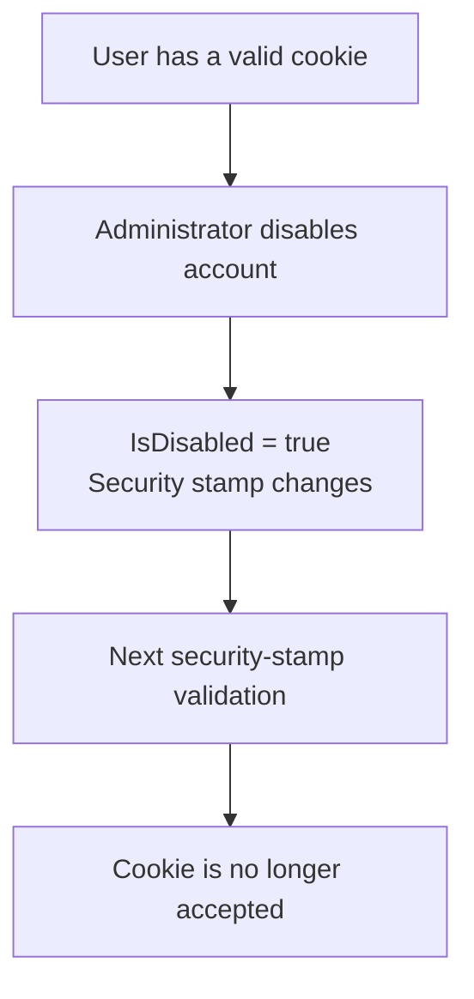

Resetting a password through Identity also invalidates existing access through
Identity’s password/security-stamp behavior.

The current service explicitly changes the security stamp when the disabled
state changes. Role changes should also be treated as access changes and are a
follow-up verification point for the access-reset requirement.

## Authorization policies

The policy names are centralized in:

```text
src/WebHealth.Application/Authorization/AuthorizationPolicies.cs
```

They are registered in `Program.cs`:

| Policy | Roles currently allowed | Meaning |
|---|---|---|
| `Administration` | Administrator | Manage users and roles |
| `Diagnostics` | Administrator, Operations | View detailed readiness and diagnostics |
| `OperateMonitoring` | Administrator, Operations | Perform global monitoring operations |
| `ReadAllOperationalData` | Administrator, Operations | Read operational data without a resource assignment |

The policy declarations use `RequireRole(...)`. For example:

```csharp
.AddPolicy(AuthorizationPolicies.Administration, policy =>
    policy.RequireRole(ApplicationRoles.Administrator))
```

The fallback policy still requires every user to be authenticated. A named
policy adds a stronger role requirement on top of that default.

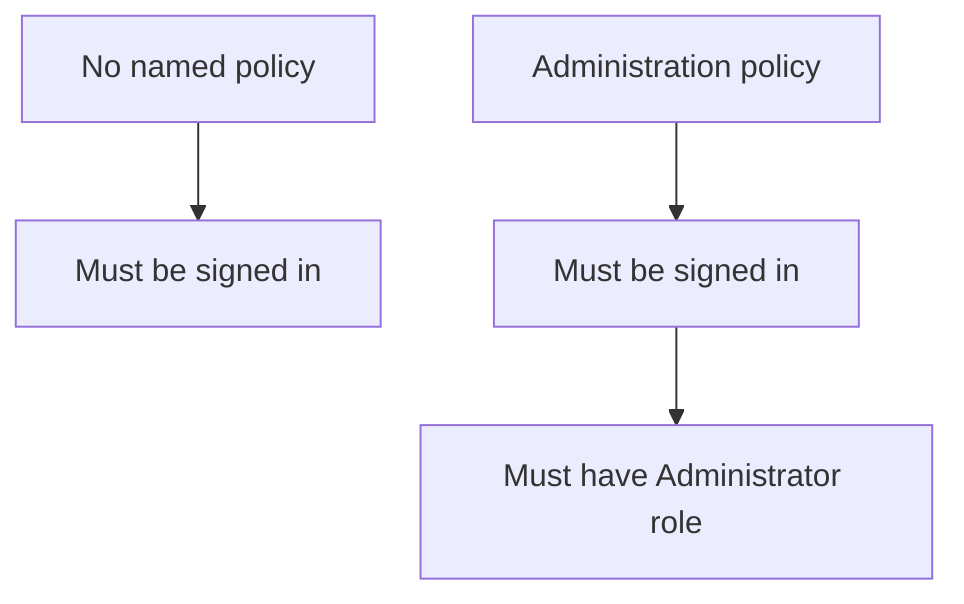

## Authorization matrix implemented by this baseline

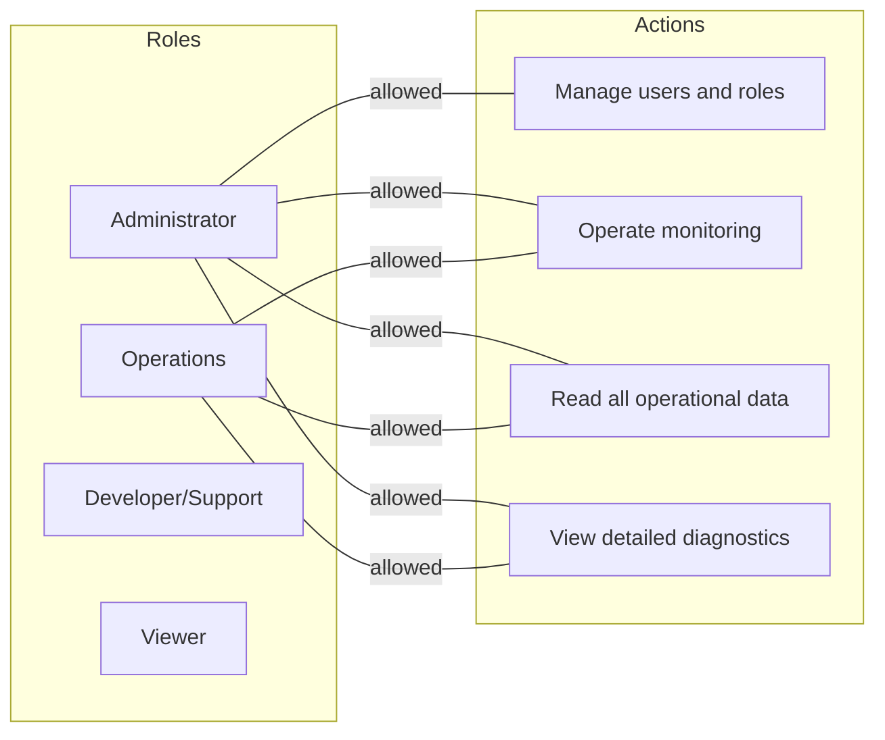

Developer/Support and Viewer fail closed for global reads. Later registry and
assignment work will add resource policies for records they are assigned or
explicitly granted.

Developer/Support registry editing remains disabled by default because the
current operation policy does not include that role.

## Direct requests versus hidden navigation

The sidebar hides the Users link for users who are not Administrators:

```csharp
item.IsVisible(User)
```

This improves usability, but it is not security. A user can still type the URL
manually or send an HTTP request directly.

The controller policy is the real security boundary:

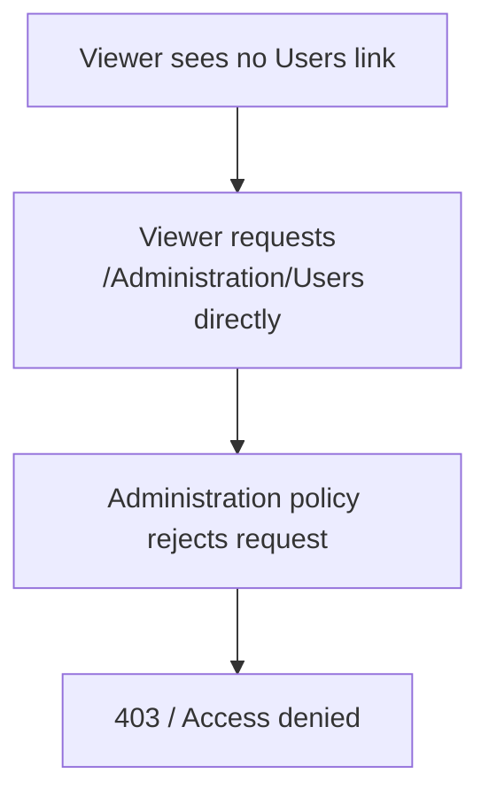

This is why the tests check both navigation visibility and direct requests.

## Anonymous, forbidden, and allowed requests

The request pipeline now behaves conceptually like this:

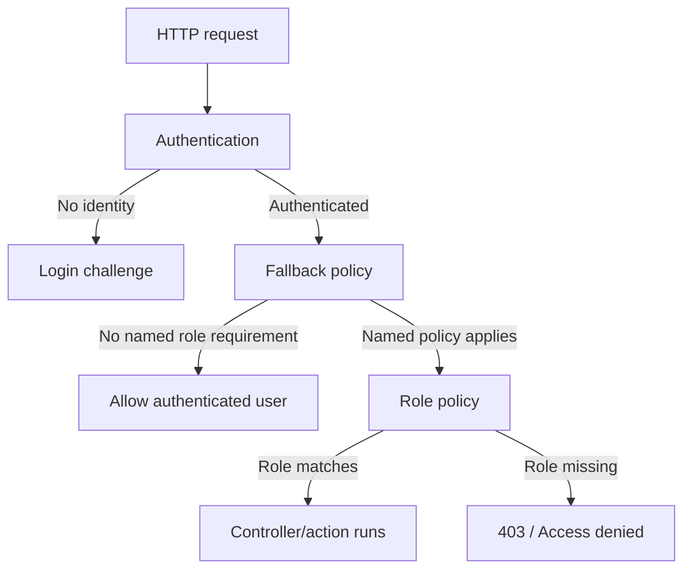

For the MVC browser flow, the cookie is configured with:

```text
LoginPath:        /Account/Login
AccessDeniedPath: /Account/AccessDenied
```

The existing status-code page then presents the application’s access-denied
screen.

The detailed readiness endpoint requires the Administrator/Operations
`Diagnostics` policy, while liveness is explicitly anonymous:

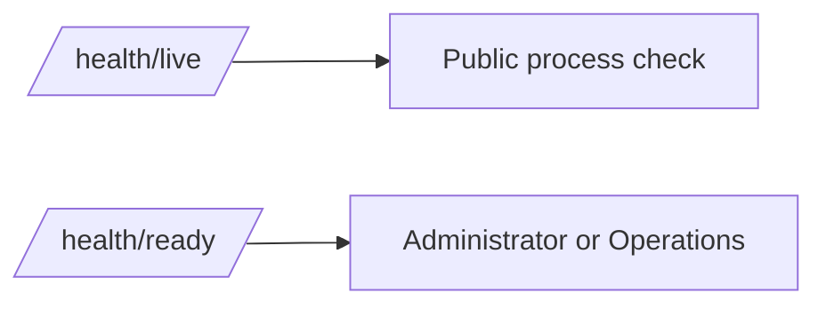

Authenticated forbidden requests pass through one authorization-result handler
and create an `authorization.denied` row. The audit value allow-list excludes
query strings and records only the validated actor ID, UTC time, method, path,
outcome, action, and correlation ID.

## Global antiforgery protection

`Program.cs` registers:

```csharp
options.Filters.Add(new AutoValidateAntiforgeryTokenAttribute())
```

This means unsafe MVC requests such as POST, PUT, PATCH, and DELETE must include
an antiforgery token. GET requests are safe reads and are not blocked by this
filter.

The form flow is:

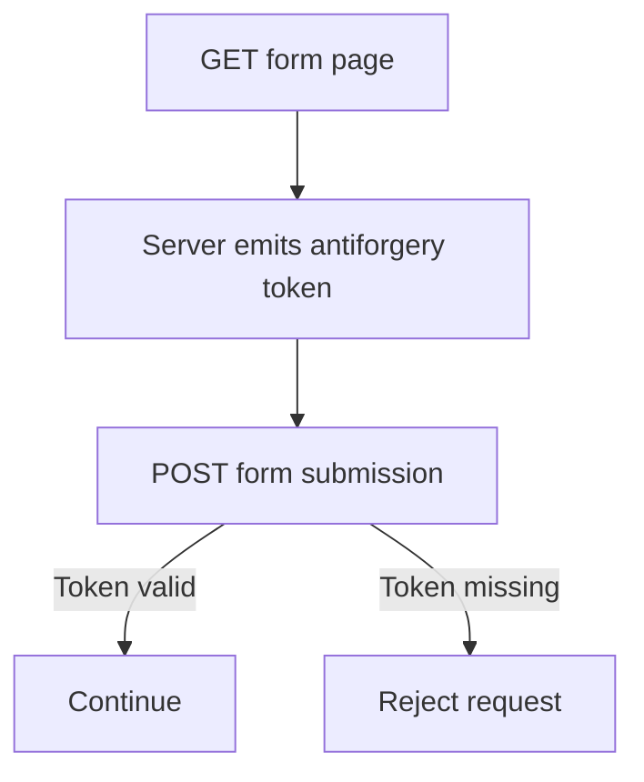

The login and logout actions also show explicit `[ValidateAntiForgeryToken]`
attributes. This makes their protection obvious at the action itself in addition
to the global MVC filter.

## What is stored and what is logged

User creation and access changes use transactions:

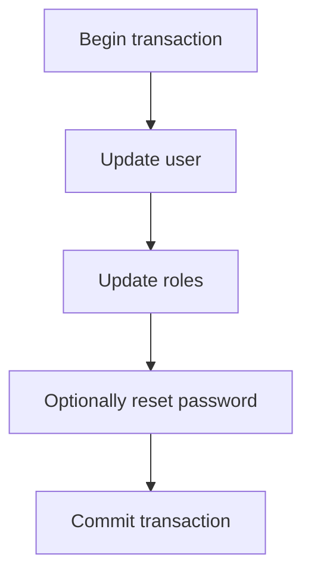

Passwords are not logged. The structured administration messages contain:

- actor user ID;
- target user ID;
- enabled/disabled state;
- role names;
- whether a password reset occurred.

The password value and email address are not included in those messages.

These structured logs are operational signals. They are not yet the durable,
append-only audit history planned for the later audit increment.

## How the tests prove the baseline

The main test file is:

```text
tests/WebHealth.IntegrationTests/AuthorizationBaselineTests.cs
```

The tests cover:

| Test behavior | Expected result |
|---|---|
| Anonymous administration request | Redirects to login |
| Operations, Developer/Support, or Viewer requesting administration | 403 Forbidden |
| Administrator requesting administration | 200 OK |
| Administrator or Operations using operation policy | 200 OK |
| Developer/Support or Viewer using operation policy | 403 Forbidden |
| Any of the four roles using view policy | 200 OK |
| Administrator sees Users navigation | Link exists |
| Viewer sees Users navigation | Link is absent |

The test-only authentication handler accepts these headers:

```text
X-WebHealth-Test-User: Test User
X-WebHealth-Test-Roles: Administrator
```

This simulates claims without needing a browser login for every authorization
test. It does not replace the real Identity login flow in the application.

The database foundation assertions also exercise user creation, role
replacement, password reset, disabled-state persistence, security-stamp
validation, and self-lockout protection.

## How task 2.1 and task 2.2 connect

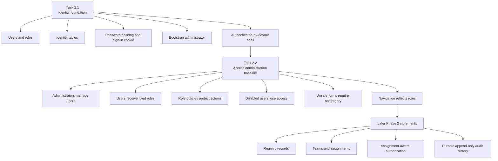

The result is a foundation, not the final permission system. It establishes the
global role boundaries needed before record-level assignments can be added.

## Current boundaries and follow-up work

The following are intentionally not complete in this increment:

1. **Assignment-aware authorization**: Developer/Support and Viewer are allowed
   by the global view baseline, but record-level assignment checks belong to the
   registry/access-grant increment.
2. **Durable denial audit**: authenticated forbidden requests currently produce
   the access-denied behavior and test evidence, but a durable append-only audit
   record for each denial belongs to the audit increment.
3. **Explicit API 401/403 behavior**: the current cookie flow is primarily an MVC
   browser flow. API endpoints will need an explicit challenge/forbidden handler
   so they do not receive HTML redirects.
4. **Generic permission designer**: no UI was added to invent arbitrary roles or
   permissions. The four application personas remain fixed.

## The mental model to keep

When tracing any protected feature, follow this order:

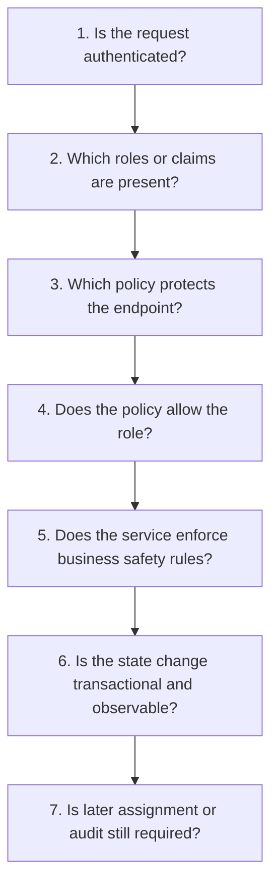

That sequence connects the database records, Identity, middleware, policies,
controllers, services, views, and tests into one overall Phase 2 picture.
