# Phase 2.3: Assignment and Audit Foundation Explained

This guide explains the completed assignment and audit foundation and connects it
to the authentication and authorization work from the previous increments.

## The main idea

The earlier increments established these answers:

```text
Phase 1: Who is the user?
Phase 2.2: Which global role does the user have?
Phase 2.3: Which user or team owns the assignment, and what changed over time?
```

This increment does not yet attach assignments to Client, Website, Environment,
or Endpoint records. Those registry records do not exist yet. Instead, it builds
the reusable foundation that the registry increment will consume.

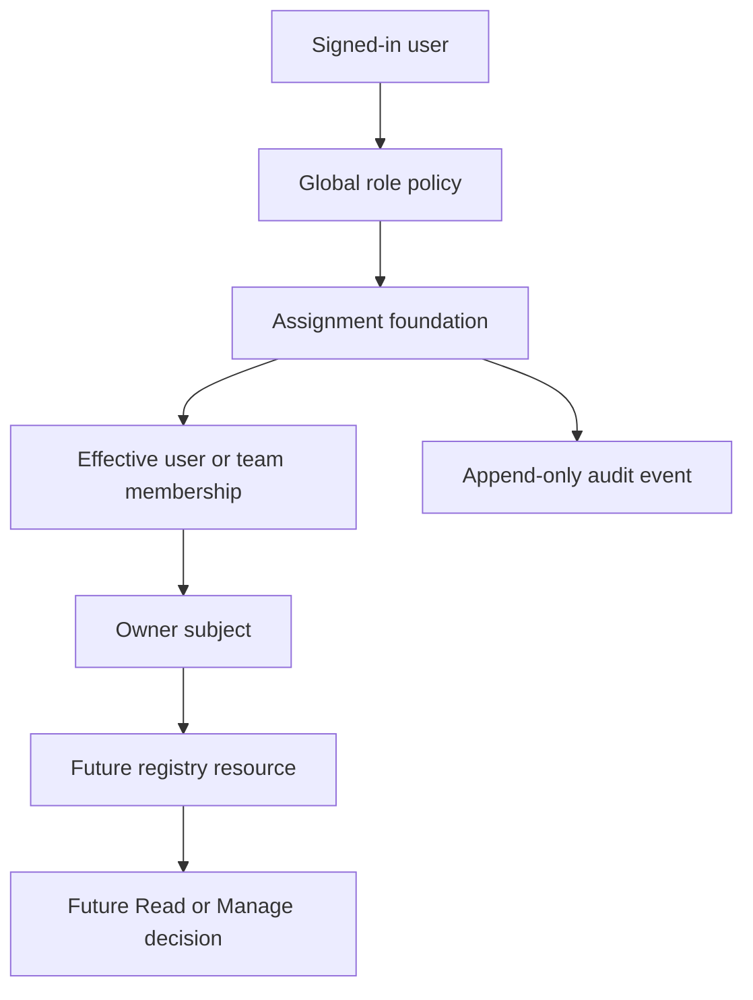

## What was delivered

The implementation now provides:

1. Administrator-managed teams.
2. Effective-dated team membership history.
3. One reusable owner subject for every user or team.
4. Assignment evaluation that rejects disabled users and disabled teams.
5. Normalized, unique team names.
6. Optimistic concurrency for team updates.
7. Audited user and team changes with safe before/after values.
8. Audited authenticated authorization denials.
9. PostgreSQL-enforced append-only audit rows.
10. Administrator/Operations audit search with filters and pagination.
11. A new migration applied to the development database.

The important boundary is:

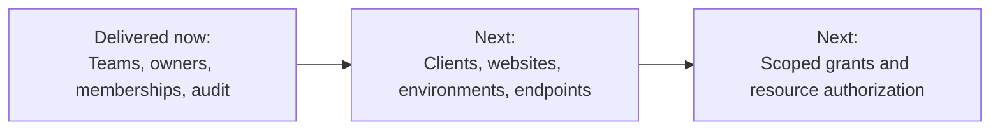

## How this connects to previous phases

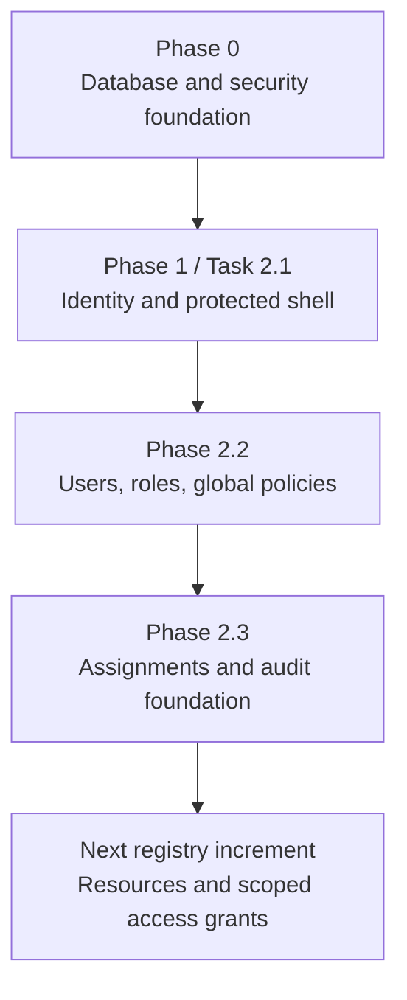

### Phase 0

Phase 0 established the database and security rules that make this increment
safe to build on:

- PostgreSQL schema and naming conventions;
- restrictive foreign keys;
- optimistic concurrency conventions;
- explicit migrations;
- secure outbound and request-handling boundaries.

### Task 2.1

Task 2.1 added:

- `ApplicationUser` and `ApplicationRole`;
- Identity tables and password hashing;
- sign-in cookies;
- the bootstrap administrator;
- authenticated-by-default MVC pages.

### Task 2.2

Task 2.2 added:

- fixed application roles;
- Administrator-only user management;
- global authorization policies;
- disabled-account handling;
- role-aware navigation;
- global antiforgery validation.

### Task 2.3

This increment uses those authenticated actors and Administrator policies to add
teams, ownership subjects, effective membership, and durable audit evidence.

## Where the code lives

### Application contracts

```text
src/WebHealth.Application/
├── Assignments/
│   ├── ITeamAdministrationService.cs
│   └── IAssignmentAccessEvaluator.cs
├── Auditing/
│   ├── IAuditTrailWriter.cs
│   ├── IAuditTrailReader.cs
│   └── IAuthorizationDenialAuditWriter.cs
└── Authorization/
    └── AuthorizationPolicies.cs
```

The application layer describes the use cases without directly depending on
Entity Framework or PostgreSQL.

### Infrastructure implementation

```text
src/WebHealth.Infrastructure/
├── Assignments/
│   ├── Team.cs
│   ├── TeamAdministrationService.cs
│   ├── AssignmentAccessEvaluator.cs
│   └── AssignmentModelConfiguration.cs
├── Auditing/
│   ├── AuditEvent.cs
│   ├── AuditTrailWriter.cs
│   ├── AuditTrailReader.cs
│   ├── AuditEventConfiguration.cs
│   └── AuthorizationDenialAuditWriter.cs
└── Persistence/Migrations/
    └── 20260814100602_AssignmentAndAuditFoundation.cs
```

### Web implementation

```text
src/WebHealth.Web/
├── Authorization/AuditingAuthorizationMiddlewareResultHandler.cs
├── Controllers/AuditController.cs
├── Controllers/AdministrationController.cs
├── Models/AssignmentViewModels.cs
├── Models/AuditViewModels.cs
└── Views/
    ├── Administration/Teams.cshtml
    └── Audit/Index.cshtml
```

## Teams and effective membership

A team is a reusable group of users. Administrators can create, rename, disable,
and edit teams through:

```text
/Administration/Teams
/Administration/CreateTeam
/Administration/EditTeam/{id}
```

The team page displays the members who are effective **now**, not every historical
membership row.

### Why membership is effective-dated

Membership is represented as a time interval:

```text
[EffectiveFrom, EffectiveUntil)
```

An open `EffectiveUntil` means the membership is currently active.

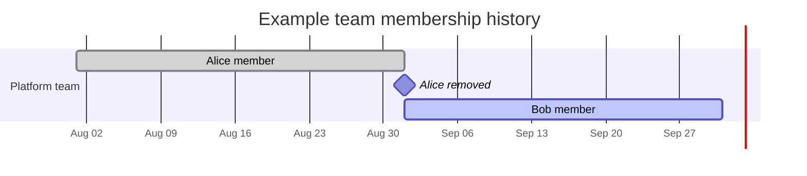

When an Administrator removes a member, the service closes the existing period
by setting `EffectiveUntil`. It does not delete the old row. This preserves the
history needed to answer questions such as:

> Was this user a member of the team at the time of the event?

PostgreSQL also rejects overlapping membership periods for the same team and
user through a GiST exclusion constraint.

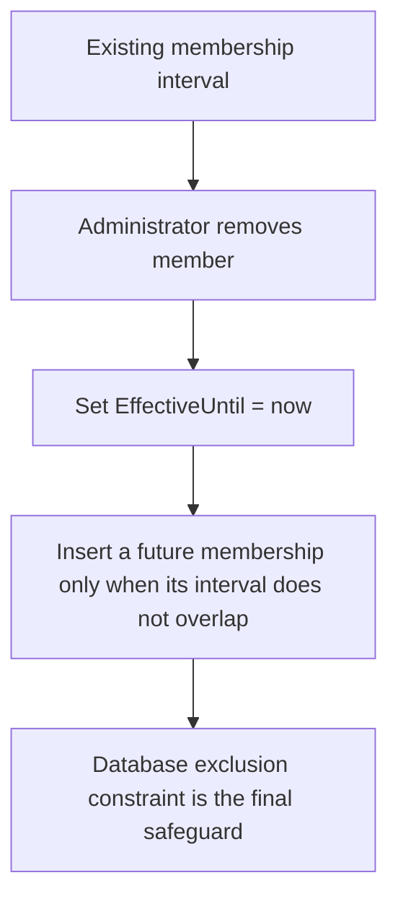

### Team rules

The service and database enforce these rules:

- team names are trimmed and normalized;
- normalized team names are unique;
- disabled users cannot be added as new members;
- repeated submitted user IDs are deduplicated;
- a disabled team remains stored but grants no effective assignment access;
- a stale team version is rejected instead of overwriting newer changes.

## Owner subjects

An `OwnerSubject` is a reusable reference to exactly one owner type:

- one user; or
- one team.

It is deliberately not both and not neither.

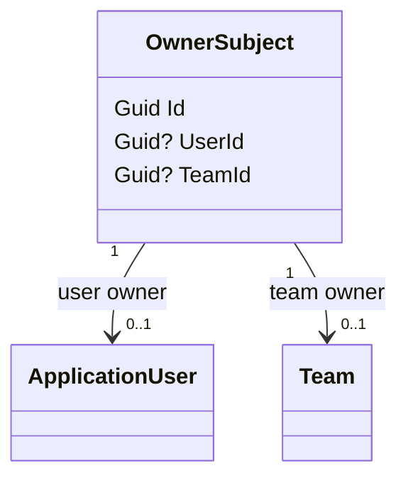

The database enforces the rule with:

```text
(user_id IS NOT NULL) + (team_id IS NOT NULL) = 1
```

It also uses filtered unique indexes so each user and each team receives only one
owner subject.

### When owner subjects are created

The migration backfills an owner subject for existing users. Future users receive
one when they are created by the bootstrap process or Administrator user-management
service. Teams receive their owner subject when the team is created.

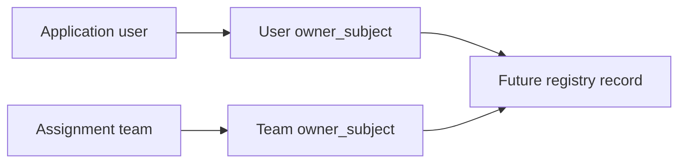

This means future registry tables can reference a single `owner_subject_id`
instead of having separate user-owner and team-owner columns everywhere.

## Assignment evaluation

`IAssignmentAccessEvaluator` answers whether a user is assigned to an owner
subject at a particular time.

It checks either:

1. the owner subject points directly to that user; or
2. the owner subject points to a team where the user has an effective membership.

The evaluator denies access when:

- the user is disabled;
- the team is disabled;
- the membership has not started;
- the membership has ended;
- the owner subject does not exist.

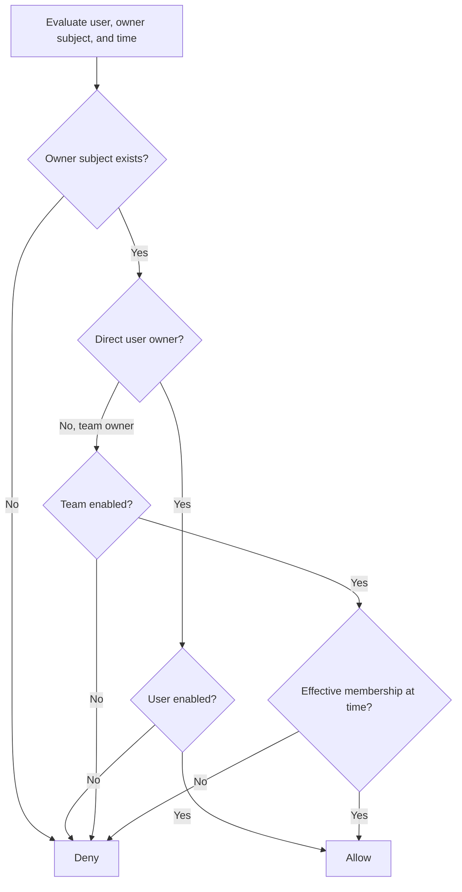

The evaluator deliberately does not put assignment claims into cookies. It
queries current database state, so disabling a user or team can affect the next
authorization decision without waiting for a cookie to contain new assignment
data.

## Audit events

An audit event is a durable record of a security-relevant or administration
change. The event contains:

```text
ActorUserId
OccurredAt
Action
EntityType
EntityIdentifier
Outcome
BeforeValues (optional JSON)
AfterValues  (optional JSON)
```

Examples of actions now recorded include:

```text
user.created
user.updated
team.created
team.updated
authorization.denied
```

### Explicit, typed audit writer

Application code calls mutation-specific operations on `IAuditTrailWriter` with
typed, allow-listed snapshots. The writer owns action names and permitted fields;
it cannot accept an arbitrary object or dictionary. `IAuditTrailReader` is a
separate query contract for audit search.

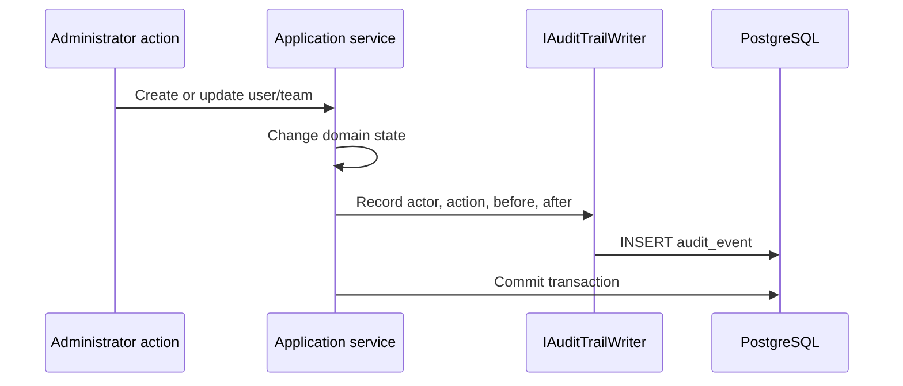

For user changes, the allow-listed snapshot fields are:

- display name;
- email;
- disabled state;
- supported roles;
- whether a password reset occurred.

For team changes, the snapshot contains:

- team name;
- disabled state;
- member user IDs.

Passwords, password hashes, tokens, request bodies, and arbitrary query strings
are not included in these snapshots.

## Audit denial handling

Authenticated users who fail authorization pass through
`AuditingAuthorizationMiddlewareResultHandler`.

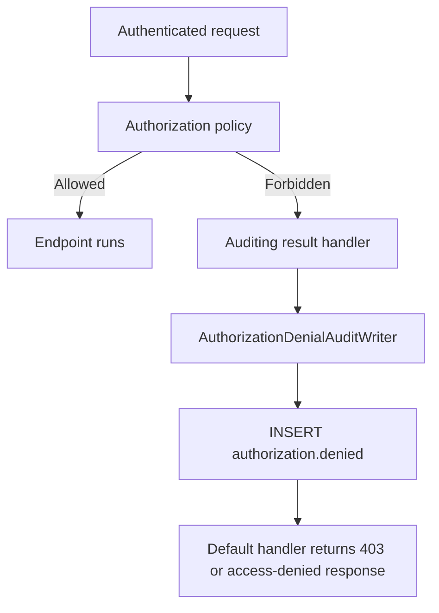

The denial writer records only a bounded, allow-listed request summary:

- actor user ID, when available;
- UTC timestamp;
- HTTP method;
- path without the query string;
- correlation/trace ID;
- forbidden outcome.

The query string is intentionally excluded because it may contain sensitive
values. If audit persistence fails, the failure is logged and the normal
authorization response still proceeds.

## PostgreSQL append-only protection

Application code does not expose update or delete methods for audit events. The
database adds a second, stronger boundary:

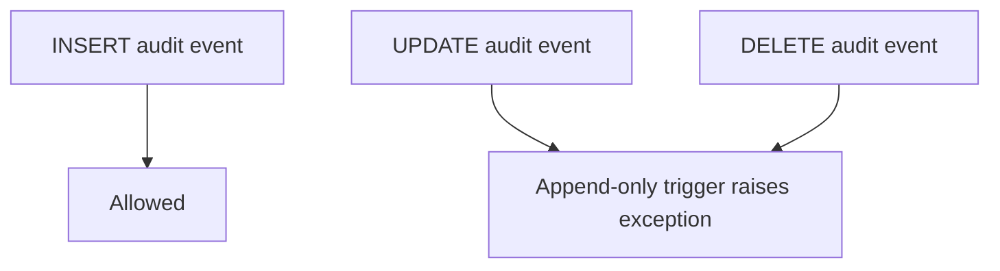

The migration creates:

- `web_health.audit_event` JSONB before/after columns;
- an entity/time search index;
- `prevent_audit_event_mutation()`;
- `trg_audit_event_append_only`.

This protects the history even if someone bypasses the application and connects
directly to PostgreSQL with a role that is otherwise allowed to write rows.

## Audit search UI

Administrators and Operations users can open:

```text
/Audit
```

The `AuditController` uses the `ViewAuditHistory` policy, which allows only:

```text
Administrator
Operations
```

The page supports filters for:

- inclusive UTC from date;
- inclusive UTC to date;
- actor;
- action;
- entity type or entity identifier.

Results are newest-first, have stable ordering, and use bounded pagination with a
maximum page size of 100.

```mermaid
flowchart LR
    A[Administrator or Operations] --> B[/Audit]
    B --> C[AuditSearchQuery]
    C --> D[Date, actor, action, entity filters]
    D --> E[Newest-first paginated results]
    E --> F[Safe before/after values]
```

Developer/Support and Viewer fail closed: the audit link is hidden for usability
and the controller policy rejects a direct request.

## Database changes

The development database now includes the assignment and audit foundation
migration:

```text
20260814100602_AssignmentAndAuditFoundation
```

It adds or changes:

| Database object | Purpose |
|---|---|
| `web_health.team` | Team identity, state, normalized name, and version |
| `web_health.team_member` | Effective-dated team membership |
| `web_health.owner_subject` | Exactly one user or team owner |
| `web_health.audit_event` | Durable audit records and safe snapshots |
| GiST exclusion constraint | Prevents overlapping membership periods |
| Append-only trigger | Rejects audit updates and deletes |

The migration also creates owner subjects for users that already existed before
the migration.

## Verification evidence

The database foundation tests verify:

- all migrations apply with no pending migrations;
- owner subjects are created for users and teams;
- disabled users and teams do not pass assignment evaluation;
- effective membership closes rather than deletes history;
- overlapping membership periods are rejected by PostgreSQL;
- duplicate normalized team names are rejected;
- stale team versions are rejected;
- before/after audit snapshots are searchable;
- password values are absent from audit snapshots;
- authenticated denials are persisted without query strings;
- audit rows cannot be updated or deleted.

The authorization integration tests verify:

- Administrator and Operations can access audit history;
- Developer/Support and Viewer receive a forbidden response;
- role-aware navigation shows Teams and Audit only to permitted roles;
- direct requests remain protected even when a link is hidden.

## What is intentionally deferred

This increment is a foundation, not the final resource-access feature. The
following work belongs to the next registry increment:

1. Client, Website, Environment, and Endpoint tables.
2. Scoped grants at exactly one resource level.
3. `Read` and `Manage` grant levels.
4. Assignment-aware query services and resource authorization handlers.
5. Website-owner inheritance.
6. Optional endpoint-owner override.
7. Viewer explicit-grant evaluation.
8. Registry-specific audit events.

The current evaluator can be consumed by those future handlers, but it does not
yet decide access to a registry record because those records and grants do not
exist yet.

## The complete Phase 2 mental model

When a future registry request arrives, trace it through this sequence:

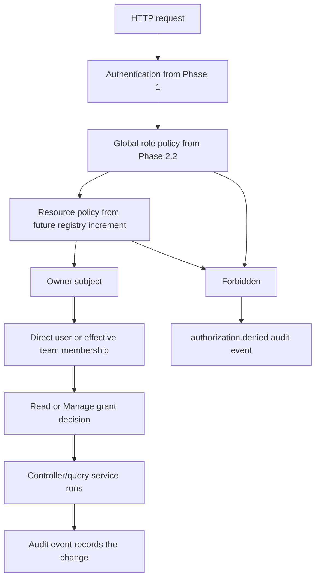

In short:

```text
Phase 1 identifies the user.
Phase 2.2 checks the user's global role.
Phase 2.3 supplies teams, ownership references, effective membership, and audit history.
The next increment will apply those pieces to registry resources and scoped grants.
```
