# Phase 2.4: Client and Website Vertical Slice Explained

This guide explains the Client and Website registry implementation and connects
it to the authentication, authorization, assignment, and audit work from the
previous phases.

## The main idea

Phase 2.3 created the reusable assignment foundation:

- users and teams can be owners;
- team membership can be effective at a particular time;
- owner subjects provide one reusable owner reference;
- changes can be audited.

Phase 2.4 finally gives that foundation real registry records to protect:

It also introduces the scoped access-grant persistence needed for Viewer reads.

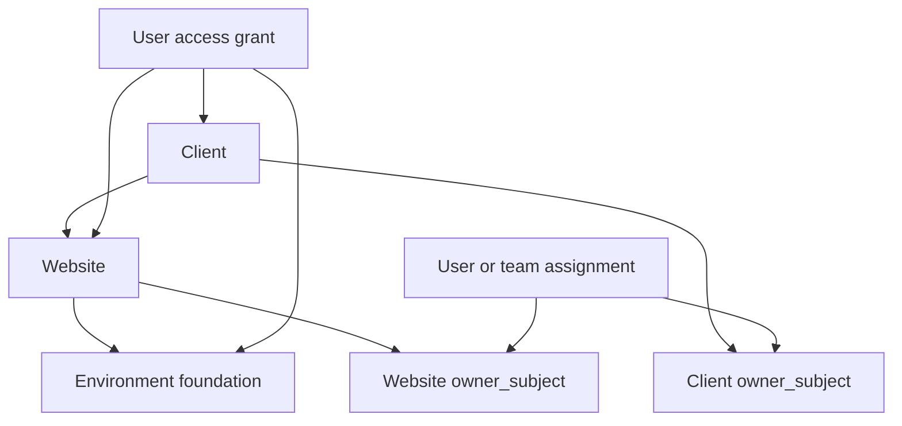

The result is a working vertical slice: data model, database constraints,
application services, authorization, query filtering, MVC pages, lifecycle
operations, and audit events are connected together.

## What was delivered

The implementation now supports:

1. Client list, details, create, edit, disable, soft-delete, and restore flows.
2. Website list, details, create, edit, disable, soft-delete, and restore flows.
3. A minimal Environment table used to validate website enablement.
4. Owner selection using the reusable user/team owner subjects.
5. Registry read policy for all four application roles.
6. Registry management policy for Administrator and Operations.
7. Developer/Support visibility through direct or team ownership.
8. Viewer visibility through active scoped access grants.
9. Client ownership flowing down to its websites.
10. Website ownership controlling website visibility independently.
11. Name normalization and PostgreSQL uniqueness constraints.
12. Optimistic concurrency using a version number.
13. Transactional lifecycle changes with typed audit snapshots.

## How the phases connect

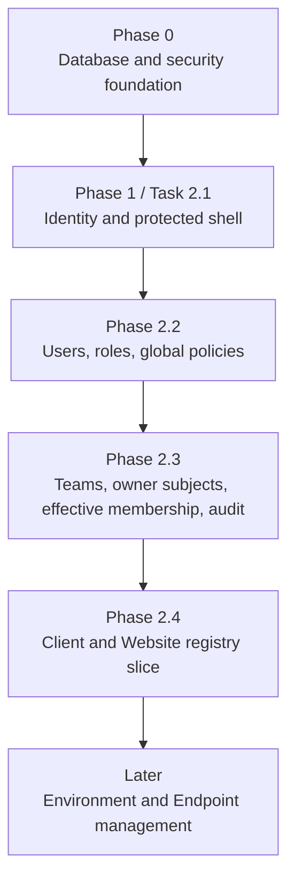

### Phase 0 supplied the safety foundation

Phase 0 established the conventions used here:

- PostgreSQL and the `web_health` schema;
- explicit migrations instead of automatic startup migration;
- normalized names;
- restrictive foreign keys;
- optimistic concurrency;
- bounded and validated input;
- database constraints as the final correctness boundary.

### Phase 1 supplied identity

Phase 1 added:

- `ApplicationUser` and `ApplicationRole`;
- Identity password hashing and cookies;
- the bootstrap Administrator;
- protected MVC pages;
- disabled-user handling.

### Phase 2.2 supplied global authorization

Phase 2.2 added:

- Administrator, Operations, Developer/Support, and Viewer roles;
- user and team administration;
- global authorization policies;
- antiforgery protection;
- role-aware navigation.

### Phase 2.3 supplied ownership and audit

Phase 2.3 added:

- teams and effective membership;
- owner subjects that point to one user or one team;
- assignment evaluation;
- durable append-only audit events.

Phase 2.4 uses all of those pieces to decide which registry rows a user can see
and which registry changes a user can make.

## The registry hierarchy

The current hierarchy is:

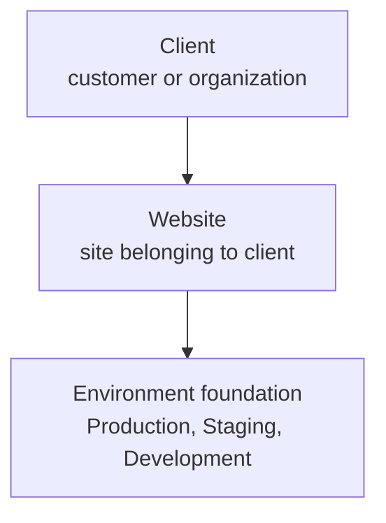

Example:

```text
Client:      Acme Corporation
Website:     acme.com
Environment: Production
Base URL:    https://acme.com
```

The Client and Website pages are available now. Environment persistence exists
to support the website enablement rule, but Environment CRUD is intentionally
deferred.

Endpoint records are also deferred. Therefore endpoint-level grants and endpoint
owner overrides are not part of this vertical slice.

## Where the code lives

### Application contracts

```text
src/WebHealth.Application/Registry/
├── RegistryContracts.cs
├── IClientRegistryService.cs
├── IWebsiteRegistryService.cs
└── IRegistryReader.cs
```

These contracts separate web requests from the registry business operations.

Important contracts include:

- `IRegistryReader`: filtered reads for clients and websites;
- `IClientRegistryService`: client mutations;
- `IWebsiteRegistryService`: website mutations;
- `RegistryAccessContext`: the current user ID and roles used by the service.

### Infrastructure implementation

```text
src/WebHealth.Infrastructure/Registry/
├── RegistryEntities.cs
├── RegistryReader.cs
├── RegistryVisibility.cs
├── ClientRegistryService.cs
├── WebsiteRegistryService.cs
├── RegistryMutationSupport.cs
└── RegistryEntityConfigurations.cs
```

### Web implementation

```text
src/WebHealth.Web/
├── Controllers/RegistryController.cs
├── Models/RegistryViewModels.cs
└── Views/Registry/
    ├── Clients.cshtml
    ├── Client.cshtml
    ├── CreateClient.cshtml
    ├── EditClient.cshtml
    ├── Websites.cshtml
    ├── Website.cshtml
    ├── CreateWebsite.cshtml
    └── EditWebsite.cshtml
```

## Registry authorization

Two new policies are registered in `Program.cs`:

| Policy | Roles | Purpose |
|---|---|---|
| `ReadRegistry` | Administrator, Operations, Developer/Support, Viewer | Open registry pages and read allowed rows |
| `ManageRegistry` | Administrator, Operations | Create, edit, disable, delete, and restore registry rows |

The controller uses the read policy at class level:

```csharp
[Authorize(Policy = AuthorizationPolicies.ReadRegistry)]
```

Mutation actions add the stronger policy:

```csharp
[Authorize(Policy = AuthorizationPolicies.ManageRegistry)]
```

This creates two layers:

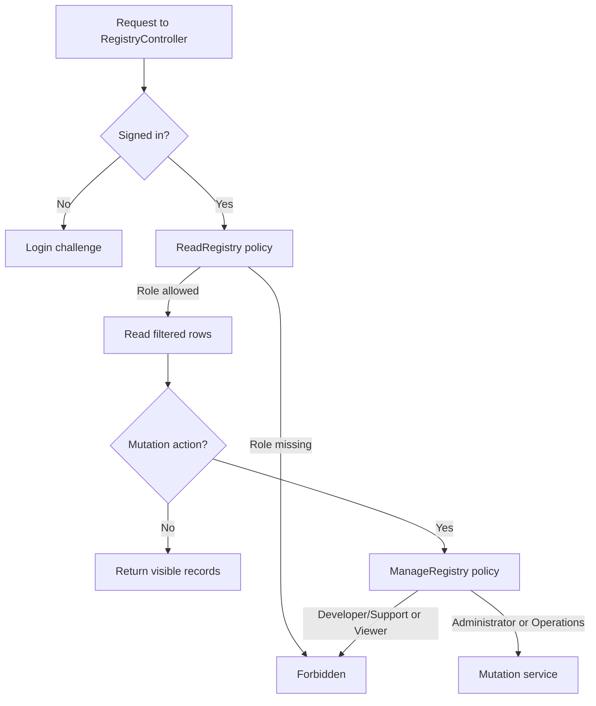

The service checks management access again. The controller policy protects the
HTTP route, while the service check protects the application operation if it is
called from another entry point.

## What each role can see

The current global baseline is:

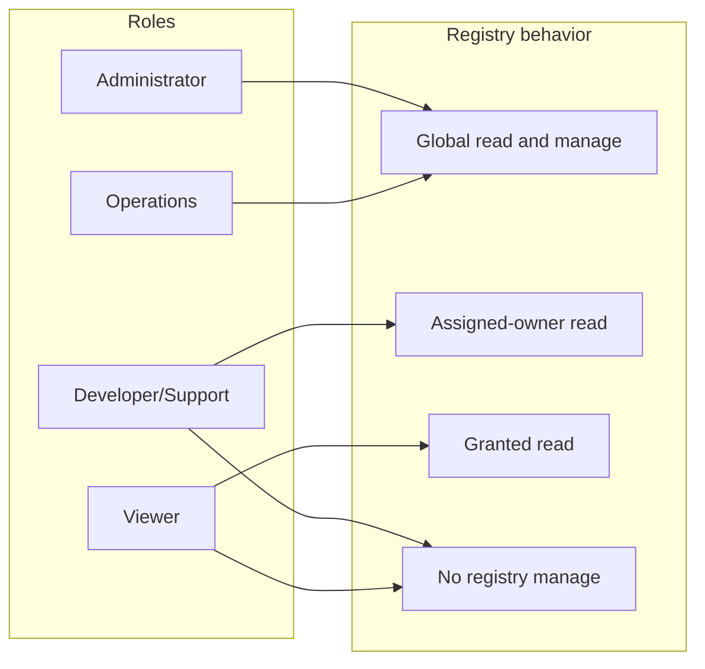

More precisely:

- **Administrator** and **Operations** can read all registry rows and manage them.
- **Developer/Support** can read records owned by the user or an effective team
  membership.
- **Viewer** can read records covered by an active access grant.
- **Developer/Support** and **Viewer** cannot use registry mutation actions.

Hiding a navigation link is only a usability improvement. The policies and
query filters remain the real security boundaries.

## Assignment-aware query filtering

`RegistryReader` does not load every row and filter it in the browser. It applies
visibility rules to the database query before the results are returned.

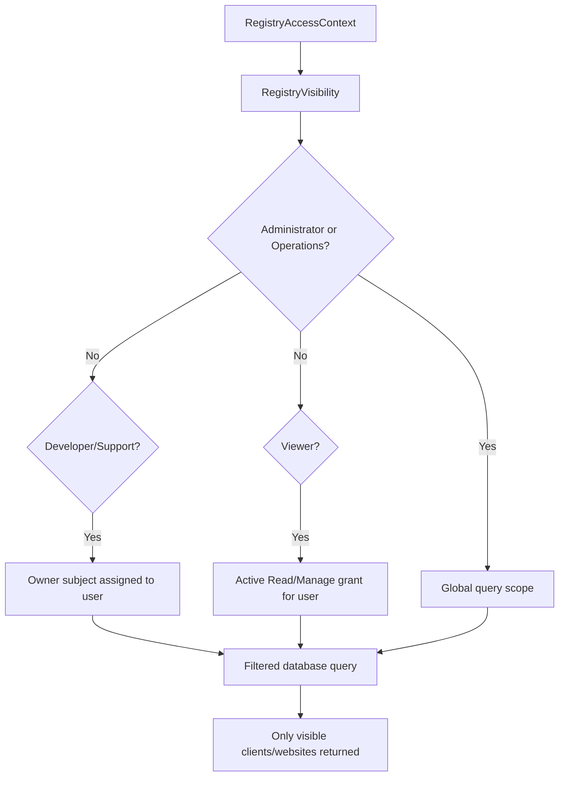

The current evaluator checks:

- the user is enabled;
- direct user ownership;
- effective team membership;
- the team is enabled;
- the membership is active at the current time.

The grant filter checks:

- the grant belongs to the current user;
- the grant has started;
- it has not expired;
- it has not been revoked;
- the user is enabled.

## Ownership inheritance

Ownership is stored independently on both Client and Website records.

For Developer/Support visibility, ownership flows like this:

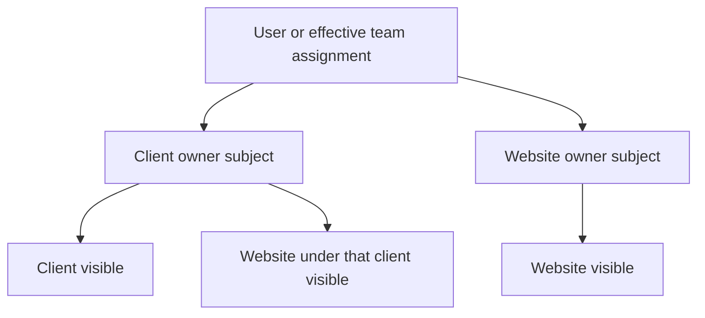

Therefore a Developer/Support user can see a website when either:

- the website is owned by the user or an assigned team; or
- the containing Client is owned by the user or an assigned team.

For Viewer grants, visibility can flow from:

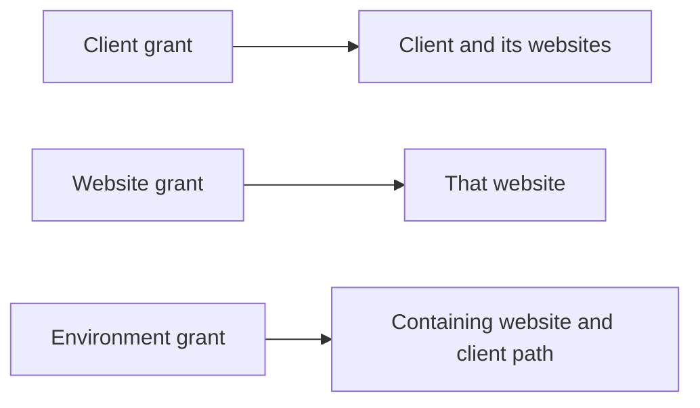

Endpoint inheritance and endpoint overrides are deferred until an Endpoint
entity exists.

## Access grants

The `access_grant` table represents a user’s scoped access. Each row must point to
exactly one scope:

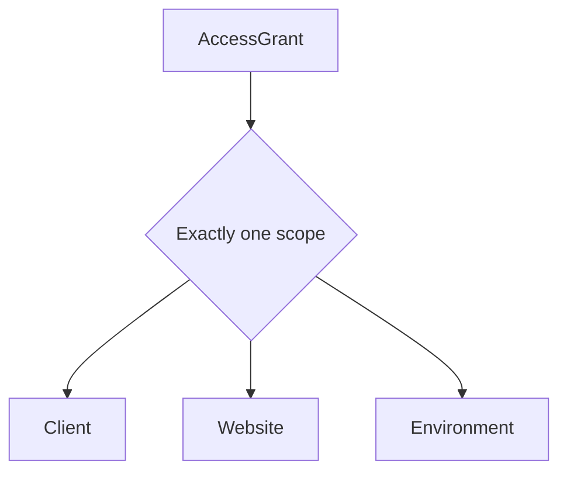

The database allows only these access levels:

```text
Read
Manage
```

It also validates that an expiry, when present, occurs after the grant starts.
The current vertical slice uses active grants to scope Viewer reads. A complete
grant-management UI and resource-specific Manage enforcement belong to later
work; global registry management remains controlled by the Administrator and
Operations policy.

## Client lifecycle

Administrators and Operations users can:

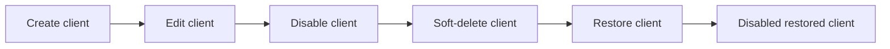

Deletion is soft deletion. The row remains in the database with `DeletedAt` and
`DeletedByUserId`, preserving relationships and audit history.

Normal operational lists exclude deleted rows. Administrator and Operations use
the separate Archived registry view to review and restore them; assignment-scoped
roles cannot query the archive.

An active client name must be unique after normalization. Deleted names may be
reused because the unique index applies only while `deleted_at IS NULL`.

## Website lifecycle and environment rule

Websites have a parent Client and their own owner subject.

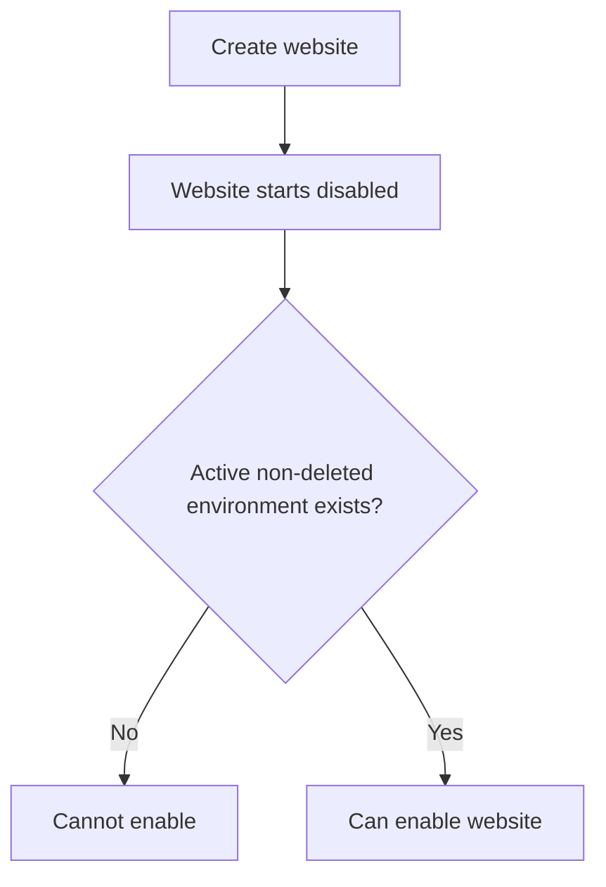

The same invariant is enforced twice:

1. application service validation gives a useful error message;
2. PostgreSQL deferred constraint triggers protect the database at commit time.

This prevents a website from being enabled without an active Environment and
prevents the final active Environment from being removed while the Website is
enabled.

The current UI creates and edits Clients and Websites. Environment CRUD is
intentionally deferred, so enabling a website currently requires Environment
data to be created through the supported database/test setup.

## Normalization and uniqueness

Names are normalized before comparison:

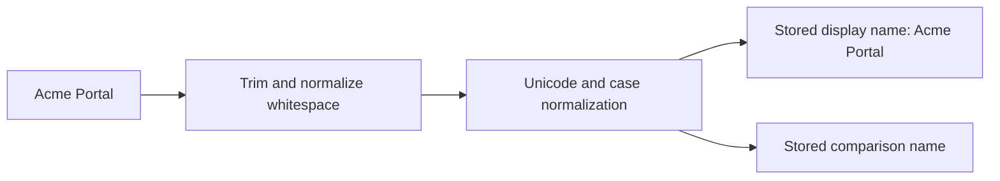

The database provides the final duplicate defense:

| Record | Uniqueness rule |
|---|---|
| Client | Normalized name is globally unique while not deleted |
| Website | Normalized name is unique within a Client while not deleted |
| Environment | Normalized name is unique within a Website while not deleted |

The same normalization helper is shared with earlier team and identity-related
rules instead of reimplementing string comparison in each service.

## Optimistic concurrency

Every Client and Website has a `Version` value. The edit form sends the version
that was displayed to the user.

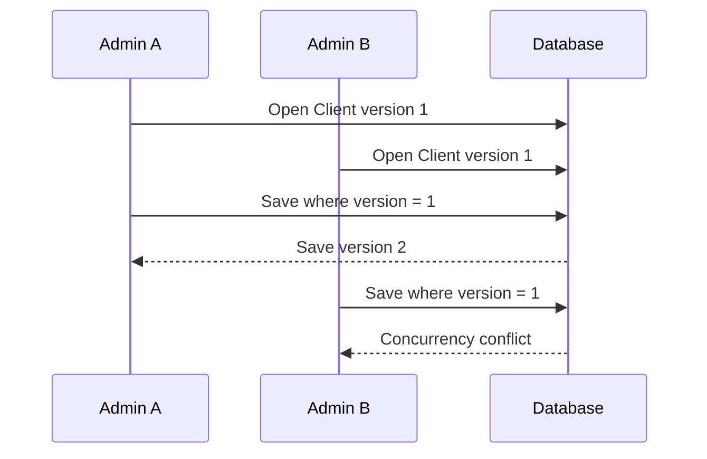

The second update does not silently overwrite the first update. The web layer
returns a safe reload message and preserves the stale version token, so submitting
the unchanged stale form again cannot overwrite the newer database state.

## Audit integration

Every successful Client and Website mutation writes a typed, allow-listed audit
snapshot in the same transaction as the state change.

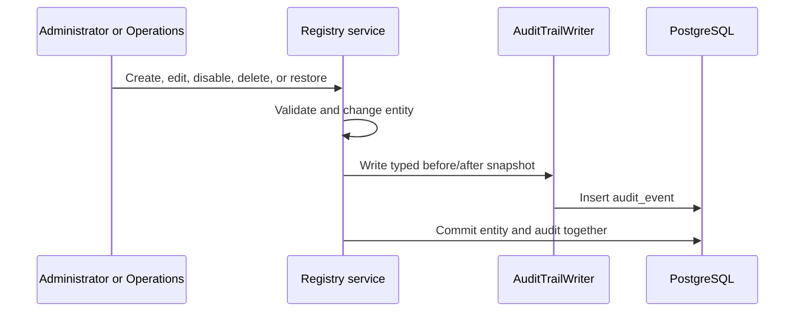

Client snapshots contain:

- Client ID;
- name;
- owner subject ID;
- active state;
- deleted state;
- version.

Website snapshots contain:

- Website ID;
- Client ID;
- name;
- owner subject ID;
- technology/CMS;
- enabled state;
- deleted state;
- version.

Client note contents are deliberately excluded from audit snapshots. A safe
`NotesChanged` flag still records whether a mutation changed them. Passwords,
tokens, and arbitrary request data are also excluded.

Actions include:

```text
client.created
client.updated
client.disabled
client.deleted
client.restored

website.created
website.updated
website.disabled
website.deleted
website.restored
```

## Database migration

The explicit migration is:

```text
20260814110940_ClientWebsiteVerticalSlice
```

It adds:

```text
web_health.client
web_health.website
web_health.environment
web_health.access_grant
```

It also adds foreign keys, indexes, uniqueness rules, access-grant checks, and
the deferred website/environment constraint triggers.

The application does not apply migrations automatically at startup. The migration
was applied explicitly to the disposable native PostgreSQL verification database;
development databases must be updated explicitly when the change is adopted.

## Verification evidence

The implementation tests verify:

- all five current migrations apply with no pending migrations;
- Clients and Websites can be created and queried;
- duplicate names are rejected after normalization;
- Developer/Support ownership filtering works;
- Viewer client, website, and environment grants scope results;
- disabled owners are rejected for new mutations;
- stale versions return concurrency conflicts;
- website enablement requires an active Environment;
- soft-delete, restore, and disable lifecycle actions work;
- Client and Website audit actions are recorded;
- audit snapshots contain only approved fields.

Authorization tests verify:

| Role | Registry read | Registry manage |
|---|---:|---:|
| Administrator | Allowed | Allowed |
| Operations | Allowed | Allowed |
| Developer/Support | Allowed, assignment-scoped | Forbidden |
| Viewer | Allowed, grant-scoped | Forbidden |

## What is intentionally deferred

This vertical slice does not yet include:

1. Environment CRUD screens and services.
2. Endpoint records and Endpoint CRUD.
3. Endpoint-level grants.
4. Website endpoint-owner override.
5. Grant administration UI.
6. Full resource-specific `Manage` grant enforcement.
7. Monitoring checks and endpoint configuration.
8. Registry-specific assignment screens beyond owner selection.

## The complete Phase 2 mental model

When a future monitoring request needs to decide whether a user can access a
resource, trace it through this sequence:

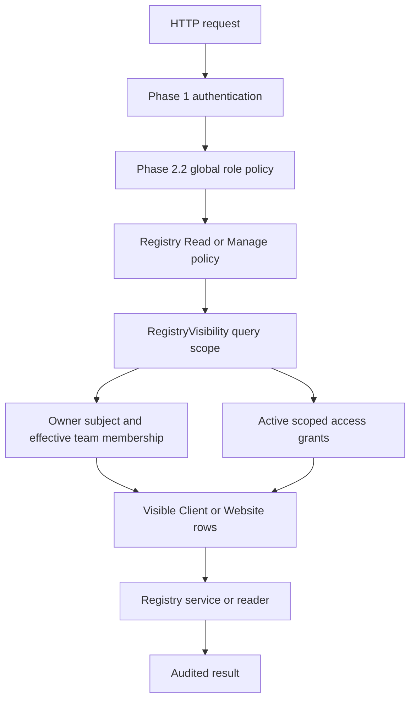

In plain language:

```text
Phase 1 identifies the user.
Phase 2.2 checks the user’s global role.
Phase 2.3 supplies ownership, teams, membership, and audit history.
Phase 2.4 applies those rules to real Client and Website records.
The next increment adds Environments and Endpoints to complete the registry.
```
