# Phase 2.5: Environment and Endpoint Vertical Slice Explained

This guide explains the Environment and Endpoint registry implementation and
connects it to the identity, authorization, assignment, audit, Client, and
Website work from the previous phases.

## The main idea

Phase 2.4 created Clients and Websites. Phase 2.5 completes the registry target
hierarchy by adding Environments and Endpoints:

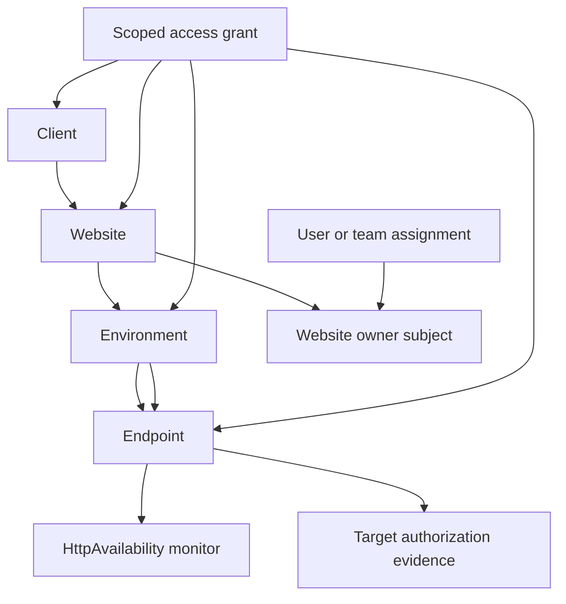

The result is another working vertical slice: persistence, validation,
authorization, filtered reads, MVC pages, lifecycle operations, URL identity,
monitor configuration defaults, and audit events work together.

This phase prepares endpoints to be monitored. It does **not** perform HTTP
requests, schedule jobs, resolve DNS, or record check results. Those are Phase 3
responsibilities.

## What was delivered

The implementation now supports:

1. Environment list, details, create, edit, disable, soft-delete, restore, and
   manager-only archive flows.
2. Endpoint list, details, create, edit, disable, soft-delete, restore, and
   manager-only archive flows.
3. Supported environment types: Production, Staging, Preproduction, Test,
   Development, and Custom.
4. Environment name uniqueness within a Website after normalization.
5. Endpoint URL normalization and stable canonical URL identity.
6. Production HTTPS enforcement, with an Administrator-approved HTTP exception.
7. Endpoint owner inheritance from the Website, with an optional enabled
   user/team override.
8. Endpoint-scoped access grants for scoped reads.
9. Developer/Support ownership-based target reads and test authorization.
10. Viewer grant-scoped reads without target-testing permission.
11. Automatic creation of an `HttpAvailability` monitor using the seeded system
    policy profile.
12. Host/port-scoped personal ownership or explicit testing-permission evidence.
13. Central effective eligibility across Website, Environment, Endpoint,
    configured monitor, and current authorization-evidence state.
14. Optimistic concurrency, lifecycle auditing, and manager-only archive reads.

## How the phases connect

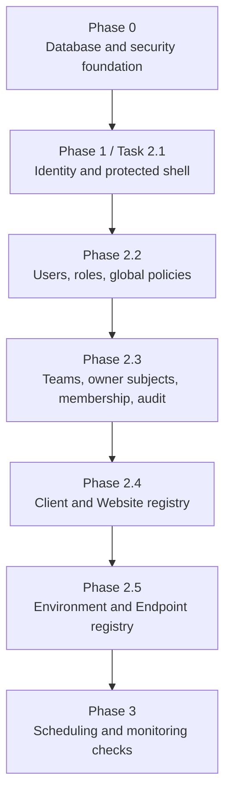

### Phase 0 supplied the safety foundation

Phase 2.5 uses the Phase 0 conventions for:

- PostgreSQL and the `web_health` schema;
- explicit, reproducible migrations;
- normalized names and canonical endpoint URLs;
- restrictive foreign keys and database constraints;
- optimistic concurrency;
- bounded input and safe error handling;
- SSRF and prohibited-network protections;
- database enforcement as the final correctness boundary.

The endpoint URL rule is especially important because URLs are both user input
and future outbound connection targets.

### Phase 1 supplied identity

Phase 1 supplies the current authenticated user, enabled-user handling,
Identity cookies, and the bootstrap Administrator. That identity is used to:

- record who created or changed an Environment or Endpoint;
- determine whether a user is an Administrator;
- preserve safe audit history;
- enforce production HTTP exception approval.

### Phase 2.2 supplied global authorization

Phase 2.2 supplies the application roles and global policies:

- Administrator;
- Operations;
- Developer/Support;
- Viewer.

These policies answer the broad question, “May this role access registry or
target operations?” Target-level filtering then answers, “Which records may this
user access?”

### Phase 2.3 supplied ownership and audit

Phase 2.3 supplies:

- users and teams as owner subjects;
- effective team membership;
- assignment evaluation;
- append-only audit events.

Phase 2.5 reuses those facilities for endpoint ownership, inherited ownership,
test authorization, and typed audit snapshots.

### Phase 2.4 supplied the parent registry records

Phase 2.4 supplied Clients, Websites, scoped grants, lifecycle conventions, and
the first registry visibility rules. Phase 2.5 adds the child records needed to
identify actual monitoring targets.

## The registry hierarchy

The complete registry hierarchy is now:

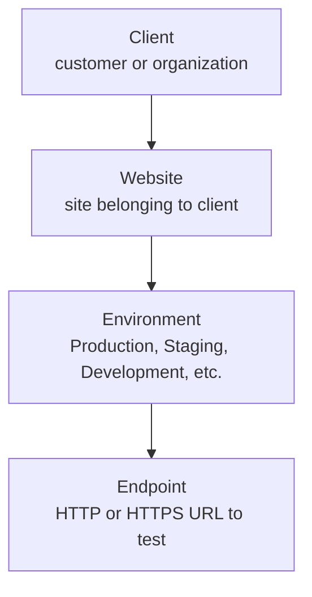

Example:

```text
Client:       Acme Corporation
Website:      acme.com
Environment:  Production
Base URL:     https://acme.com
Endpoint:     https://acme.com/health
```

An Environment describes where a Website is deployed. An Endpoint is the
specific URL that a future monitoring check will contact.

## Where the code lives

### Domain rules

```text
src/WebHealth.Domain/Normalization/
├── NameNormalizer.cs
└── EndpointUrlNormalizer.cs
```

`NameNormalizer` provides shared name comparison rules. `EndpointUrlNormalizer`
validates and canonicalizes endpoint URLs without depending on MVC or the
database.

### Application contracts

```text
src/WebHealth.Application/Registry/
├── TargetContracts.cs
├── IEnvironmentRegistryService.cs
├── IEndpointRegistryService.cs
├── ITargetRegistryReader.cs
├── ITargetAuthorizationService.cs
└── IMonitoringEligibilityService.cs
```

These contracts describe the use cases without exposing Entity Framework or
PostgreSQL to the Web layer.

Important contracts include:

- `IEnvironmentRegistryService`: Environment mutations;
- `IEndpointRegistryService`: Endpoint mutations;
- `ITargetRegistryReader`: filtered Environment and Endpoint reads;
- `ITargetAuthorizationService`: whether a user may test a target;
- `IMonitoringEligibilityService`: whether an Endpoint is ready for future
  monitoring.

### Infrastructure implementation

```text
src/WebHealth.Infrastructure/Registry/
├── EnvironmentRegistryService.cs
├── EndpointRegistryService.cs
├── TargetRegistryReader.cs
├── TargetAuthorizationService.cs
├── MonitoringEligibility.cs
├── RegistryEntities.cs
└── RegistryEntityConfigurations.cs
```

Infrastructure implements the contracts, applies database queries and
transactions, and persists registry and monitoring configuration records.

### Web implementation

```text
src/WebHealth.Web/
├── Controllers/TargetsController.cs
├── Models/TargetViewModels.cs
└── Views/Targets/
```

The Web layer handles routes, forms, model binding, authorization attributes,
and conversion of application results into pages. It does not decide URL
identity or construct SQL queries.

## Authorization has two dimensions

Target access uses both a global role policy and a resource-level decision:

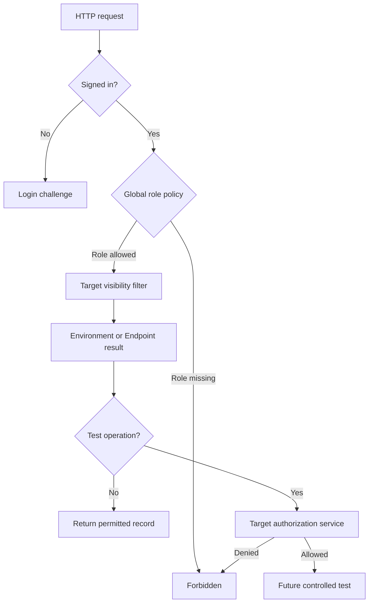

The current baseline is:

| Role | Environment/Endpoint read | Manage registry | Test target |
|---|---:|---:|---:|
| Administrator | All | Allowed | Allowed when effectively eligible |
| Operations | All | Allowed | Allowed when effectively eligible |
| Developer/Support | Ownership-scoped | Forbidden | Allowed when authorized |
| Viewer | Grant-scoped | Forbidden | Forbidden |

The controller policy protects the route. The application service checks the
operation again so that another entry point cannot bypass the rule.

## Ownership and visibility inheritance

Endpoint ownership normally follows the Website owner:

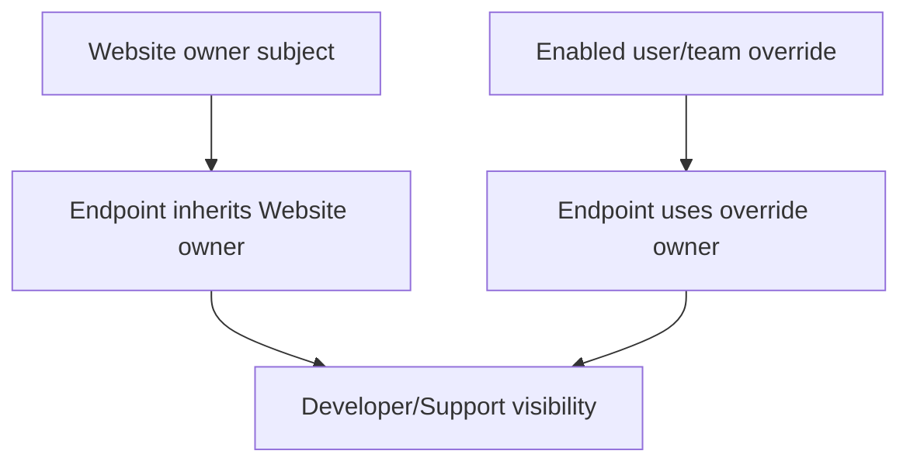

For Developer/Support users, an Endpoint is visible only when its single
effective owner subject is assigned to the user or an effective team
membership. An explicit Endpoint owner replaces the inherited Website owner;
Client or Website ownership does not remain as an additional Endpoint access
path after that override.

For Viewers, active grants can be scoped to the Client, Website, Environment, or
Endpoint:

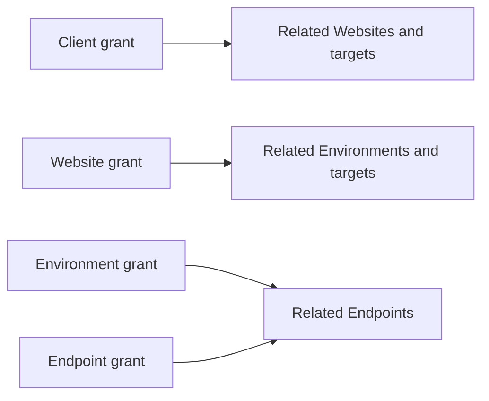

An access grant provides visibility. It does not automatically give a Viewer
permission to test an endpoint.

## Environment rules

Environment names are normalized and unique within their Website while the
record is not deleted. Environment types are limited to the supported values:

```text
Production
Staging
Preproduction
Test
Development
Custom
```

`Production` and `IsProduction` must remain consistent. The application validates
the relationship and PostgreSQL provides the final constraint boundary.

Environments have the same lifecycle pattern used by Clients and Websites:

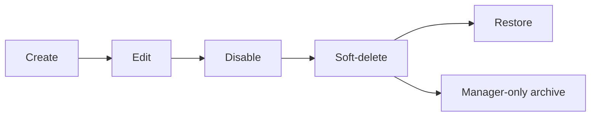

Operational queries exclude deleted rows. Archive queries are restricted to
Administrator and Operations users.

## Endpoint URL identity and safety

The application keeps a display URL for users and a canonical URL for identity:

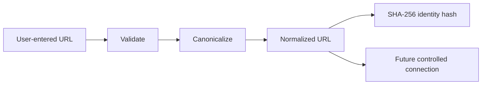

The normalizer:

- requires an absolute HTTP or HTTPS URL;
- rejects credentials, fragments, unsupported schemes, and IPv6 zone
  identifiers;
- normalizes scheme, IDNA host, trailing host dot, default port, empty path,
  dot segments, and safe percent escapes;
- preserves path case, trailing-slash identity, and significant query order;
- bounds the input and stores the normalization version.

PostgreSQL enforces uniqueness using the URL hash and normalization version.
After a hash conflict, the service compares canonical text so a theoretical hash
collision is not silently treated as a duplicate URL.

## Production HTTPS rule

Production endpoints require HTTPS:

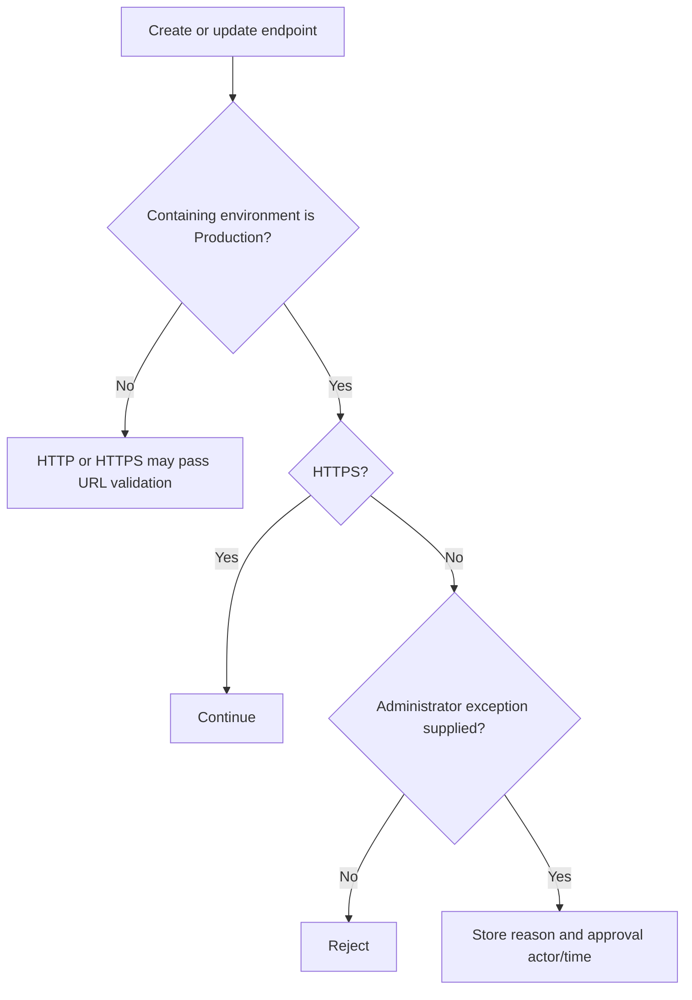

Only an Administrator may approve the HTTP exception. The reason is bounded and
shown only to Administrator and Operations users. Scoped users see only whether
exception evidence exists.

The rule is enforced both by application validation and deferred PostgreSQL
triggers. This protects the invariant even if data changes occur through a
different transaction path.

## Endpoint monitor foundation

Creating an Endpoint also creates one `HttpAvailability` monitor linked to the
seeded system policy profile:

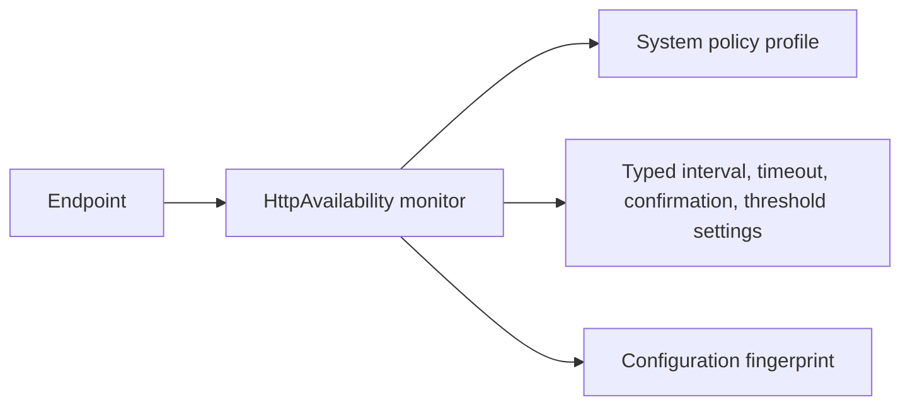

This prepares monitoring configuration but does not run monitoring. The initial
record intentionally leaves `ScheduleAnchor` and `NextDueAt` empty.

Not yet performed in this phase:

- HTTP requests;
- DNS resolution;
- redirect checks;
- Hangfire enqueueing;
- schedules and leases;
- logical checks and results;
- incidents, notifications, and history.

Those belong to Phase 3.

## Audit and optimistic concurrency

Every successful Environment and Endpoint mutation writes a typed audit event in
the same transaction as the state change:

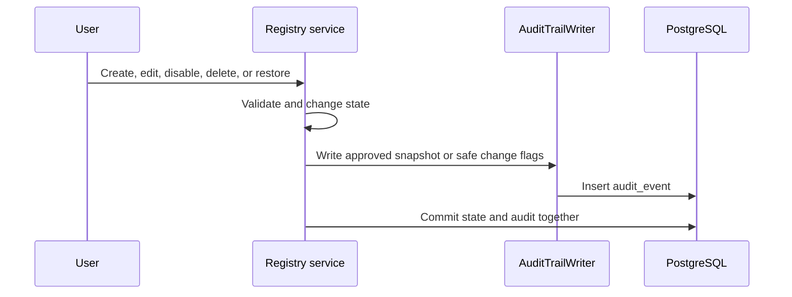

Endpoint URLs are not copied into audit JSON. URL changes are represented using
safe change information and URL hashes. HTTP exception reasons are also not
copied into audit snapshots.

Edits and lifecycle operations use the submitted original `Version`. If another
user has changed the record, the update fails with a concurrency conflict rather
than overwriting the newer state.

## Database migration

The explicit migrations are:

```text
RegistryFoundation
```

It adds or completes persistence for:

```text
Environment
Endpoint
EndpointMonitor
PolicyProfile
TargetAuthorizationEvidence
endpoint-scoped access grants
```

It also adds foreign keys, indexes, uniqueness rules, URL and environment
constraints, deterministic default policy data, and deferred cross-table
enforcement.

Migrations are not applied automatically when the application starts. They must
be applied explicitly to the development or verification database.

## Verification evidence

Verification covers:

- clean PostgreSQL migration application;
- Environment and Endpoint creation, reading, uniqueness, lifecycle, and
  concurrency;
- typed audit actions and safe audit contents;
- URL normalization, rejection boundaries, and stable SHA-256 identity;
- automatic `HttpAvailability` monitor and policy-profile creation;
- no scheduling timestamps or outbound requests during creation;
- Administrator-only Production HTTP exceptions at service and database
  boundaries;
- consistency between policy profile and monitor type;
- Developer ownership-based target testing authorization;
- active external-target evidence and effective monitoring eligibility;
- owner-override denial through the previously inherited owner;
- Production HTTP Environment, reassignment, and URL transition rejection;
- Viewer denial of target testing;
- endpoint-scoped Viewer grants;
- manager-only archive queries.

## What is intentionally deferred

This vertical slice does not yet include:

1. Scheduled monitoring execution.
2. Hangfire jobs, leases, and `next_due_at` calculation.
3. HTTP, DNS, TLS, redirect, SEO, or crawl checks.
4. Check results, history, incidents, recovery, or notifications.
5. Grant administration screens.
6. Full resource-specific `Manage` grant enforcement.
7. Browser-based synthetic monitoring.
8. Production deployment or operational rollout.

## The complete Phase 2 mental model

When a future monitoring request needs to decide whether it may test a target,
trace it through the Phase 2 layers:

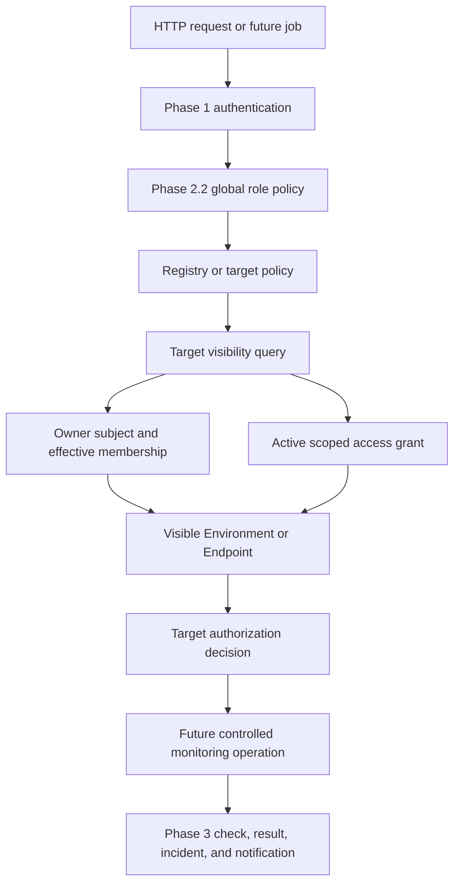

In plain language:

```text
Phase 1 identifies the user.
Phase 2.2 checks the user's global role.
Phase 2.3 supplies teams, ownership, effective membership, and audit history.
Phase 2.4 supplies Clients, Websites, and scoped registry visibility.
Phase 2.5 identifies Environments and safe Endpoint targets.
Phase 3 will use those authorized targets to run monitoring checks.
```
