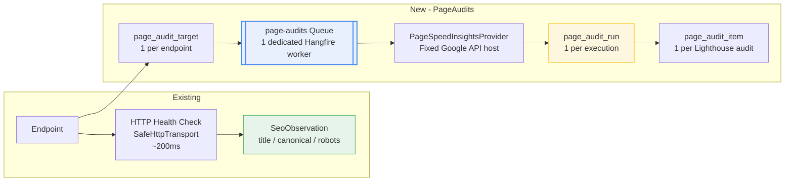
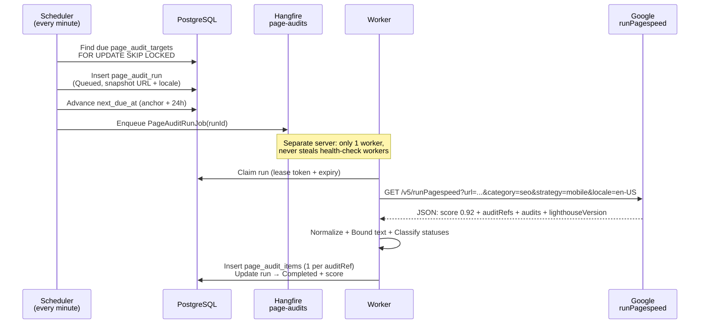
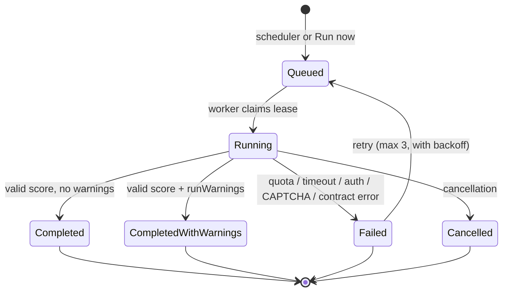
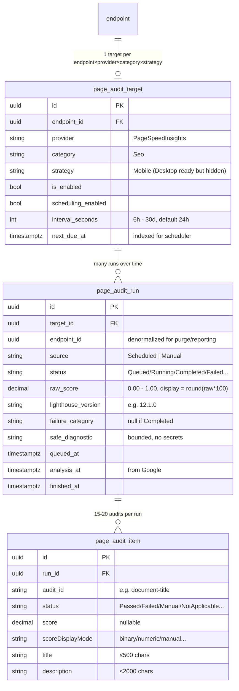
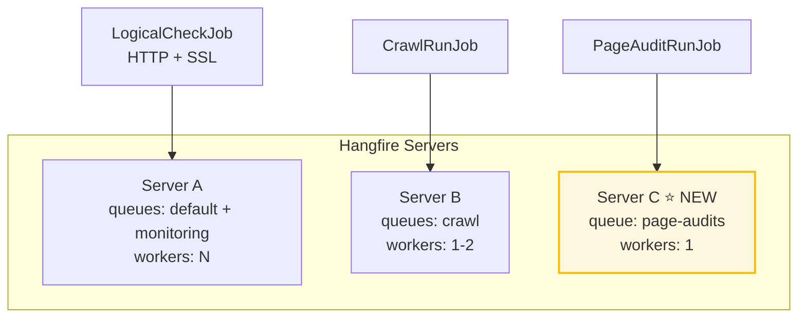
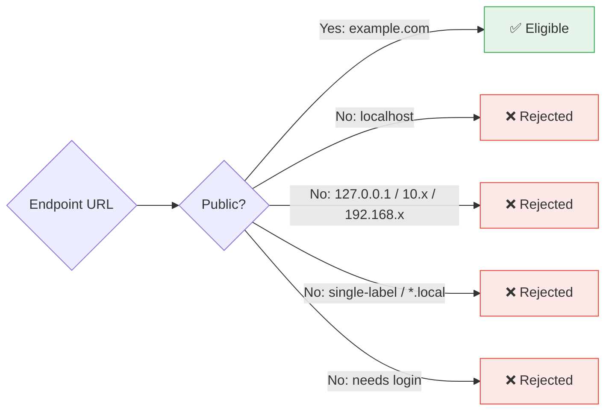
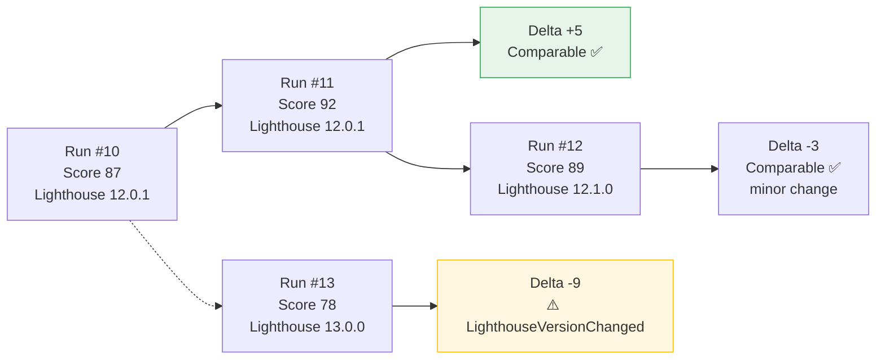

# SEO Integration Explained — PageSpeed Insights in WebHealth

> **Plain-English companion** to the full plan in
> `PageSpeed_Insights_SEO_Audit_Implementation_Plan.md` (8-11 days).
> This file answers **what it is, how it works, and what the architecture looks like** — no deep implementation detail.

**One-line summary:** WebHealth will ask **Google's PageSpeed Insights API** to run **Lighthouse SEO** on your public pages, save a small normalized result, and show you the **score + which audits passed/failed + how it changed** — without slowing down any existing health checks.

---

## 1. What are we adding, exactly?

Not a full performance tester. Not a rank predictor.

We call **one Google API** (`runPagespeed`), ask for **one category** (`seo`), on **one strategy** (`mobile`), in **one language** (`en-US`), and store only what we need.

**You see:** `Lighthouse technical SEO score: 92 / 100` + a list of audits + history + delta vs last run.

**We never say:** "Your Google ranking will be X". It's a **technical audit**, not a traffic prediction.

| Feature | What you get |
| :--- | :--- |
| **Score** | 0–100, derived from Lighthouse 0–1 score (`92` = raw `0.92`) |
| **Audits** | ~15–20 items: `Passed`, `Failed`, `Manual`, `Not Applicable` |
| **History** | Every run with time + Lighthouse version |
| **Delta** | `+4` vs previous run, flagged if Lighthouse major version changed |

---

## 2. Why a separate subsystem? (The 10-second reason)

WebHealth already has **local SEO checks** (`SeoObservation`):

> "Did the HTML we fetched have a title? A canonical? A noindex?"

The new feature is **Google's remote audit**:

> "Google loaded this public URL on its infrastructure and ran Lighthouse."

They are different worlds:

- Different initiator (our HTTP check vs Google's infra)
- Different speed (200ms vs 10–90 seconds)
- Different failures (timeout vs quota / CAPTCHA / Lighthouse error)
- Different data (our extracted values vs Lighthouse audit collection)

Putting both into one table would make one table mean two things.  
Putting a 60-second Google call into the short health-check queue would block availability monitoring.

**So we copy the crawler pattern** — its own tables, its own queue, its own worker.



> **Read it left to right:** Endpoint has two paths. Top = fast local check. Bottom = slow Google audit via isolated queue.

---

## 3. How it works — The life of an audit

### 3.1 From the user's point of view

1.  Go to **Targets → Endpoint → Enable "Google PageSpeed SEO audits"** + optionally "run on schedule (every 24h)".
2.  Click **Run now** (if you have `TestRegistryTargets` permission) → you see a new Queued/Running run.
3.  A minute later the page shows: **Score 92**, **3 failed audits**, **12 passed**, **1 manual**.
4.  Click an older run in the history list → the detail panel re-renders for that run.
5.  The delta says **-5 vs previous (Lighthouse 12.1.0 → same)** or **"Version changed"** if Google updated Lighthouse.

### 3.2 Behind the scenes (scheduled)



**Key rule:** We never hold a DB transaction while talking to Google.

### 3.3 On-demand (Run now)

Same flow, except:
- You click **Run now** → controller checks authorization → creates **one Queued run** *if* no active run exists for that target.
- If a run is already Queued/Running we return **the existing run** — no duplicate.



> **Important:** A `Failed` *audit* (e.g., "Links missing `rel`") does **NOT** make the *run* Failed. The run is `Completed` and contains a `Failed` item.

---

## 4. Architecture — The 3 new tables

We store **only normalized values**. No raw JSON, no screenshots, no traces, no `details` blobs. They are huge, version-dependent, and not needed for V1.



**Enforced by PostgreSQL:**

- Unique `(endpoint_id, provider, category, strategy)` — one target per shape.
- Partial unique "only one Queued/Running per target" — prevents duplicates.
- Unique `(run_id, audit_id)` — no duplicate audit in a run.
- `raw_score` is `NULL OR 0..1`.
- Terminal status must have `finished_at`.

### Where the tables live in code

```
src/WebHealth.Domain/PageAudits/       → vocabulary, eligibility, normalization (pure logic)
src/WebHealth.Application/PageAudits/  → IPageAuditProvider, IPageAuditReader (interfaces)
src/WebHealth.Infrastructure/PageAudits/ → entities, PageSpeedInsightsProvider, reader, scheduler, jobs
src/WebHealth.Web/PageAudits/          → controller + one view (Index.cshtml)
```

The provider interface is the **swap seam**: tomorrow we could add `SelfHostedLighthouseProvider` without redesigning anything.

---

## 5. The isolated worker — Why it matters

If PageSpeed shared the normal health-check queue, **one slow Google call (60s) would block 12 availability checks (5s each)**.

We fix this with queue isolation — same pattern the crawler already uses:



> **Guarantee:** PageSpeed work **never** consumes a health-check or crawl worker.

---

## 6. What we send to Google (and what we don't)

### Request — always the same shape

```http
GET https://pagespeedonline.googleapis.com/pagespeedonline/v5/runPagespeed
    ?url=https%3A%2F%2Fexample.com%2F
    &category=seo
    &strategy=mobile
    &locale=en-US
    &key=REDACTED
```

- `category=seo` is **always** sent (default would be performance).
- `strategy` is **always** explicit (`mobile` in V1).
- `locale=en-US` fixes titles/descriptions so stored text is stable.
- Base host `pagespeedonline.googleapis.com` is a **constant**, not config — prevents abuse as a generic HTTP client.
- Endpoint URL is built with a URI builder, escaped exactly once.

### What we read from the response

Only:

```
lighthouseResult.lighthouseVersion
lighthouseResult.categories.seo.score
lighthouseResult.categories.seo.auditRefs[]  ← membership list
lighthouseResult.audits[<id>].title/description/score/scoreDisplayMode/...
lighthouseResult.runWarnings
lighthouseResult.runtimeError
```

We **iterate `auditRefs`**, not `audits` — only SEO-relevant audits.

### What we deliberately ignore (V1)

`loadingExperience`, `originLoadingExperience`, CrUX, screenshots, traces, `details`, stack packs, full HTML.  
**Reason:** They are large, noisy, or being removed from the PageSpeed API (CrUX). This is an SEO feature, not a performance lab.

---

## 7. Eligibility & Privacy — Public pages only

A target is eligible **only if**:

- Endpoint exists, not deleted, owner is active
- URL is **HTTP/HTTPS**, no credentials/fragment
- Target is `is_enabled = true`
- No active (Queued/Running) run already exists
- Target has current authorization
- Host is **public**:



The endpoint form shows a clear disclosure:

> "PageSpeed auditing sends this public URL to Google and asks Google infrastructure to load it. Do not enable it for private, secret, authenticated, or internal-only URLs."

We use the **stored normalized endpoint URL** — the user cannot type an arbitrary URL into `Run now`.

---

## 8. Scheduling, leases, and retries — Made simple

| Concept | How it works |
|---|---|
| **Default cadence** | Disabled until you enable it. Then **every 24 hours** (configurable 6h–30d). |
| **Claim** | Dispatcher uses `FOR UPDATE SKIP LOCKED` — two schedulers never grab the same target. |
| **Lease** | Worker writes a `lease_token + lease_expires_at`. Only the lease holder can complete the run. |
| **Enqueue after commit** | We commit the `Queued` row **before** enqueuing the job. No transaction held during the Google call. |
| **Reconciliation** | A sweep re-enqueues `Queued` runs stuck too long, or `Running` runs with expired leases — safely, because the job is idempotent. |
| **Retries** | **Max 3 attempts**, explicit backoff (immediate → 60s → 5 min). Honors `Retry-After` for 429/503. `AutomaticRetry(Attempts=0)` — we control it. |
| **Failure handling** | Normalized into bounded categories; never store the raw Google error body or API key. |

**Failure categories:**

`ProviderRateLimited` · `ProviderUnavailable` · `ProviderTimeout` · `ProviderAuthenticationFailed` · `TargetRejected` · `CaptchaBlocked` · `LighthouseRuntimeError` · `ProviderContractInvalid` · `ProviderResponseTooLarge` · `Cancelled`

---

## 9. Score display & Comparison

**Stored:** `raw_score = 0.92` (decimal 0–1)  
**Shown:** `92 / 100` via `round(raw_score * 100, AwayFromZero)`

| Raw | Display |
|---|---|
| `0.00` | 0 |
| `0.924` | 92 |
| `0.995` | 100 |
| `1.00` | 100 |

**Delta & comparability:**

We compare against the **latest earlier Completed run** with the **same endpoint + provider + category + strategy + locale**.

- Same Lighthouse **major** version → `Comparable` → show delta normally.
- Different **major** version (e.g., `11.x → 12.x`) → `LighthouseVersionChanged` → still show delta but **label it** as spanning a tool change (audits may have been added/removed).
- Minor version change → still `Comparable`.



---

## 10. UI — One page, two integration points

### 10.1 New page: `/PageAudits`

One view (`Views/PageAudits/Index.cshtml`) in the dashboard card style:

**Header / Summary card:**

- Endpoint selector
- Enabled / Scheduling state + provider + strategy
- Latest Lighthouse score (big number) + delta + comparability badge
- Lighthouse version + analysis timestamp
- Counts: `3 Failed · 12 Passed · 1 Manual · 2 N/A · 1 Informative`
- History list (bounded, paged)
- **Run now** button (authorized users only)

**Detail — expandable sections on the same page (selected run):**

1.  ❌ Failed automated audits
2.  ✅ Passed audits
3.  👤 Manual checks (e.g., structured data — never counts as failed)
4.  `—` Not Applicable
5.  `i` Informative / Scored
6.  ⚠️ Audit errors + run warnings

> Selecting a run from history **re-renders the same page** for that run. No separate details page in V1.
> Provider text is rendered as **plain text** (HTML-encoded). Lighthouse descriptions may contain Markdown links — we don't add a Markdown renderer in V1.

### 10.2 Existing page: `/Seo` (small integration)

Keep `/Seo` focused on WebHealth's own policy checks. Add a compact line:

```
PageSpeed: 92 Mobile, audited 4h ago → View audits
```

Links to `/PageAudits?endpointId=...`. We **do not** merge Lighthouse audits into `SeoFindingGroups` in V1 — those groups are built around stable WebHealth rule keys.

---

## 11. Local SEO vs PageSpeed — Don't confuse them

| | **WebHealth SEO (existing)** | **PageSpeed SEO (new)** |
|---|---|---|
| **Who loads the page?** | WebHealth itself (`SafeHttpTransport`) | Google's infrastructure |
| **What it checks** | Our policy: missing title, empty description, canonical host, `noindex` on prod, robots `Disallow: /`, sitemap | Lighthouse's ~20 generic SEO audits |
| **Authoritative for** | `expected canonical host`, prod vs non-prod indexing policy, required sitemap | Nothing policy-specific — just the generic Lighthouse view |
| **Health impact** | Feeds endpoint health / incidents | **Does not** create incidents in V1; shown in UI only |
| **Speed** | Fast (part of health check) | Slow (60s+) |
| **Example overlap** | Both flag a missing title — but **WebHealth decides** if it's critical for *your* prod policy | Lighthouse flags it generically |

> **Rule of thumb:** If both flag the same thing, fix it — but trust **WebHealth's policy engine** for "is this critical on prod?".

---

## 12. What V1 deliberately does NOT do

| Deferred | Why |
|---|---|
| **No incidents / notifications from PageSpeed** | Needs real run data to decide thresholds. Also avoids polluting availability history with synthetic `LogicalCheck` rows. |
| **No CrUX / field data** | Google is removing it from PageSpeed; use dedicated CrUX APIs later if needed. |
| **No desktop strategy** | Schema supports it (`strategy` column), UI does not. Add later without migration. |
| **No raw JSON / screenshots / traces** | Storage + privacy + version noise. Fixtures stay in tests, not the DB. |
| **No self-hosted Lighthouse yet** | Planned swap via `IPageAuditProvider` — no redesign needed. |
| **No score thresholds / regression alerts** | Decide after seeing real score distributions. V1 shows the delta, that's enough to learn. |

---

## 13. End-to-end timeline (one target, happy path)

```mermaid
gantt
    title One endpoint — 48 hours
    dateFormat X
    axisFormat %Hh
    section Config
    Enable PageSpeed audit        :done, a1, 0, 1
    section Scheduler
    Run #1 Queued                 :active, r1, 1, 2
    Run #1 Running (Google)       :r1run, 2, 4
    Run #1 Completed Score 88     :milestone, m1, 4, 0
    Wait 24h                      :w1, 4, 28
    Run #2 Queued                 :r2, 28, 29
    Run #2 Running (Google)       :r2run, 29, 31
    Run #2 Completed Score 92     :milestone, m2, 31, 0
    section Manual
    User clicks Run now           :crit, man, 35, 36
    Run #3 Completed Score 92     :milestone, m3, 38, 0
```



---

## 14. Glossary (30 seconds)

| Term | Meaning |
|---|---|
| **PageSpeed Insights** | Google's hosted service that runs Lighthouse and returns scores |
| **Lighthouse** | Google's open-source audit engine; we use its `seo` category |
| **`page_audit_target`** | Configuration: "audit this endpoint with this provider/category/strategy, every 24h" |
| **`page_audit_run`** | One execution: Queued → Running → Completed/Failed, with score + version + timestamps |
| **`page_audit_item`** | One Lighthouse audit inside a run: e.g., `document-title → Passed` |
| **`lease_token`** | Claimed-work marker so two workers don't execute the same run |
| **`auditRefs`** | Lighthouse's list of which audits belong to the SEO category |

---

## 15. Where to read more

- **Full plan + file map + test plan:** `PageSpeed_Insights_SEO_Audit_Implementation_Plan.md` (§15–§17)
- **Existing SEO docs:** `docs/phase-6/SEO_Value_Extraction.md`, `SEO_Canonical_And_Indexing_Policy.md`
- **Queue isolation precedent:** `docs/phase-6/Crawl_Execution_And_Isolation.md`

> **For reviewers:** This explained file is intentionally non-normative. If anything here conflicts with the full plan, the full plan wins.
